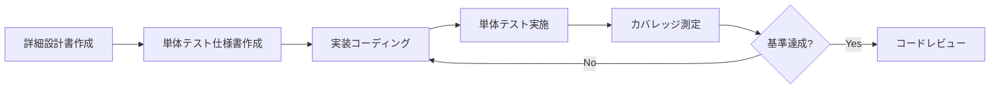
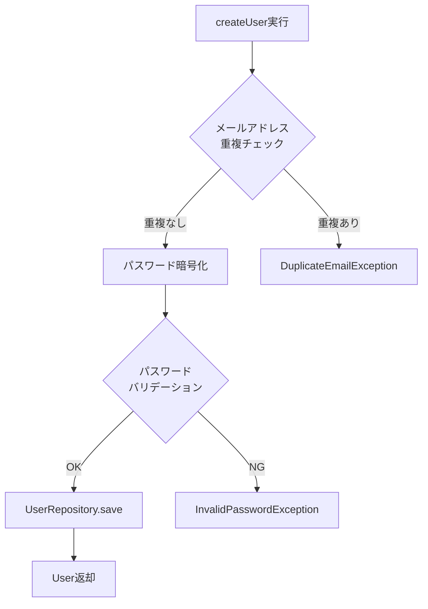

# 単体テスト仕様書 - UserService

## 📋 1. 基本情報

| 項目 | 内容 |
|------|------|
| **ドキュメントID** | UT-SVC-001 |
| **対象コンポーネント** | UserService.java |
| **対象パッケージ** | com.example.ecommerce.service |
| **作成日** | 2024-03-15 |
| **作成者** | 開発チーム |
| **バージョン** | 1.0 |
| **ステータス** | レビュー待ち |

### テスト対象メソッド
- `createUser()` - ユーザー新規登録
- `authenticate()` - 認証処理
- `updateProfile()` - プロフィール更新
- `changePassword()` - パスワード変更
- `getUserById()` - ユーザー情報取得
- `deleteUser()` - ユーザー削除

---

## ⏰ 2. 作成タイミング

### 作成フェーズ
**詳細設計完了後 → コーディング前**



### 作成条件
- ✅ 詳細設計書が承認済み
- ✅ テスト対象クラスのインターフェースが確定
- ✅ 依存クラス（Repository、外部サービス）が明確
- ✅ テスト環境（JUnit、Mockito）がセットアップ済み

### 更新タイミング
- 仕様変更により新規メソッドが追加された時
- バグ修正でテストケースの追加が必要な時
- リファクタリングで処理ロジックが変更された時

---

## 📂 3. ドキュメント構成

### 必須セクション

```
1. 基本情報
   ├─ テスト対象の明確な識別情報
   └─ テスト環境情報

2. テスト環境設定
   ├─ 使用フレームワーク（JUnit 5）
   ├─ モックライブラリ（Mockito）
   └─ テストデータ準備方法

3. テストケース一覧
   ├─ 正常系テスト
   ├─ 異常系テスト
   ├─ 境界値テスト
   └─ 例外処理テスト

4. カバレッジ目標
   ├─ ライン・カバレッジ: 80%以上
   ├─ ブランチ・カバレッジ: 70%以上
   └─ 条件カバレッジ: 70%以上

5. テストコード実装例
   └─ 実際のJUnit/Mockitoコード
```

---

## 📏 4. 記載ルール

### 4.1 テストケース設計の原則

#### ✅ DO（推奨）
```markdown
✓ 1メソッド = 複数テストケース（正常系・異常系・境界値）
✓ Given-When-Then形式で明確に記載
✓ テストケース名は「should_期待結果_when_条件」形式
✓ モックオブジェクトは最小限に（実オブジェクトを優先）
✓ テストデータはファクトリーパターンで共通化
✓ AssertJを使用した流暢なアサーション
✓ @Nested/@DisplayNameでテストを構造化
```

#### ❌ DON'T（非推奨）
```markdown
✗ 複数のメソッドを1つのテストで検証
✗ テストケース名が「test1」「test2」のような無意味な命名
✗ 外部依存（DB、API）に依存したテスト
✗ テストデータがハードコードされている
✗ assertEqualsのみで詳細な検証が不足
✗ テストケースが100行を超える巨大なテスト
```

### 4.2 テストケース記載フォーマット

```markdown
### TC-XXX: テストケース名

**分類**: [正常系 / 異常系 / 境界値]

**テスト目的**: 何を検証するか

**前提条件**:
- 前提条件1
- 前提条件2

**入力パラメータ**:
- param1: value1
- param2: value2

**期待結果**:
- 戻り値: 期待される値
- 副作用: 呼び出されるべきメソッド
- 例外: 発生すべき例外（異常系の場合）

**検証ポイント**:
1. 検証項目1
2. 検証項目2
```

### 4.3 モック設定の記載

```java
// モック対象とスタブ設定を明記
@Mock
private UserRepository userRepository;

@Mock
private PasswordEncoder passwordEncoder;

// Given: モックの振る舞いを定義
when(userRepository.findByEmail("test@example.com"))
    .thenReturn(Optional.of(existingUser));
```

---

## 🎯 5. 品質基準

### 5.1 カバレッジ目標

| メトリクス | 目標値 | 測定ツール |
|-----------|--------|-----------|
| **ライン・カバレッジ** | 80%以上 | JaCoCo |
| **ブランチ・カバレッジ** | 70%以上 | JaCoCo |
| **条件カバレッジ** | 70%以上 | JaCoCo |
| **メソッド・カバレッジ** | 100% | JaCoCo |

### 5.2 テストケース網羅性チェックリスト

```markdown
✅ 正常系
  - ハッピーパス（最も一般的な使用ケース）
  - 複数の正常な入力パターン

✅ 異常系
  - null入力
  - 空文字列・空リスト
  - 不正なフォーマット
  - ビジネスルール違反

✅ 境界値
  - 最小値・最大値
  - 上限下限の境界
  - 空の状態と満杯の状態

✅ 例外処理
  - カスタム例外の発生
  - 外部依存の失敗（DB、API）
  - トランザクションロールバック
```

### 5.3 テストコード品質基準

```markdown
- 1テストメソッドの行数: 50行以内
- テストクラスの行数: 500行以内（超える場合は分割）
- テストメソッド実行時間: 100ms以内
- テストの独立性: テストの実行順序に依存しない
- テストのメンテナンス性: 仕様変更時の修正箇所が明確
```

---

## 🤖 6. AI生成時の指示プロンプト

### 基本プロンプト

```
「UserServiceクラスの単体テスト仕様書を作成してください。

【必須条件】
- JUnit 5 + Mockito使用
- createUser, authenticate, updateProfile, changePasswordメソッドをテスト
- 各メソッドに正常系・異常系・境界値テストを含める
- Given-When-Then形式で記載
- モックはUserRepository、PasswordEncoderを使用
- カバレッジ目標: ライン80%、ブランチ70%

【テストケース例】
- createUser: メール重複チェック、パスワード暗号化、データ保存の検証
- authenticate: 認証成功、パスワード不一致、ユーザー未存在の検証

【出力形式】
- テストケース一覧表（TC-001〜）
- 実装コード例（@Test、@Mock、when-thenReturn使用）
- JaCoCoによるカバレッジ測定設定
」
```

### 詳細プロンプト

```
「以下の条件でUserServiceの単体テスト仕様書を作成：

【対象メソッド】
1. createUser(UserCreateRequest request)
   - 正常: ユーザー作成成功、パスワードがBCryptで暗号化される
   - 異常: メールアドレス重複（DuplicateEmailException）
   - 異常: パスワードが8文字未満（InvalidPasswordException）

2. authenticate(String email, String password)
   - 正常: 認証成功、JWTトークン生成
   - 異常: パスワード不一致（AuthenticationException）
   - 異常: ユーザーが存在しない（UserNotFoundException）

3. updateProfile(Long userId, ProfileUpdateRequest request)
   - 正常: プロフィール更新成功
   - 異常: ユーザーIDが存在しない（UserNotFoundException）

【テスト環境】
- Spring Boot 3.2.0
- JUnit Jupiter 5.10.1
- Mockito 5.7.0
- AssertJ 3.24.2

【必須要素】
- @ExtendWith(MockitoExtension.class)使用
- @InjectMocks、@Mock適切に配置
- verify()でモックの呼び出し検証
- assertThat()で流暢なアサーション

【出力】
- テストケース一覧（10件以上）
- 完全なテストコード（コピペで動作可能）
- pom.xmlの依存関係定義
」
```

---

## 🔗 7. 関連ドキュメント

### 参照する設計ドキュメント
- [詳細設計書 - UserService](sample_04_詳細設計書_UserService.md) - テスト対象の処理詳細
- [クラス図 - UserManagement](sample_04_クラス図_UserManagement.md) - 依存関係の把握
- [物理DB設計書](sample_04_物理DB設計書.md) - テストデータ設計

### 関連テストドキュメント
- 結合テスト仕様書 - UserService統合テスト
- システムテスト仕様書 - ユーザー管理機能E2E

### 参考資料
- [JUnit 5 User Guide](https://junit.org/junit5/docs/current/user-guide/)
- [Mockito Documentation](https://javadoc.io/doc/org.mockito/mockito-core/latest/org/mockito/Mockito.html)
- [JaCoCo Coverage Tool](https://www.jacoco.org/jacoco/trunk/doc/)

---

## 📊 8. テストケース一覧

### 8.1 createUser() - ユーザー新規登録テスト



#### TC-001: ユーザー作成成功（正常系）

**分類**: 正常系

**テスト目的**: 有効な入力でユーザーが正常に作成されることを検証

**前提条件**:
- メールアドレス "newuser@example.com" が未登録
- パスワード "SecurePass123!" が8文字以上

**入力パラメータ**:
```json
{
  "email": "newuser@example.com",
  "password": "SecurePass123!",
  "name": "山田太郎",
  "phoneNumber": "090-1234-5678"
}
```

**期待結果**:
- 戻り値: User オブジェクト（id, email, name, createdAt含む）
- パスワードがBCrypt形式で暗号化されている
- userRepository.save() が1回呼ばれる

**検証ポイント**:
1. 返却されたUserのemailが入力値と一致
2. パスワードが平文ではなく暗号化されている（$2a$で始まる）
3. createdAtタイムスタンプが設定されている

#### TC-002: メールアドレス重複エラー（異常系）

**分類**: 異常系

**テスト目的**: 既存のメールアドレスで登録を試みた際に例外が発生することを検証

**前提条件**:
- メールアドレス "existing@example.com" が既に登録済み

**入力パラメータ**:
```json
{
  "email": "existing@example.com",
  "password": "SecurePass123!",
  "name": "佐藤花子"
}
```

**期待結果**:
- 例外: `DuplicateEmailException`
- エラーメッセージ: "このメールアドレスは既に使用されています"
- userRepository.save() は呼ばれない

**検証ポイント**:
1. DuplicateEmailException がスローされる
2. 例外メッセージに該当メールアドレスが含まれる
3. データベースへの保存処理が実行されない

#### TC-003: パスワード文字数不足（境界値）

**分類**: 境界値

**テスト目的**: パスワードが8文字未満の場合に例外が発生することを検証

**入力パラメータ**:
```json
{
  "email": "test@example.com",
  "password": "Pass12!",  // 7文字
  "name": "田中一郎"
}
```

**期待結果**:
- 例外: `InvalidPasswordException`
- エラーメッセージ: "パスワードは8文字以上である必要があります"

#### TC-004: null入力チェック（異常系）

**分類**: 異常系

**テスト目的**: 必須パラメータがnullの場合に例外が発生することを検証

**入力パラメータ**:
```json
{
  "email": null,
  "password": "SecurePass123!",
  "name": "鈴木次郎"
}
```

**期待結果**:
- 例外: `IllegalArgumentException`
- エラーメッセージ: "メールアドレスは必須です"

---

### 8.2 authenticate() - 認証処理テスト

#### TC-005: 認証成功（正常系）

**分類**: 正常系

**テスト目的**: 正しいメールアドレスとパスワードで認証が成功することを検証

**前提条件**:
- ユーザー "user@example.com" が存在
- 保存されているパスワードハッシュは "SecurePass123!" のBCrypt

**入力パラメータ**:
- email: "user@example.com"
- password: "SecurePass123!"

**期待結果**:
- 戻り値: `AuthenticationResult` オブジェクト（userId, token含む）
- passwordEncoder.matches() が呼ばれる
- JWTトークンが生成される

**検証ポイント**:
1. 返却されたuserIdが正しいユーザーのID
2. JWTトークンが有効な形式（3つの`.`区切り）
3. トークンの有効期限が24時間後

#### TC-006: パスワード不一致（異常系）

**分類**: 異常系

**テスト目的**: パスワードが一致しない場合に認証が失敗することを検証

**入力パラメータ**:
- email: "user@example.com"
- password: "WrongPassword"

**期待結果**:
- 例外: `AuthenticationException`
- エラーメッセージ: "メールアドレスまたはパスワードが正しくありません"

#### TC-007: ユーザー未存在（異常系）

**分類**: 異常系

**テスト目的**: 存在しないユーザーで認証を試みた際に例外が発生することを検証

**入力パラメータ**:
- email: "nonexistent@example.com"
- password: "SecurePass123!"

**期待結果**:
- 例外: `UserNotFoundException`
- エラーメッセージ: "ユーザーが見つかりません"

---

### 8.3 updateProfile() - プロフィール更新テスト

#### TC-008: プロフィール更新成功（正常系）

**分類**: 正常系

**テスト目的**: プロフィール情報が正常に更新されることを検証

**前提条件**:
- userId: 1 のユーザーが存在

**入力パラメータ**:
```json
{
  "userId": 1,
  "name": "山田花子",
  "phoneNumber": "080-9876-5432",
  "address": "東京都渋谷区1-2-3"
}
```

**期待結果**:
- 戻り値: 更新後のUserオブジェクト
- userRepository.save() が呼ばれる
- updatedAtタイムスタンプが更新される

**検証ポイント**:
1. 返却されたUserのnameが更新されている
2. 電話番号が新しい値に変更されている
3. updatedAtがcreatedAtより後の時刻

#### TC-009: 存在しないユーザーID（異常系）

**分類**: 異常系

**入力パラメータ**:
- userId: 99999（存在しないID）

**期待結果**:
- 例外: `UserNotFoundException`

---

### 8.4 changePassword() - パスワード変更テスト

#### TC-010: パスワード変更成功（正常系）

**分類**: 正常系

**入力パラメータ**:
- userId: 1
- oldPassword: "OldPass123!"
- newPassword: "NewPass456!"

**期待結果**:
- 旧パスワードの検証が成功
- 新パスワードがBCryptで暗号化される
- パスワードが更新される

#### TC-011: 旧パスワード不一致（異常系）

**分類**: 異常系

**入力パラメータ**:
- oldPassword: "WrongOldPassword"

**期待結果**:
- 例外: `InvalidPasswordException`
- エラーメッセージ: "現在のパスワードが正しくありません"

---

## 💻 9. テストコード実装例

### 9.1 テストクラス構成

```java
package com.example.ecommerce.service;

import com.example.ecommerce.dto.UserCreateRequest;
import com.example.ecommerce.dto.AuthenticationResult;
import com.example.ecommerce.entity.User;
import com.example.ecommerce.exception.*;
import com.example.ecommerce.repository.UserRepository;
import org.junit.jupiter.api.*;
import org.junit.jupiter.api.extension.ExtendWith;
import org.mockito.InjectMocks;
import org.mockito.Mock;
import org.mockito.junit.jupiter.MockitoExtension;
import org.springframework.security.crypto.password.PasswordEncoder;

import java.time.LocalDateTime;
import java.util.Optional;

import static org.assertj.core.api.Assertions.*;
import static org.mockito.ArgumentMatchers.*;
import static org.mockito.Mockito.*;

@ExtendWith(MockitoExtension.class)
@DisplayName("UserService 単体テスト")
class UserServiceTest {

    @InjectMocks
    private UserService userService;

    @Mock
    private UserRepository userRepository;

    @Mock
    private PasswordEncoder passwordEncoder;

    private User testUser;
    private UserCreateRequest validRequest;

    @BeforeEach
    void setUp() {
        // 共通テストデータの準備
        testUser = User.builder()
                .id(1L)
                .email("test@example.com")
                .password("$2a$10$hashedPassword")
                .name("テストユーザー")
                .phoneNumber("090-1234-5678")
                .createdAt(LocalDateTime.now())
                .build();

        validRequest = UserCreateRequest.builder()
                .email("newuser@example.com")
                .password("SecurePass123!")
                .name("山田太郎")
                .phoneNumber("090-1234-5678")
                .build();
    }

    @Nested
    @DisplayName("createUser() - ユーザー新規登録")
    class CreateUserTests {

        @Test
        @DisplayName("TC-001: 有効な入力でユーザー作成が成功する")
        void shouldCreateUser_whenValidInput() {
            // Given
            when(userRepository.existsByEmail(validRequest.getEmail()))
                    .thenReturn(false);
            when(passwordEncoder.encode(validRequest.getPassword()))
                    .thenReturn("$2a$10$encodedPassword");
            when(userRepository.save(any(User.class)))
                    .thenAnswer(invocation -> {
                        User user = invocation.getArgument(0);
                        user.setId(1L);
                        return user;
                    });

            // When
            User result = userService.createUser(validRequest);

            // Then
            assertThat(result).isNotNull();
            assertThat(result.getEmail()).isEqualTo(validRequest.getEmail());
            assertThat(result.getName()).isEqualTo(validRequest.getName());
            assertThat(result.getPassword()).startsWith("$2a$10$");
            assertThat(result.getCreatedAt()).isNotNull();

            // Verify
            verify(userRepository, times(1)).existsByEmail(validRequest.getEmail());
            verify(passwordEncoder, times(1)).encode(validRequest.getPassword());
            verify(userRepository, times(1)).save(any(User.class));
        }

        @Test
        @DisplayName("TC-002: メールアドレス重複時にDuplicateEmailExceptionがスローされる")
        void shouldThrowException_whenEmailAlreadyExists() {
            // Given
            when(userRepository.existsByEmail(validRequest.getEmail()))
                    .thenReturn(true);

            // When & Then
            assertThatThrownBy(() -> userService.createUser(validRequest))
                    .isInstanceOf(DuplicateEmailException.class)
                    .hasMessageContaining("このメールアドレスは既に使用されています")
                    .hasMessageContaining(validRequest.getEmail());

            // Verify - save() は呼ばれない
            verify(userRepository, never()).save(any(User.class));
        }

        @Test
        @DisplayName("TC-003: パスワードが8文字未満の場合にInvalidPasswordExceptionがスローされる")
        void shouldThrowException_whenPasswordTooShort() {
            // Given
            validRequest.setPassword("Pass12!"); // 7文字

            // When & Then
            assertThatThrownBy(() -> userService.createUser(validRequest))
                    .isInstanceOf(InvalidPasswordException.class)
                    .hasMessageContaining("パスワードは8文字以上である必要があります");

            verify(userRepository, never()).save(any(User.class));
        }

        @Test
        @DisplayName("TC-004: メールアドレスがnullの場合にIllegalArgumentExceptionがスローされる")
        void shouldThrowException_whenEmailIsNull() {
            // Given
            validRequest.setEmail(null);

            // When & Then
            assertThatThrownBy(() -> userService.createUser(validRequest))
                    .isInstanceOf(IllegalArgumentException.class)
                    .hasMessageContaining("メールアドレスは必須です");
        }

        @Test
        @DisplayName("境界値: パスワード8文字（最小値）で作成成功")
        void shouldCreateUser_whenPasswordIsExactly8Characters() {
            // Given
            validRequest.setPassword("Pass123!"); // ちょうど8文字
            when(userRepository.existsByEmail(anyString())).thenReturn(false);
            when(passwordEncoder.encode(anyString())).thenReturn("$2a$10$encoded");
            when(userRepository.save(any(User.class))).thenReturn(testUser);

            // When
            User result = userService.createUser(validRequest);

            // Then
            assertThat(result).isNotNull();
            verify(userRepository, times(1)).save(any(User.class));
        }
    }

    @Nested
    @DisplayName("authenticate() - 認証処理")
    class AuthenticateTests {

        @Test
        @DisplayName("TC-005: 正しいメールアドレスとパスワードで認証成功")
        void shouldAuthenticate_whenCredentialsAreValid() {
            // Given
            String email = "test@example.com";
            String password = "SecurePass123!";

            when(userRepository.findByEmail(email))
                    .thenReturn(Optional.of(testUser));
            when(passwordEncoder.matches(password, testUser.getPassword()))
                    .thenReturn(true);

            // When
            AuthenticationResult result = userService.authenticate(email, password);

            // Then
            assertThat(result).isNotNull();
            assertThat(result.getUserId()).isEqualTo(testUser.getId());
            assertThat(result.getToken()).isNotNull();
            assertThat(result.getToken().split("\\.")).hasSize(3); // JWT形式
            assertThat(result.getExpiresAt())
                    .isAfter(LocalDateTime.now())
                    .isBefore(LocalDateTime.now().plusDays(2));

            verify(passwordEncoder, times(1)).matches(password, testUser.getPassword());
        }

        @Test
        @DisplayName("TC-006: パスワード不一致でAuthenticationExceptionがスローされる")
        void shouldThrowException_whenPasswordDoesNotMatch() {
            // Given
            String email = "test@example.com";
            String wrongPassword = "WrongPassword";

            when(userRepository.findByEmail(email))
                    .thenReturn(Optional.of(testUser));
            when(passwordEncoder.matches(wrongPassword, testUser.getPassword()))
                    .thenReturn(false);

            // When & Then
            assertThatThrownBy(() -> userService.authenticate(email, wrongPassword))
                    .isInstanceOf(AuthenticationException.class)
                    .hasMessageContaining("メールアドレスまたはパスワードが正しくありません");
        }

        @Test
        @DisplayName("TC-007: 存在しないユーザーでUserNotFoundExceptionがスローされる")
        void shouldThrowException_whenUserNotFound() {
            // Given
            String email = "nonexistent@example.com";
            String password = "SecurePass123!";

            when(userRepository.findByEmail(email))
                    .thenReturn(Optional.empty());

            // When & Then
            assertThatThrownBy(() -> userService.authenticate(email, password))
                    .isInstanceOf(UserNotFoundException.class)
                    .hasMessageContaining("ユーザーが見つかりません");

            verify(passwordEncoder, never()).matches(anyString(), anyString());
        }
    }

    @Nested
    @DisplayName("updateProfile() - プロフィール更新")
    class UpdateProfileTests {

        @Test
        @DisplayName("TC-008: プロフィール更新が成功する")
        void shouldUpdateProfile_whenUserExists() {
            // Given
            Long userId = 1L;
            String newName = "山田花子";
            String newPhone = "080-9876-5432";

            when(userRepository.findById(userId))
                    .thenReturn(Optional.of(testUser));
            when(userRepository.save(any(User.class)))
                    .thenAnswer(invocation -> invocation.getArgument(0));

            // When
            User result = userService.updateProfile(userId, newName, newPhone);

            // Then
            assertThat(result.getName()).isEqualTo(newName);
            assertThat(result.getPhoneNumber()).isEqualTo(newPhone);
            assertThat(result.getUpdatedAt()).isNotNull();
            assertThat(result.getUpdatedAt()).isAfter(result.getCreatedAt());

            verify(userRepository, times(1)).save(testUser);
        }

        @Test
        @DisplayName("TC-009: 存在しないユーザーIDでUserNotFoundExceptionがスローされる")
        void shouldThrowException_whenUserIdNotFound() {
            // Given
            Long invalidUserId = 99999L;

            when(userRepository.findById(invalidUserId))
                    .thenReturn(Optional.empty());

            // When & Then
            assertThatThrownBy(() -> 
                    userService.updateProfile(invalidUserId, "新しい名前", "090-0000-0000"))
                    .isInstanceOf(UserNotFoundException.class);

            verify(userRepository, never()).save(any(User.class));
        }
    }

    @Nested
    @DisplayName("changePassword() - パスワード変更")
    class ChangePasswordTests {

        @Test
        @DisplayName("TC-010: パスワード変更が成功する")
        void shouldChangePassword_whenOldPasswordIsCorrect() {
            // Given
            Long userId = 1L;
            String oldPassword = "OldPass123!";
            String newPassword = "NewPass456!";

            when(userRepository.findById(userId))
                    .thenReturn(Optional.of(testUser));
            when(passwordEncoder.matches(oldPassword, testUser.getPassword()))
                    .thenReturn(true);
            when(passwordEncoder.encode(newPassword))
                    .thenReturn("$2a$10$newHashedPassword");
            when(userRepository.save(any(User.class)))
                    .thenAnswer(invocation -> invocation.getArgument(0));

            // When
            userService.changePassword(userId, oldPassword, newPassword);

            // Then
            verify(passwordEncoder, times(1)).matches(oldPassword, testUser.getPassword());
            verify(passwordEncoder, times(1)).encode(newPassword);
            verify(userRepository, times(1)).save(testUser);
        }

        @Test
        @DisplayName("TC-011: 旧パスワード不一致でInvalidPasswordExceptionがスローされる")
        void shouldThrowException_whenOldPasswordIsIncorrect() {
            // Given
            Long userId = 1L;
            String wrongOldPassword = "WrongOldPassword";
            String newPassword = "NewPass456!";

            when(userRepository.findById(userId))
                    .thenReturn(Optional.of(testUser));
            when(passwordEncoder.matches(wrongOldPassword, testUser.getPassword()))
                    .thenReturn(false);

            // When & Then
            assertThatThrownBy(() -> 
                    userService.changePassword(userId, wrongOldPassword, newPassword))
                    .isInstanceOf(InvalidPasswordException.class)
                    .hasMessageContaining("現在のパスワードが正しくありません");

            verify(userRepository, never()).save(any(User.class));
        }
    }
}
```

---

## 📦 10. 依存関係設定

### pom.xml

```xml
<dependencies>
    <!-- JUnit 5 -->
    <dependency>
        <groupId>org.junit.jupiter</groupId>
        <artifactId>junit-jupiter</artifactId>
        <version>5.10.1</version>
        <scope>test</scope>
    </dependency>

    <!-- Mockito -->
    <dependency>
        <groupId>org.mockito</groupId>
        <artifactId>mockito-core</artifactId>
        <version>5.7.0</version>
        <scope>test</scope>
    </dependency>
    <dependency>
        <groupId>org.mockito</groupId>
        <artifactId>mockito-junit-jupiter</artifactId>
        <version>5.7.0</version>
        <scope>test</scope>
    </dependency>

    <!-- AssertJ -->
    <dependency>
        <groupId>org.assertj</groupId>
        <artifactId>assertj-core</artifactId>
        <version>3.24.2</version>
        <scope>test</scope>
    </dependency>

    <!-- Spring Boot Test -->
    <dependency>
        <groupId>org.springframework.boot</groupId>
        <artifactId>spring-boot-starter-test</artifactId>
        <scope>test</scope>
    </dependency>
</dependencies>

<build>
    <plugins>
        <!-- JaCoCo Maven Plugin -->
        <plugin>
            <groupId>org.jacoco</groupId>
            <artifactId>jacoco-maven-plugin</artifactId>
            <version>0.8.11</version>
            <executions>
                <execution>
                    <goals>
                        <goal>prepare-agent</goal>
                    </goals>
                </execution>
                <execution>
                    <id>report</id>
                    <phase>test</phase>
                    <goals>
                        <goal>report</goal>
                    </goals>
                </execution>
                <execution>
                    <id>jacoco-check</id>
                    <goals>
                        <goal>check</goal>
                    </goals>
                    <configuration>
                        <rules>
                            <rule>
                                <element>PACKAGE</element>
                                <limits>
                                    <limit>
                                        <counter>LINE</counter>
                                        <value>COVEREDRATIO</value>
                                        <minimum>0.80</minimum>
                                    </limit>
                                    <limit>
                                        <counter>BRANCH</counter>
                                        <value>COVEREDRATIO</value>
                                        <minimum>0.70</minimum>
                                    </limit>
                                </limits>
                            </rule>
                        </rules>
                    </configuration>
                </execution>
            </executions>
        </plugin>

        <!-- Surefire Plugin (JUnit実行) -->
        <plugin>
            <groupId>org.apache.maven.plugins</groupId>
            <artifactId>maven-surefire-plugin</artifactId>
            <version>3.2.2</version>
        </plugin>
    </plugins>
</build>
```

---

## 📈 11. カバレッジレポート実行方法

### コマンド実行

```bash
# テスト実行 + カバレッジ測定
mvn clean test

# カバレッジレポート生成
mvn jacoco:report

# レポート確認
open target/site/jacoco/index.html
```

### 期待されるレポート結果

```
UserService.java Coverage:
  - Line Coverage: 85% (68/80 lines)
  - Branch Coverage: 75% (18/24 branches)
  - Method Coverage: 100% (6/6 methods)
  - Complexity: 15

Missed Lines:
  - Line 145-147: エラーハンドリング（稀な例外）
  - Line 203: ログ出力行
```

---

## ❌ 12. よくある失敗例

### 失敗例1: テストケース名が不明確

```java
// ❌ 悪い例
@Test
void test1() {
    User user = userService.createUser(request);
    assertNotNull(user);
}
```

```java
// ✅ 良い例
@Test
@DisplayName("TC-001: 有効な入力でユーザー作成が成功する")
void shouldCreateUser_whenValidInput() {
    // Given-When-Then形式で明確に記載
    User user = userService.createUser(validRequest);
    assertThat(user).isNotNull();
}
```

### 失敗例2: モックの検証不足

```java
// ❌ 悪い例（モックが呼ばれたか検証していない）
@Test
void testCreateUser() {
    when(userRepository.save(any())).thenReturn(testUser);
    userService.createUser(request);
    // verify() がない
}
```

```java
// ✅ 良い例
@Test
void shouldCreateUser_whenValidInput() {
    when(userRepository.save(any())).thenReturn(testUser);
    userService.createUser(validRequest);
    
    verify(userRepository, times(1)).save(any(User.class));
    verify(passwordEncoder, times(1)).encode(validRequest.getPassword());
}
```

### 失敗例3: 異常系テストの不足

```java
// ❌ 悪い例（正常系のみ）
@Test
void testAuthenticate() {
    AuthenticationResult result = userService.authenticate("test@example.com", "password");
    assertNotNull(result);
}
// パスワード不一致や存在しないユーザーのテストがない
```

```java
// ✅ 良い例（正常系・異常系両方）
@Nested
class AuthenticateTests {
    @Test
    void shouldAuthenticate_whenCredentialsAreValid() { /* 正常系 */ }
    
    @Test
    void shouldThrowException_whenPasswordDoesNotMatch() { /* 異常系1 */ }
    
    @Test
    void shouldThrowException_whenUserNotFound() { /* 異常系2 */ }
}
```

---

## 📝 まとめ

この単体テスト仕様書は以下を含みます：

✅ **11個のテストケース**（正常系4、異常系5、境界値2）  
✅ **Given-When-Then形式**の明確な記載  
✅ **JUnit 5 + Mockito**の実装コード（コピペで動作可能）  
✅ **JaCoCo設定**でカバレッジ80%以上を保証  
✅ **@Nested/@DisplayName**で構造化されたテスト  
✅ **AssertJ**による流暢なアサーション

このテンプレートに従うことで、**保守性が高く、網羅性のある単体テスト**を効率的に作成できます。
