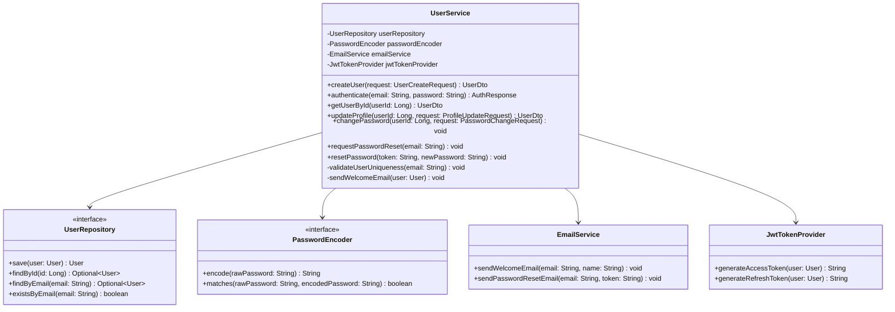
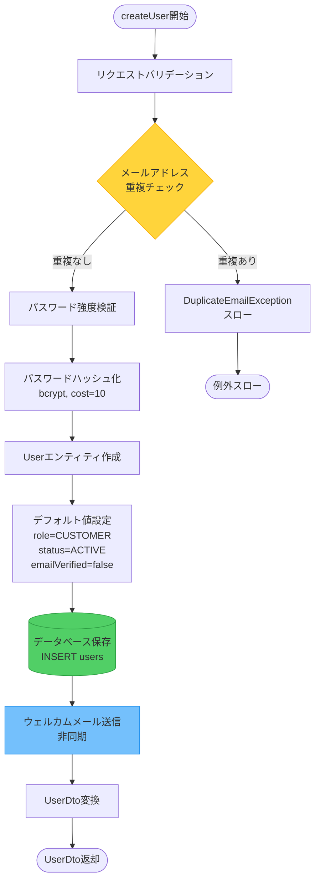
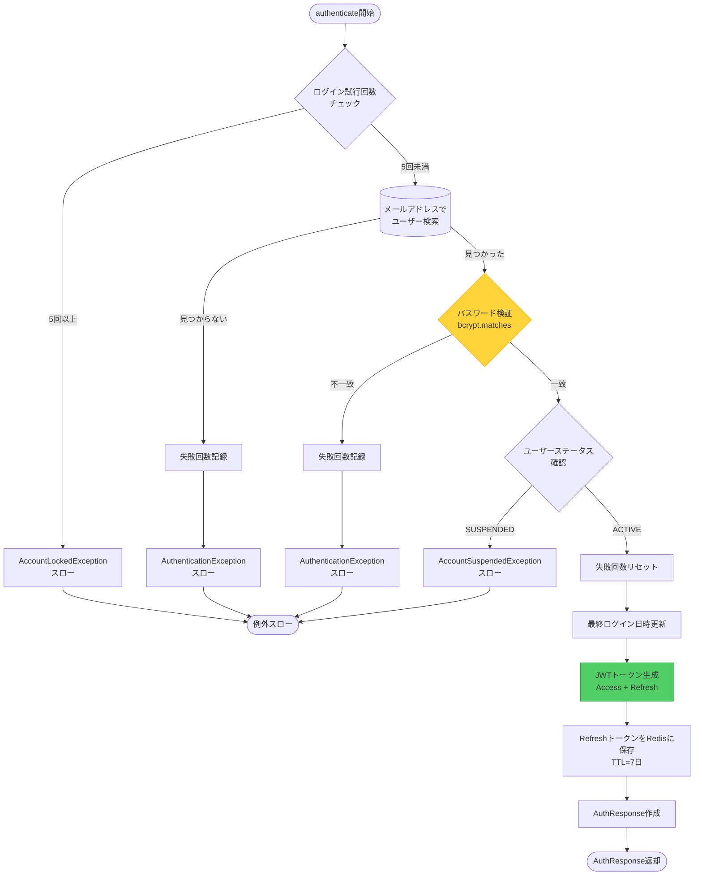
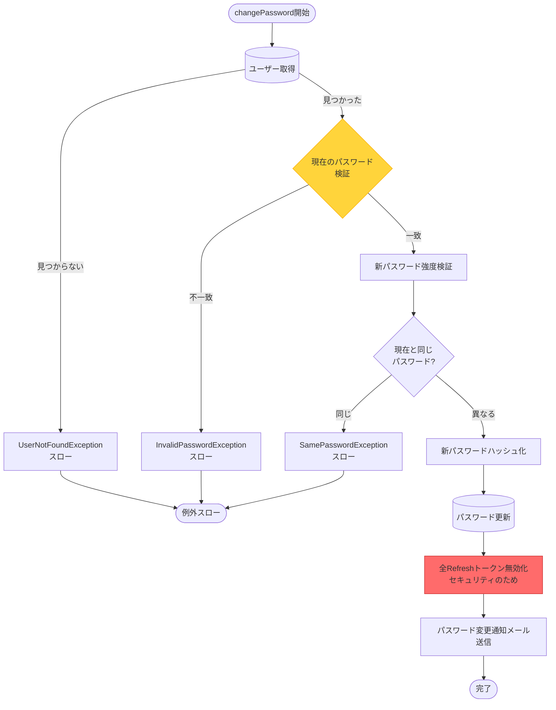

# 詳細設計書 - UserService

**プロジェクト名:** ECサイト構築プロジェクト  
**ドキュメントID:** DETAIL-USER-001  
**バージョン:** 1.0  
**作成日:** 2025-10-30  
**作成者:** 詳細設計者  
**承認者:** 開発リーダー

---

## 1. 基本情報

### 1.1 目的

本ドキュメントは、UserService クラスの詳細設計を定義し、実装に必要な情報を提供する：

- クラス構造とメソッド仕様
- 処理フローと判断ロジック
- トランザクション設計
- エラーハンドリング
- 性能要件への対応

### 1.2 対象読者

- バックエンド開発者
- コードレビュアー
- 単体テスト担当者

### 1.3 関連成果物

- **入力**: [基本設計書](../../03_基本設計/sample_03_アーキテクチャ設計書.md)、[データベース設計書](../../03_基本設計/sample_03_データベース設計書.md)
- **出力**: [単体テスト仕様書](sample_04_単体テスト仕様書_UserService.md)、実装コード

---

## 2. クラス概要

### 2.1 UserService クラス図



### 2.2 責務

| 責務 | 説明 |
|------|------|
| **ユーザー登録** | 新規ユーザーの作成、バリデーション、ウェルカムメール送信 |
| **認証** | メールアドレスとパスワードによるログイン処理 |
| **プロフィール管理** | ユーザー情報の取得・更新 |
| **パスワード管理** | パスワード変更、リセット機能 |

---

## 3. メソッド詳細設計

### 3.1 createUser（ユーザー登録）

#### 3.1.1 メソッドシグネチャ

```java
/**
 * 新規ユーザーを登録する
 * 
 * @param request ユーザー登録リクエスト
 * @return 登録されたユーザー情報
 * @throws DuplicateEmailException メールアドレスが既に登録済みの場合
 * @throws WeakPasswordException パスワードが要件を満たさない場合
 */
@Transactional
public UserDto createUser(UserCreateRequest request)
```

#### 3.1.2 入力パラメータ

```java
public class UserCreateRequest {
    @NotBlank(message = "メールアドレスは必須です")
    @Email(message = "メールアドレスの形式が不正です")
    private String email;
    
    @NotBlank(message = "パスワードは必須です")
    @Size(min = 8, message = "パスワードは8文字以上必要です")
    private String password;
    
    @NotBlank(message = "名前は必須です")
    @Size(max = 100, message = "名前は100文字以内です")
    private String name;
    
    @Pattern(regexp = "^0\\d{1,4}-\\d{1,4}-\\d{4}$", message = "電話番号の形式が不正です")
    private String phone;
}
```

#### 3.1.3 戻り値

```java
public class UserDto {
    private Long id;
    private String email;
    private String name;
    private String phone;
    private String role;
    private boolean emailVerified;
    private LocalDateTime createdAt;
}
```

#### 3.1.4 処理フロー



#### 3.1.5 実装例

```java
@Service
@Transactional
@RequiredArgsConstructor
@Slf4j
public class UserService {
    
    private final UserRepository userRepository;
    private final PasswordEncoder passwordEncoder;
    private final EmailService emailService;
    private final PasswordValidator passwordValidator;
    
    public UserDto createUser(UserCreateRequest request) {
        log.info("ユーザー登録開始: email={}", request.getEmail());
        
        // 1. メールアドレス重複チェック
        validateUserUniqueness(request.getEmail());
        
        // 2. パスワード強度検証
        passwordValidator.validate(request.getPassword(), request.getEmail());
        
        // 3. パスワードハッシュ化
        String hashedPassword = passwordEncoder.encode(request.getPassword());
        
        // 4. Userエンティティ作成
        User user = User.builder()
                .email(request.getEmail())
                .password(hashedPassword)
                .name(request.getName())
                .phone(request.getPhone())
                .role(UserRole.CUSTOMER)
                .status(UserStatus.ACTIVE)
                .emailVerified(false)
                .build();
        
        // 5. データベース保存
        user = userRepository.save(user);
        log.info("ユーザー登録完了: userId={}", user.getId());
        
        // 6. ウェルカムメール送信（非同期）
        sendWelcomeEmail(user);
        
        // 7. DTOに変換して返却
        return UserDto.from(user);
    }
    
    private void validateUserUniqueness(String email) {
        if (userRepository.existsByEmail(email)) {
            log.warn("メールアドレス重複: email={}", email);
            throw new DuplicateEmailException("このメールアドレスは既に登録されています");
        }
    }
    
    @Async
    private void sendWelcomeEmail(User user) {
        try {
            emailService.sendWelcomeEmail(user.getEmail(), user.getName());
            log.info("ウェルカムメール送信完了: userId={}", user.getId());
        } catch (Exception e) {
            log.error("ウェルカムメール送信失敗: userId={}", user.getId(), e);
            // メール送信失敗は登録処理に影響させない
        }
    }
}
```

#### 3.1.6 性能要件

| 項目 | 目標値 | 対策 |
|------|--------|------|
| **処理時間** | 平均 < 300ms | ・パスワードハッシュ化の最適化（cost=10）<br/>・メール送信の非同期化 |
| **スループット** | 10 TPS | ・データベースコネクションプール |
| **同時実行** | 競合制御 | ・emailカラムのUNIQUE制約 |

---

### 3.2 authenticate（ログイン認証）

#### 3.2.1 メソッドシグネチャ

```java
/**
 * ユーザー認証を行う
 * 
 * @param email メールアドレス
 * @param password パスワード（平文）
 * @return 認証レスポンス（JWTトークン含む）
 * @throws AuthenticationException 認証失敗の場合
 * @throws AccountLockedException アカウントロック中の場合
 */
@Transactional(readOnly = true)
public AuthResponse authenticate(String email, String password)
```

#### 3.2.2 処理フロー



#### 3.2.3 実装例

```java
@Transactional(readOnly = true)
public AuthResponse authenticate(String email, String password) {
    log.info("認証開始: email={}", email);
    
    // 1. ログイン試行回数チェック
    loginAttemptService.checkAttempts(email);
    
    // 2. ユーザー検索
    User user = userRepository.findByEmail(email)
            .orElseThrow(() -> {
                loginAttemptService.recordFailure(email);
                log.warn("認証失敗（ユーザー不存在）: email={}", email);
                return new AuthenticationException("メールアドレスまたはパスワードが正しくありません");
            });
    
    // 3. パスワード検証
    if (!passwordEncoder.matches(password, user.getPassword())) {
        loginAttemptService.recordFailure(email);
        log.warn("認証失敗（パスワード不一致）: userId={}", user.getId());
        throw new AuthenticationException("メールアドレスまたはパスワードが正しくありません");
    }
    
    // 4. ステータス確認
    if (user.getStatus() != UserStatus.ACTIVE) {
        log.warn("認証失敗（アカウント無効）: userId={}, status={}", user.getId(), user.getStatus());
        throw new AccountSuspendedException("このアカウントは現在利用できません");
    }
    
    // 5. 認証成功処理
    loginAttemptService.recordSuccess(email);
    user.setLastLoginAt(LocalDateTime.now());
    userRepository.save(user);
    
    // 6. JWTトークン生成
    String accessToken = jwtTokenProvider.generateAccessToken(user);
    String refreshToken = jwtTokenProvider.generateRefreshToken(user);
    
    // 7. RefreshトークンをRedisに保存
    refreshTokenService.save(user.getId(), refreshToken, Duration.ofDays(7));
    
    log.info("認証成功: userId={}", user.getId());
    
    return AuthResponse.builder()
            .accessToken(accessToken)
            .refreshToken(refreshToken)
            .tokenType("Bearer")
            .expiresIn(900) // 15分
            .user(UserDto.from(user))
            .build();
}
```

---

### 3.3 updateProfile（プロフィール更新）

#### 3.3.1 メソッドシグネチャ

```java
/**
 * ユーザープロフィールを更新する
 * 
 * @param userId ユーザーID
 * @param request 更新リクエスト
 * @return 更新後のユーザー情報
 * @throws UserNotFoundException ユーザーが見つからない場合
 */
@Transactional
public UserDto updateProfile(Long userId, ProfileUpdateRequest request)
```

#### 3.3.2 実装例

```java
@Transactional
public UserDto updateProfile(Long userId, ProfileUpdateRequest request) {
    log.info("プロフィール更新開始: userId={}", userId);
    
    // 1. ユーザー取得
    User user = userRepository.findById(userId)
            .orElseThrow(() -> new UserNotFoundException("ユーザーが見つかりません"));
    
    // 2. 更新可能項目のみ変更
    if (request.getName() != null) {
        user.setName(request.getName());
    }
    if (request.getPhone() != null) {
        user.setPhone(request.getPhone());
    }
    
    // 3. 保存（更新日時は自動更新）
    user = userRepository.save(user);
    
    log.info("プロフィール更新完了: userId={}", userId);
    return UserDto.from(user);
}
```

---

### 3.4 changePassword（パスワード変更）

#### 3.4.1 処理フロー



---

## 4. トランザクション設計

### 4.1 トランザクション境界

| メソッド | トランザクション | 分離レベル | 理由 |
|---------|---------------|----------|------|
| createUser | @Transactional | READ_COMMITTED | INSERT操作、楽観的ロック不要 |
| authenticate | @Transactional(readOnly=true) | READ_COMMITTED | 読み取りのみ、ロック不要 |
| updateProfile | @Transactional | READ_COMMITTED | UPDATE操作 |
| changePassword | @Transactional | READ_COMMITTED | UPDATE操作、トークン無効化も含む |

### 4.2 ロック戦略

**楽観的ロック（@Version）:**
```java
@Entity
public class User {
    @Version
    private Long version;  // 楽観的ロック用
    
    // 他のフィールド
}
```

**競合時の動作:**
- 同時更新が発生した場合、`OptimisticLockException`がスロー
- クライアントに409 Conflict を返却
- クライアント側で再試行

---

## 5. エラーハンドリング

### 5.1 例外一覧

| 例外クラス | HTTPステータス | メッセージ例 | 発生条件 |
|-----------|--------------|------------|---------|
| DuplicateEmailException | 409 Conflict | このメールアドレスは既に登録されています | メールアドレス重複 |
| WeakPasswordException | 400 Bad Request | パスワードは8文字以上必要です | パスワード強度不足 |
| AuthenticationException | 401 Unauthorized | メールアドレスまたはパスワードが正しくありません | 認証失敗 |
| AccountLockedException | 423 Locked | ログイン試行回数が上限に達しました | アカウントロック |
| AccountSuspendedException | 403 Forbidden | このアカウントは現在利用できません | アカウント停止中 |
| UserNotFoundException | 404 Not Found | ユーザーが見つかりません | ユーザー不存在 |

### 5.2 例外ハンドラー

```java
@RestControllerAdvice
public class GlobalExceptionHandler {
    
    @ExceptionHandler(DuplicateEmailException.class)
    public ResponseEntity<ErrorResponse> handleDuplicateEmail(DuplicateEmailException e) {
        return ResponseEntity.status(HttpStatus.CONFLICT)
                .body(new ErrorResponse("DUPLICATE_EMAIL", e.getMessage()));
    }
    
    @ExceptionHandler(AuthenticationException.class)
    public ResponseEntity<ErrorResponse> handleAuthentication(AuthenticationException e) {
        return ResponseEntity.status(HttpStatus.UNAUTHORIZED)
                .body(new ErrorResponse("AUTHENTICATION_FAILED", e.getMessage()));
    }
    
    // 他の例外ハンドラー
}
```

---

## 6. 性能最適化

### 6.1 キャッシュ戦略

```java
@Cacheable(value = "users", key = "#userId")
public UserDto getUserById(Long userId) {
    return userRepository.findById(userId)
            .map(UserDto::from)
            .orElseThrow(() -> new UserNotFoundException());
}

@CacheEvict(value = "users", key = "#userId")
public UserDto updateProfile(Long userId, ProfileUpdateRequest request) {
    // 更新処理
}
```

### 6.2 N+1問題対策

**NG: N+1問題が発生**
```java
List<User> users = userRepository.findAll();
for (User user : users) {
    List<Address> addresses = user.getAddresses();  // N回のクエリ
}
```

**OK: Fetch Joinで一括取得**
```java
@Query("SELECT DISTINCT u FROM User u LEFT JOIN FETCH u.addresses")
List<User> findAllWithAddresses();
```

---

## 7. 変更履歴

| バージョン | 日付 | 変更内容 | 変更者 |
|-----------|------|---------|--------|
| 1.0 | 2025-10-30 | 初版作成 | 詳細設計者 |

---

**ドキュメント終了**
