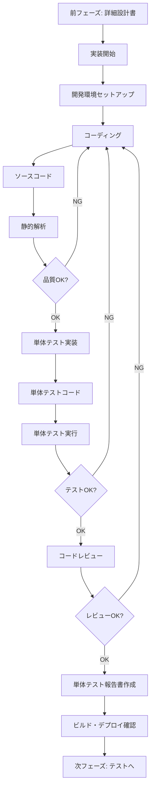

# 05_実装フェーズ

**フェーズ概要:** 詳細設計に基づいてプログラムコードを作成し、単体テストを実施する

**バージョン:** 1.0  
**最終更新日:** 2025-10-30

---

## 📋 このフェーズの目的

実装フェーズは、詳細設計書に基づいて実際のプログラムコードを作成し、品質を確保する段階です。

### 主な目的

1. **コーディング**
   - 詳細設計書に基づいたコード実装
   - コーディング規約の遵守
   - コードレビューの実施

2. **単体テスト**
   - 作成したコードの動作確認
   - バグの早期発見と修正
   - カバレッジの確保

3. **品質の確保**
   - 静的解析ツールの活用
   - コード品質指標の測定
   - 技術的負債の管理

---

## 📄 このフェーズで作成する成果物

| 成果物 | 作成者 | 目的 | 詳細ルール |
|--------|--------|------|-----------|
| **ソースコード** | プログラマー | システムの実体を作成 | [コーディング規約.md](./コーディング規約.md) |
| **単体テストコード** | プログラマー | 単体テストの自動化 | [単体テストコード作成ルール.md](./単体テストコード作成ルール.md) |
| **コードレビュー記録** | レビュアー | 品質確認の証跡 | [コードレビュー実施ルール.md](./コードレビュー実施ルール.md) |
| **単体テスト報告書** | プログラマー | テスト結果の記録 | [単体テスト報告書作成ルール.md](./単体テスト報告書作成ルール.md) |
| **リファクタリング記録** | プログラマー | コード改善の履歴 | [リファクタリング記録ルール.md](./リファクタリング記録ルール.md) |
| **ビルド・デプロイ手順書** | DevOpsエンジニア | ビルドとデプロイの手順 | [ビルドデプロイ手順書作成ルール.md](./ビルドデプロイ手順書作成ルール.md) |

---

## 🎯 成果物の関係性



---

## ✅ このフェーズの完了基準

### 必須完了項目

- [ ] すべてのモジュールがコーディング完了している
- [ ] 単体テストが実施され、合格している
- [ ] コードレビューが完了している
- [ ] コードカバレッジが基準値を満たしている
- [ ] 静的解析で重大な問題がない
- [ ] ビルドが成功している
- [ ] コードがリポジトリにコミットされている

### 確認事項

- [ ] コーディング規約が遵守されている
- [ ] 設計書とコードの整合性が取れている
- [ ] エラーハンドリングが適切に実装されている
- [ ] ログ出力が適切に実装されている
- [ ] セキュリティ要件が実装されている

---

## 🔍 AI作成時の重要ポイント

### AIがドキュメントを作成する際の注意事項

1. **コード品質の重視**
   - 可読性の高いコード
   - 保守性を考慮した構造
   - 適切なコメント

2. **テストファーストの実践**
   - TDD（Test Driven Development）の推奨
   - テストケースの網羅性
   - リグレッションテストの整備

3. **CI/CDの活用**
   - 自動ビルドの設定
   - 自動テストの実行
   - 品質ゲートの設定

4. **技術的負債の管理**
   - コードの複雑度監視
   - リファクタリングの計画的実施
   - 技術的負債の可視化

---

## 📚 関連ドキュメント

- [前フェーズ: 詳細設計](../04_詳細設計/README.md)
- [次フェーズ: テスト](../06_テスト/README.md)
- [ドキュメント作成基本ルール](../00_ドキュメント作成ルール/ドキュメント作成基本ルール.md)
- [コーディング規約](../99_共通資料/コーディング規約/)

---

## 📝 このフェーズでの作業の流れ

### ステップ1: 環境準備（1週間）
- 開発環境構築
- リポジトリセットアップ
- CI/CDパイプライン構築
- ツール導入（静的解析、テストフレームワーク等）

### ステップ2: コーディング（実装規模による）
- モジュール単位での実装
- ペアプログラミング（推奨）
- 定期的なコミット
- 進捗管理

### ステップ3: 単体テスト（コーディングと並行）
- テストケース実装
- テスト実行
- カバレッジ測定
- バグ修正

### ステップ4: コードレビュー（随時）
- プルリクエスト作成
- レビュー実施
- 指摘事項対応
- マージ

### ステップ5: 品質確認（1週間）
- 静的解析実行
- 品質メトリクス測定
- リファクタリング
- 最終確認

**標準期間:** 実装規模により変動（一般的に全体の30-40%）

---

## ⚠️ よくある失敗パターンと対策

| 失敗パターン | 原因 | 対策 |
|------------|------|------|
| コードの品質が低い | レビュー不足 | ペアプログラミング、定期的なコードレビュー |
| バグの多発 | 単体テスト不足 | TDD実践、カバレッジ目標設定 |
| 実装の遅延 | 見積もりの甘さ | 実績ベースの見積もり、バッファ確保 |
| 技術的負債の蓄積 | リファクタリング未実施 | 定期的なリファクタリング時間の確保 |
| 設計との乖離 | 設計書の参照不足 | 実装前の設計レビュー必須化 |

---

## 💡 Tips: AIを活用したコーディング

### 効果的なAI活用方法

1. **コード生成**
   ```
   「[詳細設計書]と[コーディング規約.md]に基づいて、
   ユーザー認証機能のコードを生成してください。
   Java、Spring Boot、JPA使用」
   ```

2. **単体テストコード生成**
   ```
   「以下のメソッドに対する単体テストを
   [単体テストコード作成ルール.md]に従って作成してください。
   JUnit5とMockitoを使用」
   ```

3. **コードレビュー**
   ```
   「以下のコードを[コーディング規約.md]に基づいて
   レビューし、改善点を指摘してください」
   ```

4. **リファクタリング提案**
   ```
   「以下のコードをSOLID原則に基づいて
   リファクタリングしてください」
   ```

---

## 🛠️ 推奨ツール

### 開発支援ツール
- **IDE**: IntelliJ IDEA, Visual Studio Code, Eclipse
- **バージョン管理**: Git, GitHub/GitLab
- **静的解析**: SonarQube, ESLint, Checkstyle
- **テストフレームワーク**: JUnit, pytest, Jest
- **CI/CD**: Jenkins, GitHub Actions, CircleCI

### 品質管理ツール
- **コードカバレッジ**: JaCoCo, Coverage.py
- **パフォーマンス**: JProfiler, py-spy
- **セキュリティ**: OWASP Dependency Check, Snyk

---

**次のステップ:** 各成果物の詳細な作成ルールを参照し、実装とドキュメント作成を進めてください。
