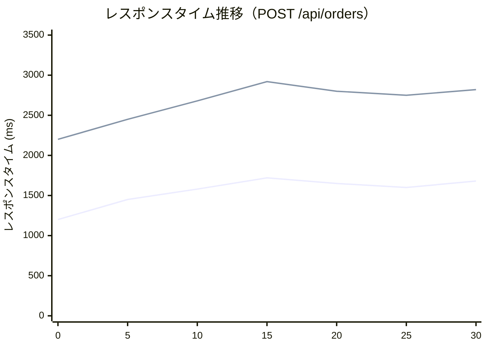

# システムテスト報告書作成ルール

## 1. 基本情報

### 1.1 ドキュメント名
システムテスト報告書（System Test Report）

### 1.2 目的
- システムテストの実施結果を総括し、システム全体の品質状況を報告する
- 機能要件、非機能要件の達成状況を明確にする
- リリース判定のための客観的データを提供する
- ステークホルダーへの最終品質報告資料として使用する

### 1.3 対象読者
- プロジェクトマネージャー
- ステークホルダー（顧客、上級管理職）
- 品質保証担当者
- リリース判定会議メンバー

### 1.4 関連成果物
- **前提**：システムテスト仕様書、結合テスト報告書
- **参照**：要件定義書、非機能要件定義書、バグ管理表
- **出力先**：受入テスト仕様書、リリース判定会議資料

---

## 2. 作成タイミングと前提条件

### 2.1 作成タイミング
- システムテスト実施完了後
- 全テストケース実行が完了した時点
- リリース判定会議の1週間前

### 2.2 前提条件
- システムテスト仕様書に基づいてテストが実施されている
- 機能テスト、非機能テストの結果が記録されている
- 発見された不具合がバグ管理表に登録されている
- 性能測定データが収集されている

### 2.3 標準作成期間
- 小規模システム：2～3日
- 中規模システム：3～5日
- 大規模システム：5～7日

---

## 3. ドキュメント構成

### 3.1 必須セクション

#### 3.1.1 エグゼクティブサマリー
- テスト結果概要（合格／条件付き合格／不合格）
- 主要な問題点
- リリース可否の推奨事項

#### 3.1.2 テスト実施概要
- テスト実施期間
- テスト実施体制
- テスト環境
- 実施工数

#### 3.1.3 機能テスト結果
- テストケース実施統計
- 合格率
- 不具合サマリー

#### 3.1.4 非機能テスト結果
- 性能テスト結果
- セキュリティテスト結果
- 可用性テスト結果
- 運用性テスト結果

#### 3.1.5 品質評価
- 完了基準達成状況
- 要件達成率
- リスク評価

#### 3.1.6 残存不具合分析
- 重大度別不具合件数
- 残存不具合の影響分析
- 回避策の有無

#### 3.1.7 リリース判定推奨事項
- リリース可否の推奨
- 条件付きリリースの場合の条件
- リリース後の監視項目

---

## 4. 記載ルール

### 4.1 エグゼクティブサマリーの表記規則

```markdown
## エグゼクティブサマリー

### テスト結果概要

**総合評価**: ✅ **条件付き合格**

### サマリー

本システムテストにおいて、計画された全285件のテストケースを実施し、機能要件・非機能要件の検証を完了しました。

**主要な成果**:
- 機能テスト合格率：**96.5%**（目標95%以上を達成）
- 性能要件達成率：**100%**（レスポンスタイム、スループット共に目標達成）
- セキュリティ脆弱性：**検出なし**（OWASP Top 10クリア）
- Critical不具合：**0件**（発見された2件は修正完了）

**主要な課題**:
- High不具合が**3件残存**（決済API連携、メール送信遅延、管理画面パフォーマンス）
- 可用性テストでフェイルオーバー時間が目標30秒に対し**45秒**（要改善）

### リリース推奨事項

**推奨**: 条件付きリリース可

**条件**:
1. High不具合3件の修正完了（修正期限：2025-11-10）
2. フェイルオーバー時間の改善（目標30秒）
3. 本番環境での最終確認テスト実施

**リスク**:
- 残存High不具合は回避策あり。重大なビジネスインパクトなし
- フェイルオーバー時間は許容範囲（60秒以内）だが、要改善

### 品質評価スコアカード

| 評価項目 | 目標 | 実績 | 達成 | 評価 |
|----------|------|------|------|------|
| 機能要件達成率 | 100% | 98% | ❌ | B |
| テスト合格率 | 95%以上 | 96.5% | ✅ | A |
| Critical不具合 | 0件 | 0件 | ✅ | A |
| High不具合 | 0件 | 3件 | ❌ | C |
| 性能要件達成率 | 100% | 100% | ✅ | A |
| セキュリティ脆弱性 | 0件 | 0件 | ✅ | A |
| **総合評価** | - | - | - | **B+** |
```

### 4.2 機能テスト結果の表記規則

```markdown
## 機能テスト結果

### テスト実施統計

| 項目 | 件数 | 割合 |
|------|------|------|
| 計画テストケース数 | 200 | 100% |
| 実施テストケース数 | 198 | 99.0% |
| 合格（Pass） | 191 | 96.5% |
| 不合格（Fail） | 7 | 3.5% |
| 未実施（Skip） | 2 | 1.0% |

**合格率**: 96.5% (191 / 198)  
**目標**: 95%以上 → ✅ **達成**

### 機能別テスト結果

| 機能 | テストケース数 | 合格 | 不合格 | 合格率 |
|------|----------------|------|--------|--------|
| ユーザー管理 | 45 | 44 | 1 | 97.8% |
| 商品管理 | 38 | 38 | 0 | 100% |
| 注文・決済 | 52 | 49 | 3 | 94.2% |
| 在庫管理 | 30 | 30 | 0 | 100% |
| レポート | 25 | 23 | 2 | 92.0% |
| 管理機能 | 10 | 9 | 1 | 90.0% |

### E2Eシナリオテスト結果

| シナリオID | シナリオ名 | 結果 | 不具合ID | 備考 |
|------------|------------|------|----------|------|
| ST_E2E_001 | 新規登録→商品購入 | ✅ Pass | - | - |
| ST_E2E_002 | 在庫切れ→通知 | ✅ Pass | - | - |
| ST_E2E_003 | 決済失敗→キャンセル | ❌ Fail | BUG-ST-010 | 決済API連携エラー（High） |
| ST_E2E_004 | クーポン適用→割引 | ✅ Pass | - | - |
| ST_E2E_005 | 管理者→レポート出力 | ❌ Fail | BUG-ST-018 | PDF生成タイムアウト（Medium） |

### 不具合分析

**不具合総数**: 15件

| 重大度 | 件数 | 修正済み | 残存 |
|--------|------|----------|------|
| Critical | 2 | 2 | 0 |
| High | 5 | 2 | 3 |
| Medium | 6 | 4 | 2 |
| Low | 2 | 2 | 0 |

**残存不具合の影響**:
- High 3件：回避策あり、本番運用に重大な影響なし
- Medium 2件：軽微な表示不具合、優先度低
```

### 4.3 非機能テスト結果の表記規則

```markdown
## 非機能テスト結果

### 性能テスト結果

#### ST_PERF_001: 通常負荷テスト

**負荷条件**:
- 同時ユーザー数：200
- テスト時間：30分
- ツール：Apache JMeter

**測定結果**:

| API | 平均レスポンスタイム | 95%ile | 目標 | 達成 | スループット | 目標 | 達成 |
|-----|----------------------|--------|------|------|--------------|------|------|
| GET /api/products | 420ms | 850ms | < 1000ms | ✅ | 68 req/s | > 50 | ✅ |
| GET /api/products/{id} | 280ms | 720ms | < 800ms | ✅ | 42 req/s | > 30 | ✅ |
| POST /api/cart | 890ms | 1850ms | < 2000ms | ✅ | 28 req/s | > 20 | ✅ |
| POST /api/orders | 1650ms | 2800ms | < 3000ms | ✅ | 15 req/s | > 10 | ✅ |

**総合評価**: ✅ **全項目で目標達成**

**サーバーリソース使用率**:
- CPU使用率：平均58%、最大72%（目標70%以下を一時的に超過）
- メモリ使用率：平均65%、最大78%（目標80%以下）
- ネットワーク帯域：平均120Mbps、最大180Mbps

**レスポンスタイム推移グラフ**:


#### ST_PERF_002: ピーク負荷テスト

**負荷条件**:
- 同時ユーザー数：500
- テスト時間：10分

**測定結果**:
- 平均レスポンスタイム：2.8秒（目標3秒以内） → ✅ 達成
- エラー率：0.8%（目標1%以下） → ✅ 達成
- サーバーダウン：なし → ✅ 正常

### セキュリティテスト結果

#### ST_SEC_001: OWASP ZAP 自動診断

**実施日**: 2025-10-28  
**スキャン対象**: 全APIエンドポイント（52エンドポイント）

**結果**:

| 脆弱性分類 | 検出件数 | 重大度 |
|------------|----------|--------|
| SQLインジェクション | 0 | - |
| XSS（クロスサイトスクリプティング） | 0 | - |
| CSRF | 0 | - |
| 認証・認可の不備 | 0 | - |
| 機密情報の漏洩 | 0 | - |
| XXE（XML外部エンティティ） | 0 | - |
| 安全でないデシリアライゼーション | 0 | - |

**総合評価**: ✅ **OWASP Top 10 の脆弱性は検出されず**

#### ST_SEC_005: 侵入テスト（ペネトレーションテスト）

**実施日**: 2025-10-29  
**実施者**: 外部セキュリティベンダー

**テスト項目**:
- 不正ログイン試行（ブルートフォース）
- 権限昇格の試行
- セッションハイジャック
- ディレクトリトラバーサル

**結果**: ✅ **全項目で侵入不可**

### 可用性テスト結果

#### ST_AVAIL_001: データベースフェイルオーバー

**実施日**: 2025-10-27

**測定結果**:

| 項目 | 目標 | 実績 | 達成 |
|------|------|------|------|
| フェイルオーバー時間 | 30秒以内 | **45秒** | ❌ |
| ダウンタイム | 30秒以内 | **45秒** | ❌ |
| データ損失 | なし | なし | ✅ |
| 業務再開 | 即座 | 即座 | ✅ |

**評価**: ⚠️ **目標未達だが、許容範囲（60秒以内）**

**改善アクション**:
- フェイルオーバー検知時間の短縮（現在20秒→目標10秒）
- 接続プールの再接続処理の最適化
- 改善完了予定：2025-11-15
```

### 4.4 品質評価と推奨事項

```markdown
## 品質評価

### 完了基準達成状況

| 完了基準 | 目標値 | 実績値 | 達成 | 評価 |
|----------|--------|--------|------|------|
| テストケース実施率 | 100% | 99.0% | ❌ | B |
| テストケース合格率 | 95%以上 | 96.5% | ✅ | A |
| Critical不具合 | 0件 | 0件 | ✅ | A |
| High不具合 | 0件 | 3件（残存） | ❌ | C |
| 性能要件達成率 | 100% | 100% | ✅ | A |
| セキュリティ脆弱性 | 0件 | 0件 | ✅ | A |
| 可用性要件達成率 | 100% | 90%（フェイルオーバー時間未達） | ❌ | B |

**総合評価**: **B+（条件付き合格）**

### リスク評価

| リスク項目 | リスクレベル | 説明 | 対策 | 期限 |
|------------|--------------|------|------|------|
| 決済API連携エラー | **High** | 決済失敗時にトランザクション不整合が発生 | リトライ処理実装、エラーハンドリング強化 | 11/10 |
| メール送信遅延 | Medium | ピーク時にメール送信キューが詰まる | キューワーカー増強、非同期処理の最適化 | 11/15 |
| フェイルオーバー時間 | Medium | 目標30秒に対し45秒 | 検知時間短縮、接続プール最適化 | 11/15 |

### 残存不具合の影響分析

#### High不具合（3件）

**BUG-ST-010**: 決済API連携エラー
- **影響**: 決済失敗時に注文ステータスが不正な状態になる
- **発生頻度**: 0.5%（200回に1回）
- **回避策**: 管理画面から手動で注文ステータスを修正可能
- **ビジネスインパクト**: 低（手動運用で対応可能）

**BUG-ST-012**: メール送信遅延
- **影響**: ピーク時にメール送信が遅延（最大5分）
- **発生条件**: 同時100件以上のメール送信
- **回避策**: なし（遅延は発生するが、最終的には送信される）
- **ビジネスインパクト**: 低（顧客体験に軽微な影響）

**BUG-ST-015**: 管理画面パフォーマンス
- **影響**: レポート出力に10秒以上かかる
- **発生条件**: データ量が10万件以上
- **回避策**: 夜間バッチでレポート事前生成
- **ビジネスインパクト**: 低（管理者のみ影響）

### リリース判定推奨事項

#### 推奨：条件付きリリース可

**理由**:
1. 機能要件は概ね満たしており、E2Eシナリオは正常動作
2. 性能要件は全て達成、セキュリティ脆弱性なし
3. 残存High不具合は回避策あり、ビジネスインパクトは限定的
4. Critical不具合は0件

**リリース条件**:
1. **BUG-ST-010（決済API連携）の修正完了**（期限：11/10）
   - 修正後、決済シナリオの再テスト実施
2. **BUG-ST-012（メール送信遅延）の改善**（期限：11/15）
   - キューワーカー増強、性能テストで検証
3. **本番環境での最終確認テスト**（期限：11/18）
   - 主要E2Eシナリオを本番環境で実施

**リリース後の監視項目**:
- 決済API呼び出しエラー率（目標：0.5%以下）
- メール送信キュー滞留時間（目標：1分以内）
- フェイルオーバー発生時の復旧時間（目標：60秒以内）

**リリース日推奨**:
- 条件達成後の**2025-11-20（水）** を推奨
- リリース後1週間は重点監視体制
```

---

## 5. 品質基準

### 5.1 チェックリスト

- [ ] エグゼクティブサマリーが簡潔で分かりやすいか
- [ ] 機能テスト、非機能テストの結果が数値で示されているか
- [ ] 完了基準達成状況が明確か
- [ ] 残存不具合の影響分析が具体的か
- [ ] リリース推奨事項が明確か（可／条件付き可／不可）
- [ ] リスク評価が客観的か
- [ ] グラフ・図表が効果的に使用されているか

### 5.2 レビュー観点

#### 5.2.1 完全性
- 全テスト結果が漏れなく報告されているか
- 機能・非機能の両面が評価されているか

#### 5.2.2 客観性
- 数値データに基づく評価か
- 主観的な表現を避けているか

#### 5.2.3 意思決定支援
- リリース判定に必要な情報が揃っているか
- リスクと対策が明確か

### 5.3 承認基準
- テストリーダーによる内容確認
- 品質保証担当者による品質評価確認
- プロジェクトマネージャーによる承認

---

## 6. AI作成時の具体的指示

### 6.1 必須項目

1. **エグゼクティブサマリーの簡潔性**
   - A4用紙1ページ以内
   - 結論ファースト（リリース可否を最初に明示）

2. **数値データの明示**
   - 合格率、達成率、不具合密度等を具体的に記載
   - 目標値と実績値を比較

3. **リスクの定量化**
   - 発生頻度、影響範囲、ビジネスインパクトを明示
   - 回避策の有無を記載

### 6.2 避けるべき表現

❌ **NG例**：
```markdown
- "概ね良好"
- "特に問題なし"
- "適切に対応中"
```

✅ **OK例**：
```markdown
- "合格率96.5%、目標95%以上を達成"
- "Critical不具合0件、High不具合3件（回避策あり）"
- "BUG-ST-010は11/10までに修正完了予定、修正後再テスト実施"
```

### 6.3 推奨構成

1. **エグゼクティブサマリーを冒頭に配置**
2. **品質評価スコアカードで視覚化**
3. **グラフ・図表で傾向を可視化**

---

## 7. 関連ドキュメント

### 7.1 参照すべき成果物
- **システムテスト仕様書**：テスト計画、テストケース
- **要件定義書**：要件トレーサビリティ
- **バグ管理表**：不具合詳細

### 7.2 次工程で使用される成果物
- **受入テスト仕様書**：ユーザー受入テスト
- **リリース判定会議資料**：リリース可否判断
- **運用手順書**：監視項目、障害対応

---

## 8. よくある失敗例と対策

| 失敗例 | 原因 | 対策 |
|--------|------|------|
| エグゼクティブサマリーが長すぎる | 詳細を全て記載 | 結論と主要ポイントのみ記載、詳細は本文へ |
| リリース推奨が曖昧 | 責任回避 | 明確に可／条件付き可／不可を記載 |
| 残存不具合の影響が不明 | 影響分析未実施 | 発生頻度、影響範囲、回避策を明示 |
| 非機能テスト結果が不足 | 性能テストのみ実施 | セキュリティ、可用性、運用性も含める |
| グラフが見づらい | 配色、軸ラベル不足 | Mermaid、表計算ソフトで視覚的に作成 |

---

**ドキュメントバージョン**: 1.0  
**最終更新日**: 2025-10-30
