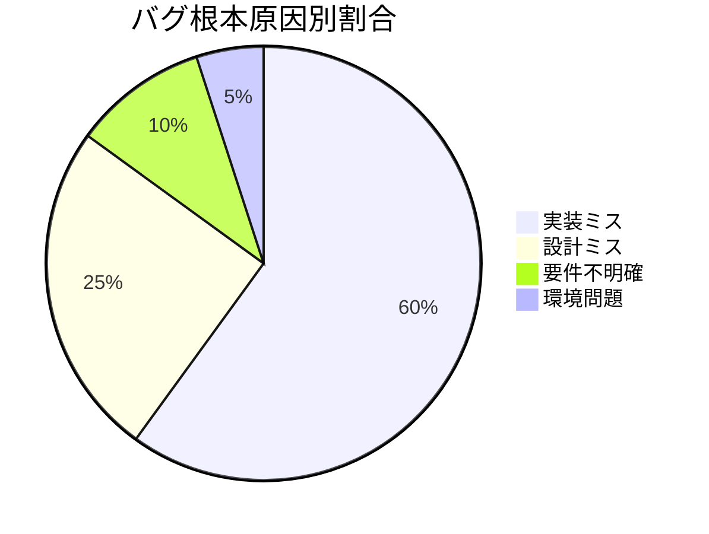

# バグ管理表作成ルール

## 1. 基本情報

### 1.1 ドキュメント名
バグ管理表（Bug Tracking Sheet / Defect Management Table）

### 1.2 目的
- テスト工程で発見されたバグを一元管理する
- バグの優先度、重大度を明確にし、修正順序を決定する
- バグの修正状況を追跡し、品質状況を可視化する
- ステークホルダーへのバグ状況報告資料として使用する

### 1.3 対象読者
- プロジェクトマネージャー
- 開発チーム（開発者、テスター）
- 品質保証担当者
- ステークホルダー

### 1.4 関連成果物
- **前提**：テスト仕様書（単体、結合、システム、受入）
- **参照**：テスト報告書、要件定義書
- **出力先**：品質報告会資料、リリース判定会議資料

---

## 2. 作成タイミングと前提条件

### 2.1 作成タイミング
- テスト開始時にフォーマットを準備
- バグ発見時に即座に登録
- プロジェクト全期間を通じて継続的に更新

### 2.2 前提条件
- バグ管理ツール（Jira、Redmine、GitHub Issues等）または表計算ソフトを使用
- バグ登録ルール（重大度、優先度の定義）が決まっている
- バグ管理の責任者が明確

### 2.3 標準作成期間
- 継続的に更新（プロジェクト全期間）

---

## 3. ドキュメント構成

### 3.1 必須項目

#### 3.1.1 バグ基本情報
- バグID（一意な識別子）
- 発見日
- 発見者
- 発見工程（単体テスト、結合テスト等）
- バグタイトル（簡潔な概要）

#### 3.1.2 バグ詳細情報
- 詳細説明
- 再現手順
- 期待結果
- 実際の結果
- スクリーンショット、ログ

#### 3.1.3 重大度・優先度
- 重大度（Severity）：Critical、High、Medium、Low
- 優先度（Priority）：High、Medium、Low
- 影響範囲（機能、ユーザー数）

#### 3.1.4 修正管理情報
- ステータス（Open、In Progress、Fixed、Closed等）
- 担当者
- 修正予定日
- 修正完了日
- 再テスト結果

#### 3.1.5 根本原因・対策
- 根本原因（要件不明確、設計ミス、実装ミス等）
- 修正内容
- 再発防止策

---

## 4. 記載ルール

### 4.1 バグ管理表のフォーマット

```markdown
## バグ管理表

### バグ一覧

| バグID | 発見日 | 重大度 | 優先度 | タイトル | ステータス | 担当者 | 修正期限 |
|--------|--------|--------|--------|----------|------------|--------|----------|
| BUG-001 | 10/21 | Critical | High | ユーザー登録時にトランザクションがロールバックされない | Fixed | 開発A | 10/22 |
| BUG-002 | 10/22 | High | High | 商品検索で特殊文字を入力するとSQLエラー | Fixed | 開発B | 10/24 |
| BUG-003 | 10/23 | High | High | 決済API呼び出しがタイムアウトする | In Progress | 開発A | 11/01 |
| BUG-004 | 10/24 | Medium | Medium | 注文履歴画面の表示が遅い（3秒以上） | Fixed | 開発C | 10/26 |
| BUG-005 | 10/25 | Medium | Low | 管理画面のボタン配置が不自然 | Open | デザイナー | 11/10 |
| BUG-006 | 10/26 | Low | Low | エラーメッセージの誤字 | Fixed | 開発B | 10/27 |

### バグステータス別集計

| ステータス | 件数 | 割合 |
|------------|------|------|
| Open（未着手） | 1 | 16.7% |
| In Progress（対応中） | 1 | 16.7% |
| Fixed（修正済み） | 4 | 66.7% |
| Closed（完了） | 0 | 0% |
| **合計** | **6** | **100%** |

### 重大度別集計

| 重大度 | Open | In Progress | Fixed | Closed | 合計 |
|--------|------|-------------|-------|--------|------|
| Critical | 0 | 0 | 1 | 0 | 1 |
| High | 0 | 1 | 1 | 0 | 2 |
| Medium | 0 | 0 | 2 | 0 | 2 |
| Low | 1 | 0 | 0 | 0 | 1 |
| **合計** | **1** | **1** | **4** | **0** | **6** |
```

### 4.2 バグ詳細の記載例

```markdown
### バグ詳細: BUG-001

**バグID**: BUG-001  
**発見日**: 2025-10-21  
**発見者**: テスターA（佐藤花子）  
**発見工程**: 結合テスト  
**重大度**: Critical  
**優先度**: High  
**ステータス**: Fixed（修正済み）  
**担当者**: 開発担当A（山田太郎）  
**修正完了日**: 2025-10-22

---

#### バグタイトル
ユーザー登録時にトランザクションがロールバックされない

#### 詳細説明
ユーザー登録処理中にEmailServiceで例外が発生した場合、UserRepositoryへのINSERT処理がロールバックされず、データベースに不完全なユーザーレコードが残存する。

#### 再現手順
1. EmailServiceが例外をスローするようモック設定
2. POST /api/users でユーザー登録を実行
   ```json
   {
     "email": "test@example.com",
     "password": "Pass123!",
     "name": "Test User"
   }
   ```
3. データベースのusersテーブルを確認

#### 期待結果
- HTTPステータス：500 Internal Server Error
- usersテーブル：0件（ロールバックされる）

#### 実際の結果
- HTTPステータス：500 Internal Server Error
- usersテーブル：**1件**（不完全なレコードが残存） ← **問題**

#### スクリーンショット・ログ
```
ERROR [UserService] EmailService.sendWelcomeEmail failed
java.lang.RuntimeException: SMTP connection failed
  at com.example.EmailServiceImpl.sendWelcomeEmail(EmailServiceImpl.java:45)
  ...
```

#### 影響範囲
- 機能：ユーザー登録機能
- 影響ユーザー：新規登録ユーザー全員
- ビジネスインパクト：Critical（データ整合性が失われる）

---

#### 根本原因分析

**原因分類**: 実装ミス

**詳細**:
UserServiceクラスのregisterUser()メソッドに `@Transactional` アノテーションが欠落していた。そのため、EmailServiceで例外が発生しても、UserRepositoryのINSERT処理がコミットされてしまった。

**根本原因**:
- コードレビューでトランザクション境界のチェックが漏れた
- 単体テストでトランザクションロールバックのテストケースがなかった

#### 修正内容

**修正前**:
```java
public Long registerUser(RegisterUserRequest request) {
    User user = userRepository.save(request.toEntity());
    emailService.sendWelcomeEmail(user.getEmail()); // 例外発生時にロールバックされない
    return user.getId();
}
```

**修正後**:
```java
@Transactional  // ← 追加
public Long registerUser(RegisterUserRequest request) {
    User user = userRepository.save(request.toEntity());
    emailService.sendWelcomeEmail(user.getEmail()); // 例外発生時にロールバック
    return user.getId();
}
```

**修正ファイル**:
- `src/main/java/com/example/service/UserService.java`

**修正コミット**:
- コミットID: `abc123def456`
- コミットメッセージ: "Fix BUG-001: Add @Transactional to registerUser()"

#### 再発防止策

1. **コードレビューチェックリスト追加**
   - トランザクション境界が適切に設定されているか確認項目を追加
2. **単体テストケース追加**
   - トランザクションロールバックのテストケースを追加
   - 例外発生時のDB状態を確認するテストを追加
3. **静的解析ツール導入検討**
   - @Transactional の欠落を検出するルールを追加

#### 再テスト結果

**再テスト日**: 2025-10-22  
**再テスト担当者**: テスターA（佐藤花子）  
**結果**: ✅ **Pass**

**確認内容**:
- EmailServiceで例外が発生した場合、usersテーブルに0件（ロールバック成功）
- HTTPステータス：500 Internal Server Error
- エラーログが適切に出力される

**クローズ日**: 2025-10-22
```

### 4.3 重大度・優先度の定義

```markdown
## 重大度（Severity）の定義

| 重大度 | 定義 | 例 |
|--------|------|-----|
| **Critical** | システム停止、データ損失、セキュリティ脆弱性 | ・システムがクラッシュする<br>・データベースのデータが消失する<br>・個人情報が漏洩する |
| **High** | 主要機能が動作しない、業務に重大な影響 | ・注文機能が使えない<br>・決済処理が失敗する<br>・ログインできない |
| **Medium** | 機能が部分的に動作しない、回避策あり | ・検索結果の表示が遅い<br>・一部の画面が表示されない<br>・エラーメッセージが不適切 |
| **Low** | 軽微な表示不具合、使い勝手の問題 | ・ボタンの配置が不自然<br>・誤字・脱字<br>・色が見づらい |

## 優先度（Priority）の定義

| 優先度 | 定義 | 修正期限目安 |
|--------|------|--------------|
| **High** | 即座に修正が必要 | 発見から24時間以内 |
| **Medium** | 計画的に修正 | 発見から1週間以内 |
| **Low** | 次回リリースで修正可 | 次回リリースまで |

## 重大度と優先度のマトリクス

| 重大度 \ 優先度 | High | Medium | Low |
|-----------------|------|--------|-----|
| **Critical** | ✅ 即座に修正 | ❌ あり得ない | ❌ あり得ない |
| **High** | ✅ 即座に修正 | ⚠️ 回避策あり | ❌ あり得ない |
| **Medium** | ⚠️ 発生頻度高 | ✅ 通常ケース | ⚠️ 影響範囲小 |
| **Low** | ❌ あり得ない | ⚠️ ユーザー体験向上 | ✅ 次回リリース |
```

### 4.4 バグ推移グラフ

```markdown
## バグ推移分析

### バグ累積推移

```mermaid
xychart-beta
    title "バグ累積推移"
    x-axis "日付" [10/21, 10/22, 10/23, 10/24, 10/25, 10/26, 10/27]
    y-axis "件数" 0 --> 20
    line "発見" [2, 4, 7, 12, 15, 18, 20]
    line "修正完了" [0, 2, 3, 6, 10, 14, 18]
    line "残存" [2, 2, 4, 6, 5, 4, 2]
```

### バグ収束傾向

**分析**:
- 10/26以降、バグ発見数が減少傾向
- 修正完了数が発見数を上回り、残存バグが減少
- 収束傾向あり → リリース可能な品質に近づいている

### 根本原因分析



**主要な根本原因**:
1. **実装ミス**（60%）：コーディングエラー、ロジックミス
2. **設計ミス**（25%）：設計書の不備、考慮漏れ
3. **要件不明確**（10%）：要件定義の曖昧さ
4. **環境問題**（5%）：テスト環境の設定ミス

**改善アクション**:
- 実装ミス削減：コードレビュー強化、ペアプログラミング導入
- 設計ミス削減：設計レビュー観点の追加、デザインパターン適用
```

---

## 5. 品質基準

### 5.1 チェックリスト

- [ ] バグID、発見日、重大度、優先度が記録されているか
- [ ] 再現手順が明確か（第三者が再現可能）
- [ ] 期待結果と実際の結果が記載されているか
- [ ] 担当者、修正期限が設定されているか
- [ ] 修正内容、再発防止策が記載されているか
- [ ] 再テスト結果が記録されているか
- [ ] バグ推移グラフで傾向が可視化されているか

### 5.2 レビュー観点

#### 5.2.1 完全性
- 全バグが漏れなく登録されているか
- ステータスが最新に更新されているか

#### 5.2.2 正確性
- 重大度・優先度が適切に設定されているか
- 再現手順が正確か

#### 5.2.3 追跡可能性
- バグIDでテストケース、修正コミットが紐付けられるか

### 5.3 承認基準
- プロジェクトマネージャーによる定期レビュー
- 品質保証担当者による品質評価

---

## 6. AI作成時の具体的指示

### 6.1 必須項目

1. **再現手順の具体性**
   - 第三者が再現できるレベルの詳細度
   - 入力値、操作手順、環境情報を明記

2. **根本原因の分析**
   - 表面的な原因ではなく、根本原因を記載
   - 5Whys、フィッシュボーン図等の手法を使用

3. **再発防止策**
   - 具体的なアクション（コードレビュー強化、テストケース追加等）
   - 実施責任者、期限を明記

### 6.2 避けるべき表現

❌ **NG例**：
```markdown
- "システムにバグがある"
- "正しく動作しない"
- "エラーが発生する"
```

✅ **OK例**：
```markdown
- "ユーザー登録処理中にEmailServiceで例外が発生した場合、UserRepositoryへのINSERT処理がロールバックされず、データベースに不完全なユーザーレコードが残存する"
- "POST /api/users が HTTPステータス 500 を返すが、usersテーブルに1件のレコードが残存する（期待：0件）"
- "EmailService.sendWelcomeEmail() で RuntimeException が発生し、トランザクションがロールバックされない"
```

### 6.3 推奨構成

1. **バグ一覧表で全体を俯瞰**
2. **重大度の高いバグから詳細を記載**
3. **バグ推移グラフで品質傾向を可視化**

---

## 7. 関連ドキュメント

### 7.1 参照すべき成果物
- **テスト仕様書**：テストケース、再現手順
- **要件定義書**：期待される動作
- **詳細設計書**：実装仕様

### 7.2 次工程で使用される成果物
- **テスト報告書**：バグ統計、品質評価
- **品質報告会資料**：ステークホルダー報告
- **リリース判定会議資料**：リリース可否判断

---

## 8. よくある失敗例と対策

| 失敗例 | 原因 | 対策 |
|--------|------|------|
| 再現手順が不明確 | 情報不足 | 環境、入力値、操作手順を詳細に記載 |
| 重大度・優先度が不適切 | 定義が曖昧 | 重大度・優先度の定義を明確にし、チームで合意 |
| バグが重複登録される | 管理が不十分 | バグID検索、類似バグチェックを実施 |
| 修正後の再テスト漏れ | プロセス不備 | Fixed → 再テスト → Closed のフロー徹底 |
| 根本原因が不明 | 表面的な分析 | 5Whys、フィッシュボーン図等で深堀り |
| バグ推移が可視化されていない | グラフ未作成 | 週次でバグ推移グラフを更新、共有 |
| 再発防止策が実施されない | 責任者・期限不明確 | 具体的なアクション、実施責任者、期限を明記 |

---

**ドキュメントバージョン**: 1.0  
**最終更新日**: 2025-10-30
