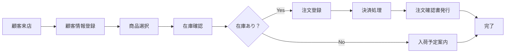

# 受入テスト仕様書作成ルール

## 1. 基本情報

### 1.1 ドキュメント名
受入テスト仕様書（User Acceptance Test Specification / UAT Specification）

### 1.2 目的
- ユーザー（顧客）がシステムを受け入れるための検証基準を定義する
- 業務要件が正しく実装されていることをユーザー視点で確認する
- 実際の業務フローに沿った運用可能性を検証する
- システムの受け入れ可否を判断するための客観的基準を提供する

### 1.3 対象読者
- ユーザー（顧客、業務担当者）
- プロジェクトマネージャー
- 品質保証担当者
- 受入テスト実施担当者

### 1.4 関連成果物
- **前提**：要件定義書、システムテスト報告書、業務フロー図
- **参照**：画面設計書、運用手順書
- **出力先**：受入テスト報告書、リリース判定会議資料

---

## 2. 作成タイミングと前提条件

### 2.1 作成タイミング
- システムテスト完了後
- 受入テスト実施の2～3週間前
- ユーザー（顧客）との合意形成後

### 2.2 前提条件
- システムテストが合格している
- 要件定義書が確定している
- 受入テスト環境（本番環境または本番相当環境）が準備されている
- ユーザー（顧客）がテストに参加可能
- 本番相当のテストデータが準備されている

### 2.3 標準作成期間
- 小規模システム：3～5日
- 中規模システム：1～2週間
- 大規模システム：2～3週間

---

## 3. ドキュメント構成

### 3.1 必須セクション

#### 3.1.1 テスト方針
- 受入テストの目的・範囲
- テスト観点（業務適合性、使いやすさ、運用性）
- テスト実施体制（ユーザー、開発チーム）
- テスト実施スケジュール

#### 3.1.2 テストシナリオ
- 業務フローベースのシナリオ
- ユーザーストーリーベースのシナリオ
- 例外処理・エラー処理のシナリオ

#### 3.1.3 テストケース一覧
- テストケースID
- テストシナリオ名
- 業務フロー
- 前提条件
- テスト手順（ユーザー視点）
- 期待結果
- 優先度

#### 3.1.4 受入基準
- 機能要件の充足度
- 使いやすさ（ユーザビリティ）
- 業務への適合性
- 運用可能性

#### 3.1.5 テストデータ
- 本番相当のマスターデータ
- 実際の業務データ（個人情報はマスキング）
- 異常データ、境界値データ

---

## 4. 記載ルール

### 4.1 テストシナリオの表記規則

```markdown
## テストシナリオ：新規顧客の注文受付業務

### 業務フロー概要



### テストシナリオ一覧

| シナリオID | シナリオ名 | 業務目的 | 優先度 |
|------------|------------|----------|--------|
| UAT_S001 | 新規顧客登録→商品注文→決済成功 | 最も基本的な業務フロー | 高 |
| UAT_S002 | 在庫切れ商品→入荷予定案内 | 在庫管理との連携確認 | 高 |
| UAT_S003 | 決済失敗→注文キャンセル | エラーハンドリング確認 | 中 |
| UAT_S004 | 既存顧客の再注文 | 顧客情報の再利用確認 | 中 |
| UAT_S005 | クーポン適用→割引計算 | プロモーション機能確認 | 低 |

### テストシナリオ詳細: UAT_S001

**シナリオID**: UAT_S001  
**シナリオ名**: 新規顧客登録→商品注文→決済成功  
**業務目的**: 新規顧客が初めて商品を注文するケース（最頻出パターン）

**前提条件**:
- オペレーターが業務端末にログイン済み
- 顧客が店舗に来店している
- 注文する商品が在庫あり

**テスト手順（ユーザー視点）**:

| ステップ | 操作内容 | 期待結果 | 確認項目 |
|----------|----------|----------|----------|
| 1 | トップメニューで「新規顧客登録」をクリック | 顧客登録画面が表示される | 画面遷移の速さ、表示内容 |
| 2 | 顧客情報を入力<br>・氏名：山田太郎<br>・電話：03-1234-5678<br>・メール：yamada@example.com | 入力フィールドが使いやすい | 入力補助、バリデーション |
| 3 | 「登録」ボタンをクリック | 「顧客登録が完了しました」メッセージ表示<br>顧客番号が発番される | メッセージの分かりやすさ |
| 4 | 「商品検索」をクリック | 商品検索画面が表示される | 画面遷移の速さ |
| 5 | 商品名「ノートPC」で検索 | 該当商品が一覧表示される | 検索速度、表示内容 |
| 6 | 「商品A」を選択、数量「2」を入力 | カートに追加される | 在庫数の表示、カート表示 |
| 7 | 「注文確定」をクリック | 注文確認画面が表示される<br>合計金額が正しく計算されている | 金額計算の正確性 |
| 8 | 決済方法「クレジットカード」を選択 | 決済画面が表示される | 決済方法の選択しやすさ |
| 9 | カード情報を入力、「決済」をクリック | 「決済処理中...」表示<br>決済完了メッセージ表示 | 処理時間、メッセージ |
| 10 | 注文確認書を印刷 | 注文確認書PDFがダウンロードされる<br>印刷プレビュー表示 | PDF内容、印刷品質 |

**受入判定基準**:
- 全ステップが迷わず実行できる（ユーザビリティ）
- レスポンスタイムが許容範囲内（各画面3秒以内）
- エラーメッセージが分かりやすい
- 印刷物が業務で使用可能なレベル

**実施時間**: 約10分（実業務想定）
```

### 4.2 受入基準の表記規則

```markdown
## 受入基準

### 機能要件の充足度

| 要件ID | 要件名 | テストシナリオID | 充足度目標 |
|--------|--------|------------------|------------|
| REQ-001 | 顧客登録機能 | UAT_S001, UAT_S004 | 100% |
| REQ-002 | 商品検索機能 | UAT_S001, UAT_S002 | 100% |
| REQ-003 | 注文登録機能 | UAT_S001, UAT_S003 | 100% |
| REQ-004 | 決済機能 | UAT_S001, UAT_S003 | 100% |
| REQ-005 | 在庫管理連携 | UAT_S002 | 100% |
| REQ-006 | クーポン機能 | UAT_S005 | 80%以上 |

**受入条件**:
- 優先度「高」の要件は100%充足
- 優先度「中」の要件は90%以上充足
- 優先度「低」の要件は80%以上充足

### 使いやすさ（ユーザビリティ）

| 評価項目 | 評価基準 | 測定方法 |
|----------|----------|----------|
| 操作の直感性 | 5段階評価で平均4.0以上 | ユーザーアンケート |
| レスポンスタイム | 各画面3秒以内 | 実測 |
| エラーメッセージ | ユーザーが理解できる | ユーザーヒアリング |
| 画面デザイン | 見やすい、分かりやすい | ユーザーアンケート |
| マニュアル不要度 | 80%以上の操作がマニュアルなしで可能 | ユーザーテスト観察 |

### 業務への適合性

| 評価項目 | 評価基準 |
|----------|----------|
| 業務フローとの整合性 | 現行業務フローから大きな変更なし |
| 業務効率の向上 | 現行システムより処理時間20%短縮 |
| 業務例外への対応 | 主要な例外ケース（10パターン）が処理可能 |
| 帳票の業務適合性 | 既存帳票フォーマットを踏襲 |

### 運用可能性

| 評価項目 | 評価基準 |
|----------|----------|
| システム起動・停止 | オペレーター自身で実施可能 |
| バックアップ・リストア | 手順書通りに実施可能 |
| 障害時の対応 | エラーログから原因を特定可能 |
| ユーザー教育 | 2日間の研修で操作習得可能 |

### 完了基準

以下の全条件を満たす場合、受入テスト合格とする：

1. **機能要件充足度**：優先度「高」の要件が100%充足
2. **テストシナリオ合格率**：95%以上
3. **Critical不具合**：0件
4. **High不具合**：0件（またはユーザーが許容）
5. **ユーザビリティ評価**：平均4.0以上（5段階評価）
6. **業務適合性**：ユーザー代表が承認
7. **運用可能性**：運用担当者が承認
```

### 4.3 ユーザーフィードバックの記録

```markdown
## ユーザーフィードバック記録

### 使いやすさ評価（5段階評価）

| 評価項目 | ユーザーA | ユーザーB | ユーザーC | 平均 | 目標 | 達成 |
|----------|-----------|-----------|-----------|------|------|------|
| 操作の直感性 | 5 | 4 | 4 | 4.3 | 4.0以上 | ✅ |
| 画面の見やすさ | 4 | 5 | 4 | 4.3 | 4.0以上 | ✅ |
| レスポンスの速さ | 4 | 4 | 5 | 4.3 | 4.0以上 | ✅ |
| エラーメッセージ | 3 | 4 | 4 | 3.7 | 4.0以上 | ❌ |
| 総合評価 | 4 | 4 | 5 | 4.3 | 4.0以上 | ✅ |

**総合評価**: 平均4.3（目標4.0以上を達成） → ✅ **合格**

**改善要望**:
- エラーメッセージがやや技術的で分かりにくい（3.7点）→ 改善が望ましい

### 自由記述コメント

**ユーザーA（営業担当）**:
> 全体的に使いやすいです。特に商品検索が速くて助かります。ただ、エラーが出たときのメッセージが分かりにくいので、もう少し平易な表現にしてほしいです。

**ユーザーB（店舗責任者）**:
> 現行システムより操作が簡単になりました。画面遷移も速く、業務効率が上がりそうです。印刷物も問題ありません。

**ユーザーC（カスタマーサポート）**:
> 顧客情報の登録がスムーズで良いです。クーポン適用の操作が少し分かりにくかったですが、慣れれば問題ないと思います。

### 改善要望と対応

| 改善要望 | 重大度 | 対応方針 | 対応期限 |
|----------|--------|----------|----------|
| エラーメッセージを平易な表現に | Medium | 主要なエラーメッセージを修正 | 11/10 |
| クーポン適用の操作改善 | Low | マニュアルに詳細手順を追記 | 11/05 |
| 印刷プレビューのフォント変更 | Low | 次回リリースで対応 | 次期バージョン |
```

---

## 5. 品質基準

### 5.1 チェックリスト

- [ ] 全ての業務フローがテストシナリオでカバーされているか
- [ ] ユーザー視点の操作手順が記載されているか
- [ ] 受入基準が明確か（機能、ユーザビリティ、業務適合性、運用性）
- [ ] テストデータが本番相当か
- [ ] ユーザー（顧客）の合意が得られているか
- [ ] 実施体制（ユーザー参加）が明確か
- [ ] 完了基準が定量的に定義されているか

### 5.2 レビュー観点

#### 5.2.1 業務適合性
- 実際の業務フローに沿っているか
- 業務例外ケースが含まれているか

#### 5.2.2 ユーザビリティ
- 専門用語を避け、ユーザーが理解できる表現か
- マニュアルなしで操作可能か

#### 5.2.3 実現可能性
- ユーザーが実施可能なテストケースか
- テスト期間が現実的か

### 5.3 承認基準
- ユーザー代表による承認
- プロジェクトマネージャーによる承認
- 品質保証担当者による確認

---

## 6. AI作成時の具体的指示

### 6.1 必須項目

1. **ユーザー視点の記載**
   - 専門用語を避け、業務用語を使用
   - 「クリックする」「入力する」等の具体的な操作を記載

2. **業務フローの可視化**
   - Mermaid flowchart で業務フローを図示
   - ユーザーが業務全体を理解できるように記載

3. **受入基準の明確化**
   - 定量的な基準（合格率、評価点数等）
   - ユーザーが判断できる基準

### 6.2 避けるべき表現

❌ **NG例**：
```markdown
- "APIが正しく動作することを確認"
- "データベースに正しく登録される"
- "システムが正常に処理する"
```

✅ **OK例**：
```markdown
- "「登録」ボタンをクリックすると、『顧客登録が完了しました』というメッセージが表示される"
- "顧客情報が顧客一覧画面に表示され、顧客番号が発番される"
- "注文確認書PDFがダウンロードされ、印刷プレビューで内容を確認できる"
```

### 6.3 推奨構成

1. **業務フローベースの構成**
   - ユーザーストーリーに沿ったシナリオ
   - 実業務の流れに沿った記載

2. **ユーザーフィードバックの記録**
   - 5段階評価、自由記述コメント
   - 改善要望と対応方針

---

## 7. 関連ドキュメント

### 7.1 参照すべき成果物
- **要件定義書**：業務要件、機能要件
- **業務フロー図**：現行業務フロー
- **画面設計書**：画面レイアウト、操作方法

### 7.2 次工程で使用される成果物
- **受入テスト報告書**：テスト結果、ユーザー評価
- **リリース判定会議資料**：リリース可否判断
- **ユーザーマニュアル**：操作手順

---

## 8. よくある失敗例と対策

| 失敗例 | 原因 | 対策 |
|--------|------|------|
| テストシナリオが技術的 | 開発者視点で作成 | ユーザーと一緒に作成、業務用語を使用 |
| 受入基準が曖昧 | 定量的な基準なし | 合格率、評価点数等の数値基準を設定 |
| ユーザー参加が不十分 | ユーザーが多忙 | テスト日程を早めに調整、優先度付け |
| テストデータが不足 | データ準備を軽視 | 本番相当のマスターデータを早期に準備 |
| 業務例外ケースが不足 | 正常系のみテスト | ユーザーヒアリングで例外ケースを洗い出し |
| エラーメッセージが分かりにくい | 技術的な表現 | ユーザーが理解できる平易な表現に修正 |
| 運用性のテスト不足 | 機能テストのみ実施 | バックアップ、障害対応等の運用シナリオも含める |

---

**ドキュメントバージョン**: 1.0  
**最終更新日**: 2025-10-30
