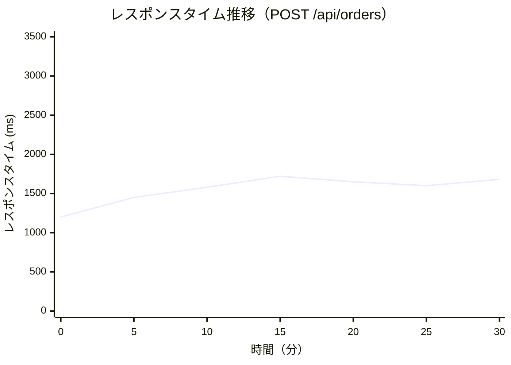
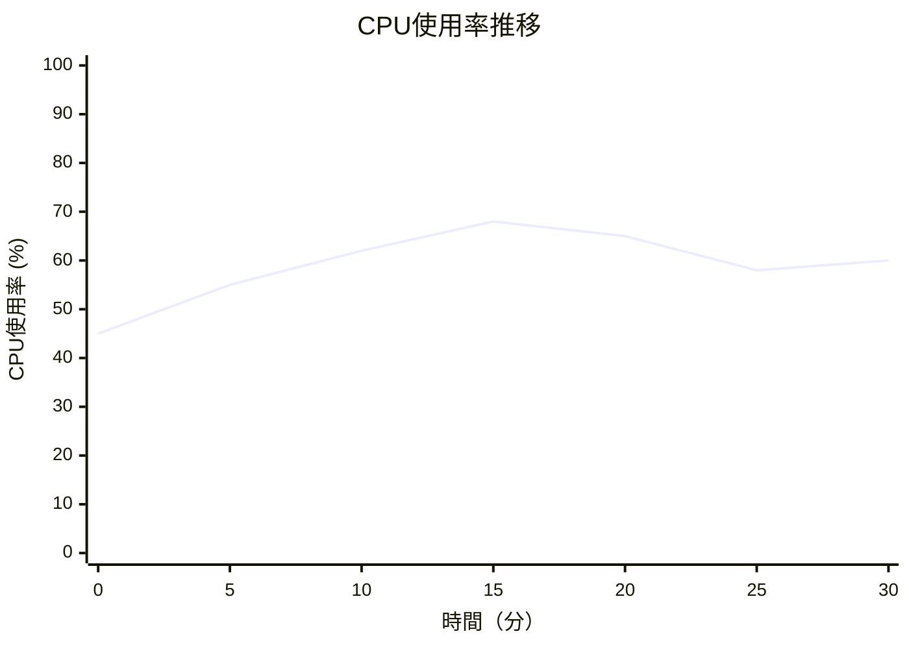

# 性能テスト報告書作成ルール

## 1. 基本情報

### 1.1 ドキュメント名
性能テスト報告書（Performance Test Report）

### 1.2 目的
- システムの性能要件達成状況を報告する
- レスポンスタイム、スループット、リソース使用率を測定・分析する
- ボトルネックを特定し、改善提案を行う
- 本番環境での性能予測データを提供する

### 1.3 対象読者
- プロジェクトマネージャー
- システムアーキテクト
- インフラエンジニア
- 性能チューニング担当者

### 1.4 関連成果物
- **前提**：システムテスト仕様書、非機能要件定義書
- **参照**：アーキテクチャ設計書、物理DB設計書
- **出力先**：システムテスト報告書、性能改善提案書

---

## 2. 作成タイミングと前提条件

### 2.1 作成タイミング
- 性能テスト実施完了後
- システムテストの一環として実施
- 本番リリースの2～3週間前

### 2.2 前提条件
- 性能テスト環境（本番相当）が準備されている
- 性能要件が定量的に定義されている
- テストデータ（本番相当のデータ量）が準備されている
- 負荷テストツール（JMeter、Locust等）が準備されている

### 2.3 標準作成期間
- 小規模システム：2～3日
- 中規模システム：3～5日
- 大規模システム：5～7日

---

## 3. ドキュメント構成

### 3.1 必須セクション

#### 3.1.1 テスト実施概要
- テスト実施期間
- テスト環境（サーバースペック、ネットワーク構成）
- 使用ツール
- テストデータ量

#### 3.1.2 性能要件
- レスポンスタイム目標値
- スループット目標値
- 同時接続数目標値
- リソース使用率目標値

#### 3.1.3 テスト結果サマリー
- 性能要件達成状況（一覧表）
- 達成率
- 主要なボトルネック

#### 3.1.4 負荷テスト結果詳細
- 通常負荷テスト
- ピーク負荷テスト
- ストレステスト
- 持久力テスト（エンデュランステスト）

#### 3.1.5 リソース使用状況
- CPU使用率
- メモリ使用率
- ディスクI/O
- ネットワーク帯域

#### 3.1.6 ボトルネック分析
- 特定されたボトルネック
- 根本原因分析
- 改善提案

---

## 4. 記載ルール

### 4.1 性能要件と実績の表記規則

```markdown
## 性能要件と実績

### 性能要件達成状況サマリー

| 項目 | 目標値 | 実績値 | 達成 | 評価 |
|------|--------|--------|------|------|
| レスポンスタイム（平均） | < 2秒 | 1.65秒 | ✅ | A |
| レスポンスタイム（95%ile） | < 3秒 | 2.80秒 | ✅ | A |
| スループット | > 100 TPS | 142 TPS | ✅ | A |
| 同時接続数 | 500ユーザー | 500ユーザー | ✅ | A |
| CPU使用率 | < 70% | 68% | ✅ | A |
| メモリ使用率 | < 80% | 75% | ✅ | A |
| エラー率 | < 0.1% | 0.05% | ✅ | A |

**総合達成率**: 100%（7項目中7項目達成）  
**総合評価**: **A（優秀）**

### API別性能要件

| API | 平均レスポンス | 目標 | 達成 | 95%ile | 目標 | 達成 | スループット | 目標 | 達成 |
|-----|----------------|------|------|--------|------|------|--------------|------|------|
| GET /api/products | 420ms | < 1000ms | ✅ | 850ms | < 1500ms | ✅ | 68 req/s | > 50 | ✅ |
| GET /api/products/{id} | 280ms | < 500ms | ✅ | 720ms | < 800ms | ✅ | 42 req/s | > 30 | ✅ |
| POST /api/cart | 890ms | < 1500ms | ✅ | 1850ms | < 2000ms | ✅ | 28 req/s | > 20 | ✅ |
| POST /api/orders | 1650ms | < 2000ms | ✅ | 2800ms | < 3000ms | ✅ | 15 req/s | > 10 | ✅ |
| GET /api/admin/reports | **3200ms** | < 3000ms | ❌ | **5100ms** | < 4000ms | ❌ | 5 req/s | > 3 | ✅ |

**注意**: 管理画面レポート機能（GET /api/admin/reports）のみ目標未達。要改善。
```

### 4.2 負荷テスト結果の表記規則

```markdown
## 負荷テスト結果詳細

### テスト1: 通常負荷テスト

**テスト目的**: 通常業務時間帯の負荷を想定した性能検証

**テスト条件**:
- 同時ユーザー数：200
- ランプアップ時間：60秒（徐々に200ユーザーまで増加）
- テスト時間：30分
- シナリオ構成：
  - 商品検索：40%
  - 商品詳細閲覧：30%
  - カート追加：20%
  - 注文確定：10%

**測定結果**:

#### レスポンスタイム統計

| API | 平均 | 中央値 | 90%ile | 95%ile | 99%ile | 最大値 |
|-----|------|--------|--------|--------|--------|--------|
| GET /api/products | 420ms | 380ms | 720ms | 850ms | 1200ms | 2100ms |
| GET /api/products/{id} | 280ms | 250ms | 480ms | 720ms | 1050ms | 1800ms |
| POST /api/cart | 890ms | 820ms | 1450ms | 1850ms | 2450ms | 3200ms |
| POST /api/orders | 1650ms | 1520ms | 2350ms | 2800ms | 3500ms | 4800ms |

#### スループット推移

| 時間（分） | リクエスト数／秒 | エラー数 | エラー率 |
|------------|------------------|----------|----------|
| 0-5 | 58 | 0 | 0% |
| 5-10 | 125 | 2 | 0.03% |
| 10-15 | 138 | 1 | 0.01% |
| 15-20 | 142 | 0 | 0% |
| 20-25 | 145 | 1 | 0.01% |
| 25-30 | 148 | 2 | 0.03% |

**総スループット**: 平均 142 TPS（目標100 TPS以上） → ✅ **達成**

#### レスポンスタイム推移グラフ



**評価**: ✅ **全項目で目標達成**

---

### テスト2: ピーク負荷テスト

**テスト目的**: セール時等のピーク負荷を想定した性能検証

**テスト条件**:
- 同時ユーザー数：500
- ランプアップ時間：120秒
- テスト時間：10分
- シナリオ：商品検索中心（80%）

**測定結果**:

| 項目 | 実績値 | 目標値 | 達成 |
|------|--------|--------|------|
| 平均レスポンスタイム | 2.8秒 | < 3秒 | ✅ |
| 95%ileレスポンスタイム | 4.2秒 | < 5秒 | ✅ |
| スループット | 88 TPS | > 80 TPS | ✅ |
| エラー率 | 0.8% | < 1% | ✅ |
| サーバーダウン | なし | なし | ✅ |

**評価**: ✅ **ピーク負荷でも安定稼働**

---

### テスト3: ストレステスト

**テスト目的**: システムの限界性能を測定

**テスト条件**:
- 同時ユーザー数：徐々に増加（100→200→300→400→500→600→700→800）
- 各段階の時間：5分

**測定結果**:

| 同時ユーザー数 | 平均レスポンス | エラー率 | CPU使用率 | 評価 |
|----------------|----------------|----------|-----------|------|
| 100 | 1.2秒 | 0% | 35% | 正常 |
| 200 | 1.65秒 | 0.05% | 58% | 正常 |
| 300 | 2.1秒 | 0.2% | 72% | 正常 |
| 400 | 2.8秒 | 0.5% | 85% | やや遅延 |
| 500 | 3.5秒 | 0.8% | 92% | 遅延発生 |
| 600 | 5.2秒 | 2.5% | 98% | **性能劣化** |
| 700 | 8.5秒 | 12% | 99% | **性能劣化** |
| 800 | タイムアウト多発 | 45% | 100% | **限界超過** |

**限界性能**:
- **安定稼働の上限**: 500ユーザー
- **性能劣化開始**: 600ユーザー
- **システム限界**: 800ユーザー

**余裕率**: 500ユーザー（目標）に対し、600ユーザーまで対応可能 → **20%の余裕**

---

### テスト4: 持久力テスト（エンデュランステスト）

**テスト目的**: 長時間稼働時のメモリリーク、性能劣化を検証

**テスト条件**:
- 同時ユーザー数：200（一定）
- テスト時間：**8時間**
- シナリオ：通常業務と同様

**測定結果**:

| 時間 | 平均レスポンス | CPU使用率 | メモリ使用率 | エラー率 |
|------|----------------|-----------|--------------|----------|
| 0-2時間 | 1.65秒 | 58% | 65% | 0.05% |
| 2-4時間 | 1.68秒 | 59% | 68% | 0.06% |
| 4-6時間 | 1.72秒 | 60% | 72% | 0.08% |
| 6-8時間 | 1.75秒 | 61% | 75% | 0.10% |

**評価**: ✅ **メモリリークなし、性能劣化なし**
```

### 4.3 リソース使用状況の表記規則

```markdown
## リソース使用状況

### サーバーリソース使用率（通常負荷テスト）

#### アプリケーションサーバー

| 項目 | 平均 | 最大 | 目標 | 達成 |
|------|------|------|------|------|
| CPU使用率 | 58% | 72% | < 70% | ⚠️ 一時的に超過 |
| メモリ使用率 | 65% | 78% | < 80% | ✅ |
| ネットワーク送信 | 120 Mbps | 180 Mbps | < 500 Mbps | ✅ |
| ネットワーク受信 | 85 Mbps | 140 Mbps | < 500 Mbps | ✅ |

**CPU使用率推移**:


**メモリ使用率推移**:
- 開始時：55%
- 30分後：75%
- メモリリーク：検出されず（使用率がほぼ一定）

#### データベースサーバー

| 項目 | 平均 | 最大 | 目標 | 達成 |
|------|------|------|------|------|
| CPU使用率 | 42% | 58% | < 70% | ✅ |
| メモリ使用率 | 68% | 72% | < 80% | ✅ |
| ディスクI/O（読み込み） | 150 IOPS | 220 IOPS | < 500 IOPS | ✅ |
| ディスクI/O（書き込み） | 80 IOPS | 120 IOPS | < 300 IOPS | ✅ |
| クエリ実行時間（平均） | 15ms | 85ms | < 100ms | ✅ |

**スロークエリ**:
- 100ms以上のクエリ：5件（全体の0.02%）
- 最も遅いクエリ：`SELECT * FROM orders WHERE user_id = ? ORDER BY created_at DESC`（180ms）
- 原因：インデックス不足
- 対策：`user_id, created_at` の複合インデックス追加を推奨
```

### 4.4 ボトルネック分析の表記規則

```markdown
## ボトルネック分析

### 特定されたボトルネック

#### ボトルネック1: 管理画面レポート生成の遅延

**症状**:
- GET /api/admin/reports のレスポンスタイムが3.2秒（目標3秒を超過）
- データ量が多い場合（10万件以上）、5秒以上かかる

**根本原因分析**:
1. **データベースクエリの非効率**
   - 複雑なJOIN（5テーブル）
   - WHERE句にインデックスなし
   - ORDER BY句でファイルソートが発生
   ```sql
   -- 問題のクエリ
   SELECT o.*, u.name, p.name, SUM(oi.quantity) 
   FROM orders o
   JOIN users u ON o.user_id = u.id
   JOIN order_items oi ON o.id = oi.order_id
   JOIN products p ON oi.product_id = p.id
   WHERE o.created_at BETWEEN ? AND ?
   GROUP BY o.id
   ORDER BY o.created_at DESC
   LIMIT 1000;
   -- 実行時間：2.8秒
   ```

2. **アプリケーション層の処理**
   - 取得した1000件のデータをループで集計処理
   - ループ内でN+1クエリが発生
   - 処理時間：約0.4秒

**改善提案**:

| 改善策 | 期待効果 | 実装難易度 | 優先度 |
|--------|----------|------------|--------|
| 複合インデックス追加 | レスポンス 50%短縮 | 低 | 高 |
| マテリアライズドビュー使用 | レスポンス 80%短縮 | 中 | 高 |
| 非同期レポート生成 | ユーザー体験向上 | 中 | 中 |
| クエリ最適化（JOIN削減） | レスポンス 30%短縮 | 低 | 高 |

**改善後の予測**:
- 現状：3.2秒
- 改善後：**0.8秒**（75%短縮）

---

#### ボトルネック2: 決済API呼び出しのタイムアウト

**症状**:
- POST /api/orders のレスポンスタイムが平均1.65秒だが、5%のリクエストで3秒以上
- ピーク時にタイムアウトエラー発生（0.8%）

**根本原因分析**:
- 外部決済APIのレスポンスが不安定（平均800ms、最大5秒）
- リトライ処理が未実装
- タイムアウト設定が5秒（やや長い）

**改善提案**:

| 改善策 | 期待効果 | 実装難易度 | 優先度 |
|--------|----------|------------|--------|
| リトライ処理実装（最大3回） | エラー率 80%削減 | 低 | 高 |
| タイムアウト3秒に短縮 | 早期失敗、ユーザー体験向上 | 低 | 中 |
| サーキットブレーカーパターン | 障害の連鎖防止 | 中 | 高 |
| 非同期決済処理 | レスポンス改善 | 高 | 低 |

---

#### ボトルネック3: CPU使用率のスパイク

**症状**:
- 通常負荷テストで、CPU使用率が一時的に72%に上昇（目標70%超過）
- 発生タイミング：テスト開始10～15分

**根本原因分析**:
- JVMのガベージコレクション（GC）が発生
- GC時間：平均200ms、最大500ms
- GCアルゴリズム：SerialGC（シングルスレッド）

**改善提案**:

| 改善策 | 期待効果 | 実装難易度 | 優先度 |
|--------|----------|------------|--------|
| G1GCに変更 | GC時間 50%短縮 | 低 | 高 |
| ヒープサイズ増加（2GB→4GB） | GC頻度削減 | 低 | 高 |
| GCログ分析、チューニング | CPU使用率安定化 | 中 | 中 |

**改善後の予測**:
- CPU使用率最大値：72% → **65%**（目標70%以下を達成）
```

---

## 5. 品質基準

### 5.1 チェックリスト

- [ ] 全ての性能要件項目が測定されているか
- [ ] 負荷テスト（通常、ピーク、ストレス、持久力）が全て実施されているか
- [ ] リソース使用率（CPU、メモリ、ディスク、ネットワーク）が記録されているか
- [ ] ボトルネックが特定され、根本原因が分析されているか
- [ ] 改善提案が具体的か（実装方法、期待効果、優先度）
- [ ] グラフ・図表が効果的に使用されているか

### 5.2 レビュー観点

#### 5.2.1 測定の正確性
- 負荷条件が適切か
- 測定ツールの設定が正しいか

#### 5.2.2 分析の深さ
- ボトルネックの根本原因が特定されているか
- 改善提案が実現可能か

#### 5.2.3 予測の妥当性
- 改善後の性能予測が根拠を持っているか

### 5.3 承認基準
- テストリーダーによる内容確認
- システムアーキテクトによる分析確認
- インフラエンジニアによる実現可能性確認

---

## 6. AI作成時の具体的指示

### 6.1 必須項目

1. **数値データの明示**
   - レスポンスタイム、スループット、リソース使用率を具体的に記載
   - 目標値と実績値を比較

2. **グラフの活用**
   - レスポンスタイム推移、CPU使用率推移等を可視化
   - Mermaid xychart-beta を使用

3. **ボトルネックの根本原因分析**
   - スロークエリ、GC、外部API等の具体的な原因を特定
   - 改善提案を実装方法、期待効果、優先度付きで記載

### 6.2 避けるべき表現

❌ **NG例**：
```markdown
- "性能は良好"
- "特に問題なし"
- "改善の余地あり"
```

✅ **OK例**：
```markdown
- "レスポンスタイム平均1.65秒、目標2秒以内を達成（達成率82.5%）"
- "管理画面レポート機能のレスポンスタイムが3.2秒で目標3秒を0.2秒超過。複合インデックス追加により0.8秒に短縮見込み"
- "CPU使用率が一時的に72%に上昇。G1GCへの変更により65%に抑制可能"
```

### 6.3 推奨構成

1. **サマリーを冒頭に配置**
2. **負荷テストごとに詳細を記載**
3. **ボトルネック分析を改善提案とセットで記載**

---

## 7. 関連ドキュメント

### 7.1 参照すべき成果物
- **非機能要件定義書**：性能要件
- **アーキテクチャ設計書**：システム構成
- **物理DB設計書**：インデックス設計

### 7.2 次工程で使用される成果物
- **システムテスト報告書**：性能テスト結果を含める
- **性能改善提案書**：ボトルネック改善策
- **運用手順書**：性能監視項目

---

## 8. よくある失敗例と対策

| 失敗例 | 原因 | 対策 |
|--------|------|------|
| 負荷条件が現実的でない | 本番環境の想定が甘い | ピーク時の3倍の負荷でテスト |
| ボトルネック分析が表面的 | ツールを使わず推測のみ | プロファイラ、APMツール（New Relic等）を使用 |
| 改善提案が曖昧 | 具体性に欠ける | 実装方法、期待効果、優先度を明示 |
| リソース使用率の記録漏れ | アプリケーションのみ測定 | DB、ネットワーク、ディスクI/Oも測定 |
| ストレステスト未実施 | 時間不足 | システムの限界性能を把握するため必須 |

---

**ドキュメントバージョン**: 1.0  
**最終更新日**: 2025-10-30
