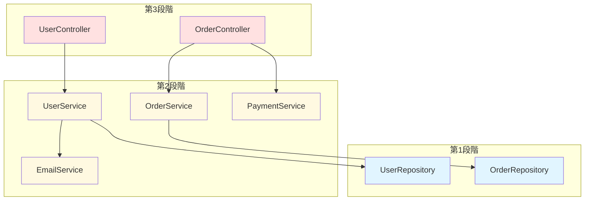
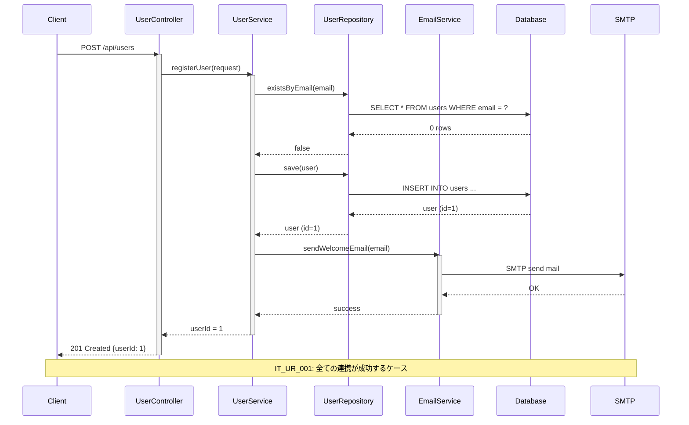
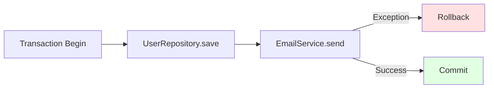

# 結合テスト仕様書作成ルール

## 1. 基本情報

### 1.1 ドキュメント名
結合テスト仕様書（Integration Test Specification）

### 1.2 目的
- 複数のモジュール・コンポーネント間の連携動作を検証する
- インターフェース仕様の整合性を確認する
- データフロー、トランザクション境界を横断するテストを実施する
- 単体テストでは検出できない結合部分の不具合を発見する

### 1.3 対象読者
- テストエンジニア
- 品質保証担当者
- 開発者（実装担当者）
- プロジェクトマネージャー

### 1.4 関連成果物
- **前提**：詳細設計書、インターフェース設計書、単体テスト報告書
- **参照**：システム構成図、シーケンス図、データベース設計書
- **出力先**：結合テストコード、結合テスト報告書

---

## 2. 作成タイミングと前提条件

### 2.1 作成タイミング
- 単体テストが完了した後
- 詳細設計、インターフェース設計が確定した後
- 結合テスト実施の1～2週間前

### 2.2 前提条件
- 単体テストが合格している（カバレッジ目標達成）
- テスト環境（結合テスト用DB、外部API連携環境）が準備されている
- インターフェース仕様（REST API、メッセージング等）が確定している
- テストデータ作成方針が決まっている

### 2.3 標準作成期間
- 小規模システム：3～5日
- 中規模システム：1～2週間
- 大規模システム：2～4週間

---

## 3. ドキュメント構成

### 3.1 必須セクション

#### 3.1.1 テスト方針
- 結合テスト範囲（対象モジュール組み合わせ）
- 結合方式（トップダウン、ボトムアップ、ビッグバン）
- テスト環境（サーバー構成、ネットワーク、データベース）
- 使用ツール（テスト自動化ツール、APIテストツール）

#### 3.1.2 テスト観点
- インターフェース整合性（API仕様準拠、データ型一致）
- データフロー（入力→処理→出力の連携）
- トランザクション境界（コミット、ロールバック）
- エラーハンドリング（例外の伝搬、エラーレスポンス）
- 非同期処理（メッセージキュー、イベント駆動）

#### 3.1.3 テストケース一覧
- テストケースID
- テストシナリオ名
- 対象モジュール組み合わせ
- テスト観点（正常系、異常系）
- 前提条件
- 入力データ
- 期待結果
- 優先度

#### 3.1.4 テストデータ設計
- マスターデータ（ユーザー、商品、設定値）
- トランザクションデータ（注文、決済履歴）
- 異常データ（境界値、不正データ）

#### 3.1.5 環境設定
- データベース初期化スクリプト
- 外部APIのモック・スタブ設定
- 認証トークン、環境変数

---

## 4. 記載ルール

### 4.1 テストケース表記規則

#### 4.1.1 テストケース一覧表
```markdown
### シナリオ：ユーザー登録→メール送信連携

| テストケースID | テストシナリオ | 対象モジュール | テスト観点 | 優先度 |
|----------------|----------------|----------------|------------|--------|
| IT_UR_001 | ユーザー登録成功→ウェルカムメール送信 | UserService + EmailService | 正常系（連携） | 高 |
| IT_UR_002 | ユーザー登録失敗→メール未送信 | UserService + EmailService | 異常系（ロールバック） | 高 |
| IT_UR_003 | メール送信失敗→ユーザー登録継続 | UserService + EmailService | 異常系（非同期） | 中 |
| IT_UR_004 | 重複メール→409エラーレスポンス | UserController + UserService | 異常系（エラー伝搬） | 中 |
```

#### 4.1.2 詳細テストケース
```markdown
### テストケース詳細: IT_UR_001

**テストケースID**: IT_UR_001  
**テストシナリオ**: ユーザー登録成功→ウェルカムメール送信  
**対象モジュール**: UserService + EmailService

**前提条件**:
- データベースが初期化されている
- EmailServiceが外部SMTP接続可能
- ユーザーテーブルにテストデータなし

**テスト手順**:
1. POST /api/users に新規ユーザー情報を送信
   ```json
   {
     "email": "newuser@example.com",
     "password": "Pass123!",
     "name": "Test User"
   }
   ```
2. レスポンスを確認
3. データベースのユーザーテーブルを確認
4. EmailServiceのメール送信ログを確認

**期待結果**:
1. HTTPステータス: 201 Created
2. レスポンスボディ:
   ```json
   {
     "userId": 1,
     "email": "newuser@example.com",
     "name": "Test User"
   }
   ```
3. データベース確認:
   - ユーザーテーブルに1件追加
   - email = "newuser@example.com"
   - password_hash が bcrypt 形式
4. EmailService確認:
   - sendWelcomeEmail() が1回呼び出された
   - 送信先: "newuser@example.com"
   - 件名: "Welcome to Our Service"

**実際の結果**: （テスト実行後に記入）

**合否**: （Pass / Fail）
```

### 4.2 結合方式の選択

```markdown
### 結合テスト方式: ボトムアップ

**選定理由**:
- データベース層、ビジネスロジック層、API層の3層構成
- 下位層（Repository）の単体テストが完了している
- 段階的に上位層を追加しながらテスト可能

**結合順序**:
1. **第1段階**: Repository + Service
   - UserRepository + UserService
   - OrderRepository + OrderService
2. **第2段階**: Service + Service
   - UserService + EmailService
   - OrderService + PaymentService
3. **第3段階**: Controller + Service
   - UserController + UserService
   - OrderController + OrderService + PaymentService


```

### 4.3 データフロー図



### 4.4 トランザクション境界のテスト

```markdown
### テストケース: IT_UR_002（トランザクションロールバック）

**シナリオ**: ユーザー登録は成功するが、後続処理で例外が発生した場合、全体がロールバックされることを確認

**テスト手順**:
1. EmailServiceのsendWelcomeEmail()がExceptionをスローするようモック設定
2. POST /api/users でユーザー登録を実行
3. データベースのユーザーテーブルを確認

**期待結果**:
- HTTPステータス: 500 Internal Server Error
- データベース: ユーザーテーブルに新規レコード**なし**（ロールバック成功）
- エラーログ: EmailServiceException が記録されている

**トランザクション境界図**:

```

---

## 5. 品質基準

### 5.1 チェックリスト

- [ ] 全てのモジュール間連携がテストケースでカバーされているか
- [ ] 正常系、異常系、境界値のテストケースが揃っているか
- [ ] トランザクション境界を跨ぐテストケースがあるか
- [ ] 外部API連携のテストケース（成功、タイムアウト、エラー）があるか
- [ ] 非同期処理のテストケース（キュー、イベント）があるか
- [ ] データベース整合性のテストケースがあるか
- [ ] エラーレスポンス形式のテストケースがあるか
- [ ] テストデータ作成手順が明確か
- [ ] テスト環境構築手順が明確か

### 5.2 レビュー観点

#### 5.2.1 網羅性
- インターフェース仕様の全エンドポイントがカバーされているか
- 主要なユースケースシナリオがカバーされているか
- 異常系（ネットワークエラー、タイムアウト等）が含まれているか

#### 5.2.2 実現可能性
- テスト環境で実施可能なテストケースか
- テストデータ作成が現実的な工数か
- 外部依存のモック化が適切か

#### 5.2.3 保守性
- テストケースの意図が明確か
- テストデータの再利用性が高いか
- テスト自動化を考慮した設計か

### 5.3 承認基準
- テストエンジニアによるレビュー合格
- 開発リーダーによる実施可能性確認
- 品質保証担当者による観点網羅性確認

---

## 6. AI作成時の具体的指示

### 6.1 必須項目

1. **モジュール間の関係性を明示**
   - シーケンス図で処理フローを可視化
   - 依存関係図で結合対象を明確化

2. **具体的な入出力データ**
   - JSONリクエスト/レスポンスの実例
   - データベースのBefore/After状態
   - 外部API呼び出しのパラメータ

3. **トランザクション境界の明示**
   - どこでトランザクションが開始・終了するか
   - ロールバック条件、コミット条件

4. **テスト環境の詳細**
   - データベース初期化スクリプト
   - 外部APIのモック設定方法
   - 環境変数、設定ファイル

### 6.2 避けるべき表現

❌ **NG例**：
```markdown
- "連携が正しく動作することを確認"
- "適切なレスポンスが返される"
- "データベースが更新される"
- "エラー時の挙動を確認"
```

✅ **OK例**：
```markdown
- "UserController → UserService → UserRepository の連携で、POST /api/users が HTTPステータス 201 を返し、データベースに email='test@example.com' のレコードが1件追加されることを確認"
- "レスポンスボディが `{userId: 1, email: 'test@example.com'}` の形式で返される"
- "users テーブルに id=1, email='test@example.com', created_at=(現在時刻) のレコードが INSERT される"
- "EmailService.sendWelcomeEmail() で Exception が発生した場合、users テーブルへの INSERT がロールバックされ、レコード数が0件のまま維持される"
```

### 6.3 推奨構成

1. **シナリオベースの構成**
   - ユーザーストーリーに基づくテストシナリオ
   - 複数モジュールを跨ぐエンドツーエンドのフロー

2. **レイヤー間連携の明示**
   ```markdown
   ### テストレイヤー構造
   
   | レイヤー | モジュール | 責務 | 結合対象 |
   |----------|------------|------|----------|
   | Presentation | UserController | HTTPリクエスト処理 | UserService |
   | Business | UserService | ビジネスロジック | UserRepository, EmailService |
   | Persistence | UserRepository | データアクセス | Database |
   | Integration | EmailService | 外部連携 | SMTP Server |
   ```

3. **テスト自動化を意識した記載**
   - REST Assured、Postman Collection等のツール使用を前提
   - テストコード例（Java、Python等）を含める

---

## 7. 関連ドキュメント

### 7.1 参照すべき成果物
- **詳細設計書**：モジュール間インターフェース
- **シーケンス図**：処理フロー、データフロー
- **インターフェース設計書**：API仕様、リクエスト/レスポンス形式
- **単体テスト報告書**：単体テスト合格状況

### 7.2 次工程で使用される成果物
- **結合テストコード**：本仕様書に基づいて実装
- **結合テスト報告書**：テスト結果、不具合一覧
- **システムテスト仕様書**：結合テストでカバーできない箇所を補完

---

## 8. よくある失敗例と対策

| 失敗例 | 原因 | 対策 |
|--------|------|------|
| テストケースが単体テストと重複 | 結合テストの観点が不明確 | モジュール間連携に焦点を当てる。単一モジュールのテストは除外 |
| 外部API依存でテストが不安定 | 実際の外部APIを使用 | WireMock、MockServer等でAPIをモック化 |
| テストデータ作成が膨大 | 全パターンを網羅しようとする | 代表的なシナリオに絞り、境界値・異常系は重点的にテスト |
| トランザクションロールバックが検証できない | テスト後のDB状態確認漏れ | テスト前後のDB状態をSQLで明示的に確認 |
| テストケース間で状態が共有される | データベース初期化漏れ | 各テストケース前に @BeforeEach でDB初期化 |
| 非同期処理のタイミング依存 | メッセージキューの遅延 | await、polling、タイムアウト設定で確実に結果を待機 |
| エラーレスポンスの形式が不統一 | 例外ハンドリングの漏れ | 全エンドポイントで共通のエラーレスポンス形式をテスト |
| テスト環境構築に時間がかかる | 手動セットアップ | Docker Compose、Testcontainers で環境を自動構築 |

---

## 9. 補足：テスト自動化ツール例

### 9.1 REST API テスト（Java + REST Assured）
```java
@Test
void testUserRegistration_Integration() {
    // Given
    String requestBody = """
        {
            "email": "test@example.com",
            "password": "Pass123!",
            "name": "Test User"
        }
        """;
    
    // When
    Response response = given()
        .contentType(ContentType.JSON)
        .body(requestBody)
    .when()
        .post("/api/users")
    .then()
        .statusCode(201)
        .extract().response();
    
    // Then
    Long userId = response.jsonPath().getLong("userId");
    assertThat(userId).isGreaterThan(0);
    
    // Verify Database
    User savedUser = userRepository.findById(userId).orElseThrow();
    assertThat(savedUser.getEmail()).isEqualTo("test@example.com");
    
    // Verify Email Service
    verify(emailService, times(1)).sendWelcomeEmail("test@example.com");
}
```

### 9.2 データベース初期化（Spring Boot）
```java
@BeforeEach
void setUp() {
    // データベース初期化
    jdbcTemplate.execute("TRUNCATE TABLE users");
    jdbcTemplate.execute("TRUNCATE TABLE orders");
    
    // テストデータ投入
    jdbcTemplate.execute("INSERT INTO users (email, name) VALUES ('existing@example.com', 'Existing User')");
}
```

---

**ドキュメントバージョン**: 1.0  
**最終更新日**: 2025-10-30
