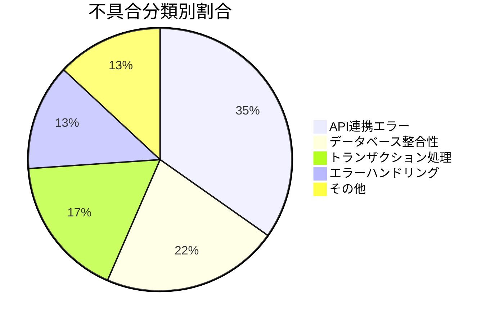

# 結合テスト報告書作成ルール

## 1. 基本情報

### 1.1 ドキュメント名
結合テスト報告書（Integration Test Report）

### 1.2 目的
- 結合テストの実施結果を記録し、品質状況を報告する
- 発見された不具合の詳細を記録し、修正追跡を可能にする
- テスト実施の完了基準達成状況を可視化する
- ステークホルダーへの品質報告資料として使用する

### 1.3 対象読者
- プロジェクトマネージャー
- 品質保証担当者
- 開発リーダー
- ステークホルダー（顧客、上級管理職）

### 1.4 関連成果物
- **前提**：結合テスト仕様書、単体テスト報告書
- **参照**：バグ管理表、テストケース実施記録
- **出力先**：システムテスト仕様書、品質報告会資料

---

## 2. 作成タイミングと前提条件

### 2.1 作成タイミング
- 結合テスト実施完了後
- 全テストケース実行が完了した時点
- システムテスト開始前

### 2.2 前提条件
- 結合テスト仕様書に基づいてテストが実施されている
- テストケースごとの実施結果が記録されている
- 発見された不具合がバグ管理表に登録されている
- テスト環境の構成情報が記録されている

### 2.3 標準作成期間
- 小規模システム：1～2日
- 中規模システム：2～3日
- 大規模システム：3～5日

---

## 3. ドキュメント構成

### 3.1 必須セクション

#### 3.1.1 テスト実施概要
- テスト実施期間
- テスト実施担当者
- テスト環境（サーバー、ネットワーク、データベース）
- 使用ツール

#### 3.1.2 テスト実施結果サマリー
- 計画テストケース数
- 実施テストケース数
- 合格数（Pass）
- 不合格数（Fail）
- 未実施数
- 合格率

#### 3.1.3 テストケース実施結果詳細
- テストケースID
- テストシナリオ名
- 実施日時
- 実施者
- 結果（Pass/Fail/Skip）
- 不具合ID（Failの場合）
- 備考

#### 3.1.4 不具合サマリー
- 不具合総数
- 重大度別件数（Critical、High、Medium、Low）
- ステータス別件数（Open、In Progress、Fixed、Closed）
- 不具合密度（不具合数／機能ポイント数）

#### 3.1.5 不具合詳細
- 不具合ID
- 発見日
- 重大度
- タイトル
- 詳細説明
- 再現手順
- ステータス
- 担当者

#### 3.1.6 品質評価
- 完了基準達成状況
- リスク評価
- 残存不具合の影響分析
- 次工程（システムテスト）への推奨事項

---

## 4. 記載ルール

### 4.1 テスト実施結果サマリーの表記規則

```markdown
## テスト実施結果サマリー

### 実施期間
- 開始日：2025-10-20
- 終了日：2025-10-30
- 実施日数：11日間（実働8日間）

### 実施体制
- テストリーダー：山田太郎
- テスト実施者：佐藤花子、鈴木一郎、田中次郎
- 実施工数：合計 64人時

### テスト実施統計

| 項目 | 件数 | 割合 |
|------|------|------|
| 計画テストケース数 | 150 | 100% |
| 実施テストケース数 | 148 | 98.7% |
| 合格（Pass） | 140 | 93.3% |
| 不合格（Fail） | 8 | 5.3% |
| 未実施（Skip） | 2 | 1.3% |

**合格率**: 94.6% (140 / 148)  
**進捗率**: 98.7% (148 / 150)

### 未実施テストケースの理由
- IT_UR_145：外部API連携環境が準備できず（次回テスト時に実施予定）
- IT_OR_098：前提となる機能の不具合により未実施
```

### 4.2 不具合サマリーの表記規則

```markdown
## 不具合サマリー

### 不具合総数：23件

### 重大度別内訳

| 重大度 | 件数 | 割合 | 説明 |
|--------|------|------|------|
| Critical | 2 | 8.7% | システム停止、データ損失 |
| High | 5 | 21.7% | 主要機能が動作しない |
| Medium | 10 | 43.5% | 機能が部分的に動作しない |
| Low | 6 | 26.1% | 軽微な表示不具合、性能劣化 |

### ステータス別内訳

| ステータス | 件数 | 割合 |
|------------|------|------|
| Fixed（修正済み） | 15 | 65.2% |
| In Progress（対応中） | 5 | 21.7% |
| Open（未着手） | 3 | 13.0% |
| Closed（完了） | 0 | 0% |

### 不具合密度
- **不具合密度**: 2.3件 / 機能ポイント（23件 / 10FP）
- **業界標準**: 1.5～3.0件 / FP
- **評価**: 標準範囲内

### 不具合傾向分析



**主要な不具合原因**：
1. API連携のエラーハンドリング不足（8件、34.8%）
2. データベース整合性制約違反（5件、21.7%）
3. トランザクション境界の誤り（4件、17.4%）
```

### 4.3 テストケース実施結果詳細

```markdown
## テストケース実施結果詳細

### 高優先度テストケース実施結果（抜粋）

| テストケースID | テストシナリオ | 実施日 | 実施者 | 結果 | 不具合ID | 備考 |
|----------------|----------------|--------|--------|------|----------|------|
| IT_UR_001 | ユーザー登録→メール送信 | 10/21 | 佐藤 | Pass | - | - |
| IT_UR_002 | 登録失敗→ロールバック | 10/21 | 佐藤 | **Fail** | BUG-001 | トランザクション未ロールバック |
| IT_UR_003 | メール送信失敗→登録継続 | 10/22 | 鈴木 | Pass | - | 非同期処理正常 |
| IT_OR_010 | 注文→決済連携 | 10/23 | 田中 | **Fail** | BUG-005 | 決済API タイムアウト |
| IT_OR_011 | 在庫減算→注文確定 | 10/23 | 田中 | Pass | - | - |
| IT_OR_015 | 注文キャンセル→返金 | 10/24 | 佐藤 | **Fail** | BUG-008 | 返金処理が2重実行 |
| IT_PA_020 | 決済成功→通知送信 | 10/25 | 鈴木 | Pass | - | - |

**注意事項**：
- BUG-001（Critical）は10/22に修正完了、再テスト合格
- BUG-005（High）は外部API側の問題、調整中
- BUG-008（High）は10/26修正完了、再テスト待ち
```

### 4.4 不具合詳細

```markdown
## 不具合詳細（重大度：Critical / High のみ抜粋）

### BUG-001: ユーザー登録失敗時にトランザクションがロールバックされない（Critical）

**発見日**: 2025-10-21  
**発見者**: 佐藤花子  
**重大度**: Critical  
**ステータス**: Fixed（修正済み）  
**修正日**: 2025-10-22  
**修正者**: 開発担当A

**詳細説明**:
ユーザー登録処理中にEmailServiceで例外が発生した場合、UserRepositoryへのINSERT処理がロールバックされず、データベースに不完全なユーザーレコードが残存する。

**再現手順**:
1. EmailServiceが例外をスローするようモック設定
2. POST /api/users でユーザー登録を実行
3. データベースのusersテーブルを確認
4. **問題**: レコードが残存している（期待：0件）

**期待結果**: usersテーブルに0件  
**実際の結果**: usersテーブルに1件（不完全なレコード）

**根本原因**: UserServiceクラスのregisterUser()メソッドに @Transactional アノテーションが欠落

**修正内容**:
```java
// Before（不具合あり）
public Long registerUser(RegisterUserRequest request) {
    User user = userRepository.save(request.toEntity());
    emailService.sendWelcomeEmail(user.getEmail()); // 例外発生時にロールバックされない
    return user.getId();
}

// After（修正後）
@Transactional  // ← 追加
public Long registerUser(RegisterUserRequest request) {
    User user = userRepository.save(request.toEntity());
    emailService.sendWelcomeEmail(user.getEmail()); // 例外発生時にロールバック
    return user.getId();
}
```

**再テスト結果**: Pass（10/22 再テスト合格）

---

### BUG-005: 決済API呼び出しがタイムアウトする（High）

**発見日**: 2025-10-23  
**発見者**: 田中次郎  
**重大度**: High  
**ステータス**: In Progress（対応中）  
**担当者**: 開発担当B、外部ベンダーC社

**詳細説明**:
注文確定時に決済API（PaymentGateway）を呼び出すが、5秒以上レスポンスがなくタイムアウトする。頻度は約30%（10回中3回発生）。

**再現手順**:
1. POST /api/orders で注文を作成
2. OrderServiceがPaymentServiceを呼び出し
3. PaymentServiceがPaymentGateway APIを呼び出し
4. **問題**: 5秒後にTimeoutExceptionが発生

**期待結果**: 2秒以内にレスポンス（決済成功/失敗）  
**実際の結果**: 30%の確率で5秒後にタイムアウト

**根本原因**:
- 外部API側のレスポンス遅延（調査中）
- 当システム側のタイムアウト設定が5秒（適切）
- リトライ処理が未実装

**対応方針**:
1. 外部ベンダーC社へ性能改善依頼（優先度：高）
2. リトライ処理の実装（最大3回、指数バックオフ）
3. タイムアウト時のエラーメッセージ改善

**再テスト予定**: 2025-11-01（外部API改善後）
```

### 4.5 品質評価と推奨事項

```markdown
## 品質評価

### 完了基準達成状況

| 完了基準 | 目標値 | 実績値 | 達成 |
|----------|--------|--------|------|
| テストケース実施率 | 100% | 98.7% | ❌ |
| テストケース合格率 | 95%以上 | 94.6% | ❌ |
| Critical不具合 | 0件 | 0件（修正済み2件） | ✅ |
| High不具合 | 0件 | 5件（修正済み3件、対応中2件） | ❌ |
| 不具合密度 | 3.0件/FP以下 | 2.3件/FP | ✅ |

**総合評価**: 条件付き合格（High不具合の修正完了後に再評価が必要）

### リスク評価

| リスク項目 | リスクレベル | 説明 | 対策 |
|------------|--------------|------|------|
| 外部API依存 | **High** | 決済APIのタイムアウトが頻発 | リトライ処理実装、ベンダー改善依頼 |
| トランザクション処理 | Low | BUG-001修正済み、再発防止策実施 | コードレビュー強化、単体テストで検証 |
| データベース整合性 | Medium | 5件の整合性制約違反を発見 | 外部キー制約を追加、バリデーション強化 |

### 次工程（システムテスト）への推奨事項

1. **High不具合の完全解消**
   - BUG-005（決済APIタイムアウト）の修正完了を待つ
   - 修正後の再テスト実施

2. **エラーハンドリングの強化**
   - API連携エラーが多数発見されたため、システムテストでも重点的にテスト
   - エラーメッセージの一貫性を検証

3. **性能テストの実施**
   - 決済APIのタイムアウト問題を踏まえ、性能テストを実施
   - 負荷テスト（同時100ユーザー）での安定性確認

4. **未実施テストケースの実施**
   - IT_UR_145（外部API連携）をシステムテスト時に実施
   - IT_OR_098（前提機能修正後に実施）
```

---

## 5. 品質基準

### 5.1 チェックリスト

- [ ] 全テストケースの実施結果が記録されているか
- [ ] 不合格（Fail）テストケースの不具合IDが紐付けられているか
- [ ] 不具合の重大度、ステータスが明確か
- [ ] Critical不具合が全て修正済みか
- [ ] 完了基準達成状況が明確か
- [ ] リスク評価が記載されているか
- [ ] 次工程への推奨事項が具体的か
- [ ] 数値データ（合格率、不具合密度等）が正確か

### 5.2 レビュー観点

#### 5.2.1 完全性
- 全テストケースの結果が漏れなく記録されているか
- 未実施テストケースの理由が明確か

#### 5.2.2 正確性
- 不具合の再現手順が正確か
- 不具合の根本原因が分析されているか

#### 5.2.3 客観性
- 品質評価が客観的データに基づいているか
- リスク評価が妥当か

### 5.3 承認基準
- テストリーダーによる内容確認
- 品質保証担当者による品質評価確認
- プロジェクトマネージャーによる承認

---

## 6. AI作成時の具体的指示

### 6.1 必須項目

1. **数値データの明示**
   - テストケース数、合格率、不具合密度等を具体的に記載
   - 目標値と実績値を比較

2. **不具合の詳細記録**
   - 再現手順を具体的に記載
   - 根本原因の分析結果を含める
   - 修正内容（コード例）を含める

3. **品質評価の客観性**
   - 完了基準に基づいて評価
   - リスクレベルを明示
   - データに基づく評価（感覚的な表現を避ける）

### 6.2 避けるべき表現

❌ **NG例**：
```markdown
- "概ね良好な品質"
- "いくつかの不具合が発見された"
- "適切に対応中"
- "特に問題なし"
```

✅ **OK例**：
```markdown
- "合格率94.6%、目標95%に対して0.4ポイント未達"
- "23件の不具合が発見された。内訳：Critical 2件（修正済み）、High 5件（修正済み3件、対応中2件）"
- "BUG-005は外部ベンダーC社が2025-11-01までに修正予定。リトライ処理を追加実装中（完了予定：10/28）"
- "Critical不具合0件、テストケース実施率98.7%で、条件付き合格と評価"
```

### 6.3 推奨構成

1. **エグゼクティブサマリーを冒頭に配置**
   - ステークホルダーが最初に読む部分
   - 品質状況、主要な問題点、推奨事項を簡潔に記載

2. **グラフ・図表の活用**
   - 不具合の推移グラフ
   - 重大度別円グラフ
   - テスト進捗ガントチャート

3. **不具合の影響範囲を明示**
   - どの機能に影響するか
   - ユーザー影響の有無
   - 回避策の有無

---

## 7. 関連ドキュメント

### 7.1 参照すべき成果物
- **結合テスト仕様書**：テスト計画、テストケース
- **バグ管理表**：不具合の詳細情報
- **単体テスト報告書**：前工程の品質状況

### 7.2 次工程で使用される成果物
- **システムテスト仕様書**：結合テストで発見された問題を踏まえた観点追加
- **品質報告会資料**：ステークホルダーへの報告
- **リリース判定会議資料**：リリース可否の判断材料

---

## 8. よくある失敗例と対策

| 失敗例 | 原因 | 対策 |
|--------|------|------|
| 不具合の根本原因が不明 | 表面的な調査のみ実施 | 5Whys、フィッシュボーン図等で根本原因を分析 |
| 品質評価が主観的 | 数値データなし | 合格率、不具合密度等の客観的指標を使用 |
| 未実施テストケースの理由不明 | 記録漏れ | 未実施の理由を必ず記録（環境、前提条件等） |
| 修正済み不具合の再テスト結果なし | 再テスト実施漏れ | 修正済み不具合は必ず再テスト実施、結果を記録 |
| 次工程への推奨事項が曖昧 | 具体性に欠ける | 何を、いつまでに、誰が実施すべきか明確に記載 |
| グラフが見づらい | 配色、ラベル不足 | Mermaid、表計算ソフトで視覚的に分かりやすく作成 |
| 不具合修正の影響範囲が不明 | 影響分析未実施 | 修正によって影響を受ける機能を明示、回帰テスト実施 |

---

**ドキュメントバージョン**: 1.0  
**最終更新日**: 2025-10-30
