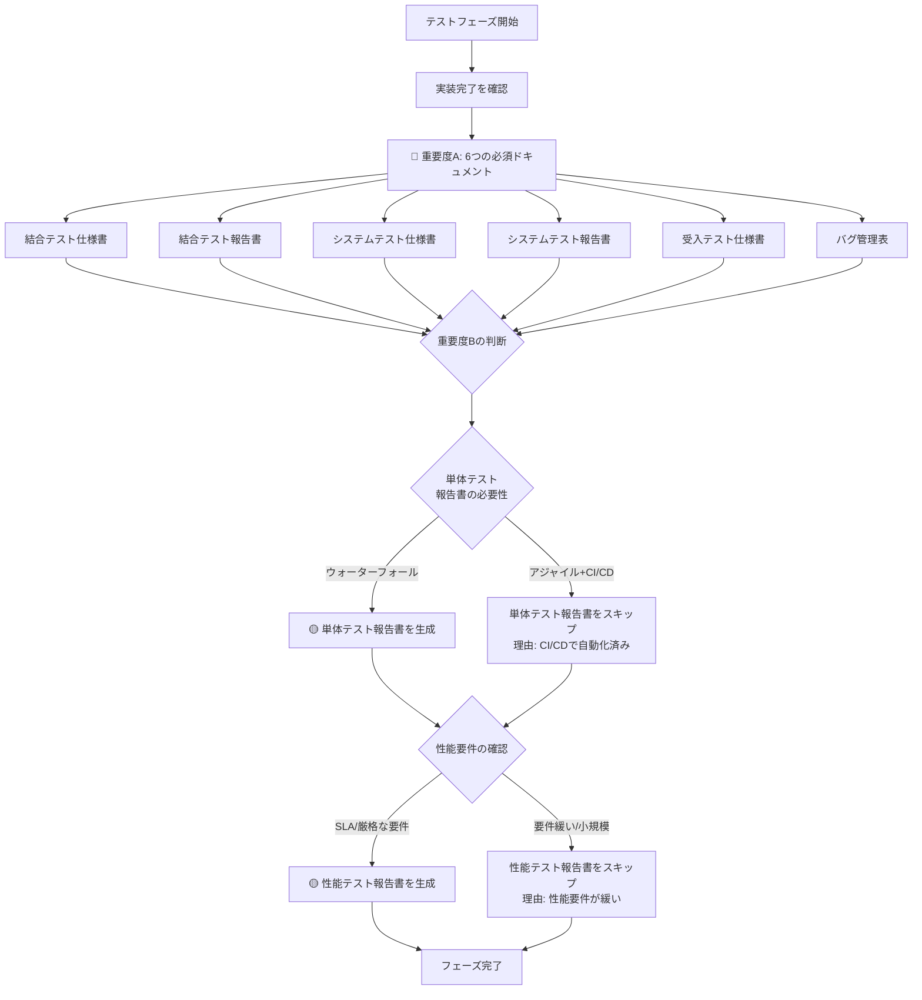

# 06_テストフェーズ - ドキュメント作成ルール

## 📋 フェーズ概要

**目的:** システムの品質を検証し、不具合を検出・修正する

**主要成果物:** 単体テスト報告書、結合テスト仕様書・報告書、システムテスト仕様書・報告書、性能テスト報告書、受入テスト仕様書、バグ管理表

**前工程:** 05_実装フェーズ  
**次工程:** 07_運用・保守フェーズ

---

## 🎯 成果物の重要度と自動生成ルール

### 🔴 重要度A：生成必須（MANDATORY）- 常に自動生成

| No | 成果物名 | ルールファイル | 理由 |
|----|---------|--------------|------|
| 1 | **結合テスト仕様書** | [06_結合テスト仕様書作成ルール.md](06_結合テスト仕様書作成ルール.md) | モジュール間連携の検証に必須 |
| 2 | **結合テスト報告書** | [06_結合テスト報告書作成ルール.md](06_結合テスト報告書作成ルール.md) | 統合品質の証跡として必須 |
| 3 | **システムテスト仕様書** | [06_システムテスト仕様書作成ルール.md](06_システムテスト仕様書作成ルール.md) | E2Eでのシステム動作検証に必須 |
| 4 | **システムテスト報告書** | [06_システムテスト報告書作成ルール.md](06_システムテスト報告書作成ルール.md) | リリース判定の根拠として必須 |
| 5 | **受入テスト仕様書** | [06_受入テスト仕様書作成ルール.md](06_受入テスト仕様書作成ルール.md) | 顧客承認の基準として必須 |
| 6 | **バグ管理表** | [06_バグ管理表作成ルール.md](06_バグ管理表作成ルール.md) | 品質管理・トレーサビリティに必須 |

**AI動作:**
```
✅ ユーザーの明示的な指示がなくても自動的に生成する
✅ 該当フェーズに入ったら必ず生成対象として認識する
⚠️  省略する場合は、ユーザーに理由を説明し確認を求める
```

---

### 🟡 重要度B：生成推奨（RECOMMENDED）- デフォルトで自動生成

| No | 成果物名 | ルールファイル | 理由 | 省略可能なケース |
|----|---------|--------------|------|-----------------|
| 1 | **単体テスト報告書** | ルールなし | テスト結果の記録として重要 | CI/CDで自動化され、カバレッジレポートで代替可能な場合 |
| 2 | **性能テスト報告書** | [06_性能テスト報告書作成ルール.md](06_性能テスト報告書作成ルール.md) | 非機能要件の検証として重要 | 性能要件が厳しくない小規模システム |

**AI動作:**
```
✅ デフォルトで自動生成する
🔄 プロジェクト規模や要件に応じて省略判断可能
💬 省略する場合は、その理由をユーザーに説明する
```

**判断基準:**

#### 単体テスト報告書
- **生成すべきケース:**
  - ウォーターフォール開発
  - 正式な品質報告が必要
  - 顧客への証跡提出が必要

- **省略可能なケース:**
  - アジャイル開発
  - CI/CDでカバレッジ自動測定
  - GitHub ActionsやJenkinsのレポートで代替

#### 性能テスト報告書
- **生成すべきケース:**
  - 大量トランザクション処理
  - SLA（サービスレベル合意）あり
  - 性能要件が厳格
  - クラウドコスト最適化が重要

- **省略可能なケース:**
  - 社内ツール・小規模システム
  - 性能要件が緩い
  - PoC・プロトタイプ段階

---

### 🟢 重要度C：生成任意（OPTIONAL）- 指示時のみ生成

現在、このフェーズには重要度Cの成果物はありません。

**理由:** テストフェーズは品質保証の最終工程であり、すべての成果物が重要度A（必須）またはB（推奨）に分類されています。

---

## 🤖 AI自動生成フロー（テストフェーズ）



---

## 📊 統計情報

### 成果物数サマリー

| 重要度 | 件数 | 割合 | 自動生成 |
|--------|------|------|----------|
| 🔴 A（必須） | 6件 | 75% | ✅ すべて |
| 🟡 B（推奨） | 2件 | 25% | ✅ デフォルト |
| 🟢 C（任意） | 0件 | 0% | - |
| **合計** | **8件** | **100%** | 8件がデフォルト生成 |

### テストレベル別の成果物

| テストレベル | 仕様書 | 報告書 | 重要度 |
|------------|--------|--------|--------|
| **単体テスト** | （詳細設計で作成） | 単体テスト報告書 | 🟡 B |
| **結合テスト** | 結合テスト仕様書 | 結合テスト報告書 | 🔴 A |
| **システムテスト** | システムテスト仕様書 | システムテスト報告書 | 🔴 A |
| **性能テスト** | （システムテストに含む） | 性能テスト報告書 | 🟡 B |
| **受入テスト** | 受入テスト仕様書 | （受入テスト報告書）※ | 🔴 A |

※ 受入テスト報告書は、受入テスト仕様書の結果記入欄で代替可能

### 作成時間の目安（AI生成）

| 成果物名 | 規模（小） | 規模（中） | 規模（大） |
|---------|-----------|-----------|-----------|
| 結合テスト仕様書 | 2時間 | 5時間 | 12時間 |
| 結合テスト報告書 | 1時間 | 2時間 | 4時間 |
| システムテスト仕様書 | 3時間 | 8時間 | 20時間 |
| システムテスト報告書 | 1時間 | 3時間 | 6時間 |
| 性能テスト報告書 | 2時間 | 4時間 | 8時間 |
| 受入テスト仕様書 | 2時間 | 5時間 | 10時間 |
| バグ管理表 | 30分 | 1時間 | 2時間 |

---

## ⚙️ プロジェクト特性別の推奨構成

### 小規模プロジェクト（1-3人月）

**必須（重要度A）:**
- ✅ 結合テスト仕様書（簡易版）
- ✅ 結合テスト報告書
- ✅ システムテスト仕様書（主要シナリオ中心）
- ✅ システムテスト報告書
- ✅ 受入テスト仕様書
- ✅ バグ管理表

**推奨（重要度B）:**
- 🔄 単体テスト報告書 → CI/CDレポートで代替可
- 🔄 性能テスト報告書 → 簡易版、または省略可

---

### 中規模プロジェクト（4-12人月）

**必須（重要度A）:**
- ✅ すべての重要度A成果物を標準レベルで作成

**推奨（重要度B）:**
- ✅ 単体テスト報告書（正式版）
- ✅ 性能テスト報告書（主要機能）

---

### 大規模プロジェクト（13人月以上）

**必須（重要度A）:**
- ✅ すべての重要度A成果物を詳細レベルで作成

**推奨（重要度B）:**
- ✅ 単体テスト報告書（詳細版）
- ✅ 性能テスト報告書（詳細版 + ボトルネック分析）

---

## 🎨 開発手法別の推奨構成

### ウォーターフォール開発

**すべての成果物を正式版で作成:**
- ✅ 重要度A: すべて詳細版
- ✅ 重要度B: すべて正式版
- 📝 フォーマルな品質報告が重要

### アジャイル開発

**簡略化・自動化を活用:**
- ✅ 重要度A: 標準版（ただし継続的に更新）
- 🔄 単体テスト報告書 → CI/CDダッシュボードで代替
- 🔄 性能テスト報告書 → スプリントごとの軽量版
- 📝 ドキュメントは必要最小限、自動化を優先

### DevOps / CI/CD環境

**自動化とドキュメントの統合:**
- ✅ テスト仕様書は必須（自動テストの基準）
- ✅ バグ管理表はJIRA/GitHubと連携
- 🤖 テスト報告書は自動生成を検討
- 📊 ダッシュボードでリアルタイム監視

---

## 🔗 関連ドキュメント

- [ドキュメント作成基本ルール](../00_ドキュメント作成ルール/ドキュメント作成基本ルール.md) - 全体の基本ルール
- [README_成果物重要度定義](../README_成果物重要度定義.md) - 全フェーズの重要度定義
- [04_詳細設計フェーズ](../04_詳細設計/README.md) - 単体テスト仕様書作成
- [05_実装フェーズ](../05_実装/README.md) - 前工程
- [07_運用保守フェーズ](../07_運用保守/README.md) - 次工程

---

**最終更新日:** 2025年10月30日  
**バージョン:** 1.0  
**対象:** AI開発アシスタント、QAエンジニア、テスター

---

## 📚 サンプルファイル

実際のルールを適用した実践的なサンプルファイルが[samplesディレクトリ](./samples/)に用意されています。

### 提供サンプル（ECサイトプロジェクト）

1. **[sample_06_結合テスト仕様書.md](./samples/sample_06_結合テスト仕様書.md)** (18.7 KB)
   - モジュール間連携テスト、TestContainers、REST Assured

2. **[sample_06_結合テスト報告書.md](./samples/sample_06_結合テスト報告書.md)** (11.0 KB)
   - テスト結果、検出バグ3件（全修正済み）、品質メトリクス

3. **[sample_06_システムテスト仕様書.md](./samples/sample_06_システムテスト仕様書.md)** (15.5 KB)
   - E2Eシナリオ、Selenium自動化コード、クロスブラウザテスト

4. **[sample_06_システムテスト報告書.md](./samples/sample_06_システムテスト報告書.md)** (11.3 KB)
   - テスト結果、検出バグ5件（全修正済み）、性能・互換性・アクセシビリティ測定

5. **[sample_06_受入テスト仕様書.md](./samples/sample_06_受入テスト仕様書.md)** (9.6 KB)
   - ビジネスユーザー視点のテストケース、承認基準、実施計画

6. **[sample_06_バグ管理表.md](./samples/sample_06_バグ管理表.md)** (12.7 KB)
   - バグ一覧テーブル、詳細分析、トレンド分析、修正タイムライン

**題材**: ECサイト構築プロジェクト（Spring Boot 3.2 + React 18 + PostgreSQL 15）

**ストーリー**: 結合テスト→システムテスト→受入テストの一連の流れで8件のバグを検出→修正→リグレッションテスト成功

**活用方法**:
- 自プロジェクトの参考として
- AI生成時のプロンプトの具体例として
- ルール適用の品質チェック基準として

