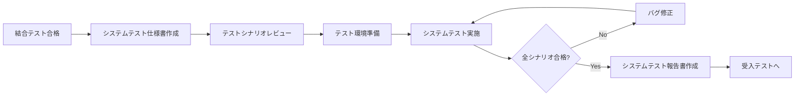
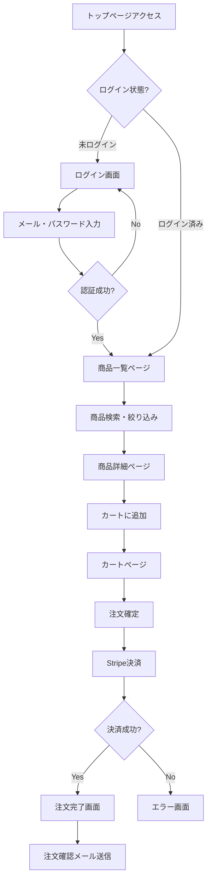
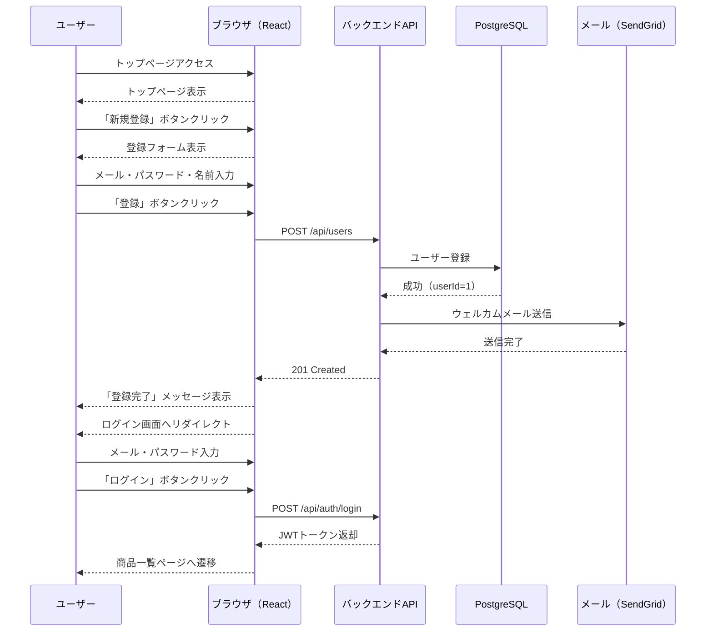
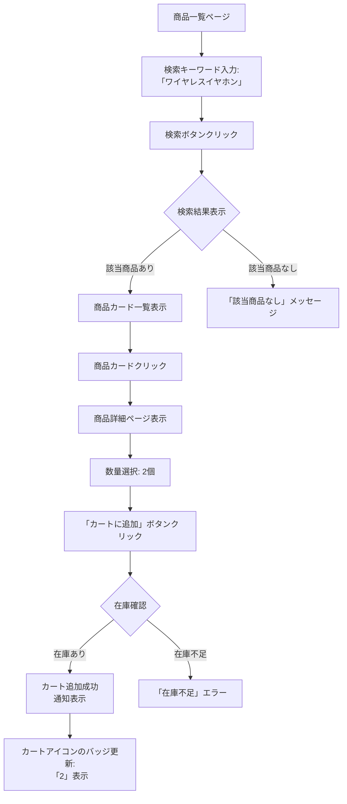

# システムテスト仕様書 - ECサイト全体機能

## 📋 1. 基本情報

| 項目 | 内容 |
|------|------|
| **ドキュメントID** | ST-ECOM-001 |
| **対象システム** | ECサイト（ユーザー管理、商品管理、注文・決済） |
| **テスト対象範囲** | フロントエンド（React） ↔ バックエンド（Spring Boot） ↔ DB |
| **作成日** | 2024-04-01 |
| **作成者** | QAチーム |
| **バージョン** | 1.0 |
| **テストフェーズ** | システムテスト（E2Eテスト） |

### テスト対象機能
- **ユーザー管理**: 会員登録、ログイン、プロフィール管理
- **商品管理**: 商品一覧、検索、詳細表示、在庫確認
- **注文・決済**: カート追加、注文確定、Stripe決済、注文履歴

---

## ⏰ 2. 作成タイミング

### 作成フェーズ
**結合テスト完了後 → システムテスト実施前**



### 実施条件
- ✅ 結合テストが全て合格
- ✅ ステージング環境が本番相当に構築済み
- ✅ Selenium/Playwrightの自動テスト環境が整備済み
- ✅ テストデータが準備済み

---

## 📂 3. ドキュメント構成

### 必須セクション

```
1. 基本情報
   ├─ テスト対象システム全体像
   └─ テスト範囲（機能・非機能）

2. テスト環境
   ├─ インフラ構成（ステージング環境）
   ├─ 使用ツール（Selenium、Playwright）
   └─ ブラウザ・デバイス種類

3. テストシナリオ
   ├─ ユーザーストーリーベースのE2Eシナリオ
   ├─ 業務フロー全体のテスト
   └─ 異常系・エッジケース

4. テストケース一覧
   ├─ シナリオID、操作手順、期待結果
   └─ 優先度（Critical/High/Medium/Low）

5. テストデータ
   ├─ マスタデータ
   └─ トランザクションデータ

6. 非機能要件テスト
   ├─ 性能テスト（レスポンスタイム）
   ├─ セキュリティテスト
   └─ ユーザビリティテスト
```

---

## 📏 4. 記載ルール

### 4.1 システムテストの観点

#### ✅ DO（推奨）
```markdown
✓ ユーザー視点でのエンドツーエンド検証
✓ 業務フローを通したシナリオテスト
✓ 実際のブラウザ操作による検証
✓ 複数デバイス・ブラウザでのテスト
✓ UI/UXの視覚的な確認
✓ エラーメッセージの表示確認
✓ 非機能要件（性能、セキュリティ）の検証
```

#### ❌ DON'T（非推奨）
```markdown
✗ API単体の細かいテスト（結合テストで実施済み）
✗ 単一コンポーネントの単体機能テスト
✗ ホワイトボックステスト（コード内部の検証）
✗ 開発環境でのテスト（ステージング環境を使用）
```

### 4.2 テストシナリオ記載フォーマット

```markdown
### ST-XXX: シナリオ名

**優先度**: [Critical / High / Medium / Low]

**テスト観点**: ユーザーストーリーの視点

**前提条件**:
- ユーザーの状態（ログイン済み、カート内商品あり等）
- マスタデータの状態

**操作手順**:
1. ブラウザでページ遷移
2. ボタンクリック・入力操作
3. 画面表示確認
4. データ送信
5. 結果確認

**期待結果**:
- 画面表示内容
- データベース登録内容
- 外部サービス連携結果
- エラーメッセージ（異常系の場合）

**スクリーンショット**: あり/なし

**所要時間**: XX分
```

### 4.3 ユーザーフロー図の記載



---

## 🎯 5. 品質基準

### 5.1 合格基準

| 基準項目 | 目標値 | 測定方法 |
|---------|--------|---------|
| **シナリオ合格率** | 100% | 全シナリオ成功 |
| **画面表示時間** | 90%が2秒以内 | ブラウザDevToolsで測定 |
| **ページ遷移時間** | 平均1秒以内 | Navigation Timing API |
| **クロスブラウザ互換性** | Chrome/Safari/Firefox正常動作 | 手動確認 |
| **モバイル対応** | レスポンシブデザイン正常表示 | 実機・エミュレータ確認 |
| **アクセシビリティ** | WCAG 2.1 AA基準 | Lighthouseスコア80以上 |

### 5.2 実施チェックリスト

```markdown
✅ 機能テスト
  - 主要業務フローが正常に完了する
  - エラー時に適切なメッセージが表示される
  - データがDB/Redisに正しく保存される

✅ 非機能テスト
  - ページ読み込みが2秒以内
  - レスポンシブデザインがモバイルで正常
  - セキュリティヘッダーが設定されている

✅ クロスブラウザ
  - Chrome最新版で動作
  - Safari最新版で動作
  - Firefox最新版で動作

✅ UX/UI
  - エラーメッセージが分かりやすい
  - ローディング表示が適切
  - 入力フォームのバリデーションが即座
```

---

## 🤖 6. AI生成時の指示プロンプト

### 基本プロンプト

```
「ECサイトのシステムテスト仕様書を作成してください。

【必須条件】
- ユーザー視点のE2Eシナリオ
- ブラウザ操作によるテスト手順
- Selenium/Playwrightでの自動化想定
- Chrome/Safari/Firefoxでのクロスブラウザテスト
- モバイルレスポンシブ対応確認

【テストシナリオ】
1. 新規ユーザー登録〜ログイン
2. 商品検索〜カート追加
3. 注文確定〜Stripe決済
4. 注文履歴確認

【出力形式】
- テストシナリオ一覧（優先度付き）
- ユーザーフロー図（Mermaid flowchart）
- Selenium自動化コード例
- 画面キャプチャ取得設定
」
```

---

## 🔗 7. 関連ドキュメント

### 参照する設計・テストドキュメント
- [要件定義書](02_要件定義/機能要件定義書.md) - 機能要件
- [結合テスト報告書](sample_06_結合テスト報告書.md) - 前フェーズ結果
- [UI設計書](03_基本設計/UI設計書.md) - 画面仕様

### 後続ドキュメント
- [システムテスト報告書](sample_06_システムテスト報告書.md) - テスト結果記録
- [受入テスト仕様書](sample_06_受入テスト仕様書.md) - UAT計画

---

## 📊 8. テストシナリオ

### シナリオ1: 新規ユーザー登録からログインまで（Critical）



---

### シナリオ2: 商品検索からカート追加まで（Critical）



---

## 📋 9. テストケース一覧

### 9.1 ユーザー管理機能

#### ST-001: 新規ユーザー登録〜ログイン（E2Eシナリオ）

**優先度**: Critical

**テスト観点**: 初回ユーザーの登録からログインまでの一連の流れ

**前提条件**:
- ステージング環境が起動している
- メールアドレス `test-$(timestamp)@example.com` が未登録
- SendGridモックが動作中

**操作手順**:
1. ブラウザで `https://staging.example.com` にアクセス
2. トップページの「新規登録」ボタンをクリック
3. 登録フォームに以下を入力:
   - メールアドレス: `test-20240401@example.com`
   - パスワード: `SecurePass123!`
   - 名前: `テスト太郎`
   - 電話番号: `090-1234-5678`
4. 「登録」ボタンをクリック
5. 「登録完了」メッセージが表示されることを確認
6. ログイン画面へ自動遷移することを確認
7. メールアドレスとパスワードを入力
8. 「ログイン」ボタンをクリック

**期待結果**:
- ✅ 登録完了メッセージ: 「登録が完了しました。ログインしてください。」
- ✅ ウェルカムメール送信: SendGridログに送信履歴
- ✅ ログイン成功: 商品一覧ページへリダイレクト
- ✅ ヘッダーに「テスト太郎さん」と表示
- ✅ LocalStorageにJWTトークンが保存されている
- ✅ DB確認: `SELECT * FROM users WHERE email = 'test-20240401@example.com'` で1行

**スクリーンショット**:
- 登録フォーム画面
- 登録完了メッセージ
- ログイン後の商品一覧画面

**所要時間**: 5分

---

#### ST-002: ログイン失敗（パスワード不一致）

**優先度**: High

**テスト観点**: 誤ったパスワードでログインを試みた際のエラーハンドリング

**前提条件**:
- ユーザー `existing@example.com` が登録済み（パスワード: `CorrectPass123!`）

**操作手順**:
1. ログイン画面にアクセス
2. メールアドレス: `existing@example.com` を入力
3. パスワード: `WrongPassword` を入力
4. 「ログイン」ボタンをクリック

**期待結果**:
- ✅ エラーメッセージ表示: 「メールアドレスまたはパスワードが正しくありません」
- ✅ ログイン画面に留まる（遷移しない）
- ✅ 入力フィールドがクリアされない（再入力しやすい）
- ✅ エラーメッセージが赤色で目立つ

**所要時間**: 2分

---

### 9.2 商品管理機能

#### ST-003: 商品検索〜商品詳細表示

**優先度**: Critical

**テスト観点**: 商品検索機能とフィルタリング

**前提条件**:
- 商品マスタに50件の商品が登録済み
- カテゴリ「イヤホン」に10件の商品

**操作手順**:
1. 商品一覧ページにアクセス
2. 検索ボックスに「ワイヤレス」と入力
3. Enterキーを押下（または検索ボタンクリック）
4. 検索結果一覧を確認
5. カテゴリフィルタで「イヤホン」を選択
6. 価格順ソート（安い順）を選択
7. 1件目の商品カードをクリック

**期待結果**:
- ✅ 検索結果: 「ワイヤレス」を含む商品のみ表示
- ✅ 検索ヒット数: 「検索結果: 8件」と表示
- ✅ フィルタ適用: イヤホンカテゴリのみ表示
- ✅ ソート: 価格が昇順に並んでいる
- ✅ 商品詳細ページ: 商品名、価格、説明、在庫数、画像が表示
- ✅ URLが `/products/{productId}` に変更

**所要時間**: 3分

---

#### ST-004: カート追加〜カート内容確認

**優先度**: Critical

**テスト観点**: カート機能とRedisセッション管理

**前提条件**:
- ログイン済み（userId=1）
- カートが空

**操作手順**:
1. 商品詳細ページ（商品ID=10）にアクセス
2. 数量を「2」に変更
3. 「カートに追加」ボタンをクリック
4. 「カートに追加しました」通知を確認
5. ヘッダーのカートアイコンのバッジを確認
6. カートアイコンをクリック
7. カートページで商品情報を確認

**期待結果**:
- ✅ 通知表示: 「カートに追加しました」（3秒間表示）
- ✅ カートバッジ: 「2」と表示（数量合計）
- ✅ カートページ: 商品名、単価、数量、小計が表示
- ✅ 合計金額: 単価×数量が正しく計算されている
- ✅ Redis確認: `GET cart:user:1` でカート情報が保存されている

**所要時間**: 4分

---

### 9.3 注文・決済機能

#### ST-005: 注文確定〜Stripe決済成功（E2Eシナリオ）

**優先度**: Critical

**テスト観点**: 注文から決済までの完全なフロー

**前提条件**:
- ログイン済み（userId=1）
- カートに商品2点（合計¥15,000）

**操作手順**:
1. カートページで「注文に進む」ボタンをクリック
2. 配送先住所入力ページで以下を入力:
   - 郵便番号: `150-0001`
   - 住所: `東京都渋谷区神宮前1-2-3`
   - 電話番号: `090-1234-5678`
3. 「次へ」ボタンをクリック
4. 注文確認ページで商品・金額を確認
5. 「決済へ進む」ボタンをクリック
6. Stripe決済画面でテストカード情報を入力:
   - カード番号: `4242 4242 4242 4242`
   - 有効期限: `12/34`
   - CVC: `123`
7. 「支払う」ボタンをクリック
8. 決済処理を待機（ローディング表示確認）

**期待結果**:
- ✅ 注文確認ページ: 商品一覧、小計、送料、消費税、合計が表示
- ✅ Stripe決済画面: セキュアなiframeで表示
- ✅ 決済成功: 「注文が完了しました」ページへリダイレクト
- ✅ 注文番号表示: 「注文番号: ORD-20240401-00001」
- ✅ 注文確認メール送信: SendGridログに送信履歴
- ✅ DB確認:
  ```sql
  SELECT * FROM orders WHERE user_id = 1 ORDER BY created_at DESC LIMIT 1;
  -- status = 'COMPLETED', total_amount = 15000
  ```
- ✅ カートクリア: カートアイコンのバッジが「0」

**スクリーンショット**:
- 配送先入力画面
- 注文確認画面
- Stripe決済画面
- 注文完了画面

**所要時間**: 8分

---

#### ST-006: 決済失敗（カード不正）

**優先度**: High

**テスト観点**: Stripe決済失敗時のエラーハンドリング

**前提条件**:
- ログイン済み
- カートに商品あり

**操作手順**:
1. 注文確認ページから「決済へ進む」
2. Stripe決済画面で不正カード番号を入力:
   - カード番号: `4000 0000 0000 0002`（Stripeテスト用 - カード拒否）
3. 「支払う」ボタンをクリック

**期待結果**:
- ✅ エラーメッセージ: 「お支払いが拒否されました。カード情報を確認してください。」
- ✅ 注文未確定: DBのordersテーブルにレコードが作成されていない
- ✅ カート保持: カート内容が削除されていない
- ✅ 再試行可能: 決済画面に留まり、別のカードで再試行できる

**所要時間**: 3分

---

#### ST-007: 注文履歴確認

**優先度**: Medium

**テスト観点**: マイページでの注文履歴表示

**前提条件**:
- ログイン済み（userId=1）
- 過去に3件の注文履歴あり

**操作手順**:
1. ヘッダーの「マイページ」をクリック
2. サイドメニューの「注文履歴」をクリック
3. 注文一覧を確認
4. 最新の注文をクリックして詳細表示

**期待結果**:
- ✅ 注文一覧: 3件の注文が新しい順に表示
- ✅ 表示項目: 注文番号、注文日、合計金額、ステータス
- ✅ 注文詳細: 商品一覧、配送先住所、決済情報が表示
- ✅ ステータス表示: 「配送準備中」「配送中」「配送完了」のいずれか

**所要時間**: 3分

---

## 💻 10. 自動化テストコード例（Selenium）

### 10.1 環境セットアップ

```python
# pytest + selenium
import pytest
from selenium import webdriver
from selenium.webdriver.common.by import By
from selenium.webdriver.support.ui import WebDriverWait
from selenium.webdriver.support import expected_conditions as EC
import time

@pytest.fixture
def driver():
    options = webdriver.ChromeOptions()
    options.add_argument('--headless')
    options.add_argument('--no-sandbox')
    driver = webdriver.Chrome(options=options)
    driver.implicitly_wait(10)
    yield driver
    driver.quit()

BASE_URL = "https://staging.example.com"
```

### 10.2 ST-001: 新規登録〜ログイン

```python
def test_ST_001_ユーザー登録からログイン(driver):
    """ST-001: 新規ユーザー登録〜ログイン（E2Eシナリオ）"""
    
    # Given
    timestamp = int(time.time())
    email = f"test-{timestamp}@example.com"
    password = "SecurePass123!"
    name = "テスト太郎"
    
    # When - ユーザー登録
    driver.get(f"{BASE_URL}/signup")
    
    driver.find_element(By.ID, "email").send_keys(email)
    driver.find_element(By.ID, "password").send_keys(password)
    driver.find_element(By.ID, "name").send_keys(name)
    driver.find_element(By.ID, "phoneNumber").send_keys("090-1234-5678")
    
    driver.find_element(By.CSS_SELECTOR, "button[type='submit']").click()
    
    # Then - 登録完了メッセージ確認
    success_message = WebDriverWait(driver, 10).until(
        EC.presence_of_element_located((By.CLASS_NAME, "success-message"))
    )
    assert "登録が完了しました" in success_message.text
    
    # Then - ログイン画面へ遷移確認
    WebDriverWait(driver, 5).until(
        EC.url_contains("/login")
    )
    
    # When - ログイン
    driver.find_element(By.ID, "email").send_keys(email)
    driver.find_element(By.ID, "password").send_keys(password)
    driver.find_element(By.CSS_SELECTOR, "button[type='submit']").click()
    
    # Then - 商品一覧ページへ遷移
    WebDriverWait(driver, 5).until(
        EC.url_contains("/products")
    )
    
    # Then - ユーザー名表示確認
    user_name_element = driver.find_element(By.CLASS_NAME, "user-name")
    assert "テスト太郎さん" in user_name_element.text
    
    # Then - JWTトークン保存確認
    jwt_token = driver.execute_script("return localStorage.getItem('authToken');")
    assert jwt_token is not None
    assert len(jwt_token) > 50  # JWTは長い文字列
    
    # スクリーンショット
    driver.save_screenshot("ST-001_登録後ログイン成功.png")
```

### 10.3 ST-005: 注文確定〜決済

```python
def test_ST_005_注文確定から決済成功(driver):
    """ST-005: 注文確定〜Stripe決済成功（E2Eシナリオ）"""
    
    # Given - ログイン済み状態
    login(driver, "test@example.com", "SecurePass123!")
    
    # Given - カートに商品追加
    add_to_cart(driver, product_id=10, quantity=2)
    
    # When - カートページへ
    driver.get(f"{BASE_URL}/cart")
    
    # Then - カート内容確認
    cart_items = driver.find_elements(By.CLASS_NAME, "cart-item")
    assert len(cart_items) > 0
    
    # When - 注文に進む
    driver.find_element(By.ID, "checkout-button").click()
    
    # When - 配送先入力
    WebDriverWait(driver, 5).until(
        EC.presence_of_element_located((By.ID, "postalCode"))
    )
    driver.find_element(By.ID, "postalCode").send_keys("150-0001")
    driver.find_element(By.ID, "address").send_keys("東京都渋谷区神宮前1-2-3")
    driver.find_element(By.ID, "phoneNumber").send_keys("090-1234-5678")
    driver.find_element(By.ID, "next-button").click()
    
    # Then - 注文確認ページ
    WebDriverWait(driver, 5).until(
        EC.presence_of_element_located((By.CLASS_NAME, "order-summary"))
    )
    
    total_amount = driver.find_element(By.CLASS_NAME, "total-amount").text
    assert "¥15,000" in total_amount
    
    # When - 決済へ進む
    driver.find_element(By.ID, "proceed-to-payment").click()
    
    # When - Stripe決済（iframe内）
    WebDriverWait(driver, 10).until(
        EC.frame_to_be_available_and_switch_to_it((By.CSS_SELECTOR, "iframe[name^='__privateStripeFrame']"))
    )
    
    driver.find_element(By.NAME, "cardnumber").send_keys("4242424242424242")
    driver.find_element(By.NAME, "exp-date").send_keys("1234")
    driver.find_element(By.NAME, "cvc").send_keys("123")
    
    driver.switch_to.default_content()  # iframeから戻る
    driver.find_element(By.ID, "submit-payment").click()
    
    # Then - 注文完了ページ
    WebDriverWait(driver, 15).until(
        EC.presence_of_element_located((By.CLASS_NAME, "order-complete"))
    )
    
    order_number = driver.find_element(By.CLASS_NAME, "order-number").text
    assert "ORD-" in order_number
    
    # Then - カートバッジクリア確認
    cart_badge = driver.find_element(By.CLASS_NAME, "cart-badge")
    assert cart_badge.text == "0"
    
    # スクリーンショット
    driver.save_screenshot("ST-005_注文完了.png")

def login(driver, email, password):
    """ヘルパー関数: ログイン"""
    driver.get(f"{BASE_URL}/login")
    driver.find_element(By.ID, "email").send_keys(email)
    driver.find_element(By.ID, "password").send_keys(password)
    driver.find_element(By.CSS_SELECTOR, "button[type='submit']").click()
    WebDriverWait(driver, 5).until(EC.url_contains("/products"))

def add_to_cart(driver, product_id, quantity):
    """ヘルパー関数: カートに追加"""
    driver.get(f"{BASE_URL}/products/{product_id}")
    quantity_input = driver.find_element(By.ID, "quantity")
    quantity_input.clear()
    quantity_input.send_keys(str(quantity))
    driver.find_element(By.ID, "add-to-cart").click()
    WebDriverWait(driver, 3).until(
        EC.presence_of_element_located((By.CLASS_NAME, "notification"))
    )
```

---

## 📊 11. クロスブラウザテスト計画

### 11.1 対象ブラウザ・デバイス

| ブラウザ/デバイス | バージョン | 優先度 | テストケース |
|----------------|-----------|--------|------------|
| **Chrome（Windows）** | 最新版 | Critical | 全シナリオ（ST-001〜ST-007） |
| **Safari（macOS）** | 最新版 | High | ST-001, ST-003, ST-005 |
| **Firefox（Windows）** | 最新版 | Medium | ST-001, ST-005 |
| **Chrome（Android）** | 最新版 | High | ST-001, ST-003, ST-005 |
| **Safari（iOS）** | 最新版 | High | ST-001, ST-005 |

### 11.2 レスポンシブデザインテスト

| デバイス | 解像度 | テスト内容 |
|---------|--------|-----------|
| **デスクトップ** | 1920x1080 | 全機能正常表示 |
| **タブレット** | 768x1024 | ナビゲーションメニュー折りたたみ |
| **スマートフォン** | 375x667 | ハンバーガーメニュー、タッチ操作 |

---

## ❌ 12. よくある失敗例

### 失敗例1: Seleniumのwait不足で要素が見つからない

```python
# ❌ 悪い例
driver.find_element(By.ID, "submit").click()
driver.find_element(By.CLASS_NAME, "success-message")  # 要素がまだ存在しない
```

```python
# ✅ 良い例
driver.find_element(By.ID, "submit").click()
success_message = WebDriverWait(driver, 10).until(
    EC.presence_of_element_located((By.CLASS_NAME, "success-message"))
)
```

### 失敗例2: テスト環境とステージング環境の差異を考慮していない

```markdown
❌ ローカルのモックデータでテストして「合格」
✅ ステージング環境の実データで検証
```

---

## 📝 まとめ

このシステムテスト仕様書には以下が含まれます：

✅ **7個のE2Eシナリオ**（Critical 4件、High 2件、Medium 1件）  
✅ **ユーザーフロー図**（Mermaid flowchart/sequenceDiagram）  
✅ **Selenium自動化コード**（Python + pytest）  
✅ **クロスブラウザテスト計画**（Chrome/Safari/Firefox）  
✅ **レスポンシブデザイン検証**  
✅ **画面キャプチャ取得設定**

ユーザー視点でのエンドツーエンド検証により、**実際の業務フローが正常に動作すること**を確認します。
