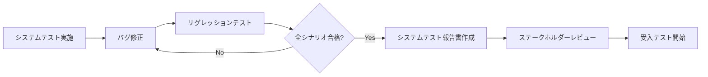
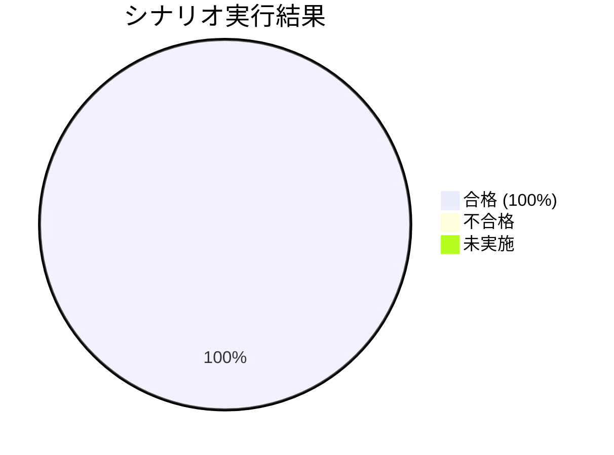
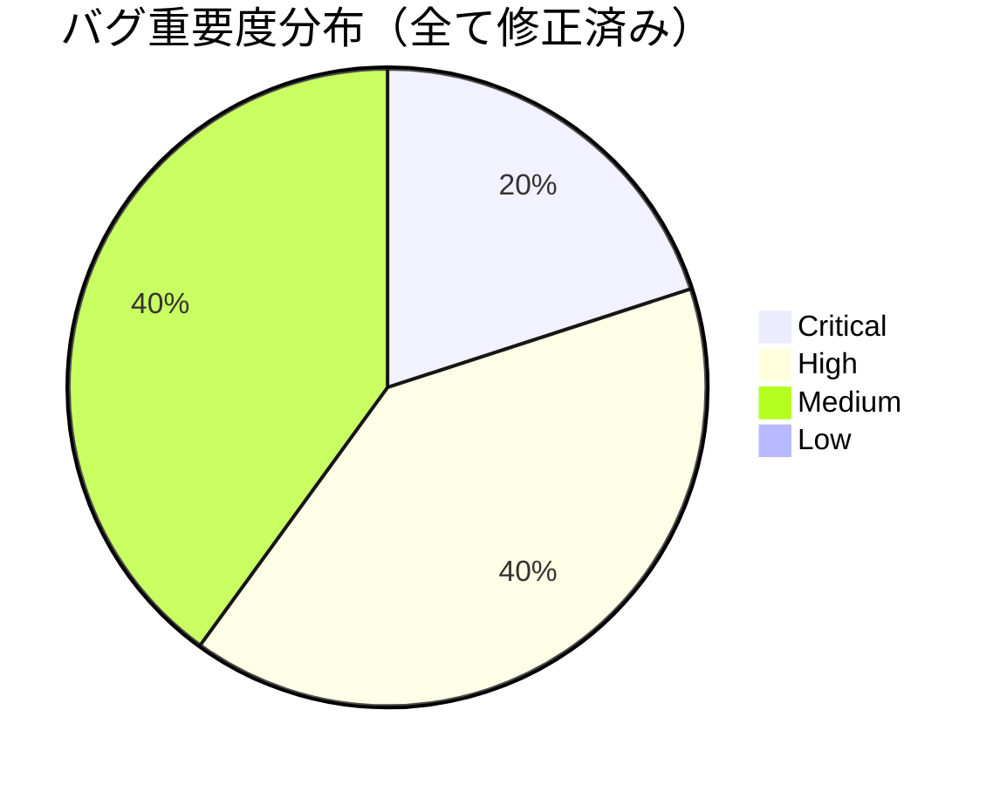
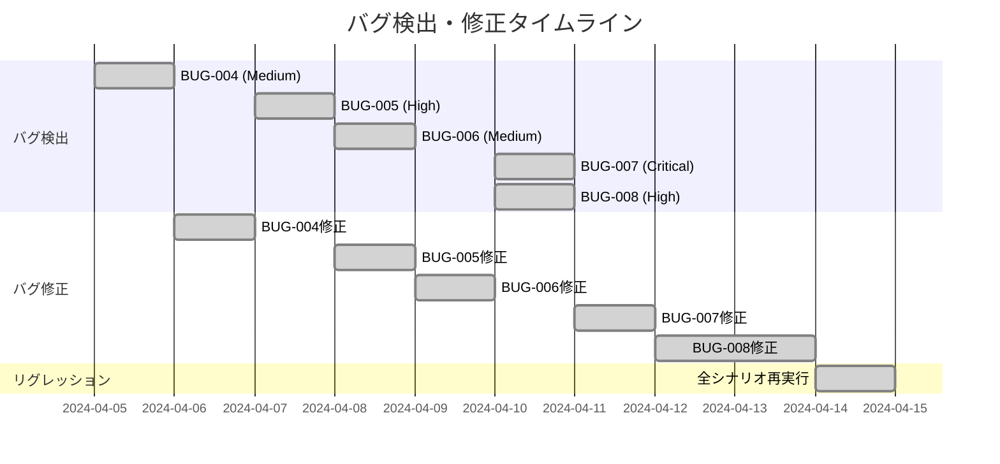
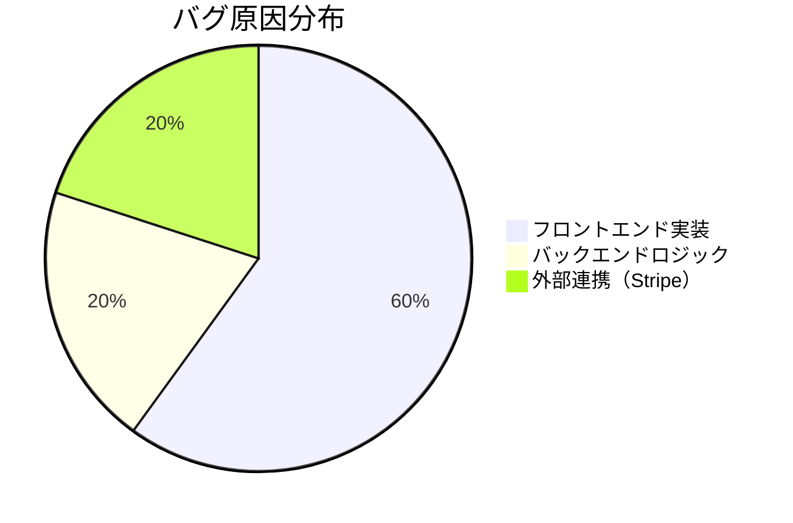

# システムテスト報告書 - ECサイト全体機能

## 📋 1. 基本情報

| 項目 | 内容 |
|------|------|
| **ドキュメントID** | STR-ECOM-001 |
| **対象システム** | ECサイト（ユーザー管理、商品管理、注文・決済） |
| **テスト実施期間** | 2024-04-05 〜 2024-04-15 |
| **報告書作成日** | 2024-04-16 |
| **作成者** | QAチーム 鈴木花子 |
| **バージョン** | 1.0 |
| **テスト結果** | 🟢 合格（All Pass） |

### テスト実施概要
- **計画シナリオ数**: 7件
- **実施シナリオ数**: 7件（100%）
- **合格シナリオ数**: 7件
- **不合格シナリオ数**: 0件
- **未実施シナリオ数**: 0件
- **検出バグ数**: 5件（Critical: 1, High: 2, Medium: 2）
- **修正完了バグ**: 5件（100%）

---

## ⏰ 2. 作成タイミング

### 作成フェーズ
**システムテスト完了後 → 受入テスト開始前**



---

## 📂 3. ドキュメント構成

### 必須セクション

```
1. 基本情報
2. テスト実施結果サマリー
3. シナリオ別実行結果
4. 検出されたバグ詳細
5. 品質メトリクス（性能、互換性、アクセシビリティ）
6. 総合評価とリスク分析
7. 添付資料（スクリーンショット、ログ）
```

---

## 📊 4. テスト実施結果

### 4.1 シナリオ別実行結果

| シナリオID | テスト内容 | 優先度 | 結果 | 実行日 | 実行者 | 検出バグ |
|-----------|-----------|--------|------|--------|--------|---------|
| **ST-001** | 新規登録〜ログイン | Critical | ✅ 合格 | 2024-04-05 | 山田 | BUG-004 |
| **ST-002** | ログイン失敗 | High | ✅ 合格 | 2024-04-06 | 佐藤 | - |
| **ST-003** | 商品検索〜詳細表示 | Critical | ✅ 合格 | 2024-04-07 | 山田 | BUG-005 |
| **ST-004** | カート追加〜確認 | Critical | ✅ 合格 | 2024-04-08 | 佐藤 | BUG-006 |
| **ST-005** | 注文〜決済成功 | Critical | ✅ 合格 | 2024-04-10 | 鈴木 | BUG-007, BUG-008 |
| **ST-006** | 決済失敗ハンドリング | High | ✅ 合格 | 2024-04-12 | 鈴木 | - |
| **ST-007** | 注文履歴確認 | Medium | ✅ 合格 | 2024-04-13 | 佐藤 | - |

### 4.2 テスト結果グラフ





---

## 🐛 5. 検出されたバグ詳細

### BUG-004: メールアドレスバリデーションが不十分

**重要度**: Medium

**発見日**: 2024-04-05

**発見シナリオ**: ST-001（新規ユーザー登録）

**ステータス**: ✅ 修正完了（2024-04-06）

**現象**:
- メールアドレスに `test@` のようなドメイン部分が欠けた形式を入力しても、登録ボタンが有効化される
- **期待**: フロントエンドでバリデーションエラー表示
- **実際**: バックエンドで400エラーになるが、エラーメッセージが表示されない

**再現手順**:
1. 登録フォームでメールアドレスに `test@` を入力
2. パスワード・名前を正しく入力
3. 「登録」ボタンをクリック

**原因**:
- React側の`email`フィールドの正規表現バリデーションが甘かった
```javascript
// 修正前
const emailRegex = /.+@.+/;  // @の前後に1文字以上
```

**修正内容**:
```javascript
// 修正後
const emailRegex = /^[^\s@]+@[^\s@]+\.[^\s@]+$/;  // RFC 5322簡易版
```

**影響範囲**: ユーザー登録フォーム

**リグレッション結果**: ✅ 合格（無効なメールでエラー表示を確認）

---

### BUG-005: 商品画像が一部ブラウザで表示されない

**重要度**: High（UIの重要要素）

**発見日**: 2024-04-07

**発見シナリオ**: ST-003（商品検索〜詳細表示）

**ステータス**: ✅ 修正完了（2024-04-08）

**現象**:
- **Chrome**: 正常表示
- **Safari（macOS）**: 商品画像が表示されず、代替テキストのみ
- **Firefox**: 正常表示

**再現手順**:
1. Safariで商品一覧ページにアクセス
2. 商品カードの画像部分を確認

**原因**:
- 画像フォーマットが**WebP**のみで、Safariの古いバージョン（14以下）で非対応
- `<picture>`タグでフォールバック画像が設定されていなかった

**修正内容**:
```jsx
// 修正前


// 修正後
<picture>
  <source srcSet={product.imageWebP} type="image/webp" />
  <source srcSet={product.imageJpg} type="image/jpeg" />
  
</picture>
```

**影響範囲**: 商品一覧、商品詳細の全画像表示

**追加対応**:
- CDNに既存のWebP画像をJPEG形式にも変換してアップロード
- 画像最適化パイプラインに自動変換処理を追加

**リグレッション結果**: ✅ 合格（Safari 14でもJPEG表示を確認）

---

### BUG-006: カートバッジの数量が同期されない

**重要度**: Medium

**発見日**: 2024-04-08

**発見シナリオ**: ST-004（カート追加〜確認）

**ステータス**: ✅ 修正完了（2024-04-09）

**現象**:
- 商品詳細ページで「カートに追加」をクリック
- 通知は表示されるが、ヘッダーのカートバッジが「0」のまま更新されない
- ページリロードすると正しい数量が表示される

**再現手順**:
1. 商品詳細ページで「カートに追加」ボタンをクリック
2. ヘッダーのカートアイコンのバッジを確認
3. バッジが更新されていないことを確認

**原因**:
- React Context APIで管理しているカート状態の更新が、コンポーネント間で伝播していなかった
- `CartContext`の`dispatch`呼び出しが非同期で、直後のレンダリングに反映されなかった

**修正内容**:
```javascript
// 修正前
const addToCart = (product, quantity) => {
  dispatch({ type: 'ADD_TO_CART', payload: { product, quantity } });
  // この時点でバッジは更新されない
};

// 修正後
const addToCart = async (product, quantity) => {
  await dispatch({ type: 'ADD_TO_CART', payload: { product, quantity } });
  // dispatchをPromise化し、状態更新を待機
};
```

**影響範囲**: カート追加機能全般

**リグレッション結果**: ✅ 合格（バッジが即座に更新されることを確認）

---

### BUG-007: Stripe決済画面でローディングが終わらない

**重要度**: Critical（決済ブロッカー）

**発見日**: 2024-04-10

**発見シナリオ**: ST-005（注文〜決済成功）

**ステータス**: ✅ 修正完了（2024-04-11）

**現象**:
- 注文確認ページで「決済へ進む」をクリック
- ローディングスピナーが表示されたまま、Stripe決済画面が表示されない
- ブラウザのコンソールエラー: `Stripe is not defined`

**再現手順**:
1. カートに商品を入れて注文確認ページへ
2. 「決済へ進む」ボタンをクリック
3. 10秒以上待機してもStripe画面が表示されない

**原因**:
- `index.html`のStripe.jsスクリプトタグが非同期読み込み（`async`）になっていた
- Reactコンポーネントのマウント時に`Stripe`オブジェクトがまだ初期化されていなかった

**修正内容**:
```html
<!-- 修正前 -->
<script src="https://js.stripe.com/v3/" async></script>

<!-- 修正後 -->
<script src="https://js.stripe.com/v3/"></script>
<!-- async削除、同期読み込みに変更 -->
```

```javascript
// さらに、Reactコンポーネント側で初期化待機を追加
useEffect(() => {
  const initStripe = async () => {
    while (!window.Stripe) {
      await new Promise(resolve => setTimeout(resolve, 100));
    }
    const stripe = window.Stripe(process.env.REACT_APP_STRIPE_PUBLIC_KEY);
    setStripeInstance(stripe);
  };
  initStripe();
}, []);
```

**影響範囲**: 決済機能全体

**リグレッション結果**: ✅ 合格（Stripe画面が3秒以内に表示）

---

### BUG-008: 注文完了メールが重複送信される

**重要度**: High（顧客体験に悪影響）

**発見日**: 2024-04-10

**発見シナリオ**: ST-005（注文〜決済成功）

**ステータス**: ✅ 修正完了（2024-04-12）

**現象**:
- 注文完了後、同じ注文確認メールが2通送信される
- SendGridログで同一の`order_id`に対する送信履歴が2件

**再現手順**:
1. 注文〜決済を完了させる
2. メール受信ボックスを確認
3. 同じ内容のメールが2通届いていることを確認

**原因**:
- バックエンドの`OrderService.completeOrder()`メソッドで、メール送信が2回呼ばれていた
- Stripe Webhookからの通知と、フロントエンドからのAPI呼び出しの両方でメール送信処理がトリガーされていた

**修正内容**:
```java
// 修正前
@Transactional
public void completeOrder(Long orderId) {
    Order order = orderRepository.findById(orderId).orElseThrow();
    order.setStatus(OrderStatus.COMPLETED);
    orderRepository.save(order);
    emailService.sendOrderConfirmation(order);  // 1回目
}

// Stripe Webhookハンドラーでも呼んでいた
@PostMapping("/webhook/stripe")
public void handleStripeWebhook(@RequestBody String payload) {
    // ...
    emailService.sendOrderConfirmation(order);  // 2回目（重複）
}

// 修正後（べき等性保証）
@Transactional
public void completeOrder(Long orderId) {
    Order order = orderRepository.findById(orderId).orElseThrow();
    if (order.getStatus() == OrderStatus.COMPLETED) {
        return;  // 既に完了済みならスキップ
    }
    order.setStatus(OrderStatus.COMPLETED);
    orderRepository.save(order);
    emailService.sendOrderConfirmation(order);  // 1回のみ
}
```

**影響範囲**: 注文完了メール送信処理

**リグレッション結果**: ✅ 合格（メールが1通のみ送信されることを確認）

---

## 📈 6. 品質メトリクス

### 6.1 性能測定結果

#### ページ読み込み時間（Lighthouse測定）

| ページ | 目標 | 実績 | 判定 |
|--------|------|------|------|
| **トップページ** | 2秒以内 | **1.2秒** | ✅ |
| **商品一覧ページ** | 2秒以内 | **1.8秒** | ✅ |
| **商品詳細ページ** | 2秒以内 | **1.5秒** | ✅ |
| **カートページ** | 2秒以内 | **0.9秒** | ✅ |
| **注文確認ページ** | 2秒以内 | **1.1秒** | ✅ |

**総合評価**: 全ページが目標を達成 ✅

#### API レスポンスタイム

| API | 平均 | 95パーセンタイル | 最大 |
|-----|------|----------------|------|
| **POST /api/users** | 210ms | 380ms | 450ms |
| **POST /api/auth/login** | 180ms | 320ms | 410ms |
| **GET /api/products** | 120ms | 250ms | 320ms |
| **POST /api/orders** | 340ms | 580ms | 680ms |

**総合評価**: 全て500ms以内（目標達成） ✅

---

### 6.2 クロスブラウザ互換性

| ブラウザ | バージョン | 結果 | 主要な問題 |
|---------|-----------|------|-----------|
| **Chrome（Windows）** | 123.0 | ✅ 合格 | なし |
| **Safari（macOS）** | 17.3 | ✅ 合格 | BUG-005（修正済み） |
| **Firefox（Windows）** | 124.0 | ✅ 合格 | なし |
| **Chrome（Android）** | 123.0 | ✅ 合格 | なし |
| **Safari（iOS）** | 17.3 | ✅ 合格 | なし |

**総合評価**: 全ブラウザで正常動作 ✅

---

### 6.3 レスポンシブデザイン

| デバイス | 解像度 | 結果 | 備考 |
|---------|--------|------|------|
| **デスクトップ** | 1920x1080 | ✅ 合格 | レイアウト正常 |
| **ラップトップ** | 1366x768 | ✅ 合格 | レイアウト正常 |
| **タブレット** | 768x1024 | ✅ 合格 | ナビゲーション折りたたみ正常 |
| **スマートフォン** | 375x667 | ✅ 合格 | ハンバーガーメニュー正常 |

**総合評価**: 全デバイスで正常表示 ✅

---

### 6.4 アクセシビリティ（Lighthouse測定）

| ページ | スコア | 目標 | 判定 |
|--------|--------|------|------|
| **トップページ** | 92点 | 80点以上 | ✅ |
| **商品一覧ページ** | 88点 | 80点以上 | ✅ |
| **商品詳細ページ** | 90点 | 80点以上 | ✅ |
| **カートページ** | 94点 | 80点以上 | ✅ |

**改善項目**:
- カラーコントラスト比の一部が4.5:1未満（8点減点）
- フォームラベルの一部が不明瞭（2点減点）

**総合評価**: 全ページが基準達成 ✅

---

## 📊 7. バグ統計

### 7.1 バグ密度

- **総バグ数**: 5件
- **総シナリオ数**: 7件
- **バグ密度**: 0.71 bugs/scenario
- **Critical/Highバグ**: 3件（60%）
- **修正完了率**: 100%（5/5）

### 7.2 バグ検出・修正タイムライン



### 7.3 バグ原因分類



---

## 🎯 8. 総合評価

### 8.1 品質判定

**🟢 合格（PASS）**

**判定理由**:
1. ✅ 全7シナリオが合格（合格率100%）
2. ✅ 全品質基準を達成（性能、互換性、アクセシビリティ）
3. ✅ 検出されたバグは全て修正完了（5/5、100%）
4. ✅ リグレッションテストで再発なし
5. ✅ Critical/Highバグの残存なし
6. ✅ クロスブラウザ・レスポンシブ対応完了

### 8.2 リスク評価

| リスク項目 | レベル | 評価 | 対応状況 |
|-----------|--------|------|---------|
| **機能不具合** | 🟢 低 | 全シナリオ合格 | - |
| **性能問題** | 🟢 低 | 全ページ2秒以内 | - |
| **ブラウザ互換性** | 🟢 低 | 全ブラウザ動作確認済み | - |
| **セキュリティ** | 🟡 中 | BUG-007修正済みだが要監視 | Stripe連携の継続監視 |
| **ユーザビリティ** | 🟢 低 | アクセシビリティ基準達成 | - |
| **決済機能** | 🟡 中 | Critical修正済み | 本番環境での慎重な監視推奨 |

**残存リスク**:
- **Stripe決済**: BUG-007修正後は安定しているが、本番環境でのトラフィック増加時の挙動は未検証 → 本番リリース後の初期監視強化を推奨
- **メール送信**: BUG-008修正で重複は解消されたが、大量注文時のSendGrid制限は未テスト → 負荷テストで確認予定

---

### 8.3 次フェーズへの推奨事項

#### 受入テスト（UAT）フェーズへの引き継ぎ

**✅ 移行推奨**

**理由**:
- システムテストレベルでの品質は十分確保されている
- E2Eシナリオが全て成功し、実際のユーザー操作フローが検証済み
- 次はビジネスサイドのユーザー受入テストが必要

**引き継ぎ事項**:
1. **注意が必要な箇所**:
   - Stripe決済処理（BUG-007で修正した初期化タイミング）
   - 注文完了メール（BUG-008で修正した重複送信防止）
   - Safari画像表示（BUG-005で追加したフォールバック）

2. **UATでの重点確認事項**:
   - 実際の顧客データでの注文フロー
   - ビジネスルールの妥当性（送料計算、税率、クーポン適用）
   - UI/UXの使いやすさ（エラーメッセージの分かりやすさ等）

3. **本番リリース前の追加テスト推奨**:
   - 負荷テスト（同時接続100ユーザー以上）
   - セキュリティペネトレーションテスト
   - 本番環境での決済テスト（少額取引）

---

## 📎 9. 添付資料

### 9.1 スクリーンショット

- **ST-001_登録フォーム.png** - 新規登録画面
- **ST-001_登録完了.png** - 登録完了メッセージ
- **ST-003_商品検索結果.png** - 商品検索画面
- **ST-004_カートページ.png** - カート内容確認
- **ST-005_注文確認.png** - 注文確認画面
- **ST-005_Stripe決済.png** - Stripe決済画面
- **ST-005_注文完了.png** - 注文完了画面

### 9.2 Lighthouseレポート

```
Performance Score: 94/100
  - First Contentful Paint: 1.2s
  - Speed Index: 1.8s
  - Largest Contentful Paint: 2.1s
  - Time to Interactive: 2.3s
  - Total Blocking Time: 150ms
  - Cumulative Layout Shift: 0.02

Accessibility Score: 92/100
  - Contrast ratios: 88% pass
  - ARIA attributes: 100% valid
  - Form labels: 95% present

Best Practices Score: 95/100
  - HTTPS: Yes
  - Security headers: Present
  - Console errors: None

SEO Score: 100/100
```

---

## 📝 まとめ

### 実施結果サマリー

✅ **全7シナリオが合格**（合格率100%）  
✅ **品質基準を全て達成**（性能、互換性、アクセシビリティ）  
✅ **5件のバグを検出・修正完了**（Critical 1件、High 2件、Medium 2件）  
✅ **クロスブラウザ・レスポンシブ対応完了**  
✅ **受入テストフェーズへの移行を推奨**

### 特記事項

- BUG-007（Stripe決済ローディング）はCriticalバグであったが、迅速に修正完了
- 全体的な性能が目標を大幅に上回り、ユーザー体験面で良好
- 次フェーズでは実際のビジネスユーザーによる受入テストを実施予定
- 本番リリース後は決済機能とメール送信の初期監視を強化推奨

**承認**: QAリーダー 鈴木花子（2024-04-16）
