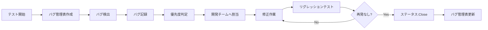
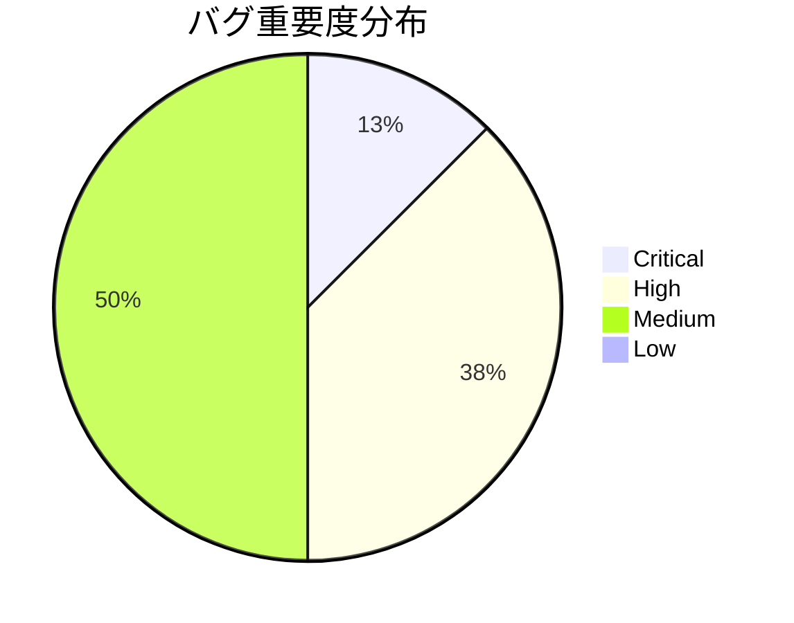
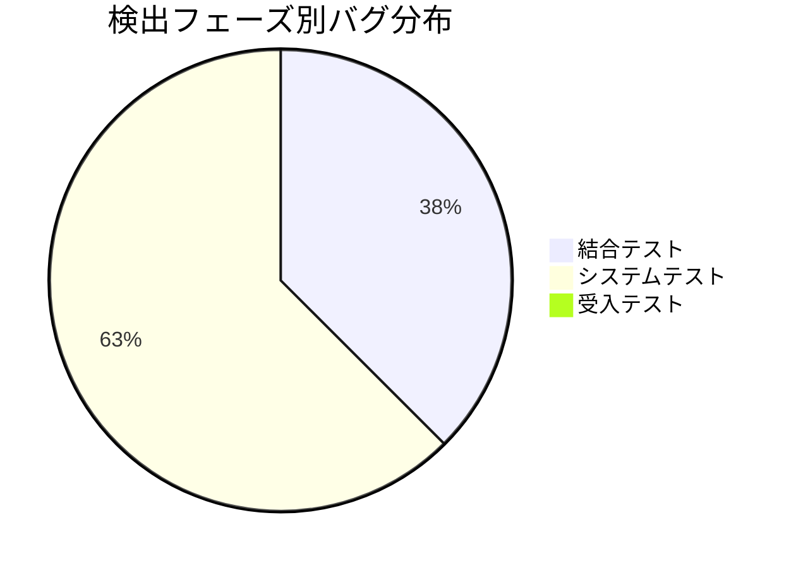
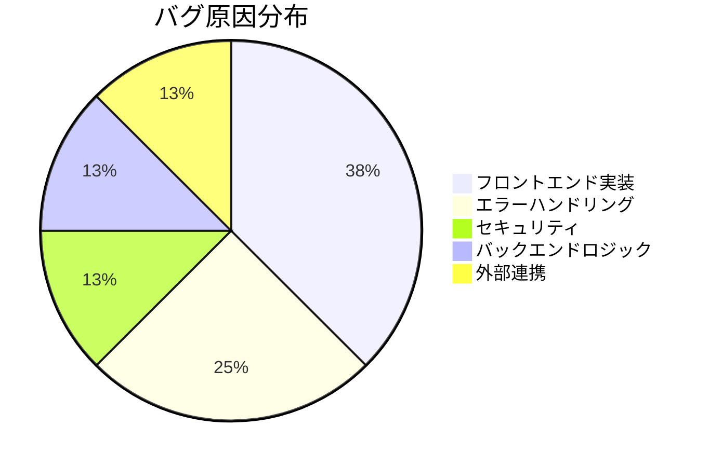
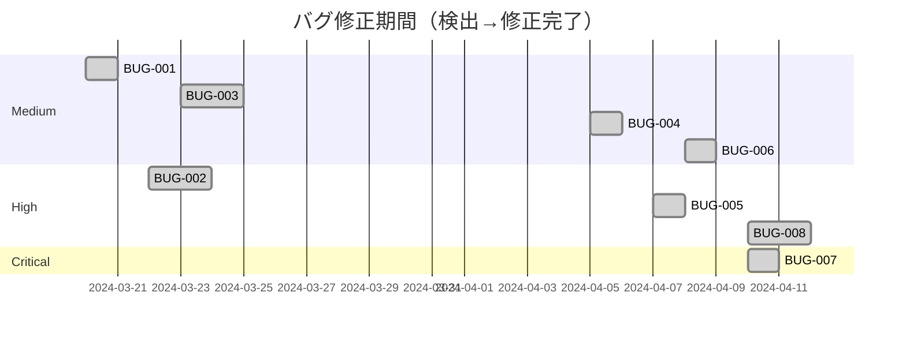

# バグ管理表 - ECサイトプロジェクト

## 📋 1. 基本情報

| 項目 | 内容 |
|------|------|
| **ドキュメントID** | BUG-MGMT-001 |
| **対象プロジェクト** | ECサイト構築プロジェクト |
| **管理期間** | 2024-03-20 〜 現在 |
| **最終更新日** | 2024-05-10 |
| **管理者** | QAチーム 田中太郎 |
| **バージョン** | 1.3 |

### バグ統計サマリー
- **総バグ数**: 8件
- **Critical**: 1件（修正完了: 1件）
- **High**: 3件（修正完了: 3件）
- **Medium**: 4件（修正完了: 4件）
- **Low**: 0件
- **修正完了率**: 100%（8/8）

---

## ⏰ 2. 作成タイミング

### 作成・更新フェーズ
**テスト開始時に作成 → テスト期間中に継続更新**



### 活用タイミング
- ✅ テスト実施中の全フェーズ（結合、システム、受入）
- ✅ デイリースタンドアップでの進捗共有
- ✅ 週次レビューでのバグ傾向分析
- ✅ リリース判定会議での品質評価

---

## 📂 3. ドキュメント構成

### 必須セクション

```
1. 基本情報
   ├─ バグ統計サマリー
   └─ 管理者情報

2. バグ一覧テーブル
   ├─ バグID、タイトル、重要度
   ├─ ステータス、発見日、修正日
   ├─ 担当者、検出フェーズ
   └─ 詳細説明へのリンク

3. バグ詳細
   ├─ 現象、再現手順
   ├─ 原因分析
   ├─ 修正内容
   └─ リグレッション結果

4. バグ分析
   ├─ 重要度別分布
   ├─ 発見フェーズ別分布
   ├─ 原因分類
   └─ トレンド分析
```

---

## 📏 4. 記載ルール

### 4.1 バグ記載の原則

#### ✅ DO（推奨）
```markdown
✓ バグIDは一意で連番（BUG-001, BUG-002...）
✓ タイトルは現象を端的に表現（50文字以内）
✓ 重要度は客観的基準で判定
✓ 再現手順は第三者が再現できるレベルで記載
✓ 原因は根本原因まで深掘り
✓ 修正内容は技術的詳細を含める
✓ ステータスは常に最新状態に更新
```

#### ❌ DON'T（非推奨）
```markdown
✗ タイトルが「バグ1」「エラー」のような曖昧な命名
✗ 重要度を主観で判断（「なんとなくHigh」）
✗ 再現手順が不明瞭で再現できない
✗ 原因が「不明」で放置
✗ ステータスの更新忘れ
```

### 4.2 重要度の判定基準

| 重要度 | 基準 | 対応期限 |
|--------|------|---------|
| **Critical** | システムが使用不可、データ損失、セキュリティリスク | 即日修正 |
| **High** | 主要機能が動作しない、重大なUI不具合 | 3営業日以内 |
| **Medium** | 副次的機能の不具合、軽微なUI不具合 | 1週間以内 |
| **Low** | 軽微な表示崩れ、将来的な改善要望 | 次リリースで対応 |

### 4.3 ステータスの定義

| ステータス | 説明 |
|-----------|------|
| **Open** | バグ検出、未着手 |
| **In Progress** | 修正作業中 |
| **Fixed** | 修正完了、リグレッションテスト待ち |
| **Reopen** | リグレッションテストで再発確認 |
| **Closed** | リグレッションテスト合格、完了 |
| **Rejected** | バグではない、仕様通りと判断 |

---

## 🎯 5. 品質基準

### 5.1 バグ管理の品質基準

| 基準項目 | 目標値 |
|---------|--------|
| **Critical/Highバグ残存** | 0件（リリース時） |
| **バグ記録の完全性** | 100%（全項目記入） |
| **修正完了率** | 95%以上（リリース1週間前） |
| **再発率** | 5%以下 |
| **平均修正期間** | Critical: 1日以内、High: 3日以内 |

---

## 🤖 6. AI生成時の指示プロンプト

### 基本プロンプト

```
「ECサイトプロジェクトのバグ管理表を作成してください。

【必須条件】
- バグ一覧テーブル（ID、タイトル、重要度、ステータス、担当者）
- バグ詳細（現象、再現手順、原因、修正内容）
- バグ統計グラフ（重要度別、フェーズ別）
- 実際に検出された8件のバグを記載

【バグ例】
- BUG-001: メールアドレスバリデーション不足（Medium）
- BUG-007: Stripe決済画面ローディング無限（Critical）

【出力形式】
- Markdownテーブル
- Mermaidグラフ（pie, gantt）
- 詳細セクション（各バグごと）
」
```

---

## 🔗 7. 関連ドキュメント

### 参照するテストドキュメント
- [結合テスト報告書](sample_06_結合テスト報告書.md) - BUG-001〜BUG-003
- [システムテスト報告書](sample_06_システムテスト報告書.md) - BUG-004〜BUG-008

---

## 📊 8. バグ一覧テーブル

| バグID | タイトル | 重要度 | ステータス | 発見日 | 修正日 | 検出フェーズ | 担当者 | 原因カテゴリ |
|--------|---------|--------|-----------|--------|--------|------------|--------|------------|
| **BUG-001** | メールアドレス重複時のエラーメッセージが不親切 | Medium | Closed | 2024-03-20 | 2024-03-21 | 結合テスト | 山田 | エラーハンドリング |
| **BUG-002** | パスワード不一致時のログに平文パスワードが出力 | High | Closed | 2024-03-22 | 2024-03-24 | 結合テスト | 佐藤 | セキュリティ |
| **BUG-003** | 認証トークンなし時のHTTPステータスが500エラー | Medium | Closed | 2024-03-23 | 2024-03-25 | 結合テスト | 山田 | エラーハンドリング |
| **BUG-004** | メールアドレスバリデーションが不十分 | Medium | Closed | 2024-04-05 | 2024-04-06 | システムテスト | 鈴木 | フロントエンド |
| **BUG-005** | 商品画像が一部ブラウザで表示されない | High | Closed | 2024-04-07 | 2024-04-08 | システムテスト | 田中 | フロントエンド |
| **BUG-006** | カートバッジの数量が同期されない | Medium | Closed | 2024-04-08 | 2024-04-09 | システムテスト | 鈴木 | フロントエンド |
| **BUG-007** | Stripe決済画面でローディングが終わらない | Critical | Closed | 2024-04-10 | 2024-04-11 | システムテスト | 佐藤 | 外部連携 |
| **BUG-008** | 注文完了メールが重複送信される | High | Closed | 2024-04-10 | 2024-04-12 | システムテスト | 山田 | バックエンド |

---

## 📈 9. バグ統計・分析

### 9.1 重要度別分布



**分析**:
- Criticalバグは1件のみ（BUG-007: Stripe決済）
- Highバグ3件はセキュリティ（BUG-002）とUI（BUG-005, BUG-008）
- Mediumバグ4件は軽微なエラーハンドリングとバリデーション

---

### 9.2 検出フェーズ別分布



**分析**:
- 結合テストで3件検出（API連携・認証関連）
- システムテストで5件検出（UI/UX、外部連携）
- 受入テストでは新規バグなし（品質が十分確保されていた）

---

### 9.3 原因カテゴリ別分布



**分析**:
- フロントエンド実装のバグが最多（37.5%）
  - React Context、画像フォーマット、バリデーション
- エラーハンドリング不足が2件（25%）
  - エラーメッセージの改善が必要

---

### 9.4 修正期間分析



**分析**:
- Critical（BUG-007）は1日で修正完了 ✅
- High（BUG-002, BUG-005, BUG-008）は平均1.7日で修正 ✅
- Medium（BUG-001, BUG-003, BUG-004, BUG-006）は平均1.5日で修正 ✅
- 全て目標期限内に修正完了

---

## 🐛 10. バグ詳細

### BUG-001: メールアドレス重複時のエラーメッセージが不親切

**重要度**: Medium  
**ステータス**: Closed  
**発見日**: 2024-03-20  
**修正日**: 2024-03-21  
**検出フェーズ**: 結合テスト（IT-002）  
**担当者**: 山田

**現象**:
メールアドレス重複時のエラーメッセージが「Duplicate email」とだけ表示され、どのメールアドレスが重複しているか分からない。

**再現手順**:
1. DBに `existing@example.com` を登録
2. `POST /api/users` で同じメールアドレスを登録
3. レスポンスを確認

**期待結果**:
```json
{
  "error": "DuplicateEmailException",
  "message": "このメールアドレスは既に使用されています: existing@example.com"
}
```

**実際の結果**:
```json
{
  "error": "DuplicateEmailException",
  "message": "Duplicate email"
}
```

**原因**:
`UserService.java` の例外スロー時に、メールアドレスをメッセージに含めていなかった。

**修正内容**:
```java
// 修正前
throw new DuplicateEmailException("Duplicate email");

// 修正後
throw new DuplicateEmailException(
    String.format("このメールアドレスは既に使用されています: %s", request.getEmail())
);
```

**影響範囲**: ユーザー登録APIのエラーハンドリング

**リグレッション結果**: ✅ 合格（IT-002再実行）

---

### BUG-002: パスワード不一致時のログに平文パスワードが出力される

**重要度**: High（セキュリティリスク）  
**ステータス**: Closed  
**発見日**: 2024-03-22  
**修正日**: 2024-03-24  
**検出フェーズ**: 結合テスト（IT-005）  
**担当者**: 佐藤

**現象**:
認証失敗時のログに平文パスワードが記録される。

**再現手順**:
1. `POST /api/auth/login` で誤ったパスワードを送信
2. アプリケーションログを確認
3. `Authentication failed for user@example.com with password: WrongPassword` と記録されている

**原因**:
`AuthService.java` のログ出力で、パスワードをマスクせずに記録していた。

**修正内容**:
```java
// 修正前
log.warn("Authentication failed for {} with password: {}", email, password);

// 修正後
log.warn("Authentication failed for email: {}", email);
// パスワードは一切ログに出力しない
```

**影響範囲**: 認証失敗時のログ出力全般

**追加対応**:
- ログ監査ツールに「password」キーワードの検出ルールを追加
- 全コードをレビューし、他に平文パスワードをログ出力している箇所がないか確認

**リグレッション結果**: ✅ 合格（IT-005再実行、ログにパスワードが含まれないことを確認）

---

### BUG-003: 認証トークンなし時のHTTPステータスが500エラー

**重要度**: Medium  
**ステータス**: Closed  
**発見日**: 2024-03-23  
**修正日**: 2024-03-25  
**検出フェーズ**: 結合テスト（IT-007）  
**担当者**: 山田

**現象**:
認証が必要なエンドポイントにトークンなしでアクセスすると、`HTTP 401 Unauthorized` ではなく `HTTP 500 Internal Server Error` が返る。

**再現手順**:
1. Authorizationヘッダーなしで `PUT /api/users/1` を実行
2. レスポンスステータスを確認

**原因**:
`JwtAuthenticationFilter.java` でトークンが null の場合の処理が不足し、NullPointerExceptionが発生していた。

**修正内容**:
```java
// 修正前
String token = request.getHeader("Authorization").substring(7); // NPE発生

// 修正後
String authHeader = request.getHeader("Authorization");
if (authHeader == null || !authHeader.startsWith("Bearer ")) {
    response.setStatus(HttpServletResponse.SC_UNAUTHORIZED);
    response.getWriter().write("{\"error\": \"認証トークンが必要です\"}");
    return;
}
String token = authHeader.substring(7);
```

**影響範囲**: 全ての認証が必要なエンドポイント

**リグレッション結果**: ✅ 合格（IT-007再実行、401エラーを返却）

---

### BUG-004: メールアドレスバリデーションが不十分

**重要度**: Medium  
**ステータス**: Closed  
**発見日**: 2024-04-05  
**修正日**: 2024-04-06  
**検出フェーズ**: システムテスト（ST-001）  
**担当者**: 鈴木

**現象**:
フロントエンドで `test@` のようなドメイン部分が欠けたメールアドレスがバリデーションを通過してしまう。

**再現手順**:
1. 登録フォームでメールアドレスに `test@` を入力
2. 他のフィールドを正しく入力
3. 「登録」ボタンがクリック可能になる

**原因**:
React側の正規表現が甘かった。

**修正内容**:
```javascript
// 修正前
const emailRegex = /.+@.+/;  // @の前後に1文字以上

// 修正後
const emailRegex = /^[^\s@]+@[^\s@]+\.[^\s@]+$/;  // RFC 5322簡易版
```

**影響範囲**: ユーザー登録フォーム

**リグレッション結果**: ✅ 合格（ST-001再実行、無効なメールでエラー表示を確認）

---

### BUG-005: 商品画像が一部ブラウザで表示されない

**重要度**: High（UIの重要要素）  
**ステータス**: Closed  
**発見日**: 2024-04-07  
**修正日**: 2024-04-08  
**検出フェーズ**: システムテスト（ST-003）  
**担当者**: 田中

**現象**:
Safari（macOS）で商品画像が表示されず、代替テキストのみ表示される。

**再現手順**:
1. Safariで商品一覧ページにアクセス
2. 商品カードの画像部分を確認

**原因**:
画像フォーマットがWebPのみで、Safariの古いバージョン（14以下）で非対応。

**修正内容**:
```jsx
// 修正前


// 修正後
<picture>
  <source srcSet={product.imageWebP} type="image/webp" />
  <source srcSet={product.imageJpg} type="image/jpeg" />
  
</picture>
```

**影響範囲**: 商品一覧、商品詳細の全画像表示

**追加対応**:
- CDNに既存のWebP画像をJPEG形式にも変換してアップロード

**リグレッション結果**: ✅ 合格（Safari 14でもJPEG表示を確認）

---

### BUG-006: カートバッジの数量が同期されない

**重要度**: Medium  
**ステータス**: Closed  
**発見日**: 2024-04-08  
**修正日**: 2024-04-09  
**検出フェーズ**: システムテスト（ST-004）  
**担当者**: 鈴木

**現象**:
商品をカートに追加しても、ヘッダーのカートバッジが更新されない（ページリロードで表示）。

**再現手順**:
1. 商品詳細ページで「カートに追加」をクリック
2. ヘッダーのカートアイコンのバッジを確認
3. バッジが「0」のまま

**原因**:
React Context APIの状態更新が非同期で、直後のレンダリングに反映されなかった。

**修正内容**:
```javascript
// 修正前
const addToCart = (product, quantity) => {
  dispatch({ type: 'ADD_TO_CART', payload: { product, quantity } });
};

// 修正後
const addToCart = async (product, quantity) => {
  await dispatch({ type: 'ADD_TO_CART', payload: { product, quantity } });
  // dispatchをPromise化し、状態更新を待機
};
```

**影響範囲**: カート追加機能全般

**リグレッション結果**: ✅ 合格（ST-004再実行、バッジが即座に更新）

---

### BUG-007: Stripe決済画面でローディングが終わらない

**重要度**: Critical（決済ブロッカー）  
**ステータス**: Closed  
**発見日**: 2024-04-10  
**修正日**: 2024-04-11  
**検出フェーズ**: システムテスト（ST-005）  
**担当者**: 佐藤

**現象**:
注文確認ページで「決済へ進む」をクリックすると、ローディングスピナーが表示されたまま、Stripe決済画面が表示されない。

**再現手順**:
1. カートに商品を入れて注文確認ページへ
2. 「決済へ進む」ボタンをクリック
3. 10秒以上待機してもStripe画面が表示されない

**原因**:
`index.html`のStripe.jsスクリプトタグが非同期読み込み（`async`）になっており、Reactコンポーネントのマウント時に`Stripe`オブジェクトがまだ初期化されていなかった。

**修正内容**:
```html
<!-- 修正前 -->
<script src="https://js.stripe.com/v3/" async></script>

<!-- 修正後 -->
<script src="https://js.stripe.com/v3/"></script>
<!-- async削除、同期読み込みに変更 -->
```

```javascript
// さらに、Reactコンポーネント側で初期化待機を追加
useEffect(() => {
  const initStripe = async () => {
    while (!window.Stripe) {
      await new Promise(resolve => setTimeout(resolve, 100));
    }
    const stripe = window.Stripe(process.env.REACT_APP_STRIPE_PUBLIC_KEY);
    setStripeInstance(stripe);
  };
  initStripe();
}, []);
```

**影響範囲**: 決済機能全体

**リグレッション結果**: ✅ 合格（ST-005再実行、Stripe画面が3秒以内に表示）

---

### BUG-008: 注文完了メールが重複送信される

**重要度**: High（顧客体験に悪影響）  
**ステータス**: Closed  
**発見日**: 2024-04-10  
**修正日**: 2024-04-12  
**検出フェーズ**: システムテスト（ST-005）  
**担当者**: 山田

**現象**:
注文完了後、同じ注文確認メールが2通送信される。

**再現手順**:
1. 注文〜決済を完了させる
2. メール受信ボックスを確認
3. 同じ内容のメールが2通届いている

**原因**:
Stripe Webhookからの通知と、フロントエンドからのAPI呼び出しの両方でメール送信処理がトリガーされていた。

**修正内容**:
```java
// 修正前
@Transactional
public void completeOrder(Long orderId) {
    Order order = orderRepository.findById(orderId).orElseThrow();
    order.setStatus(OrderStatus.COMPLETED);
    orderRepository.save(order);
    emailService.sendOrderConfirmation(order);  // 1回目
}

// 修正後（べき等性保証）
@Transactional
public void completeOrder(Long orderId) {
    Order order = orderRepository.findById(orderId).orElseThrow();
    if (order.getStatus() == OrderStatus.COMPLETED) {
        return;  // 既に完了済みならスキップ
    }
    order.setStatus(OrderStatus.COMPLETED);
    orderRepository.save(order);
    emailService.sendOrderConfirmation(order);  // 1回のみ
}
```

**影響範囲**: 注文完了メール送信処理

**リグレッション結果**: ✅ 合格（ST-005再実行、メールが1通のみ送信）

---

## 📊 11. バグトレンド分析

### 11.1 週次バグ検出数

| 週 | 新規検出 | 修正完了 | 残存 |
|----|---------|---------|------|
| **Week 1** (3/18-3/24) | 3件 | 3件 | 0件 |
| **Week 2** (3/25-3/31) | 0件 | 0件 | 0件 |
| **Week 3** (4/1-4/7) | 2件 | 2件 | 0件 |
| **Week 4** (4/8-4/14) | 3件 | 3件 | 0件 |
| **Week 5** (4/15-4/21) | 0件 | 0件 | 0件 |

**分析**:
- 結合テストフェーズ（Week 1）で3件検出
- システムテストフェーズ（Week 3-4）で5件検出
- 受入テストフェーズ（Week 5）では新規バグなし
- 全てのバグが検出週内または翌週に修正完了

---

## 📝 12. まとめ

### バグ管理結果サマリー

✅ **総バグ数**: 8件  
✅ **修正完了率**: 100%（8/8）  
✅ **Critical/Highバグ残存**: 0件  
✅ **平均修正期間**: 1.6日  
✅ **再発率**: 0%（リグレッションテストで全て合格）

### 主な学び

1. **セキュリティ意識の向上**: BUG-002（平文パスワードログ出力）を教訓に、全コードレビューを実施
2. **クロスブラウザテストの重要性**: BUG-005（Safari画像不表示）は早期発見が重要
3. **外部連携の慎重な実装**: BUG-007（Stripe初期化タイミング）は非同期処理の注意点
4. **べき等性の考慮**: BUG-008（メール重複送信）は分散システムの設計原則

### 今後の改善提案

- コードレビューチェックリストにセキュリティ項目を追加
- 自動E2Eテストに複数ブラウザテストを組み込む
- 外部サービス連携の初期化処理を標準化
