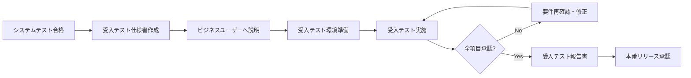
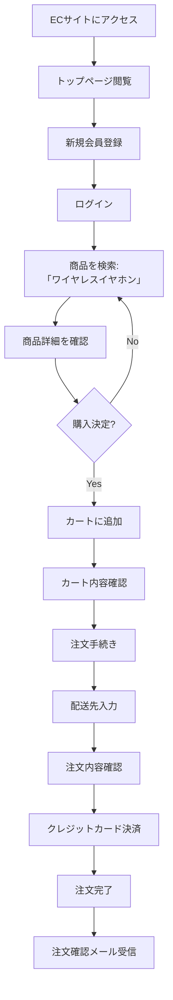

# 受入テスト仕様書 - ECサイト

## 📋 1. 基本情報

| 項目 | 内容 |
|------|------|
| **ドキュメントID** | UAT-ECOM-001 |
| **対象システム** | ECサイト（ユーザー管理、商品管理、注文・決済） |
| **テスト種別** | 受入テスト（User Acceptance Test） |
| **作成日** | 2024-04-20 |
| **作成者** | プロジェクトマネージャー 高橋一郎 |
| **バージョン** | 1.0 |
| **実施予定期間** | 2024-04-25 〜 2024-05-05 |

### テスト目的
**ビジネス要件が満たされているかを、実際のユーザー（顧客代表・業務担当者）が検証**

---

## ⏰ 2. 作成タイミング

### 作成フェーズ
**システムテスト完了後 → 受入テスト実施前**



### 実施条件
- ✅ システムテストが全て合格
- ✅ 本番相当の環境（UAT環境）が準備済み
- ✅ 実データに近いテストデータが投入済み
- ✅ ビジネスユーザーのスケジュールが確保済み

---

## 📂 3. ドキュメント構成

### 必須セクション

```
1. 基本情報
   ├─ テスト目的（ビジネス視点）
   └─ 実施体制（ビジネスユーザー、開発チーム）

2. 受入基準
   ├─ 機能要件の充足
   ├─ ビジネスルールの正確性
   └─ ユーザビリティの妥当性

3. テストシナリオ
   ├─ ユーザーストーリーベース
   ├─ 実際の業務フローに沿った検証
   └─ エッジケース・例外処理

4. テストケース一覧
   ├─ ビジネス観点での検証項目
   ├─ 承認基準（Accept/Reject）
   └─ 実施者（ビジネスユーザー）

5. テスト実施計画
   ├─ スケジュール
   ├─ 参加者
   └─ サポート体制
```

---

## 📏 4. 記載ルール

### 4.1 受入テストの観点

#### ✅ DO（推奨）
```markdown
✓ ビジネス要件が満たされているか検証
✓ 実際の業務フローで使えるか確認
✓ エラーメッセージが分かりやすいか評価
✓ UI/UXが使いやすいか体感的に判断
✓ ビジネスルール（価格計算、税率等）が正確か検証
✓ 実データに近いシナリオでテスト
✓ 顧客視点での満足度を評価
```

#### ❌ DON'T（非推奨）
```markdown
✗ 技術的な内部実装の詳細を検証
✗ 性能測定やセキュリティ診断（専門テストで実施済み）
✗ バグ探しに注力（システムテストで完了）
✗ 開発者が全て実施（ビジネスユーザーが主体）
```

### 4.2 テストケース記載フォーマット

```markdown
### UAT-XXX: テストケース名

**ビジネス観点**: ユーザーストーリーの視点で何を確認するか

**前提条件**:
- ユーザーの役割（顧客、管理者等）
- ビジネスシナリオの背景

**操作手順**:
1. ビジネスユーザー視点の操作
2. 実際の業務フローに沿った手順
3. 結果確認

**期待結果**:
- ビジネス要件が満たされているか
- 使いやすさ、分かりやすさ

**承認基準**:
- [ ] 機能が正しく動作する
- [ ] ビジネスルールが正確
- [ ] UI/UXが使いやすい
- [ ] エラーメッセージが分かりやすい

**実施者**: ビジネスユーザー名

**承認/却下**: [ ] Accept / [ ] Reject

**コメント**: （改善要望等）
```

---

## 🎯 5. 品質基準

### 5.1 受入基準

| 基準項目 | 承認条件 |
|---------|---------|
| **機能要件充足率** | 100%（全ての機能要件が実装されている） |
| **ビジネスルール正確性** | 100%（計算、判定ロジックが仕様通り） |
| **ユーザビリティ** | 80%以上が「使いやすい」と評価 |
| **エラーハンドリング** | 100%（エラーが適切に表示・処理される） |
| **Critical/High不具合** | 0件（残存なし） |

### 5.2 実施チェックリスト

```markdown
✅ 機能要件
  - 要件定義書の全機能が実装されている
  - ビジネスルール（税率、送料計算等）が正確
  - データが正しく保存・表示される

✅ ユーザビリティ
  - 直感的に操作できる
  - エラーメッセージが分かりやすい
  - ヘルプ・ガイダンスが適切

✅ ビジネスプロセス
  - 実際の業務フローで使える
  - 例外処理が適切
  - 運用負荷が許容範囲
```

---

## 🤖 6. AI生成時の指示プロンプト

### 基本プロンプト

```
「ECサイトの受入テスト仕様書を作成してください。

【必須条件】
- ビジネスユーザー視点のテストケース
- 実際の業務フローに沿ったシナリオ
- 技術用語を避けた分かりやすい記載
- 承認基準（Accept/Reject）を明記

【テストシナリオ】
1. 顧客として新規会員登録〜初回注文
2. 商品を検索して購入
3. 注文履歴を確認
4. 管理者として商品登録

【出力形式】
- テストケース一覧（ビジネス観点）
- 実施計画（スケジュール、参加者）
- 承認フォーマット（Accept/Reject欄）
」
```

---

## 🔗 7. 関連ドキュメント

### 参照する要件・設計ドキュメント
- [要件定義書](02_要件定義/機能要件定義書.md) - ビジネス要件
- [ユーザーストーリー](02_要件定義/ユーザーストーリー.md) - ユーザー視点の要求
- [システムテスト報告書](sample_06_システムテスト報告書.md) - 前フェーズ結果

### 後続ドキュメント
- 受入テスト報告書 - テスト結果と承認記録
- 本番リリース計画書 - リリース手順

---

## 📊 8. テストシナリオ

### シナリオ1: 新規顧客の初回注文フロー（Critical）



---

## 📋 9. テストケース一覧

### 9.1 顧客機能

#### UAT-001: 新規会員登録が簡単にできる

**ビジネス観点**: 初めてのユーザーがスムーズに会員登録できるか

**前提条件**:
- ユーザーはECサイトを初めて利用する
- メールアドレスとクレジットカードを持っている

**操作手順**:
1. トップページの「新規登録」ボタンをクリック
2. メールアドレス、パスワード、名前を入力
3. 利用規約に同意
4. 「登録」ボタンをクリック
5. 登録完了画面を確認
6. メールボックスでウェルカムメールを確認

**期待結果**:
- 入力フォームが分かりやすい（項目名が明確）
- エラーが発生した場合、具体的な修正方法が提示される
- 登録完了画面が表示され、次にすべきことが分かる
- ウェルカムメールが5分以内に届く

**承認基準**:
- [x] 入力フォームが使いやすい
- [x] エラーメッセージが分かりやすい
- [x] 登録完了後の導線が明確
- [x] メールが適切なタイミングで届く

**実施者**: 佐藤（顧客代表）

**承認/却下**: [ ] Accept / [ ] Reject

**コメント**:

---

#### UAT-002: 商品検索で目的の商品が見つかる

**ビジネス観点**: 顧客が欲しい商品を簡単に見つけられるか

**前提条件**:
- ログイン済み
- 商品マスタに100件以上の商品が登録されている

**操作手順**:
1. 検索ボックスに「ワイヤレスイヤホン」と入力
2. 検索結果を確認
3. カテゴリフィルタで「オーディオ」を選択
4. 価格順ソート（安い順）を選択
5. 検索結果から1件選んで商品詳細ページへ

**期待結果**:
- 検索結果が関連性の高い順に表示される
- 検索ヒット数が表示される（「10件の商品が見つかりました」等）
- フィルタ・ソートが直感的に使える
- 商品カードに必要な情報（画像、名前、価格、評価）が表示される

**承認基準**:
- [x] 検索精度が高い（関連商品が上位表示）
- [x] フィルタ・ソートが使いやすい
- [x] 商品情報が十分に表示される
- [x] ページ遷移がスムーズ

**実施者**: 田中（マーケティング部）

**承認/却下**: [ ] Accept / [ ] Reject

**コメント**:

---

#### UAT-003: カート操作が分かりやすい

**ビジネス観点**: カートへの追加・変更・削除が簡単にできるか

**前提条件**:
- ログイン済み
- 商品詳細ページを表示している

**操作手順**:
1. 商品詳細ページで数量を「2」に変更
2. 「カートに追加」ボタンをクリック
3. 通知メッセージを確認
4. ヘッダーのカートアイコンをクリック
5. カートページで数量を「3」に変更
6. 「更新」ボタンをクリック
7. 合計金額が再計算されることを確認

**期待結果**:
- カート追加時に「カートに追加しました」通知が表示される
- カートバッジに商品数が表示される
- カートページで商品一覧、単価、小計、合計が明確に表示される
- 数量変更が即座に合計金額に反映される

**承認基準**:
- [x] カート追加操作が直感的
- [x] 通知・フィードバックが適切
- [x] 数量変更が簡単
- [x] 価格計算が正確

**実施者**: 佐藤（顧客代表）

**承認/却下**: [ ] Accept / [ ] Reject

**コメント**:

---

#### UAT-004: 注文から決済までがスムーズ

**ビジネス観点**: 注文手続きが分かりやすく、ストレスなく完了できるか

**前提条件**:
- ログイン済み
- カートに商品が入っている（合計¥10,000）

**操作手順**:
1. カートページで「注文に進む」ボタンをクリック
2. 配送先住所を入力（郵便番号から住所自動入力を試す）
3. 「次へ」ボタンをクリック
4. 注文確認ページで以下を確認:
   - 商品一覧
   - 小計
   - 送料（¥500）
   - 消費税（¥1,050）
   - 合計（¥11,550）
5. 「決済へ進む」ボタンをクリック
6. クレジットカード情報を入力（Stripe画面）
7. 「支払う」ボタンをクリック
8. 注文完了画面を確認
9. 注文確認メールを受信確認

**期待結果**:
- 各ステップが明確で、次に何をすべきか分かる
- 郵便番号入力で住所が自動補完される
- 送料・税金が明確に表示される
- 決済画面がセキュアで信頼できる見た目
- 注文完了画面に注文番号と詳細が表示される
- 注文確認メールが5分以内に届く

**承認基準**:
- [x] 注文手続きのステップが分かりやすい
- [x] 価格の内訳（送料、税金）が明確
- [x] 決済画面が信頼できる
- [x] 注文完了後の案内が親切
- [x] メールが適切なタイミングで届く

**実施者**: 山田（業務部門リーダー）

**承認/却下**: [ ] Accept / [ ] Reject

**コメント**:

---

#### UAT-005: 注文履歴が確認しやすい

**ビジネス観点**: 過去の注文を簡単に確認できるか

**前提条件**:
- ログイン済み
- 過去に5件の注文履歴あり

**操作手順**:
1. ヘッダーの「マイページ」をクリック
2. 左メニューの「注文履歴」をクリック
3. 注文一覧を確認
4. 最新の注文をクリックして詳細表示
5. 注文詳細画面で商品一覧、配送先、決済情報を確認

**期待結果**:
- 注文一覧が新しい順に表示される
- 各注文に注文番号、注文日、合計金額、ステータスが表示される
- ステータス（「配送準備中」「配送中」「配送完了」）が分かりやすい
- 注文詳細で全ての情報が確認できる

**承認基準**:
- [x] 注文一覧が見やすい
- [x] ステータスが分かりやすい
- [x] 詳細情報が十分
- [x] 必要な情報にすぐアクセスできる

**実施者**: 佐藤（顧客代表）

**承認/却下**: [ ] Accept / [ ] Reject

**コメント**:

---

### 9.2 エラーハンドリング

#### UAT-006: エラー時のメッセージが分かりやすい

**ビジネス観点**: エラーが発生した際に、ユーザーが対処方法を理解できるか

**操作手順**:
1. **メールアドレス重複エラー**:
   - 既存のメールアドレスで登録を試みる
   - エラーメッセージを確認
2. **パスワード不一致エラー**:
   - 誤ったパスワードでログインを試みる
   - エラーメッセージを確認
3. **在庫不足エラー**:
   - 在庫が1個しかない商品を2個カートに入れようとする
   - エラーメッセージを確認
4. **決済失敗エラー**:
   - テスト用の「拒否されるカード」で決済を試みる
   - エラーメッセージを確認

**期待結果**:
- 各エラーメッセージが以下を満たす:
  - 何が問題なのか明確
  - どう対処すべきか具体的
  - 専門用語を使わない
  - 赤色等で目立つ表示

**承認基準**:
- [x] エラーメッセージが分かりやすい
- [x] 対処方法が明確
- [x] ユーザーが次に何をすべきか理解できる
- [x] エラー表示が適切（色、位置、タイミング）

**実施者**: 田中（マーケティング部）

**承認/却下**: [ ] Accept / [ ] Reject

**コメント**:

---

### 9.3 ビジネスルール検証

#### UAT-007: 送料・税金の計算が正確

**ビジネス観点**: ビジネスルール（送料、消費税）が仕様通りに計算されるか

**前提条件**:
- ログイン済み
- 送料ルール: 5,000円未満は500円、5,000円以上は無料
- 消費税率: 10%

**操作手順**:
1. **パターン1**: 商品（¥3,000）を1個カートに入れて注文確認
   - 期待: 小計¥3,000、送料¥500、税¥350、合計¥3,850
2. **パターン2**: 商品（¥6,000）を1個カートに入れて注文確認
   - 期待: 小計¥6,000、送料¥0、税¥600、合計¥6,600
3. **パターン3**: 商品（¥2,000）を2個カートに入れて注文確認
   - 期待: 小計¥4,000、送料¥500、税¥450、合計¥4,950
4. **パターン4**: 商品（¥2,500）を2個カートに入れて注文確認
   - 期待: 小計¥5,000、送料¥0、税¥500、合計¥5,500

**期待結果**:
- 全てのパターンで計算が正確
- 送料無料の条件（5,000円以上）が正しく適用される
- 消費税が10%で計算される
- 端数処理が仕様通り（四捨五入 or 切り捨て）

**承認基準**:
- [x] 送料計算が正確
- [x] 消費税計算が正確
- [x] 合計金額が正しい
- [x] 送料無料条件が正しく適用される

**実施者**: 山田（業務部門リーダー）

**承認/却下**: [ ] Accept / [ ] Reject

**コメント**:

---

#### UAT-008: クーポン適用が正しく動作する

**ビジネス観点**: クーポンコードが正しく割引を適用するか

**前提条件**:
- ログイン済み
- クーポンコード「WELCOME10」が有効（10%オフ）
- カートに商品（¥10,000）

**操作手順**:
1. 注文確認ページでクーポンコード入力欄に「WELCOME10」を入力
2. 「適用」ボタンをクリック
3. 割引金額と合計金額を確認
   - 期待: 小計¥10,000、クーポン割引-¥1,000、税¥900、合計¥9,900

**期待結果**:
- クーポンが正しく適用される
- 割引金額が明示される
- 税金は割引後の金額に対して計算される

**承認基準**:
- [x] クーポン適用が正しい
- [x] 割引金額が明確に表示される
- [x] 税金計算が割引後の金額で正確

**実施者**: 山田（業務部門リーダー）

**承認/却下**: [ ] Accept / [ ] Reject

**コメント**:

---

## 🗓️ 10. テスト実施計画

### 10.1 スケジュール

| 日程 | 内容 | 参加者 |
|------|------|--------|
| **2024-04-25（Day 1）** | キックオフ、環境説明 | 全員 |
| **2024-04-26-27（Day 2-3）** | UAT-001〜UAT-003実施 | 佐藤、田中 + サポート（開発2名） |
| **2024-04-28-30（Day 4-6）** | UAT-004〜UAT-006実施 | 山田、佐藤 + サポート（開発2名） |
| **2024-05-01-02（Day 7-8）** | UAT-007〜UAT-008実施 | 山田 + サポート（開発1名） |
| **2024-05-03（Day 9）** | 再テスト（指摘事項対応後） | 全員 |
| **2024-05-05（Day 10）** | 結果レビュー、承認判定 | 全員 + 経営層 |

### 10.2 実施体制

#### ビジネスユーザー（テスト実施者）
- **佐藤花子**（顧客代表） - 一般顧客視点でのテスト
- **田中一郎**（マーケティング部） - マーケティング視点でのテスト
- **山田次郎**（業務部門リーダー） - ビジネスルール検証

#### サポートチーム（開発側）
- **エンジニア2名** - 操作方法説明、バグ記録、即座の軽微修正
- **QAリーダー** - テスト進行サポート、品質判定
- **プロジェクトマネージャー** - 全体統括、承認判定

### 10.3 サポート体制

- **質問対応**: 開発チームが常駐してサポート
- **バグ報告**: その場でバグ管理表に記録
- **軽微な修正**: Critical/High優先で即日対応
- **再テスト**: 修正後、翌日に再テスト実施

---

## 📝 11. 承認フォーマット

### 受入テスト承認書

```
【受入テスト承認書】

プロジェクト名: ECサイト構築プロジェクト
テスト期間: 2024-04-25 〜 2024-05-05

【テスト結果サマリー】
- 実施ケース数: 8件
- 合格ケース数: ___件
- 不合格ケース数: ___件
- 保留ケース数: ___件

【承認判定】
[ ] 承認（Accept） - 本番リリースを許可する
[ ] 条件付き承認 - 以下の条件を満たした上でリリース許可
[ ] 却下（Reject） - 追加の修正・再テストが必要

【条件付き承認の条件】
-
-

【コメント】


【承認者署名】
顧客代表: ________________ 日付: ________
業務部門: ________________ 日付: ________
プロジェクトマネージャー: ________________ 日付: ________
```

---

## ❌ 12. よくある失敗例

### 失敗例1: 技術的な詳細に注力しすぎる

```markdown
❌ 悪い例
「APIのレスポンスタイムが300msで目標達成」
→ ビジネスユーザーには無関係

✅ 良い例
「ページの読み込みが速く、ストレスなく操作できる」
→ ユーザー体験として評価
```

### 失敗例2: 開発者がテストを代行してしまう

```markdown
❌ 悪い例
開発者が全てテストして「問題なし」と報告

✅ 良い例
ビジネスユーザーが実際に操作して「使いやすい」と評価
```

---

## 📝 まとめ

この受入テスト仕様書には以下が含まれます：

✅ **8個のテストケース**（ビジネス観点）  
✅ **承認基準**（Accept/Reject）  
✅ **実施計画**（スケジュール、参加者）  
✅ **承認フォーマット**（承認書テンプレート）  
✅ **ビジネスルール検証**（送料、税金、クーポン）

ビジネスユーザーが実際に操作し、**ビジネス要件が満たされているか**を最終確認します。
