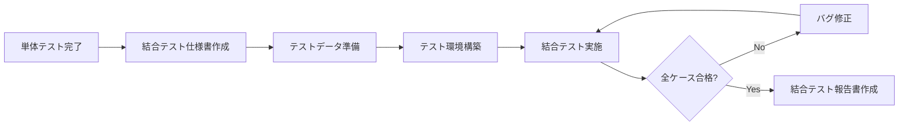
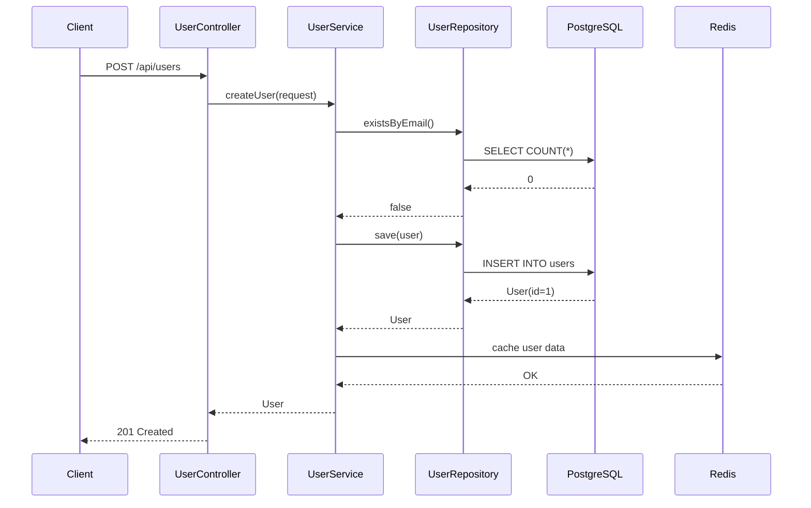
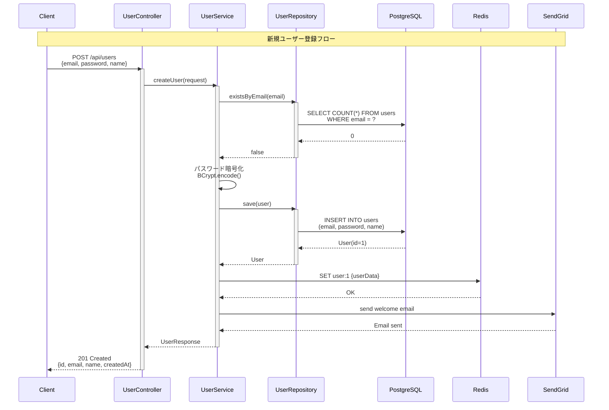
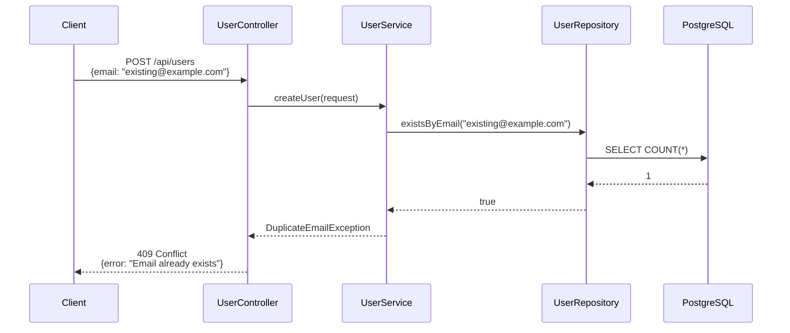

# 結合テスト仕様書 - ユーザー管理機能

## 📋 1. 基本情報

| 項目 | 内容 |
|------|------|
| **ドキュメントID** | IT-USER-001 |
| **対象機能** | ユーザー管理機能（会員登録、認証、プロフィール管理） |
| **テスト対象範囲** | Controller ↔ Service ↔ Repository ↔ Database |
| **作成日** | 2024-03-20 |
| **作成者** | QAチーム |
| **バージョン** | 1.0 |
| **テストフェーズ** | 結合テスト（Integration Test） |

### テスト対象コンポーネント
- **Controller層**: UserController, AuthController
- **Service層**: UserService, AuthService
- **Repository層**: UserRepository
- **Database**: PostgreSQL（usersテーブル）
- **外部連携**: Redis（セッション管理）、SendGrid（メール送信）

---

## ⏰ 2. 作成タイミング

### 作成フェーズ
**単体テスト完了後 → 結合テスト実施前**



### 実施条件
- ✅ 単体テストが全て合格（カバレッジ80%以上）
- ✅ テスト環境にDB、Redis、メールサーバーが準備済み
- ✅ テストデータ投入スクリプトが用意されている
- ✅ API仕様書が最新版に更新されている

---

## 📂 3. ドキュメント構成

### 必須セクション

```
1. 基本情報
   ├─ テスト対象機能の明確化
   └─ テスト範囲の定義

2. テスト環境
   ├─ インフラ構成（DB、Redis、メールサーバー）
   ├─ 使用ツール（JUnit、TestContainers、REST Assured）
   └─ テストデータ準備方法

3. テストシナリオ
   ├─ 正常系シナリオ（ハッピーパス）
   ├─ 異常系シナリオ（エラーハンドリング）
   └─ 境界値シナリオ

4. テストケース一覧
   ├─ ケースID、テスト観点、入力、期待結果
   └─ 優先度（High/Medium/Low）

5. データフロー図
   └─ コンポーネント間のデータ受け渡し

6. テスト実施計画
   ├─ 実施スケジュール
   └─ 担当者アサイン
```

---

## 📏 4. 記載ルール

### 4.1 結合テストの観点

#### ✅ DO（推奨）
```markdown
✓ コンポーネント間のインターフェースを検証
✓ トランザクション境界の動作を確認
✓ 実際のDBを使用したデータ永続化テスト
✓ 外部サービス（Redis、メール）との連携確認
✓ エンドツーエンドのデータフロー検証
✓ エラー時のロールバック動作確認
✓ REST APIの実際のHTTPリクエスト/レスポンス検証
```

#### ❌ DON'T（非推奨）
```markdown
✗ 単体テストレベルの細かいロジック検証
✗ モックを多用した擬似的なテスト
✗ UIレベルのE2Eテスト（システムテストで実施）
✗ 性能テスト（負荷テストで実施）
✗ セキュリティ脆弱性診断（専門ツールで実施）
```

### 4.2 テストケース記載フォーマット

```markdown
### IT-XXX: テストケース名

**優先度**: [High / Medium / Low]

**テスト観点**: 何を検証するか（コンポーネント間連携の視点）

**前提条件**:
- DBテーブルの初期状態
- Redisのキャッシュ状態
- 外部サービスのモック設定

**テスト手順**:
1. HTTPリクエスト送信
2. Controllerでのリクエスト受信
3. Serviceでのビジネスロジック実行
4. Repositoryでのデータ永続化
5. HTTPレスポンス返却

**入力データ**:
- リクエストボディ（JSON）
- リクエストヘッダー

**期待結果**:
- HTTPステータスコード
- レスポンスボディ（JSON）
- DB登録内容
- Redisキャッシュ内容
- メール送信履歴

**実行時間目標**: 500ms以内
```

### 4.3 データフロー図の記載



---

## 🎯 5. 品質基準

### 5.1 合格基準

| 基準項目 | 目標値 | 測定方法 |
|---------|--------|---------|
| **テストケース合格率** | 100% | 全ケース成功 |
| **カバレッジ** | API 90%以上 | REST Assuredで全エンドポイント実行 |
| **レスポンスタイム** | 95%が500ms以内 | テスト実行ログから測定 |
| **データ整合性** | 100% | DB確認クエリで検証 |
| **バグ検出率** | Critical: 0件 | バグ管理表で追跡 |

### 5.2 実施チェックリスト

```markdown
✅ 正常系
  - 主要なビジネスフローが正常に完了する
  - データがDB/Redisに正しく保存される
  - 適切なHTTPステータスコードが返却される

✅ 異常系
  - バリデーションエラーが適切にハンドリングされる
  - DB制約違反時にエラーレスポンスが返る
  - トランザクションロールバックが正常に動作する

✅ 境界値
  - 最大文字数でのデータ登録が成功する
  - 最小値でのバリデーションが機能する

✅ 外部連携
  - Redis接続失敗時のフォールバック動作
  - メール送信失敗時のリトライ処理

✅ 同時実行
  - 同時リクエストでのデータ競合がない
  - トランザクション分離レベルが適切
```

---

## 🤖 6. AI生成時の指示プロンプト

### 基本プロンプト

```
「ユーザー管理機能の結合テスト仕様書を作成してください。

【必須条件】
- Controller、Service、Repository、DBの全層を通したテスト
- Spring Boot TestでのHTTPリクエスト/レスポンス検証
- 実際のPostgreSQLを使用（TestContainers活用）
- Redisセッション管理の連携テスト
- REST Assuredによるエンドポイントテスト

【テストシナリオ】
1. ユーザー新規登録（POST /api/users）
2. メールアドレス重複チェック
3. ユーザー認証（POST /api/auth/login）
4. プロフィール更新（PUT /api/users/{id}）

【出力形式】
- テストケース一覧（優先度付き）
- データフロー図（Mermaid sequenceDiagram）
- REST Assuredテストコード実装例
- TestContainersによるDB/Redis準備コード
」
```

---

## 🔗 7. 関連ドキュメント

### 参照する設計ドキュメント
- [API設計書](sample_03_インターフェース設計書.md) - エンドポイント仕様
- [DB設計書](sample_03_データベース設計書.md) - テーブル定義
- [詳細設計書](sample_04_詳細設計書_UserService.md) - ビジネスロジック
- [単体テスト仕様書](sample_04_単体テスト仕様書_UserService.md) - 前提テスト

### 後続ドキュメント
- [結合テスト報告書](sample_06_結合テスト報告書.md) - テスト結果記録
- [システムテスト仕様書](sample_06_システムテスト仕様書.md) - E2Eテスト

---

## 📊 8. テストシナリオ

### シナリオ1: ユーザー新規登録フロー（正常系）



**検証ポイント**:
1. HTTPステータス: 201 Created
2. レスポンスにユーザーIDが含まれる
3. DBにユーザーが登録されている（SELECT確認）
4. パスワードがBCrypt形式で暗号化されている
5. Redisにキャッシュが保存されている（GET user:1）
6. ウェルカムメールが送信されている

---

### シナリオ2: メールアドレス重複登録（異常系）



**検証ポイント**:
1. HTTPステータス: 409 Conflict
2. エラーメッセージが適切
3. DBに重複データが登録されていない
4. トランザクションがロールバックされている

---

## 📋 9. テストケース一覧

### 9.1 ユーザー新規登録API（POST /api/users）

#### IT-001: 有効なデータでユーザー登録成功

**優先度**: High

**テスト観点**: Controller → Service → Repository → DBの全層連携

**前提条件**:
- DB usersテーブルが空
- Redis接続可能
- SendGridモック設定済み

**テスト手順**:
```http
POST /api/users HTTP/1.1
Content-Type: application/json

{
  "email": "newuser@example.com",
  "password": "SecurePass123!",
  "name": "山田太郎",
  "phoneNumber": "090-1234-5678"
}
```

**期待結果**:
```http
HTTP/1.1 201 Created
Content-Type: application/json

{
  "id": 1,
  "email": "newuser@example.com",
  "name": "山田太郎",
  "phoneNumber": "090-1234-5678",
  "createdAt": "2024-03-20T10:30:00"
}
```

**DB検証クエリ**:
```sql
SELECT id, email, name, password, created_at 
FROM users 
WHERE email = 'newuser@example.com';
-- 期待: 1行、passwordは$2a$10$で始まる
```

**Redis検証**:
```bash
REDIS> GET user:1
# 期待: ユーザー情報JSON
```

**実行時間目標**: 300ms以内

---

#### IT-002: メールアドレス重複で409エラー

**優先度**: High

**テスト観点**: DB一意制約とビジネスロジックの連携

**前提条件**:
```sql
INSERT INTO users (email, password, name) 
VALUES ('existing@example.com', '$2a$10$hash', '既存ユーザー');
```

**テスト手順**:
```http
POST /api/users HTTP/1.1
Content-Type: application/json

{
  "email": "existing@example.com",
  "password": "AnyPassword123!",
  "name": "新規ユーザー"
}
```

**期待結果**:
```http
HTTP/1.1 409 Conflict
Content-Type: application/json

{
  "error": "DuplicateEmailException",
  "message": "このメールアドレスは既に使用されています: existing@example.com",
  "timestamp": "2024-03-20T10:35:00"
}
```

**DB検証**:
```sql
SELECT COUNT(*) FROM users WHERE email = 'existing@example.com';
-- 期待: 1（新規登録されていない）
```

---

#### IT-003: バリデーションエラー（パスワード不足）

**優先度**: Medium

**テスト手順**:
```http
POST /api/users HTTP/1.1
Content-Type: application/json

{
  "email": "test@example.com",
  "password": "short",
  "name": "テストユーザー"
}
```

**期待結果**:
```http
HTTP/1.1 400 Bad Request
Content-Type: application/json

{
  "error": "ValidationException",
  "message": "パスワードは8文字以上である必要があります",
  "field": "password"
}
```

---

### 9.2 ユーザー認証API（POST /api/auth/login）

#### IT-004: 正しい認証情報でログイン成功

**優先度**: High

**テスト観点**: Service層での認証処理とJWT生成

**前提条件**:
```sql
INSERT INTO users (email, password, name) 
VALUES ('user@example.com', '$2a$10$xCc9aMz...', 'ログインユーザー');
```

**テスト手順**:
```http
POST /api/auth/login HTTP/1.1
Content-Type: application/json

{
  "email": "user@example.com",
  "password": "CorrectPassword123!"
}
```

**期待結果**:
```http
HTTP/1.1 200 OK
Content-Type: application/json

{
  "token": "eyJhbGciOiJIUzI1NiIsInR5cCI6IkpXVCJ9...",
  "userId": 1,
  "expiresAt": "2024-03-21T10:30:00"
}
```

**Redis検証**:
```bash
REDIS> GET session:eyJhbGci...
# 期待: セッション情報
```

**JWT検証**:
- ヘッダー: alg=HS256
- ペイロード: userId=1, exp=未来の日時
- 署名: 検証成功

---

#### IT-005: パスワード不一致で401エラー

**優先度**: High

**テスト手順**:
```http
POST /api/auth/login HTTP/1.1
Content-Type: application/json

{
  "email": "user@example.com",
  "password": "WrongPassword"
}
```

**期待結果**:
```http
HTTP/1.1 401 Unauthorized
Content-Type: application/json

{
  "error": "AuthenticationException",
  "message": "メールアドレスまたはパスワードが正しくありません"
}
```

**Redis検証**:
```bash
REDIS> KEYS session:*
# 期待: セッションが作成されていない
```

---

### 9.3 プロフィール更新API（PUT /api/users/{id}）

#### IT-006: プロフィール更新成功

**優先度**: Medium

**テスト観点**: 認証トークン検証とデータ更新の連携

**前提条件**:
```sql
INSERT INTO users (id, email, password, name, phone_number) 
VALUES (1, 'user@example.com', '$2a$10$hash', '旧名前', '090-0000-0000');
```

**テスト手順**:
```http
PUT /api/users/1 HTTP/1.1
Authorization: Bearer eyJhbGci...
Content-Type: application/json

{
  "name": "新名前",
  "phoneNumber": "080-1111-2222",
  "address": "東京都渋谷区1-2-3"
}
```

**期待結果**:
```http
HTTP/1.1 200 OK
Content-Type: application/json

{
  "id": 1,
  "name": "新名前",
  "phoneNumber": "080-1111-2222",
  "address": "東京都渋谷区1-2-3",
  "updatedAt": "2024-03-20T11:00:00"
}
```

**DB検証**:
```sql
SELECT name, phone_number, address, updated_at 
FROM users WHERE id = 1;
-- 期待: 更新された値、updated_atが最新
```

**Redis検証**:
```bash
REDIS> GET user:1
# 期待: キャッシュが更新されている
```

---

#### IT-007: 認証トークンなしで401エラー

**優先度**: High

**テスト手順**:
```http
PUT /api/users/1 HTTP/1.1
Content-Type: application/json

{
  "name": "新名前"
}
```

**期待結果**:
```http
HTTP/1.1 401 Unauthorized
Content-Type: application/json

{
  "error": "UnauthorizedException",
  "message": "認証トークンが必要です"
}
```

---

## 💻 10. テストコード実装例

### 10.1 テスト環境セットアップ（TestContainers）

```java
package com.example.ecommerce.integration;

import io.restassured.RestAssured;
import org.junit.jupiter.api.BeforeEach;
import org.springframework.boot.test.context.SpringBootTest;
import org.springframework.boot.test.web.server.LocalServerPort;
import org.springframework.test.context.DynamicPropertyRegistry;
import org.springframework.test.context.DynamicPropertySource;
import org.testcontainers.containers.PostgreSQLContainer;
import org.testcontainers.containers.GenericContainer;
import org.testcontainers.junit.jupiter.Container;
import org.testcontainers.junit.jupiter.Testcontainers;

@SpringBootTest(webEnvironment = SpringBootTest.WebEnvironment.RANDOM_PORT)
@Testcontainers
public abstract class IntegrationTestBase {

    @LocalServerPort
    private int port;

    @Container
    static PostgreSQLContainer<?> postgres = new PostgreSQLContainer<>("postgres:15")
            .withDatabaseName("testdb")
            .withUsername("testuser")
            .withPassword("testpass");

    @Container
    static GenericContainer<?> redis = new GenericContainer<>("redis:7-alpine")
            .withExposedPorts(6379);

    @DynamicPropertySource
    static void configureProperties(DynamicPropertyRegistry registry) {
        registry.add("spring.datasource.url", postgres::getJdbcUrl);
        registry.add("spring.datasource.username", postgres::getUsername);
        registry.add("spring.datasource.password", postgres::getPassword);
        registry.add("spring.redis.host", redis::getHost);
        registry.add("spring.redis.port", () -> redis.getMappedPort(6379));
    }

    @BeforeEach
    void setUp() {
        RestAssured.port = port;
        RestAssured.basePath = "/api";
    }
}
```

### 10.2 ユーザー登録テスト（REST Assured）

```java
package com.example.ecommerce.integration;

import io.restassured.http.ContentType;
import org.junit.jupiter.api.Test;
import org.springframework.beans.factory.annotation.Autowired;
import org.springframework.jdbc.core.JdbcTemplate;

import static io.restassured.RestAssured.given;
import static org.assertj.core.api.Assertions.assertThat;
import static org.hamcrest.Matchers.*;

class UserIntegrationTest extends IntegrationTestBase {

    @Autowired
    private JdbcTemplate jdbcTemplate;

    @Test
    void IT_001_有効なデータでユーザー登録成功() {
        // Given
        String requestBody = """
            {
              "email": "newuser@example.com",
              "password": "SecurePass123!",
              "name": "山田太郎",
              "phoneNumber": "090-1234-5678"
            }
            """;

        // When
        var response = given()
                .contentType(ContentType.JSON)
                .body(requestBody)
            .when()
                .post("/users")
            .then()
                .statusCode(201)
                .body("email", equalTo("newuser@example.com"))
                .body("name", equalTo("山田太郎"))
                .body("id", notNullValue())
                .body("createdAt", notNullValue())
                .extract().response();

        Long userId = response.jsonPath().getLong("id");

        // Then - DB検証
        Integer count = jdbcTemplate.queryForObject(
                "SELECT COUNT(*) FROM users WHERE email = ?",
                Integer.class,
                "newuser@example.com"
        );
        assertThat(count).isEqualTo(1);

        String storedPassword = jdbcTemplate.queryForObject(
                "SELECT password FROM users WHERE id = ?",
                String.class,
                userId
        );
        assertThat(storedPassword).startsWith("$2a$10$"); // BCrypt形式
    }

    @Test
    void IT_002_メールアドレス重複で409エラー() {
        // Given - 既存ユーザーを登録
        jdbcTemplate.update(
                "INSERT INTO users (email, password, name) VALUES (?, ?, ?)",
                "existing@example.com", "$2a$10$hash", "既存ユーザー"
        );

        String requestBody = """
            {
              "email": "existing@example.com",
              "password": "AnyPassword123!",
              "name": "新規ユーザー"
            }
            """;

        // When & Then
        given()
                .contentType(ContentType.JSON)
                .body(requestBody)
            .when()
                .post("/users")
            .then()
                .statusCode(409)
                .body("error", equalTo("DuplicateEmailException"))
                .body("message", containsString("このメールアドレスは既に使用されています"));

        // DB検証 - 重複登録されていない
        Integer count = jdbcTemplate.queryForObject(
                "SELECT COUNT(*) FROM users WHERE email = ?",
                Integer.class,
                "existing@example.com"
        );
        assertThat(count).isEqualTo(1); // 既存の1件のみ
    }

    @Test
    void IT_004_正しい認証情報でログイン成功() {
        // Given - テストユーザー作成（実際のBCryptハッシュ）
        String hashedPassword = "$2a$10$N9qo8uLOickgx2ZMRZoMyeIjZAgcfl7p92ldGxad68LJZdL17lhWy"; // "CorrectPassword123!"
        jdbcTemplate.update(
                "INSERT INTO users (email, password, name) VALUES (?, ?, ?)",
                "user@example.com", hashedPassword, "ログインユーザー"
        );

        String loginRequest = """
            {
              "email": "user@example.com",
              "password": "CorrectPassword123!"
            }
            """;

        // When & Then
        given()
                .contentType(ContentType.JSON)
                .body(loginRequest)
            .when()
                .post("/auth/login")
            .then()
                .statusCode(200)
                .body("token", notNullValue())
                .body("userId", greaterThan(0))
                .body("expiresAt", notNullValue());
    }

    @Test
    void IT_005_パスワード不一致で401エラー() {
        // Given
        jdbcTemplate.update(
                "INSERT INTO users (email, password, name) VALUES (?, ?, ?)",
                "user@example.com", "$2a$10$hash", "ユーザー"
        );

        String loginRequest = """
            {
              "email": "user@example.com",
              "password": "WrongPassword"
            }
            """;

        // When & Then
        given()
                .contentType(ContentType.JSON)
                .body(loginRequest)
            .when()
                .post("/auth/login")
            .then()
                .statusCode(401)
                .body("error", equalTo("AuthenticationException"));
    }
}
```

---

## 🗓️ 11. テスト実施計画

### 実施スケジュール

| フェーズ | 期間 | 担当者 | 内容 |
|---------|------|--------|------|
| **環境準備** | Day 1 | インフラチーム | TestContainers設定、DB/Redis準備 |
| **テストデータ作成** | Day 1-2 | QAチーム | SQLスクリプト作成、投入 |
| **テスト実施** | Day 3-5 | QAチーム | 全ケース実行、バグ記録 |
| **バグ修正** | Day 6-7 | 開発チーム | Critical/High優先で修正 |
| **リグレッション** | Day 8 | QAチーム | 修正後の再テスト |
| **報告書作成** | Day 9 | QAリーダー | テスト結果まとめ |

### 担当者アサイン

- **QAリーダー**: 田中（全体統括、報告書作成）
- **QAエンジニア1**: 佐藤（IT-001〜IT-003実施）
- **QAエンジニア2**: 鈴木（IT-004〜IT-007実施）
- **開発サポート**: 山田（環境構築、バグ修正）

---

## ❌ 12. よくある失敗例

### 失敗例1: モックを多用しすぎて実際の連携を検証できていない

```java
// ❌ 悪い例（結合テストなのにモックだらけ）
@MockBean
private UserRepository userRepository;

@MockBean
private RedisTemplate redisTemplate;

@Test
void testCreateUser() {
    when(userRepository.save(any())).thenReturn(mockUser);
    // 実際のDBに保存されていない
}
```

```java
// ✅ 良い例（実際のDB/Redisを使用）
@Autowired
private UserRepository userRepository; // 実Repository

@Test
void IT_001_ユーザー登録成功() {
    // REST Assuredで実際のHTTPリクエスト
    given().body(request).post("/users");
    
    // 実際のDBを確認
    User savedUser = userRepository.findByEmail("test@example.com").orElseThrow();
    assertThat(savedUser).isNotNull();
}
```

### 失敗例2: テストケース間でデータが汚染される

```java
// ❌ 悪い例（前のテストの影響を受ける）
@Test
void test1() {
    jdbcTemplate.update("INSERT INTO users ...");
    // 削除しない
}

@Test
void test2() {
    // test1のデータが残っているため失敗
}
```

```java
// ✅ 良い例（各テスト後にクリーンアップ）
@AfterEach
void tearDown() {
    jdbcTemplate.update("TRUNCATE TABLE users CASCADE");
}
```

---

## 📝 まとめ

この結合テスト仕様書には以下が含まれます：

✅ **7個のテストケース**（API連携テスト）  
✅ **TestContainers**による実DB/Redis環境構築  
✅ **REST Assured**によるHTTPリクエスト/レスポンス検証  
✅ **データフロー図**（Mermaid sequenceDiagram）  
✅ **DB検証クエリ**による永続化確認  
✅ **実施計画**とアサイン情報

単体テストとの違いを意識し、**コンポーネント間の連携**を重点的に検証します。
