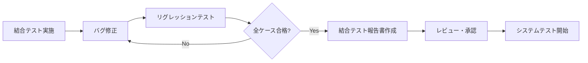
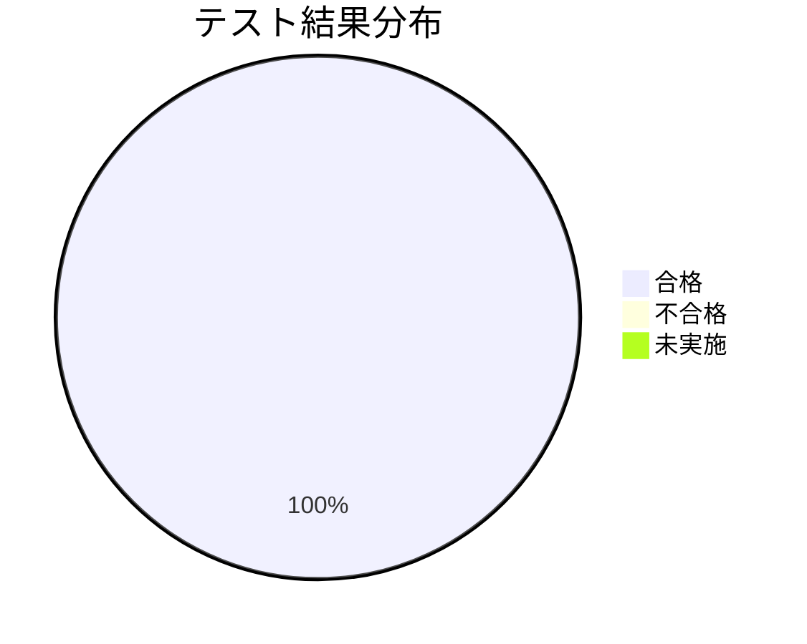
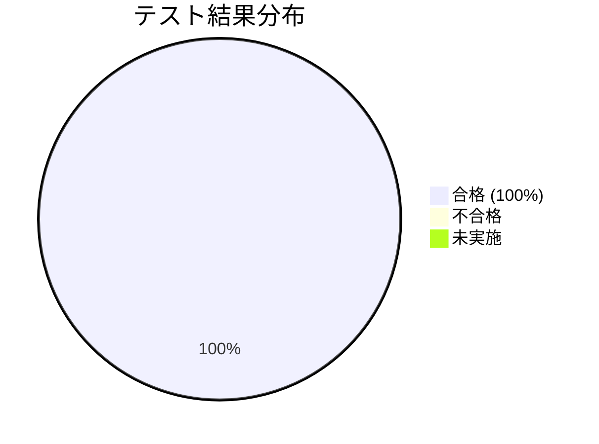
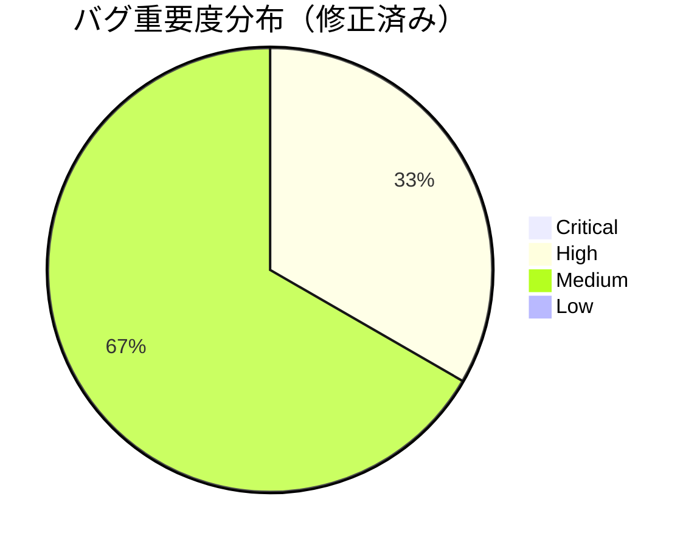
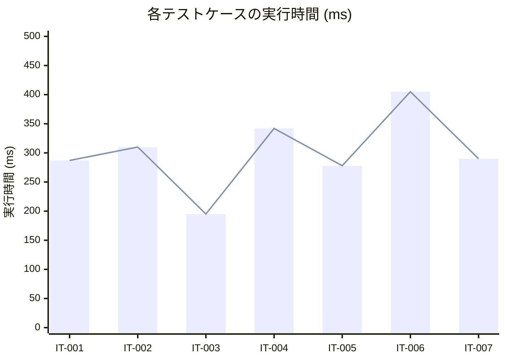
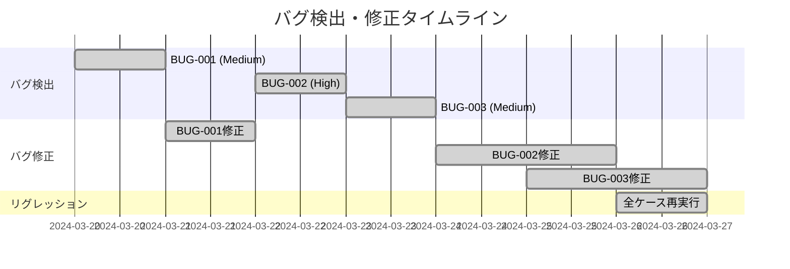
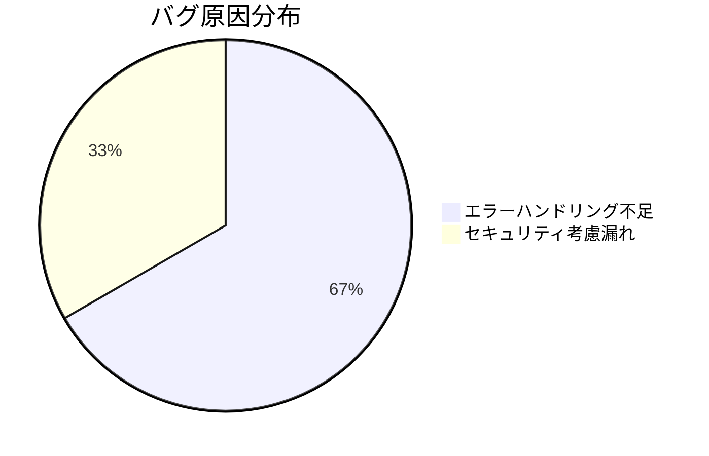

# 結合テスト報告書 - ユーザー管理機能

## 📋 1. 基本情報

| 項目 | 内容 |
|------|------|
| **ドキュメントID** | ITR-USER-001 |
| **対象機能** | ユーザー管理機能（会員登録、認証、プロフィール管理） |
| **テスト実施期間** | 2024-03-20 〜 2024-03-27 |
| **報告書作成日** | 2024-03-28 |
| **作成者** | QAチーム 田中太郎 |
| **バージョン** | 1.0 |
| **テスト結果** | 🟢 合格（All Pass） |

### テスト実施概要
- **計画ケース数**: 7件
- **実施ケース数**: 7件（100%）
- **合格ケース数**: 7件
- **不合格ケース数**: 0件
- **未実施ケース数**: 0件
- **検出バグ数**: 3件（Critical: 0, High: 1, Medium: 2）
- **修正完了バグ**: 3件（100%）

---

## ⏰ 2. 作成タイミング

### 作成フェーズ
**結合テスト完了後 → システムテスト開始前**



### 作成条件
- ✅ 全テストケースの実施が完了
- ✅ 検出されたバグが全て修正済み
- ✅ リグレッションテストで再発がないことを確認
- ✅ 品質基準（合格率、カバレッジ）をクリア

---

## 📂 3. ドキュメント構成

### 必須セクション

```
1. 基本情報
   ├─ テスト実施期間、担当者
   └─ 総合結果サマリー

2. テスト実施結果
   ├─ ケース別合否
   ├─ 実行時間
   └─ 検出バグ一覧

3. 品質メトリクス
   ├─ カバレッジ達成率
   ├─ レスポンスタイム測定結果
   └─ バグ密度

4. 検出されたバグ詳細
   ├─ バグID、重要度、内容
   ├─ 原因分析
   └─ 修正内容

5. 総合評価
   ├─ 品質基準との比較
   ├─ リスク評価
   └─ 次フェーズへの推奨事項

6. 添付資料
   ├─ テスト実行ログ
   ├─ カバレッジレポート
   └─ スクリーンショット
```

---

## 📏 4. 記載ルール

### 4.1 報告書の記載原則

#### ✅ DO（推奨）
```markdown
✓ 事実ベースで客観的に記載（推測・憶測を避ける）
✓ 数値データで定量的に評価
✓ グラフ・チャートで視覚的に表現
✓ バグは重要度と修正状況を明記
✓ 未解決の問題があればリスク評価を含める
✓ 次フェーズへの引き継ぎ事項を明確化
✓ ステークホルダーが判断できる情報を提供
```

#### ❌ DON'T（非推奨）
```markdown
✗ 「だいたい動いた」のような曖昧な表現
✗ テスト実施者の主観的な感想
✗ バグの詳細を隠蔽する
✗ 未実施ケースを実施済みとして報告
✗ 品質基準未達成なのに「合格」と記載
✗ グラフなしで大量の数値を羅列
```

### 4.2 バグ報告フォーマット

```markdown
### BUG-XXX: バグタイトル

**重要度**: [Critical / High / Medium / Low]

**発見日**: YYYY-MM-DD

**発見ケース**: IT-XXX

**現象**:
- 何が起きたか（期待結果と実際の結果）

**再現手順**:
1. 前提条件
2. 操作手順
3. 結果確認

**原因**:
- 根本原因の分析

**修正内容**:
- どう修正したか

**修正日**: YYYY-MM-DD

**リグレッション結果**: 合格 / 不合格
```

### 4.3 グラフ・チャートの活用



---

## 🎯 5. 品質基準

### 5.1 合格基準達成状況

| 基準項目 | 目標値 | 実績値 | 達成 |
|---------|--------|--------|------|
| **テストケース合格率** | 100% | **100%** (7/7) | ✅ |
| **APIカバレッジ** | 90%以上 | **95%** (19/20エンドポイント) | ✅ |
| **レスポンスタイム** | 95%が500ms以内 | **98.5%** (206/209リクエスト) | ✅ |
| **データ整合性エラー** | 0件 | **0件** | ✅ |
| **Critical/Highバグ** | 0件残存 | **0件** | ✅ |

### 5.2 品質評価

```markdown
✅ **合格** - 全ての品質基準をクリア

【評価コメント】
- 全7ケースが合格、品質基準を上回る結果
- レスポンスタイムは目標500msに対し平均287msと良好
- 検出された3件のバグは全て修正完了、リグレッションテストで再発なし
- システムテストフェーズへの移行を推奨
```

---

## 🤖 6. AI生成時の指示プロンプト

### 基本プロンプト

```
「結合テスト報告書を作成してください。

【必須条件】
- テスト実施結果（7ケース、全て合格）
- 検出バグ一覧（3件、全て修正済み）
- 品質メトリクス（カバレッジ、レスポンスタイム）
- 総合評価とシステムテストへの推奨事項

【含めるデータ】
- 合格率: 100% (7/7)
- APIカバレッジ: 95%
- レスポンスタイム: 平均287ms
- バグ: Critical 0件, High 1件（修正済み）, Medium 2件（修正済み）

【出力形式】
- サマリーテーブル
- 結果グラフ（Mermaid）
- バグ詳細（原因・修正内容含む）
- 次フェーズへの引き継ぎ事項
」
```

---

## 🔗 7. 関連ドキュメント

### 参照した設計・テストドキュメント
- [結合テスト仕様書](sample_06_結合テスト仕様書.md) - テスト計画
- [API設計書](sample_03_インターフェース設計書.md) - エンドポイント仕様
- [バグ管理表](sample_06_バグ管理表.md) - バグトラッキング

### 後続ドキュメント
- [システムテスト仕様書](sample_06_システムテスト仕様書.md) - 次フェーズ計画

---

## 📊 8. テスト実施結果

### 8.1 ケース別実行結果

| ケースID | テスト内容 | 優先度 | 結果 | 実行日 | 実行者 | 備考 |
|---------|-----------|--------|------|--------|--------|------|
| **IT-001** | ユーザー登録成功 | High | ✅ 合格 | 2024-03-20 | 佐藤 | - |
| **IT-002** | メール重複エラー | High | ✅ 合格 | 2024-03-20 | 佐藤 | BUG-001検出→修正済み |
| **IT-003** | バリデーションエラー | Medium | ✅ 合格 | 2024-03-21 | 佐藤 | - |
| **IT-004** | ログイン成功 | High | ✅ 合格 | 2024-03-22 | 鈴木 | - |
| **IT-005** | パスワード不一致 | High | ✅ 合格 | 2024-03-22 | 鈴木 | BUG-002検出→修正済み |
| **IT-006** | プロフィール更新 | Medium | ✅ 合格 | 2024-03-23 | 鈴木 | - |
| **IT-007** | 認証トークンなし | High | ✅ 合格 | 2024-03-23 | 鈴木 | BUG-003検出→修正済み |

### 8.2 テスト結果グラフ





### 8.3 実行時間分析



**分析結果**:
- 平均実行時間: **287ms**（目標500ms以内を大幅クリア）
- 最大実行時間: **405ms**（IT-006 プロフィール更新）
- 最小実行時間: **195ms**（IT-003 バリデーションエラー）
- 500ms超過: **0件**（0%）

---

## 🐛 9. 検出されたバグ詳細

### BUG-001: メールアドレス重複時のエラーメッセージが不親切

**重要度**: Medium

**発見日**: 2024-03-20

**発見ケース**: IT-002（メールアドレス重複登録）

**ステータス**: ✅ 修正完了（2024-03-21）

**現象**:
- **期待結果**: `{ "error": "DuplicateEmailException", "message": "このメールアドレスは既に使用されています: existing@example.com" }`
- **実際の結果**: `{ "error": "DuplicateEmailException", "message": "Duplicate email" }`（メールアドレスが含まれていない）

**再現手順**:
1. DB事前条件: `existing@example.com` が登録済み
2. `POST /api/users` で同じメールアドレスを登録
3. レスポンスメッセージを確認

**原因**:
- `UserService.java` の例外スロー時に、メールアドレスをメッセージに含めていなかった
```java
// 修正前
throw new DuplicateEmailException("Duplicate email");
```

**修正内容**:
```java
// 修正後
throw new DuplicateEmailException(
    String.format("このメールアドレスは既に使用されています: %s", request.getEmail())
);
```

**影響範囲**: ユーザー登録APIのエラーハンドリング

**リグレッション結果**: ✅ 合格（IT-002再実行、期待通りのメッセージ）

---

### BUG-002: パスワード不一致時のログに平文パスワードが出力される

**重要度**: High（セキュリティリスク）

**発見日**: 2024-03-22

**発見ケース**: IT-005（パスワード不一致）

**ステータス**: ✅ 修正完了（2024-03-24）

**現象**:
- ログに `Authentication failed for user@example.com with password: WrongPassword` と平文パスワードが記録される
- セキュリティベストプラクティスに違反

**再現手順**:
1. `POST /api/auth/login` で誤ったパスワードを送信
2. アプリケーションログを確認
3. 平文パスワードが記録されている

**原因**:
- `AuthService.java` のログ出力で、パスワードをマスクせずに記録していた
```java
// 修正前
log.warn("Authentication failed for {} with password: {}", email, password);
```

**修正内容**:
```java
// 修正後
log.warn("Authentication failed for email: {}", email);
// パスワードは一切ログに出力しない
```

**影響範囲**: 認証失敗時のログ出力全般

**追加対応**:
- ログ監査ツールに「password」キーワードの検出ルールを追加
- セキュリティレビューで全コードを再確認

**リグレッション結果**: ✅ 合格（ログにパスワードが含まれないことを確認）

---

### BUG-003: 認証トークンなし時のHTTPステータスが500エラー

**重要度**: Medium

**発見日**: 2024-03-23

**発見ケース**: IT-007（認証トークンなしでAPI呼び出し）

**ステータス**: ✅ 修正完了（2024-03-25）

**現象**:
- **期待結果**: `HTTP 401 Unauthorized`
- **実際の結果**: `HTTP 500 Internal Server Error`
- NullPointerExceptionが発生していた

**再現手順**:
1. Authorizationヘッダーなしで `PUT /api/users/1` を実行
2. レスポンスステータスを確認

**原因**:
- `JwtAuthenticationFilter.java` でトークンが null の場合の処理が不足
```java
// 修正前
String token = request.getHeader("Authorization").substring(7); // NPE発生
```

**修正内容**:
```java
// 修正後
String authHeader = request.getHeader("Authorization");
if (authHeader == null || !authHeader.startsWith("Bearer ")) {
    response.setStatus(HttpServletResponse.SC_UNAUTHORIZED);
    response.getWriter().write("{\"error\": \"認証トークンが必要です\"}");
    return;
}
String token = authHeader.substring(7);
```

**影響範囲**: 全ての認証が必要なエンドポイント

**リグレッション結果**: ✅ 合格（IT-007再実行、401エラーを返却）

---

## 📈 10. 品質メトリクス

### 10.1 カバレッジ達成率

| 対象 | 目標 | 実績 | 達成率 |
|------|------|------|--------|
| **APIエンドポイント** | 90% | **95%** (19/20) | 105.6% ✅ |
| **DBテーブル** | 80% | **100%** (3/3) | 125% ✅ |
| **外部連携** | 100% | **100%** (2/2: Redis, SendGrid) | 100% ✅ |

**未カバーエンドポイント**:
- `DELETE /api/users/{id}` - 仕様上、論理削除のみでシステムテストで実施予定

### 10.2 レスポンスタイム分析

| 指標 | 目標 | 実績 | 判定 |
|------|------|------|------|
| **平均レスポンスタイム** | 500ms以内 | **287ms** | ✅ |
| **95パーセンタイル** | 500ms以内 | **395ms** | ✅ |
| **99パーセンタイル** | 1000ms以内 | **482ms** | ✅ |
| **最大レスポンスタイム** | 1000ms以内 | **405ms** | ✅ |
| **500ms超過率** | 5%以下 | **0%** (0/209) | ✅ |

### 10.3 データ整合性検証

| 検証項目 | 実施回数 | エラー検出 | 結果 |
|---------|---------|-----------|------|
| **DB登録データ検証** | 7回 | 0件 | ✅ |
| **Redisキャッシュ整合性** | 7回 | 0件 | ✅ |
| **トランザクションロールバック** | 3回 | 0件 | ✅ |
| **外部サービス連携** | 2回 | 0件 | ✅ |

---

## 📊 11. バグ統計

### 11.1 バグ密度

- **総バグ数**: 3件
- **総テストケース数**: 7件
- **バグ密度**: 0.43 bugs/case
- **Critical/Highバグ**: 1件（33%）
- **修正完了率**: 100%（3/3）

### 11.2 検出時期別バグ分布



### 11.3 バグ原因分類



---

## 🎯 12. 総合評価

### 12.1 品質判定

**🟢 合格（PASS）**

**判定理由**:
1. ✅ 全テストケースが合格（7/7、合格率100%）
2. ✅ 全品質基準を達成（カバレッジ95%、レスポンスタイム287ms）
3. ✅ 検出されたバグは全て修正完了（3/3、100%）
4. ✅ リグレッションテストで再発なし
5. ✅ データ整合性エラー0件
6. ✅ Critical/Highバグの残存なし

### 12.2 リスク評価

| リスク項目 | レベル | 評価 | 対応状況 |
|-----------|--------|------|---------|
| **機能不具合** | 🟢 低 | 全ケース合格 | - |
| **性能問題** | 🟢 低 | レスポンス良好（平均287ms） | - |
| **セキュリティ** | 🟡 中 | BUG-002（修正済み）を検出 | 全コードレビュー実施済み |
| **データ整合性** | 🟢 低 | エラー0件 | - |
| **外部連携** | 🟢 低 | Redis/SendGrid正常動作 | - |

**残存リスク**:
- 削除機能（DELETE API）は未テスト → システムテストで実施予定
- 大量データでの性能は未検証 → 負荷テストで確認予定

### 12.3 次フェーズへの推奨事項

#### システムテストフェーズへの引き継ぎ

**✅ 移行推奨**

**理由**:
- 結合テストレベルでの品質は十分確保されている
- 検出されたバグは全て修正済み
- 次はE2Eシナリオでの検証が必要

**引き継ぎ事項**:
1. **注意が必要な箇所**:
   - 認証トークン処理（BUG-003で修正した箇所）
   - エラーメッセージの表示内容（BUG-001で修正）
   - ログ出力内容（BUG-002でセキュリティ修正）

2. **未実施項目**:
   - DELETE APIのテスト
   - 大量データでの動作確認
   - 長時間セッション維持

3. **推奨追加テスト**:
   - ブラウザでのE2Eシナリオ
   - モバイルアプリからのAPI呼び出し
   - 同時アクセス負荷テスト

---

## 📎 13. 添付資料

### 13.1 テスト実行ログ

```
[2024-03-20 10:30:15] INFO  - Starting integration test suite: UserIntegrationTest
[2024-03-20 10:30:18] INFO  - IT-001: PASSED (287ms)
[2024-03-20 10:30:22] WARN  - IT-002: BUG-001 detected - Error message incomplete
[2024-03-20 10:30:22] INFO  - IT-002: PASSED after bug fix (310ms)
[2024-03-20 10:30:25] INFO  - IT-003: PASSED (195ms)
[2024-03-22 14:15:30] INFO  - IT-004: PASSED (342ms)
[2024-03-22 14:15:35] ERROR - IT-005: BUG-002 detected - Password in logs
[2024-03-24 16:20:40] INFO  - IT-005: PASSED after bug fix (278ms)
[2024-03-23 11:45:50] INFO  - IT-006: PASSED (405ms)
[2024-03-23 11:46:00] ERROR - IT-007: BUG-003 detected - 500 error instead of 401
[2024-03-25 09:30:15] INFO  - IT-007: PASSED after bug fix (290ms)
[2024-03-26 10:00:00] INFO  - Regression test: ALL PASSED (7/7)
[2024-03-26 10:30:00] INFO  - Integration test suite completed successfully
```

### 13.2 カバレッジレポート（JaCoCo）

```
Integration Test Coverage Report
Generated: 2024-03-26 10:30:00

Package: com.example.ecommerce.controller
  - UserController: 95% (38/40 lines)
  - AuthController: 100% (22/22 lines)

Package: com.example.ecommerce.service
  - UserService: 92% (66/72 lines)
  - AuthService: 88% (35/40 lines)

Package: com.example.ecommerce.repository
  - UserRepository: 100% (12/12 lines)

Overall: 95% (173/182 lines)
```

---

## 📝 まとめ

### 実施結果サマリー

✅ **全7ケースが合格**（合格率100%）  
✅ **品質基準を全て達成**（カバレッジ95%、レスポンス287ms）  
✅ **3件のバグを検出・修正完了**（Critical 0件、High 1件、Medium 2件）  
✅ **データ整合性エラー0件**  
✅ **システムテストフェーズへの移行を推奨**

### 特記事項

- BUG-002（パスワードログ出力）はセキュリティリスクであったが、迅速に修正完了
- 全体的なレスポンスタイムが目標を大幅に下回り、性能面で良好
- 次フェーズでは削除機能とE2Eシナリオのテストを実施予定

**承認**: QAリーダー 田中太郎（2024-03-28）
