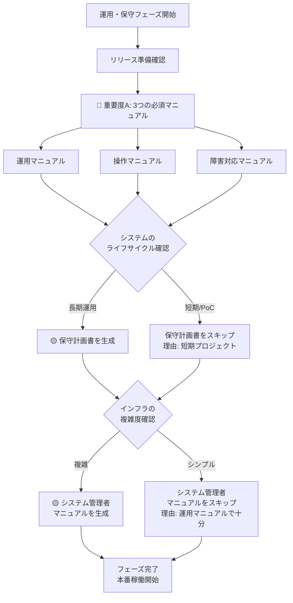

# 07_運用・保守フェーズ - ドキュメント作成ルール

## 📋 フェーズ概要

**目的:** システムの安定運用と継続的な改善

**主要成果物:** 運用マニュアル、操作マニュアル、障害対応マニュアル、保守計画書、システム管理者マニュアル

**前工程:** 06_テストフェーズ  
**次工程:** なし（継続的な運用・保守）

---

## 🎯 成果物の重要度と自動生成ルール

### 🔴 重要度A：生成必須（MANDATORY）- 常に自動生成

| No | 成果物名 | 理由 |
|----|---------|------|
| 1 | **運用マニュアル** | 本番運用に必須 |
| 2 | **操作マニュアル** | エンドユーザー向けに必須 |
| 3 | **障害対応マニュアル** | トラブルシューティングに必須 |

**AI動作:**
```
✅ ユーザーの明示的な指示がなくても自動的に生成する
✅ 該当フェーズに入ったら必ず生成対象として認識する
⚠️  省略する場合は、ユーザーに理由を説明し確認を求める
```

---

### 🟡 重要度B：生成推奨（RECOMMENDED）- デフォルトで自動生成

| No | 成果物名 | 理由 | 省略可能なケース |
|----|---------|------|-----------------|
| 1 | **保守計画書** | 長期運用では重要 | 短期プロジェクト、PoC、実験的システム |
| 2 | **システム管理者マニュアル** | 技術者向け保守ドキュメントとして重要 | 小規模システム、運用マニュアルで代替可能 |

**AI動作:**
```
✅ デフォルトで自動生成する
🔄 システムのライフサイクルや規模に応じて省略判断可能
💬 省略する場合は、その理由をユーザーに説明する
```

**判断基準:**

#### 保守計画書
- **生成すべきケース:**
  - 長期運用が予定されている
  - 定期的なバージョンアップが必要
  - 保守契約がある
  - SLA（サービスレベル合意）がある

- **省略可能なケース:**
  - 短期プロジェクト（1年未満）
  - PoC・実験的システム
  - 保守が最小限で済む単純なシステム

#### システム管理者マニュアル
- **生成すべきケース:**
  - インフラ構成が複雑
  - 複数の管理者が存在
  - デプロイメント手順が複雑
  - データベースメンテナンスが定期的

- **省略可能なケース:**
  - 小規模システム
  - クラウドマネージドサービス中心
  - 運用マニュアルで十分カバー可能

---

### 🟢 重要度C：生成任意（OPTIONAL）

**このフェーズには重要度Cの成果物はありません。**

**理由:** 運用・保守フェーズは、システムを安定稼働させる最終段階であり、すべての成果物が重要度A（必須）またはB（推奨）に分類されています。

---

## 🤖 AI自動生成フロー（運用・保守フェーズ）



---

## 📊 統計情報

### 成果物数サマリー

| 重要度 | 件数 | 割合 | 自動生成 |
|--------|------|------|----------|
| 🔴 A（必須） | 3件 | 60% | ✅ すべて |
| 🟡 B（推奨） | 2件 | 40% | ✅ デフォルト |
| 🟢 C（任意） | 0件 | 0% | - |
| **合計** | **5件** | **100%** | 5件がデフォルト生成 |

### 対象読者別の成果物

| 対象読者 | 成果物 | 重要度 | 目的 |
|---------|--------|--------|------|
| **エンドユーザー** | 操作マニュアル | 🔴 A | システムの使い方を理解 |
| **運用担当者** | 運用マニュアル | 🔴 A | 日常運用の手順を理解 |
| **運用担当者** | 障害対応マニュアル | 🔴 A | トラブル時の対応手順 |
| **保守担当者** | 保守計画書 | 🟡 B | 定期メンテナンスの計画 |
| **システム管理者** | システム管理者マニュアル | 🟡 B | インフラ管理の詳細手順 |

### 作成時間の目安（AI生成）

| 成果物名 | 規模（小） | 規模（中） | 規模（大） |
|---------|-----------|-----------|-----------|
| 運用マニュアル | 2時間 | 5時間 | 12時間 |
| 操作マニュアル | 3時間 | 8時間 | 20時間 |
| 障害対応マニュアル | 2時間 | 4時間 | 8時間 |
| 保守計画書 | 1時間 | 3時間 | 6時間 |
| システム管理者マニュアル | 2時間 | 5時間 | 10時間 |

---

## ⚙️ プロジェクト特性別の推奨構成

### 小規模プロジェクト（1-3人月）

**必須（重要度A）:**
- ✅ 運用マニュアル（簡易版）
- ✅ 操作マニュアル（FAQ形式可）
- ✅ 障害対応マニュアル（よくあるトラブルのみ）

**推奨（重要度B）:**
- 🔄 保守計画書 → 簡易版または省略可
- 🔄 システム管理者マニュアル → 運用マニュアルに統合可

---

### 中規模プロジェクト（4-12人月）

**必須（重要度A）:**
- ✅ すべての重要度A成果物を標準レベルで作成

**推奨（重要度B）:**
- ✅ 保守計画書（標準版）
- ✅ システム管理者マニュアル（標準版）

---

### 大規模プロジェクト（13人月以上）

**必須（重要度A）:**
- ✅ すべての重要度A成果物を詳細レベルで作成

**推奨（重要度B）:**
- ✅ 保守計画書（詳細版 + SLA定義）
- ✅ システム管理者マニュアル（詳細版 + 自動化スクリプト）

---

## 🎨 システム特性別の推奨構成

### クラウドネイティブ・マネージドサービス中心

**簡略化可能:**
- 🔄 システム管理者マニュアル → クラウドサービスのドキュメント参照で可
- 📝 インフラ管理はクラウドプロバイダーに委任

### オンプレミス・複雑なインフラ

**詳細化が必要:**
- ✅ システム管理者マニュアル（必須級）
- ✅ 障害対応マニュアル（詳細版）
- 📝 物理サーバー、ネットワーク管理の詳細手順

### SaaS・エンドユーザー向けサービス

**エンドユーザー重視:**
- ✅ 操作マニュアル（必須級、動画・スクリーンショット豊富）
- ✅ FAQページ、ヘルプセンター
- 📝 ユーザー自己解決を重視

---

## 📚 マニュアル作成のベストプラクティス

### 操作マニュアル

**効果的な構成:**
- ✅ スクリーンショット豊富
- ✅ ステップバイステップ形式
- ✅ FAQ形式も併用
- ✅ 検索しやすい構造

### 障害対応マニュアル

**効果的な構成:**
- ✅ 症状→原因→対処法の3段構成
- ✅ エラーメッセージから引ける索引
- ✅ エスカレーション基準明記
- ✅ ログの見方・取得方法

### 運用マニュアル

**効果的な構成:**
- ✅ 日次・週次・月次の作業チェックリスト
- ✅ バックアップ・リストア手順
- ✅ 監視項目と閾値
- ✅ 定期メンテナンス手順

---

## 🔄 継続的な更新

### マニュアルのライフサイクル管理

**初版作成:**
- 🎯 本番リリース前に完成

**定期更新:**
- 🔄 機能追加時
- 🔄 障害発生・解決時
- 🔄 四半期ごとのレビュー

**バージョン管理:**
- 📝 変更履歴を記録
- 📝 システムバージョンとマニュアルバージョンを紐付け
- 📝 廃止された手順は明確に削除または注記

---

## 🔗 関連ドキュメント

- [ドキュメント作成基本ルール](../00_ドキュメント作成ルール/ドキュメント作成基本ルール.md) - 全体の基本ルール
- [README_成果物重要度定義](../README_成果物重要度定義.md) - 全フェーズの重要度定義
- [06_テストフェーズ](../06_テスト/README.md) - 前工程

---

**最終更新日:** 2025年10月30日  
**バージョン:** 1.0  
**対象:** AI開発アシスタント、運用担当者、保守担当者
