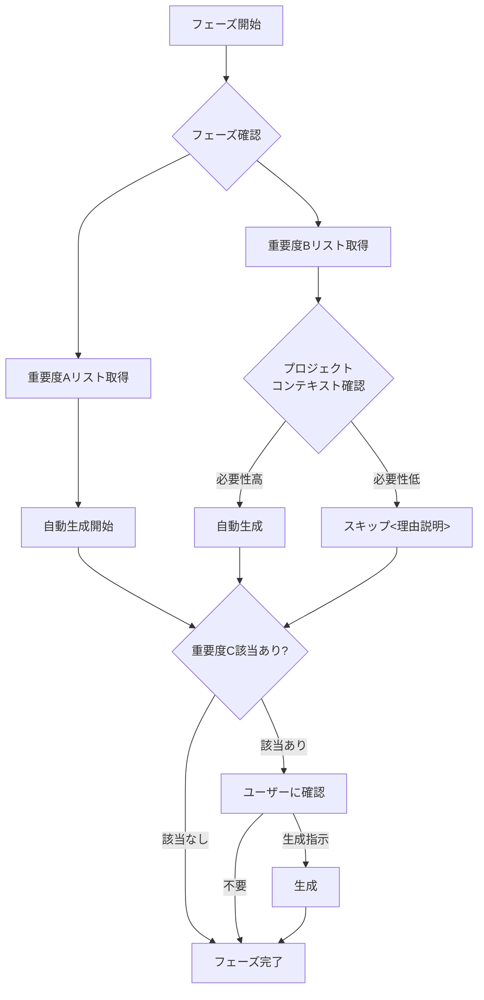

# AI活用システム開発 成果物重要度定義

## 📊 重要度の定義

本プロジェクトにおける成果物は、以下の3段階の重要度に分類されます：

### 🔴 重要度A：生成必須（MANDATORY）
- **定義**: プロジェクトの成功に不可欠な成果物。必ず自動生成される
- **AI動作**: ユーザーの明示的な指示がなくても、該当フェーズで**自動的に生成**
- **省略**: 不可（省略する場合は明示的な除外指示が必要）

### 🟡 重要度B：生成推奨（RECOMMENDED）
- **定義**: プロジェクトの品質向上に有効な成果物。通常は生成すべき
- **AI動作**: デフォルトで**自動生成**されるが、プロジェクト規模や要件によっては省略可能
- **省略**: 可能（ただし理由を明確にすること）

### 🟢 重要度C：生成任意（OPTIONAL）
- **定義**: 特定の状況や要求がある場合のみ必要な成果物
- **AI動作**: **ユーザーからの明示的な指示がない限り生成しない**
- **省略**: 通常は省略（必要な場合のみ明示的に指示）

---

## 📋 各フェーズの成果物重要度一覧

### 01. 企画・要求定義フェーズ

| 成果物名 | 重要度 | 自動生成 | 理由 |
|---------|--------|----------|------|
| RFP（提案依頼書） | 🟢 C | ❌ 指示時のみ | 発注側が作成する文書。受注側のAI開発では通常不要 |
| 提案書 | 🟡 B | ✅ 自動生成 | 受注活動で重要だが、社内開発では不要な場合あり |
| 見積書 | 🟡 B | ✅ 自動生成 | プロジェクト計画に必要だが、PoC段階では省略可 |

### 02. 要件定義フェーズ

| 成果物名 | 重要度 | 自動生成 | 理由 |
|---------|--------|----------|------|
| 要件定義書 | 🔴 A | ✅ 自動生成 | すべての開発の基礎となる最重要ドキュメント |
| システム概要書 | 🔴 A | ✅ 自動生成 | システム全体像の把握に必須 |
| 業務フロー図 | 🔴 A | ✅ 自動生成 | 業務要件の可視化に不可欠 |
| 機能要件一覧 | 🔴 A | ✅ 自動生成 | 実装すべき機能の網羅的リスト |
| 非機能要件一覧 | 🔴 A | ✅ 自動生成 | 性能・セキュリティ等の品質保証に必須 |
| WBS（作業分解図） | 🟡 B | ✅ 自動生成 | プロジェクト管理に有用だが小規模では簡略化可 |
| 受入テスト計画書 | 🟡 B | ✅ 自動生成 | 初期段階では概要レベルでも可 |

### 03. 基本設計フェーズ

| 成果物名 | 重要度 | 自動生成 | 理由 |
|---------|--------|----------|------|
| システム構成図 | 🔴 A | ✅ 自動生成 | インフラ・アーキテクチャの全体像に必須 |
| アーキテクチャ設計書 | 🔴 A | ✅ 自動生成 | 技術選定と設計方針の根拠として必須 |
| データベース設計書 | 🔴 A | ✅ 自動生成 | データ構造の定義に不可欠 |
| 画面設計書 | 🟡 B | ✅ 自動生成 | UI/UXがあるシステムでは重要。API onlyでは省略可 |
| インターフェース設計書 | 🔴 A | ✅ 自動生成 | API・外部連携の仕様定義に必須 |
| セキュリティ設計書 | 🔴 A | ✅ 自動生成 | セキュリティ要件の実装方針に必須 |
| 帳票設計書 | 🟢 C | ❌ 指示時のみ | 帳票出力が必要なシステムのみ |
| バッチ設計書 | 🟢 C | ❌ 指示時のみ | バッチ処理が必要なシステムのみ |

### 04. 詳細設計フェーズ

| 成果物名 | 重要度 | 自動生成 | 理由 |
|---------|--------|----------|------|
| 詳細設計書 | 🔴 A | ✅ 自動生成 | 実装の直接的な指針となる最重要ドキュメント |
| クラス図 | 🔴 A | ✅ 自動生成 | オブジェクト指向設計の構造定義に必須 |
| シーケンス図 | 🟡 B | ✅ 自動生成 | 複雑な処理フローの理解に有用 |
| 状態遷移図 | 🟢 C | ❌ 指示時のみ | 状態管理が複雑なシステムのみ |
| 物理DB設計書 | 🔴 A | ✅ 自動生成 | インデックス・パーティション等の性能設計に必須 |
| 単体テスト仕様書 | 🔴 A | ✅ 自動生成 | コード品質保証の基礎 |
| モジュール構成図 | 🟢 C | ❌ 指示時のみ | 大規模システムでの依存関係管理用 |
| アクティビティ図 | 🟢 C | ❌ 指示時のみ | 複雑な業務ロジックの可視化用 |
| IPO（処理機能記述） | 🟢 C | ❌ 指示時のみ | 古典的な記法。モダン開発では不要 |

### 05. 実装フェーズ

| 成果物名 | 重要度 | 自動生成 | 理由 |
|---------|--------|----------|------|
| ソースコード | 🔴 A | ✅ 自動生成 | システムの実体。必ず生成 |
| コーディング規約 | 🔴 A | ✅ 自動生成 | コード品質の統一に必須 |
| プログラム仕様書 | 🟢 C | ❌ 指示時のみ | 詳細設計書で代替可能な場合が多い |
| 開発環境構築手順書 | 🟡 B | ✅ 自動生成 | チーム開発では重要。個人開発では不要 |

### 06. テストフェーズ

| 成果物名 | 重要度 | 自動生成 | 理由 |
|---------|--------|----------|------|
| 単体テスト報告書 | 🟡 B | ✅ 自動生成 | テスト結果の記録として重要 |
| 結合テスト仕様書 | 🔴 A | ✅ 自動生成 | モジュール間連携の検証に必須 |
| 結合テスト報告書 | 🔴 A | ✅ 自動生成 | 統合品質の証跡として必須 |
| システムテスト仕様書 | 🔴 A | ✅ 自動生成 | E2Eでのシステム動作検証に必須 |
| システムテスト報告書 | 🔴 A | ✅ 自動生成 | リリース判定の根拠として必須 |
| 性能テスト報告書 | 🟡 B | ✅ 自動生成 | 非機能要件の検証として重要 |
| 受入テスト仕様書 | 🔴 A | ✅ 自動生成 | 顧客承認の基準として必須 |
| バグ管理表 | 🔴 A | ✅ 自動生成 | 品質管理・トレーサビリティに必須 |

### 07. 運用・保守フェーズ

| 成果物名 | 重要度 | 自動生成 | 理由 |
|---------|--------|----------|------|
| 運用マニュアル | 🔴 A | ✅ 自動生成 | 本番運用に必須 |
| 操作マニュアル | 🔴 A | ✅ 自動生成 | エンドユーザー向けに必須 |
| 障害対応マニュアル | 🔴 A | ✅ 自動生成 | トラブルシューティングに必須 |
| 保守計画書 | 🟡 B | ✅ 自動生成 | 長期運用では重要 |
| システム管理者マニュアル | 🟡 B | ✅ 自動生成 | 技術者向け保守ドキュメントとして重要 |

---

## 📊 統計サマリー

### 重要度別の成果物数

| 重要度 | 件数 | 割合 | 自動生成 |
|--------|------|------|----------|
| 🔴 A（必須） | 28件 | 54% | ✅ すべて自動生成 |
| 🟡 B（推奨） | 14件 | 27% | ✅ すべて自動生成 |
| 🟢 C（任意） | 10件 | 19% | ❌ 指示時のみ生成 |
| **合計** | **52件** | **100%** | 42件が自動生成対象 |

### フェーズ別の自動生成率

| フェーズ | 全成果物 | 自動生成 | 生成率 |
|---------|---------|----------|--------|
| 01. 企画・要求定義 | 3件 | 2件 | 67% |
| 02. 要件定義 | 7件 | 7件 | 100% |
| 03. 基本設計 | 8件 | 6件 | 75% |
| 04. 詳細設計 | 9件 | 5件 | 56% |
| 05. 実装 | 4件 | 3件 | 75% |
| 06. テスト | 8件 | 8件 | 100% |
| 07. 運用・保守 | 5件 | 5件 | 100% |

---

## 🤖 AIへの指示ルール

### 自動生成の原則

1. **重要度A（必須）の成果物**
   - ✅ **常に自動生成する**
   - ユーザーからの明示的な指示がなくても生成
   - 省略する場合は、ユーザーに確認を求める

2. **重要度B（推奨）の成果物**
   - ✅ **デフォルトで自動生成する**
   - プロジェクトの特性に応じて省略判断可能
   - 省略理由をユーザーに説明すること

3. **重要度C（任意）の成果物**
   - ❌ **ユーザーの明示的な指示がない限り生成しない**
   - 該当する成果物が必要な可能性がある場合、ユーザーに確認を促す
   - 例：「このシステムではバッチ処理が必要でしょうか？必要な場合はバッチ設計書を作成します」

### 生成タイミング

### プロジェクト特性による判断例

#### 小規模プロジェクト（1-3人月）
- **省略検討対象（重要度B）**:
  - WBS → スプレッドシートで代替可
  - シーケンス図 → コードコメントで代替可
  - 性能テスト報告書 → 簡易版で可

#### API専用システム
- **省略検討対象（重要度B）**:
  - 画面設計書 → UIがないため不要

#### バッチ処理なしシステム
- **生成不要（重要度C）**:
  - バッチ設計書 → 該当機能なし

---

## 🔄 更新履歴

| 日付 | バージョン | 更新内容 |
|------|-----------|---------|
| 2025-10-30 | 1.0.0 | 初版作成。全52成果物の重要度定義完了 |

---

## 📚 関連ドキュメント

- [ドキュメント作成基本ルール](00_ドキュメント作成ルール/ドキュメント作成基本ルール.md)
- [成果物一覧サマリー](成果物一覧サマリー.md)
- [AI活用システム開発_成果物設計書ガイド](AI活用システム開発_成果物設計書ガイド.html)

---

**作成日**: 2025年10月30日  
**形式**: Markdown  
**対象**: AI開発アシスタント、プロジェクトマネージャー  
**目的**: 成果物生成の自動化判断基準の明確化
