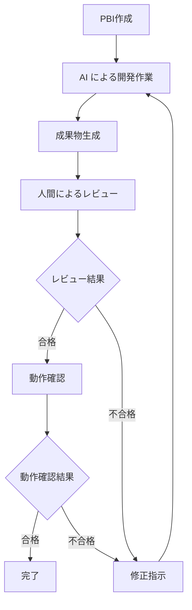

> **注意**: 本文書はDevin AI（2025年時点の性能）を前提としています。成功率15%、典型的な作業時間15-30分という実測データに基づいた現実的な時間配分を提示しています。

# 自律的AI活用システム開発におけるPBI粒度設計指針

## 1. はじめに

本文書では、自律的AIエージェント「Devin」を活用したシステム開発において最適なPBI（Product Backlog Item）の粒度について検討します。

### 開発体制の前提

- **基本開発作業**: Devin（自律的AIエージェント）が主体的に実行
- **規約・ルール管理**: リポジトリに格納し、Devinが参照可能
- **要件定義**: PBIとして文書化
- **品質管理**: 人間がレビューおよび最終動作確認を実施

## 2. PBI分割における重要な観点

### 2.1 PBI分割の基本原則

PBIを適切な粒度に分割する際は、以下の基本原則を考慮する必要があります：

#### 1. **独立性（Independence）**

- 各PBIは他のPBIと独立して開発・テスト・デプロイ可能であるべき
- 依存関係を最小化し、並列開発を可能にする
- Devin活用においては、1つのPBIが他のPBIの完了を待たずに実行できることが重要

#### 2. **完結性（Completeness）**

- 1つのPBIで意味のある機能を完成させる
- 「半分だけ実装された機能」は避ける
- ユーザーまたはシステムに価値を提供できる単位で分割

#### 3. **テスト可能性（Testability）**

- PBIの受け入れ基準が明確に定義可能
- 完了判定が客観的に可能
- Devinが自動テストを生成・実行できる粒度

#### 4. **価値提供（Value）**

- 各PBIが何らかのビジネス価値またはユーザー価値を提供
- 価値の大きいPBIを優先的に実装可能な粒度設計

#### 5. **適切なサイズ（Right-sizing）**

- 小さすぎる：管理オーバーヘッドが大きい、Devinの利点を活かせない
- 大きすぎる：リスク増大、成功率低下、フィードバックサイクルが長い
- **Devinにとっての最適サイズ：10-30分で完了するタスク**

### 2.2 Devin活用における特有の観点

従来のアジャイル開発と異なり、Devinを活用する場合は以下の特有の観点を考慮する必要があります：

#### 1. **作業時間の最適化**

- **Devinの推奨タスクサイズ：30分以内**（公式推奨）
- **実測最適範囲：10-25分**（高い成功率を維持）
- タスクが短すぎる（5分未満）：オーバーヘッドが相対的に大きい
- タスクが長すぎる（45分超）：性能劣化、成功率低下

#### 2. **タスクの明確性と具体性**

- Devinは曖昧な要件に弱い
- PBIには具体的な受け入れ基準を明記
- 参照コード例やアーキテクチャガイドラインを提供
- 「何を作るか」だけでなく「どう作るか」のガイドも重要

#### 3. **失敗時の影響範囲の制御**

- Devinの成功率は15-25%（TDD時は23%）
- 失敗を前提とした粒度設計が必要
- 1PBIの失敗が他のPBIに波及しない設計
- 手戻りコストを最小化する粒度選択

#### 4. **オーバーヘッドとのバランス**

- Devinの起動・タスク理解・環境セットアップに10-30分
- 極小タスク（案1）では、オーバーヘッドが作業時間を超える可能性
- 適度な粒度（案2、案2.5）でオーバーヘッドを相対的に削減

#### 5. **成功率を考慮した粒度設計**

- **最高成功率の粒度：案2（18-25%）**
- 粒度が大きくなるほど成功率は指数関数的に低下
- プロジェクトの品質要求と成功率のバランスを考慮

### 2.3 フロントエンド・バックエンド分離の判断基準

FE/BE分離は、Devinを活用する上で重要な戦略的判断です。

#### 分離のメリット

1. **並列開発による開発期間短縮**

   - 2つのDevinを並行稼働で実質50%の期間短縮
   - クリティカルパス上の作業を同時進行
2. **責任の明確化**

   - API仕様を境界に、FE/BEの責任を分離
   - レビューの専門性に応じた分担が可能
3. **成功率の向上**

   - タスクの焦点が絞られる（FE: 18-25%, BE: 15-22%）
   - 統合型より2-5%成功率が向上
4. **失敗時の影響範囲縮小**

   - FE側の失敗がBE側に影響しない（その逆も）
   - 片側の成功を活かして開発継続可能

#### 分離すべきケース（必須・推奨）

以下のような機能では、FE/BE分離が強く推奨されます：

1. **トランザクション処理が含まれる機能**

   - 決済処理、注文処理、在庫管理など
   - 理由：BEロジックの独立したテストとデバッグが必須
2. **複雑な状態管理が必要な機能**

   - ショッピングカート、認証状態管理など
   - 理由：FEの状態管理とBEの永続化を分離して開発
3. **外部API連携が含まれる機能**

   - 決済ゲートウェイ、メール送信、SMS送信など
   - 理由：BE側でモックを用いた独立開発が可能
4. **大規模な機能**

   - サブシステムレベル以上の機能
   - 理由：統合型では複雑度が高すぎて成功率が低下

#### 統合型でも可のケース

以下のような場合は、FE+BEを統合した1つのPBIでも問題ありません：

1. **極めて単純な表示機能**

   - 静的コンテンツページ、About画面など
   - APIがGETのみで単純
2. **プロトタイプ開発**

   - 速度重視でエンドツーエンドのデモを作成
   - 後でリファクタリング前提
3. **超小規模な機能**

   - 実装時間が30分未満の単純な機能

### 2.4 粒度選択の判断軸

プロジェクトやチームの状況に応じて、以下の判断軸で最適な粒度を選択します：

#### 1. **プロジェクト特性**

- **規模**：小規模（案2）、中規模（案2-2.5）、大規模（案2中心にハイブリッド）
- **複雑度**：低（案2.5-3）、中（案2）、高（案1-2）
- **品質要求**：厳格（案1-2）、標準（案2-2.5）、緩い（案3）
- **スケジュール制約**：厳しい（案2.5-3、並列開発）、標準（案2）

#### 2. **機能特性**

- **重要度**：極高（案2、FE/BE分離必須）、高（案2-2.5）、中（案2.5-3）、低（案3）
- **リスク**：極高（案2、分離）、高（案2）、中（案2.5）、低（案3）
- **複雑度**：極高（案1-2）、高（案2）、中（案2.5）、低（案3）
- **独立性**：高い（粗粒度可）、低い（細粒度推奨）

#### 3. **チーム状況**

- **Devin活用経験**：初めて（案2）、経験あり（案2-2.5）、熟練（ハイブリッド）
- **管理能力**：低（案3-4）、標準（案2-2.5）、高（案1-2またはハイブリッド）
- **並列開発体制**：可能（FE/BE分離推奨）、不可（統合型）

### 2.5 実践的な分割テクニック

#### 1. **ユーザーストーリーマッピング**

- ユーザーの行動フローに沿ってPBIを分割
- 各ステップを1つのPBI候補とする
- 関連ステップをグルーピング（案2.5）

#### 2. **技術的分割**

- **レイヤー別分割**：FE/BE、UI/ロジック/データ
- **コンポーネント別分割**：再利用可能な単位（案1.5）
- **API単位分割**：RESTful APIのエンドポイント群（案1.5-2）

#### 3. **リスクベース分割**

- 高リスク機能：細かく分割（案2）
- 低リスク機能：粗く分割（案2.5-3）
- 案Dハイブリッド型の適用

#### 4. **段階的詳細化**

- 最初は粗いPBIでバックログ作成
- スプリント開始前に詳細化
- 実装時には適切な粒度に再分割

### 2.6 分割の品質チェックリスト

各PBIが以下の基準を満たしているか確認します：

- [ ] **INVEST原則を満たすか**（Independent, Negotiable, Valuable, Estimable, Small, Testable）
- [ ] **Devinの最適作業時間（10-30分）に収まるか**
- [ ] **受け入れ基準が明確に定義されているか**
- [ ] **自動テストが書けるレベルの具体性があるか**
- [ ] **他のPBIと依存関係が最小化されているか**
- [ ] **失敗時の影響範囲が許容範囲内か**
- [ ] **FE/BE分離が適切に判断されているか**
- [ ] **実装に必要な前提知識・参照情報が揃っているか**

これらの観点を踏まえて、次のセクションでは具体的な粒度設計案を詳細に検討します。

### Devinの性能特性（2025年時点）

- **SWE-bench成功率**: 13.86%（ベンチマーク）/ 約15%（実運用）
- **推奨タスクサイズ**: 30分以内で完了するもの（公式推奨）
- **実測作業時間**:
  - 簡単なタスク（5-15分規模）: Devin 5-15分
  - 中規模タスク（30分-1時間規模）: Devin 15-30分 × 1-2回試行
  - デモページ生成: 43秒～数分（極めて高速）
- **最大作業時間**: 45分/セッション
- **長時間セッションの性能劣化**: 2.5時間（約10 ACU）を超えると性能低下
- **テスト駆動開発時**: 成功率23%に向上
- **時間係数**: 人間と同じタスクをDevinが実行すると1.5-4倍の時間がかかる

## 3. 開発ワークフロー分析

### 標準的なワークフロー

1. **PBI定義**: 要件をPBIとして明文化
2. **AI開発**: 規約に基づく自動実装
3. **成果物生成**: コード、テスト、ドキュメント作成
4. **人間レビュー**: 設計・実装の妥当性確認
5. **動作確認**: 実際の動作検証
6. **完了判定**: 受け入れ基準の充足確認

## 3. PBI粒度設計案

### 案1: 超細粒度アプローチ（人間主導型）

#### 概要

個々の機能の最小単位（メソッドレベル）でPBIを分割

**FE/BE分離**: 暗黙的に分離済み（各メソッド・コンポーネントがFEまたはBEに属する）

#### PBI例（タイトル）

1. **メールアドレス検証メソッドの実装**（`validateEmail`関数）
2. **パスワード強度チェック関数の作成**（強度判定ロジック）
3. **ユーザー登録フォームのバリデーション処理**（クライアント側検証）

#### 粒度レベル

- 1PBI = 1メソッドまたは1画面要素
- 実装時間: 0.5-1.5時間程度
  - Devin作業時間: 5-10分 × 1-2回試行 = 5-20分（純粋な実装時間）
  - Devinオーバーヘッド: 10-20分（タスク理解、環境セットアップ、往復コミュニケーション）
  - 人間作業時間: 20-40分（詳細仕様定義15分 + レビュー・修正指示10-15分 + 最終確認5-10分）
  - **成功率**: 約15%（粒度が小さすぎてDevinの利点を活かせない）
  - **注意**: タスクが小さすぎるため、Devinの起動・理解のオーバーヘッドが相対的に大きい

#### 人間の責任範囲

- 詳細な技術仕様の定義
- 実装方針の決定
- 各PBIの設計レビュー
- 統合時の整合性確認

#### Devinの責任範囲

- 指定された仕様に基づくコード生成
- 単体テストの自動生成と実行
- 基本的な構文チェックとデバッグ
- 失敗時の自律的な再試行（最大45分）

#### メリット

- 品質の均一性が保たれる
- 人間による細かい制御が可能
- 問題発生時の原因特定が容易
- リスクの最小化
- Devinの失敗時の影響範囲が小さい

#### デメリット

- PBI管理コストが膨大（タスク数が極めて多い）
- 開発速度の低下（Devinの起動オーバーヘッドが大きい）
- 人間の作業負荷が高い（頻繁な介入が必要）
- Devinの自律性を活かしきれない（粒度が小さすぎる）
- **低い成功率**: 小さすぎるタスクはDevinに不向き（約15%）

#### 適用場面

- 高い品質要求がある基幹システム
- 規制の厳しい業界のシステム
- 初回のAI活用プロジェクト

---

### 案2: 細粒度アプローチ（バランス重視型）

#### 概要

機能単位でPBIを定義し、適度な人間の介入を維持

**FE/BE分離**: 明示的に分離（各機能をFE版とBE版の2つのPBIに分割）

#### PBI例（タイトル）

1. **【FE】ユーザー登録フォームの実装**（バリデーション、UI/UX含む）
2. **【BE】ユーザー登録APIの実装**（認証、DB保存、メール送信）
3. **【FE】商品一覧・検索画面の実装**（UI、フィルタ、ソート）
4. **【BE】商品検索APIの実装**（検索ロジック、ページネーション）
5. **【FE】ショッピングカート画面の実装**（カートUI、ローカル状態管理）
6. **【BE】カート管理APIの実装**（CRUD、永続化、在庫チェック）

#### 粒度レベル（FE/BE分離型）

- 1PBI = 1機能のフロントエンドまたはバックエンド（単独）
- **個別PBI実装時間**: 1.5-3時間程度（FE版またはBE版）
  - Devin作業時間: 10-25分 × 1-2回試行 = 10-40分（設計、実装、自動テスト）
  - Devinオーバーヘッド: 12-18分（初回セットアップ、コンテキスト理解）
  - 人間作業時間: 1-2時間（要件定義20-40分 + レビュー20-40分 + 動作確認・修正指示20-40分）
  - **成功率**: FE 18-25%, BE 15-22%（**Devinに最適な粒度**）
  - **推奨**: 公式ドキュメントの推奨範囲（30分以内）に合致
- **1機能の合計時間**（FE版+BE版）: 3-6時間
  - 順次実行の場合: 3-6時間
  - **並列実行の場合**: 1.5-3時間（実質的な開発期間は約50%短縮）

#### 人間の責任範囲

- 機能要件の定義
- アーキテクチャ方針の決定
- 週次での進捗レビュー
- 結合テストの実行

#### Devinの責任範囲

- 詳細設計の作成（ファイル構成、クラス設計）
- 実装およびテストコード生成
- 単体テストの自動実行とデバッグ
- 基本的なリファクタリング
- エラー修正と再実行（自律的）

#### メリット

- 管理コストと品質のバランス
- 人間の専門性を効果的活用
- **Devinに最適な粒度**: 10-25分のタスクに適合
- **並列開発による開発期間短縮**: 実質50%の期間削減
- **高い成功率**: FE 18-25%, BE 15-22%
- 適度なDevin自律性の確保
- 問題の早期発見が可能
- **責任の明確化**: API仕様を境界にFE/BEを分離
- **レビューの効率化**: 専門性に応じた分担可能

#### デメリット

- **PBI数の増加**: FE/BE分離により統合型の約2倍のPBI数
- **分割オーバーヘッド**: 1機能あたりの合計時間は統合型より若干増加（3-6時間 vs 2-5時間）
- レビュー頻度の調整が必要
- 機能間の依存関係管理が複雑（特にFE-BE間のAPI仕様調整）
- 中程度の管理オーバーヘッド
- 複数回の試行が必要な場合あり（失敗時）
- **並列開発の調整コスト**: API仕様の事前合意、統合テストが必要

#### 適用場面

- 一般的な業務システム開発
- 品質と効率の両立が必要な案件
- 中程度の複雑性を持つシステム

---

### 案3: 中粒度アプローチ（効率重視型）

#### 概要

サブシステムレベルでPBIを定義し、AIの自律性を重視

**FE/BE分離**: 統合型と分離型の両方が可能

- **統合型**（基本）: FE+BEを1つのPBIで実装（効率重視）
- **分離型**（オプション）: FE版とBE版を分離（並列開発可能）

#### PBI例（タイトル）

**統合型（FE+BE一体）**:

1. **ユーザー管理サブシステムの実装**（登録、ログイン、プロフィール、認証全般、FE+BE）
2. **商品管理・ブラウジングサブシステムの実装**（一覧、詳細、検索、管理機能、FE+BE）
3. **注文・決済サブシステムの実装**（カート、注文処理、決済連携、履歴、FE+BE）

**分離型（FE/BE分離、並列開発可能）**:

1. **【FE】ユーザー管理サブシステムの実装**（全UI、状態管理、API連携）
2. **【BE】ユーザー管理サブシステムの実装**（全API、認証、DB）
3. **【FE】商品管理・ブラウジングサブシステムの実装**（全UI、検索UI）
4. **【BE】商品管理・ブラウジングサブシステムの実装**（全API、検索ロジック）

#### 粒度レベル

**統合型（FE+BE一体、基本アプローチ）**:

- 1PBI = 1サブシステム（FE+BE含む）
- 実装時間: 1.5-4日程度（12-32時間）
  - Devin作業時間: 30-45分 × 5-15回試行 = 4-15時間（設計、実装、内部テスト、統合）
  - Devinオーバーヘッド: 2-4時間（複数セッション間の引き継ぎ、長時間セッションでの性能劣化）
  - 人間作業時間: 6-13時間（要件定義2-4時間 + マイルストーンレビュー2-4時間 + システムテスト2-5時間）
  - **成功率**: 約10-15%（複雑度増加で成功率低下）
  - **リスク**: 2.5時間以上のセッションで性能劣化の警告

**分離型（FE/BE分離、並列開発オプション）**:

- 1PBI = 1サブシステムのFEまたはBE
- **個別PBI実装時間**: 0.75-2日程度（6-16時間）
  - Devin作業時間: 30-40分 × 3-8回試行 = 2-8時間
  - Devinオーバーヘッド: 1-2時間
  - 人間作業時間: 3-6時間
  - **成功率**: FE 12-18%, BE 10-15%（統合型よりやや向上）
- **1サブシステム合計時間**（FE+BE）: 12-32時間（統合型と同等）
- **並列実行時の実質時間**: 6-16時間（約50%短縮）

#### 人間の責任範囲

- 高レベル要件の定義
- システム全体のアーキテクチャ設計
- マイルストーンでの品質チェック
- システムテストの実行

#### Devinの責任範囲

- サブシステム全体の詳細設計（複数ファイル、モジュール）
- 全実装作業の自律実行
- 内部結合テストの実行とデバッグ
- パフォーマンス最適化
- 長時間の自律的な開発サイクル（最大45分セッションを複数回）

#### メリット

- 高い開発効率（人間の介入最小）
- Devinの自律性を最大活用
- 管理コストの大幅削減（PBI数が少ない）
- 迅速な機能提供が可能
- Devinが長時間自律作業できる
- **分離型の追加メリット**: 並列開発により期間短縮可能（約50%）

#### デメリット

- **品質リスクの増大**: 複雑なタスクで成功率低下（10-15%、分離型でやや改善）
- 問題発生時の影響範囲が大きい（サブシステム全体または半分）
- 人間による細かい制御が困難
- レビューの負荷が高い（大量のコードを一度に確認）
- 失敗時の手戻りコストが大きい（数日分）
- **統合型のデメリット**: FE/BEの依存関係が複雑化、並列開発不可
- **分離型のデメリット**: 統合テストの負荷増加

#### 適用場面

- プロトタイプ開発
- 内部ツール開発
- 時間制約の厳しいプロジェクト

---

### 案4: 粗粒度アプローチ（AI自律型）

#### 概要

システム全体を少数のPBIで管理し、AIに大幅な裁量を委任

**FE/BE分離**: システムレベルで分離済み（フロントエンドシステム、バックエンドシステムが別PBI）

#### PBI例（タイトル）

1. **ECサイト顧客向けシステムの構築**（全フロントエンド機能）
2. **ECサイト管理者システムの構築**（全管理機能、レポート）
3. **バックエンドAPI・インフラ基盤の構築**（全API、DB、認証基盤）

#### 粒度レベル

- 1PBI = 1システムまたは大機能群
- 実装時間: 2-4週間程度（80-160時間）
  - Devin作業時間: 45分 × 40-80回試行 = 30-60時間（全工程の設計・実装・テストを繰り返し）
  - Devinオーバーヘッド: 20-40時間（頻繁なセッション再起動、性能劣化、失敗からの回復）
  - 人間作業時間: 30-60時間（要求仕様定義10-15時間 + 頻繁な軌道修正10-20時間 + 受け入れテスト10-25時間）
  - **成功率**: 約5-10%（超高複雑度で成功率が極めて低い）
  - **重大リスク**: 長時間セッションの性能劣化が頻発、タスクの複雑さでDevinが迷走

#### 人間の責任範囲

- 要求仕様の定義
- システム全体の受け入れテスト
- 月次での進捗確認
- 最終的な品質判定

#### Devinの責任範囲

- システム全体の設計（アーキテクチャ、モジュール構成）
- 全開発工程の自律実行（数週間）
- 自動テストの実装と実行
- 継続的な品質改善とデバッグ
- 極めて長期間の自律開発（人間介入極小）

#### メリット

- 極めて高い開発効率（理論上）
- 最小限の人間リソース（定義と検証のみ）
- Devinの創造性を最大活用
- 迅速な市場投入が可能（成功すれば）

#### デメリット

- **極めて低い成功率**: 5-10%（実用性が疑問）
- 品質の予測困難性（ブラックボックス化）
- **巨大な手戻りリスク**: 失敗時は数週間の作業が無駄
- 人間によるコントロールがほぼ不可能
- レビューが非現実的（数万行のコード）
- **現実的には非推奨**: Devinの現状性能では不向き

#### 適用場面

- 実験的なプロジェクト
- AIの能力検証プロジェクト
- 短期間での概念実証

---

### 案5: 超粗粒度アプローチ（完全AI委任型）

#### 概要

プロダクト全体を単一PBIとして管理し、AIに完全委任

**FE/BE分離**: 分離しない（完全統合型、FE+BE+インフラ全てを含む）

#### PBI例（タイトル）

1. **ECサイトプラットフォーム完全構築**（要件分析からデプロイまで全工程）
2. **マーケットプレイス機能付きECシステムの開発**（複数販売者対応含む）
3. **オムニチャネルEC統合システムの構築**（Web、モバイルアプリ、実店舗連携）

#### 粒度レベル

- 1PBI = 1プロダクト全体
- 実装時間: 2-6ヶ月（320-960時間）※理論値、実際は完了困難
  - Devin作業時間: 45分 × 200-500回試行 = 150-375時間（全工程をDevinが試行）
  - Devinオーバーヘッド: 100-300時間（膨大な失敗、軌道修正、再起動）
  - 人間作業時間: 70-285時間（初期要件10時間 + 継続的な軌道修正・救済60-250時間 + 最終判定不可能）
  - **成功率**: 約1-5%（ほぼ失敗すると考えるべき）
  - **現実**: Devin単独では完了不可能、人間の大量介入が必要になり意味を失う

#### 人間の責任範囲

- 最終的なビジネス要件の提示
- 最終成果物の受け入れ判定
- 運用開始の承認

#### Devinの責任範囲

- 要件分析から運用準備まで全工程（理論上）
- アーキテクチャから実装まで全設計（自律判断）
- 品質保証活動の全実行（テスト、デバッグ）
- 継続的改善の自動実行（数ヶ月間）

#### メリット

- 人間の作業負荷が最小（理論上）
- Devinの能力を完全活用（実験的）
- 革新的な解決策の創出可能性（期待値）

#### デメリット

- **極めて高いリスク**: 成功率1-5%で実質的に失敗前提
- 品質の保証が不可能
- 要件変更への対応が極めて困難
- 完全なブラックボックス化（人間が理解不能）
- **失敗時の損失が甲大**: 数ヶ月の作業とコストが完全に無駄
- **現実的に不可能**: Devinの2025年現在の性能では非実用的

#### 適用場面

- AIの技術実証（学術研究）
- 研究開発プロジェクト（失敗前提）
- **実用プロジェクトには推奨しない**（成功率が極めて低い）

## 4. 比較分析表

| 項目                           | 案1: 超細粒度    | 案2: 細粒度(FE/BE分離)         | 案3: 中粒度         | 案4: 粗粒度          | 案5: 超粗粒度          |
| ------------------------------ | ---------------- | ------------------------------ | ------------------- | -------------------- | ---------------------- |
| **FE/BE分離**            | 暗黙的に分離済み | **明示的に分離**         | 統合型/分離型選択可 | システムレベルで分離 | 分離しない（完全統合） |
| **PBI数**                | 極大             | 大                             | 中                  | 小                   | 極小                   |
| **個別PBI実装時間**      | 0.5-1.5時間      | 1.5-3時間(FE版/BE版)           | 12-32時間           | 80-160時間           | 320-675時間            |
| **1機能合計時間**        | -                | 3-6時間(FE+BE)                 | -                   | -                    | -                      |
| **並列実行時の実質時間** | -                | **1.5-3時間**            | -                   | -                    | -                      |
| **Devin作業時間**        | 5-20分           | 10-40分(各PBI)                 | 4-15時間            | 30-60時間            | 150-375時間            |
| **Devinオーバーヘッド**  | 10-20分          | 12-18分(各PBI)                 | 2-4時間             | 20-40時間            | 100-300時間            |
| **人間作業時間**         | 20-40分          | 1-2時間(各PBI)                 | 6-13時間            | 30-60時間            | 70-285時間             |
| **試行回数(想定)**       | 1-2回            | 1-2回                          | 5-15回              | 40-80回              | 200-500回              |
| **Devin成功率**          | 15%              | **FE:18-25%, BE:15-22%** | 10-15%              | 5-10%                | 1-5%                   |
| **開発速度**             | 遅               | **中**                   | 速                  | 極速(理論)           | 最速(理論)             |
| **品質リスク**           | 小               | **小**                   | 中                  | 大                   | 極大                   |
| **管理コスト**           | 極大             | **中**                   | 中                  | 小                   | 極小                   |
| **人間負荷**             | 大               | **中**                   | 中                  | 小                   | 極小                   |
| **Devin自律度**          | 低               | **中**                   | 高                  | 極高                 | 完全                   |
| **実用性**               | 低               | **高**                   | 中                  | 低                   | 極低                   |

**注記**:

- 案2の時間配分は、FE/BE分離後の個別PBIの値です。
- 1機能（FE版+BE版）の合計時間は3-6時間ですが、並列実行により実質1.5-3時間に短縮されます。
- PBI数はFE版とBE版を別々にカウントしているため、統合型の約2倍になります。

## 5. 推奨事項（Devinの性能を踏まえて）

### 最も推奨される粒度：案2（細粒度アプローチ・FE/BE分離型）

**理由**:

- Devinの典型的な作業時間（10-25分）に最適
- 成功率が最も高い（FE: 18-25%, BE: 15-22%）
- 失敗時の影響範囲が限定的（FEまたはBE単独）
- 人間のレビュー負荷が現実的（各PBI 1-2時間）
- 管理コストと品質のバランスが良い
- **並列開発により実質的な開発期間を約50%短縮可能**

### 段階的アプローチの採用

#### フェーズ1: 導入期（1-3ヶ月）

- **推奨粒度**: 案2（細粒度）
- **目的**: Devinの性能把握と運用ノウハウの蓄積
- **成功率目標**: 15-20%
- **重点**: テスト駆動開発（TDD）の徹底で成功率を23%に向上

#### フェーズ2: 習熟期（3-6ヶ月）

- **推奨粒度**: 案2（細粒度）を継続、一部案3（中粒度）を試験導入
- **目的**: 効率化とリスク管理のバランス探索
- **成功率目標**: 20%以上（TDD活用）
- **重点**: 失敗パターンの分析と回避策の確立

#### フェーズ3: 最適化期（6ヶ月以降）

- **推奨粒度**: プロジェクト特性に応じて選択
  - **高品質要求**: 案2（細粒度）
  - **効率重視**: 案3（中粒度）を慎重に導入
  - **案4・5は非推奨**: 成功率が低すぎる（5-10%以下）

### プロジェクト特性による選択指針

| プロジェクト特性             | 推奨粒度            | 理由                                      |
| ---------------------------- | ------------------- | ----------------------------------------- |
| **基幹システム開発**   | 案2（細粒度）       | 品質リスクを最小化、Devinの失敗に対応可能 |
| **新規プロダクト開発** | 案2（細粒度）       | 安定した成功率で着実に進行                |
| **内部ツール開発**     | 案2-3（細〜中粒度） | 効率重視だが品質リスク管理は必要          |
| **プロトタイプ開発**   | 案3（中粒度）       | スピード重視、失敗許容度高い              |
| **実験・研究開発**     | 案4（粗粒度）※     | Devin性能検証目的のみ                     |
| **大規模システム**     | 案2（細粒度）のみ   | 案4・5は現実的でない                      |

※案4・5は実用プロジェクトには推奨しません

### 成功率向上のための重要施策

1. **テスト駆動開発（TDD）の徹底**

   - 成功率が15% → 23%に向上（実証済み）
   - PBIに必ず受け入れテストを含める
2. **適切な要件定義**

   - Devinが理解しやすい明確な仕様
   - 具体的な受け入れ基準の提示
   - 参照コード例の提供
3. **リポジトリ内規約の整備**

   - コーディング規約
   - アーキテクチャガイドライン
   - ベストプラクティス集
4. **失敗パターンの分析と回避**

   - 失敗したPBIの特徴を分析
   - 同様のパターンを避ける粒度設計
   - Devinが苦手な領域は人間が担当

### 継続的改善とモニタリング

定期的に以下の指標を測定・分析し、粒度を調整：

- **Devin成功率**: 目標15-20%以上
- **平均試行回数**: 3回以下が理想
- **レビュー工数**: 人間作業時間の50%以下
- **手戻りコスト**: 総工数の20%以下
- **品質指標**: バグ発生率、テストカバレッジ

### 現実的な期待値設定

Devinは2025年現在、以下の制約があることを理解して活用：

- ✅ **得意領域**: 明確に定義された単一機能の実装（15-30分）
- ✅ **活用可能**: 中規模機能の実装（1-3時間、複数試行）
- ⚠️ **要注意**: 大規模サブシステム（失敗率高い）
- ❌ **不向き**: システム全体・プロダクト全体（実用性なし）

**重要**: Devinは「自律的な開発者」ではなく、「高度な開発支援ツール」として位置づけ、適切な人間の監督下で活用することが成功の鍵です。

## 6. 実例：ECサイト構築における粒度別PBIサンプル

本セクションでは、具体的なECサイトプロジェクトを例に、各粒度アプローチでのPBI設計例を示します。

### ECサイトの全体機能概要

基本的なECサイトに必要な主要機能：

1. **ユーザー管理機能**

   - 会員登録・ログイン
   - プロフィール管理
   - パスワードリセット
2. **商品管理機能**

   - 商品一覧表示
   - 商品詳細表示
   - 商品検索・フィルタリング
   - カテゴリ管理
3. **ショッピングカート機能**

   - カートへの追加・削除
   - 数量変更
   - カート内容の保存
4. **注文管理機能**

   - 注文確認画面
   - 決済処理
   - 注文履歴表示
   - 注文ステータス管理
5. **管理者機能**

   - 商品登録・編集・削除
   - 注文管理
   - 顧客管理
   - 売上レポート

### 案1: 超細粒度アプローチの例

**想定PBI総数**: 約150-200個

#### サンプルPBI（ユーザー管理機能より）

**PBI-001: メールアドレス検証メソッドの実装**

- 作業内容: `validateEmail(email: string): boolean` メソッドの実装
- 受け入れ基準:
  - RFC 5322準拠のメール形式チェック
  - 空文字・null の適切なハンドリング
  - 単体テストカバレッジ100%
- 推定時間: Devin 5-8分 × 1-2回 + オーバーヘッド10分 + 人間 20分 = 0.6-1時間

**PBI-002: パスワード強度チェックメソッドの実装**

- 作業内容: `checkPasswordStrength(password: string): PasswordStrength` の実装
- 受け入れ基準:
  - 8文字以上、英大小文字・数字・記号を含む
  - 強度レベル（弱・中・強）を返却
  - 単体テストカバレッジ100%
- 推定時間: Devin 5-10分 × 1-2回 + オーバーヘッド10分 + 人間 20分 = 0.6-1時間

**PBI-003: ユーザー登録フォームバリデーション**

- 作業内容: フロントエンドのバリデーションロジック実装
- 受け入れ基準:
  - リアルタイムエラー表示
  - 全フィールドの検証
  - アクセシビリティ対応
- 推定時間: Devin 10-15分 × 1-2回 + オーバーヘッド15分 + 人間 30分 = 1-1.3時間

**PBI-004: ユーザー登録APIエンドポイント**

- 作業内容: POST /api/users エンドポイントの実装
- 受け入れ基準:
  - 201 Created レスポンス
  - エラーハンドリング（重複メール等）
  - API統合テスト
- 推定時間: Devin 8-12分 × 1-2回 + オーバーヘッド15分 + 人間 25分 = 0.8-1.2時間

#### この粒度の特徴

- ✅ **メリット**: 各メソッド・コンポーネント単位で品質保証
- ❌ **デメリット**: 150-200個のPBI管理が膨大、Devinの起動オーバーヘッドが相対的に大きい
- ❌ **非効率**: タスクが小さすぎてDevinの利点（自律性、並列性）を活かせない
- ⚠️ **総期間**: 90-200時間（2.5-5週間相当）※但し管理コストで相殺
- 💡 **実測例**: 1メソッド実装は5-10分で完了するが、オーバーヘッドと人間作業で結局1時間

---

### 案2: 細粒度アプローチの例（推奨）

**想定PBI総数**: 約50-100個（フロントエンド・バックエンド分離、プロジェクト規模により変動）

- 小規模EC: 50-70個
- 中規模EC: 70-100個
- 大規模EC: 90-120個

#### フロントエンド・バックエンド分離の利点

- **並列開発**: フロントエンド担当Devinとバックエンド担当Devinを並行稼働
- **責任の明確化**: インターフェース（API仕様）を境界に分離
- **失敗時の影響範囲縮小**: 片側の失敗が他方に影響しない
- **レビューの効率化**: フロントエンド/バックエンドの専門性に応じたレビュー
- **Devinの成功率向上**: タスクの焦点が絞られる

#### サンプルPBI（ユーザー管理機能より）

**PBI-101-FE: ユーザー登録フォームの実装**

- 作業内容: 会員登録画面のフロントエンド実装
- 含まれる実装:
  - 登録フォームUIコンポーネント
  - クライアント側バリデーション（リアルタイム）
  - エラー表示・UXフィードバック
  - API呼び出しロジック（POST /api/users）
  - ローディング状態管理
  - 成功時の画面遷移
- 受け入れ基準:
  - 全フィールドのバリデーション動作
  - エラーメッセージの適切な表示
  - レスポンシブデザイン対応
  - アクセシビリティ（WCAG 2.1 AA準拠）
- 推定時間: Devin 15分 × 1-2回 + オーバーヘッド15分 + 人間 1.5時間 = 2-2.5時間
- Devin成功率: 18-23%（フロントエンドに特化で成功率向上）
- 💡 **分離のメリット**: APIモックで独立開発可能

**PBI-101-BE: ユーザー登録APIの実装**

- 作業内容: 会員登録のバックエンドAPI実装
- 含まれる実装:
  - POST /api/users エンドポイント
  - サーバー側バリデーション
  - メールアドレス重複チェック
  - パスワードハッシュ化（bcrypt）
  - データベース保存処理
  - 確認メール送信（非同期）
  - JWT トークン発行
- 受け入れ基準:
  - 201 Created レスポンス（正常系）
  - 適切なエラーレスポンス（400, 409, 500）
  - セキュリティ：SQLインジェクション対策
  - テスト：APIテストカバレッジ90%以上
- 推定時間: Devin 20分 × 1-2回 + オーバーヘッド15分 + 人間 1.5時間 = 2-2.5時間
- Devin成功率: 15-20%
- 💡 **実測例**: 人間なら15分のAPI実装がDevinでは1時間（但し人間は他作業可）

**PBI-102-FE: ログイン画面の実装**

- 作業内容: ログイン・ログアウトのフロントエンド実装
- 含まれる実装:
  - ログインフォームUI
  - クライアント側バリデーション
  - 認証状態管理（Context/Redux）
  - トークンのローカルストレージ保存
  - ログアウト処理
  - 認証が必要なページの保護（ルートガード）
- 受け入れ基準:
  - ログイン成功時の画面遷移
  - トークン期限切れ時の自動ログアウト
  - ログイン状態の永続化
- 推定時間: Devin 18分 × 1-2回 + オーバーヘッド15分 + 人間 1.5時間 = 2-2.5時間
- Devin成功率: 18-22%

**PBI-102-BE: 認証APIの実装**

- 作業内容: 認証機能のバックエンドAPI実装
- 含まれる実装:
  - POST /api/auth/login エンドポイント
  - POST /api/auth/logout エンドポイント
  - POST /api/auth/refresh エンドポイント
  - JWT トークン生成・検証
  - リフレッシュトークン管理
  - 認証ミドルウェア
  - パスワード照合（bcrypt）
- 受け入れ基準:
  - 認証成功時のトークン発行
  - トークンの有効期限管理（Access: 15分、Refresh: 7日）
  - 不正なトークンの拒否
  - レート制限（ブルートフォース対策）
- 推定時間: Devin 22分 × 1-2回 + オーバーヘッド18分 + 人間 1.5時間 = 2.5-3時間
- Devin成功率: 15-20%

**PBI-103-FE: 商品一覧・検索画面の実装**

- 作業内容: 商品ブラウジングのフロントエンド実装
- 含まれる実装:
  - 商品一覧表示UI（グリッド、リスト表示切替）
  - 検索フォーム・フィルタUI
  - ページネーションコンポーネント
  - ソート選択UI（価格、人気順）
  - ローディング状態・エラー表示
  - 無限スクロール（オプション）
- 受け入れ基準:
  - グリッド/リスト表示の切替動作
  - フィルタ・ソートの即座反映
  - レスポンシブ対応
  - 画像の遅延読み込み
- 推定時間: Devin 20分 × 1-2回 + オーバーヘッド18分 + 人間 2時間 = 2.5-3.5時間
- Devin成功率: 18-22%
- 💡 **実測例**: デモページは43秒で完成（人間なら15分）と極めて高速

**PBI-103-BE: 商品検索APIの実装**

- 作業内容: 商品検索のバックエンドAPI実装
- 含まれる実装:
  - GET /api/products エンドポイント
  - 全文検索機能（商品名、説明）
  - フィルタリング（カテゴリ、価格帯、在庫状況）
  - ソート機能（複数キー対応）
  - ページネーション（offset/limit）
  - キャッシュ戦略（Redis）
- 受け入れ基準:
  - 複合条件での検索動作
  - パフォーマンス：1000商品で200ms以内
  - ページネーションの正確性
  - APIレスポンス形式の一貫性
- 推定時間: Devin 25分 × 1-2回 + オーバーヘッド20分 + 人間 2時間 = 2.5-3.5時間
- Devin成功率: 15-20%

**PBI-104-FE: 商品詳細画面の実装**

- 作業内容: 商品詳細ページのフロントエンド実装
- 含まれる実装:
  - 商品詳細UI（画像ギャラリー、説明、仕様）
  - 画像スライダー・拡大表示
  - レビュー表示セクション
  - 関連商品カルーセル
  - カートへ追加ボタン
  - 在庫状況表示
  - パンくずリスト
- 受け入れ基準:
  - 全商品情報の適切な表示
  - 画像最適化（WebP対応）
  - レスポンシブ対応
  - SEO対応（OGタグ、構造化データ）
- 推定時間: Devin 18分 × 1-2回 + オーバーヘッド15分 + 人間 1.5時間 = 2-2.5時間
- Devin成功率: 20-25%

**PBI-104-BE: 商品詳細取得APIの実装**

- 作業内容: 商品詳細のバックエンドAPI実装
- 含まれる実装:
  - GET /api/products/:id エンドポイント
  - 商品情報の取得（詳細、画像、仕様）
  - 関連商品のレコメンド（類似度計算）
  - 在庫状況のリアルタイム取得
  - 閲覧履歴の記録
- 受け入れ基準:
  - 存在しない商品IDで404レスポンス
  - レコメンドの精度
  - レスポンスタイム：100ms以内
  - キャッシュの適切な活用
- 推定時間: Devin 15分 × 1回 + オーバーヘッド12分 + 人間 1時間 = 1.5-2時間
- Devin成功率: 22-25%

**PBI-105-FE: ショッピングカート画面の実装**

- 作業内容: カート操作のフロントエンド実装
- 含まれる実装:
  - カートUIコンポーネント（一覧、サマリー）
  - 商品の追加・削除・数量変更UI
  - 合計金額の表示計算
  - ローカルストレージでの状態管理（未ログイン時）
  - カート状態の同期（ログイン時）
  - クーポン適用UI
  - 注文確認画面への遷移
- 受け入れ基準:
  - カート操作のスムーズなUX
  - 在庫警告の表示
  - ログイン前後でのカート引き継ぎ
  - 合計金額の正確な計算
- 推定時間: Devin 22分 × 1-2回 + オーバーヘッド18分 + 人間 2時間 = 2.5-3.5時間
- Devin成功率: 17-22%

**PBI-105-BE: カート管理APIの実装**

- 作業内容: カート操作のバックエンドAPI実装
- 含まれる実装:
  - GET /api/cart エンドポイント
  - POST /api/cart/items エンドポイント（追加）
  - PUT /api/cart/items/:id エンドポイント（数量変更）
  - DELETE /api/cart/items/:id エンドポイント（削除）
  - カート内容の永続化（DB）
  - 在庫数チェック
  - 価格の再計算（不正防止）
  - カートの有効期限管理
- 受け入れ基準:
  - 在庫数を超える追加の拒否
  - 価格の改ざん防止
  - トランザクション整合性
  - カート内容の同期
- 推定時間: Devin 25分 × 1-2回 + オーバーヘッド20分 + 人間 2時間 = 2.5-3.5時間
- Devin成功率: 15-20%

**PBI-106-FE: 注文確認・決済画面の実装**

- 作業内容: チェックアウトフローのフロントエンド実装
- 含まれる実装:
  - 注文確認画面UI
  - 配送先情報入力フォーム
  - 決済方法選択UI
  - 注文内容の確認表示
  - 決済フォーム統合（Stripe Elements等）
  - 決済処理のローディング表示
  - 注文完了画面
- 受け入れ基準:
  - 複数ステップのフロー管理
  - 入力内容のバリデーション
  - 決済エラーのハンドリング
  - 二重送信の防止
- 推定時間: Devin 25分 × 1-2回 + オーバーヘッド20分 + 人間 2.5時間 = 3-4時間
- Devin成功率: 15-18%（複雑なフロー）

**PBI-106-BE: 注文・決済処理APIの実装**

- 作業内容: 注文・決済のバックエンドAPI実装
- 含まれる実装:
  - POST /api/orders エンドポイント
  - 在庫引き当てロジック
  - 決済ゲートウェイ連携（Stripe/PayPal）
  - トランザクション管理（DB）
  - 決済失敗時のロールバック
  - 注文確認メール送信（非同期）
  - 注文ステータス管理
- 受け入れ基準:
  - ACID特性の保証
  - 決済失敗時の在庫復元
  - 決済成功時の確実な注文確定
  - 冪等性の保証（重複注文防止）
- 推定時間: Devin 30分 × 2-3回 + オーバーヘッド25分 + 人間 3時間 = 4-5時間
- Devin成功率: 10-15%（トランザクション複雑度高）

**PBI-107-FE: 注文履歴画面の実装**

- 作業内容: マイページの注文履歴フロントエンド実装
- 含まれる実装:
  - 注文履歴一覧UI
  - 注文詳細モーダル/ページ
  - ステータス表示（注文確認、発送済み、配達完了）
  - フィルタリング（期間、ステータス）
  - ページネーション
  - 再注文ボタン
- 受け入れ基準:
  - 注文履歴の見やすい表示
  - ステータスの視覚的表現
  - 注文詳細の確認
  - レスポンシブ対応
- 推定時間: Devin 15分 × 1回 + オーバーヘッド12分 + 人間 1.5時間 = 2-2.5時間
- Devin成功率: 20-25%

**PBI-107-BE: 注文履歴取得APIの実装**

- 作業内容: 注文履歴のバックエンドAPI実装
- 含まれる実装:
  - GET /api/users/:id/orders エンドポイント
  - GET /api/orders/:id エンドポイント（詳細）
  - 注文履歴の取得（ページネーション対応）
  - ステータス履歴の取得
  - 配送追跡情報の取得
- 受け入れ基準:
  - ユーザー自身の注文のみ取得（認可）
  - パフォーマンス：大量注文でも高速
  - ソート・フィルタ機能
- 推定時間: Devin 12分 × 1回 + オーバーヘッド10分 + 人間 1時間 = 1.5-2時間
- Devin成功率: 22-25%

**PBI-108-FE: 管理画面：商品管理UIの実装**

- 作業内容: 管理者用商品管理のフロントエンド実装
- 含まれる実装:
  - 商品一覧管理画面（検索、フィルタ）
  - 商品登録・編集フォーム
  - 画像アップロードUI（ドラッグ&ドロップ）
  - プレビュー機能
  - 一括操作UI（削除、公開/非公開）
  - カテゴリ管理UI
- 受け入れ基準:
  - 直感的な管理UI
  - バリデーションエラーの表示
  - 画像プレビュー
  - 操作確認ダイアログ
- 推定時間: Devin 25分 × 1-2回 + オーバーヘッド20分 + 人間 2時間 = 2.5-3.5時間
- Devin成功率: 18-22%

**PBI-108-BE: 商品管理APIの実装**

- 作業内容: 管理者用商品CRUDのバックエンドAPI実装
- 含まれる実装:
  - POST /api/admin/products エンドポイント（登録）
  - PUT /api/admin/products/:id エンドポイント（更新）
  - DELETE /api/admin/products/:id エンドポイント（削除）
  - 画像アップロード処理（S3等）
  - 画像最適化（リサイズ、WebP変換）
  - カテゴリ管理API
  - 管理者権限チェック
- 受け入れ基準:
  - 管理者のみアクセス可能（認可）
  - 画像の適切な保存と最適化
  - バリデーション
  - 削除時の関連データ処理
- 推定時間: Devin 28分 × 1-2回 + オーバーヘッド22分 + 人間 2時間 = 2.5-3.5時間
- Devin成功率: 15-20%

#### この粒度の特徴（FE/BE分離版）

- ✅ **メリット**:
  - **個別PBIの作業時間**: 1.5-3時間（Devin 10-40分、人間 1-2時間）
  - Devinの最適作業時間（10-25分）に合致
  - **並列開発可能**: FE担当Devin と BE担当Devin を同時稼働
  - **成功率向上**: タスクの焦点が絞られる（FE: 18-25%, BE: 15-22%）
  - レビューの専門性に応じた効率化
  - 失敗時の影響範囲が限定的
  - API仕様を境界に責任が明確
- ✅ **推奨理由**: バランスが最も良く、実用的、Devinの並列活用で開発速度向上
- ⚠️ **時間配分**:
  - **個別PBI**: 1.5-3時間（FE版またはBE版）
  - **1機能合計**（FE+BE）: 3-6時間（統合型の2-5時間より若干増加）
  - **並列実行時の実質時間**: 1.5-3時間（約50%短縮）
- ⚠️ **総期間**:
  - 順次実行: 150-300時間（4-7週間相当）※PBI数増加により統合型より長い
  - **並列実行**: 75-150時間（2-4週間相当）※FE/BEを並行開発
- 💡 **並列開発の効果**: 2つのDevinを並行稼働させることで、実質的な開発期間を約半分に短縮可能

---

### 案3: 中粒度アプローチの例

**想定PBI総数**:

- 統合型（FE+BE一体）: 約8-12個
- 分離型（FE/BE分離）: 約16-24個

#### サンプルPBI（統合型：サブシステム単位、FE+BE一体）

**PBI-201: ユーザー管理サブシステム（統合型）**

- 作業内容: ユーザー関連機能の完全実装
- 含まれる実装:
  - 会員登録・ログイン・ログアウト
  - プロフィール管理（表示・編集）
  - パスワード変更・リセット
  - メール認証システム
  - 認証ミドルウェア全般
  - JWT管理
  - 全API エンドポイント
  - 全UIコンポーネント
- 受け入れ基準:
  - ユーザー管理に関する全機能が動作
  - セキュリティ要件の充足
  - テストカバレッジ70%以上
- 推定時間: Devin 40分 × 15-20回 + 人間 8時間 = 18-25時間（2-3日）
- Devin成功率: 10-15%

**PBI-202: 商品管理・ブラウジングサブシステム（統合型）**

- 作業内容: 商品関連の全機能実装
- 含まれる実装:
  - 商品一覧・検索・フィルタリング
  - 商品詳細表示
  - カテゴリ管理
  - レビュー機能
  - 関連商品レコメンド
  - 全API エンドポイント
  - 管理画面（商品CRUD）
- 受け入れ基準:
  - 商品の閲覧・検索が快適に動作
  - 管理者による商品管理が可能
  - パフォーマンス要件達成
- 推定時間: Devin 45分 × 18-22回 + 人間 9時間 = 22-30時間（3-4日）
- Devin成功率: 10-12%

**PBI-203: 注文・決済サブシステム（統合型）**

- 作業内容: 注文処理の完全実装
- 含まれる実装:
  - ショッピングカート
  - 注文確認画面
  - 配送先管理
  - 決済処理（複数決済手段）
  - 注文履歴
  - 注文ステータス管理
  - メール通知システム
  - 在庫管理連携
  - 管理画面（注文管理）
- 受け入れ基準:
  - カートから注文完了までのフロー完動
  - 決済ゲートウェイ連携動作
  - トランザクション整合性
- 推定時間: Devin 45分 × 20-25回 + 人間 10時間 = 25-35時間（3-5日）
- Devin成功率: 8-10%（複雑度が高い）

**PBI-204: 管理者ダッシュボード・レポートサブシステム（統合型）**

- 作業内容: 管理機能の実装
- 含まれる実装:
  - ダッシュボードUI
  - 売上レポート
  - 顧客分析
  - 在庫状況管理
  - データ可視化（チャート）
  - CSV エクスポート
- 受け入れ基準:
  - 各種レポートの表示
  - データの正確性
  - パフォーマンス
- 推定時間: Devin 40分 × 12-15回 + 人間 7時間 = 15-22時間（2-3日）
- Devin成功率: 12-15%

#### サンプルPBI（分離型：サブシステムをFE/BEに分離、並列開発可能）

**PBI-201-FE: ユーザー管理サブシステム【フロントエンド】**

- 作業内容: ユーザー管理の全フロントエンド実装
- 含まれる実装:
  - 登録・ログインフォームUI
  - プロフィール管理画面
  - パスワードリセット画面
  - 認証状態管理（Context/Redux）
  - ルートガード
  - 全API連携ロジック
- 受け入れ基準:
  - 全ユーザー機能のUI動作
  - レスポンシブ対応
  - UX要件充足
- 推定時間: Devin 35分 × 8-10回 + 人間 4時間 = 9-12時間（1-1.5日）
- Devin成功率: 12-18%

**PBI-201-BE: ユーザー管理サブシステム【バックエンド】**

- 作業内容: ユーザー管理の全バックエンド実装
- 含まれる実装:
  - 全APIエンドポイント（登録、ログイン、プロフィール、パスワードリセット）
  - JWT認証システム
  - 認証ミドルウェア
  - メール送信（認証、パスワードリセット）
  - データベース設計・実装
- 受け入れ基準:
  - 全API動作
  - セキュリティ要件充足
  - APIテストカバレッジ80%以上
- 推定時間: Devin 38分 × 9-12回 + 人間 5時間 = 11-15時間（1.5-2日）
- Devin成功率: 10-15%

**PBI-202-FE: 商品管理・ブラウジングサブシステム【フロントエンド】**

- 作業内容: 商品関連の全フロントエンド実装
- 含まれる実装:
  - 商品一覧・検索UI
  - 商品詳細UI
  - カテゴリ管理UI
  - レビュー表示・投稿UI
  - 管理画面（商品CRUD）
- 推定時間: Devin 40分 × 10-13回 + 人間 5時間 = 12-17時間（1.5-2日）
- Devin成功率: 12-16%

**PBI-202-BE: 商品管理・ブラウジングサブシステム【バックエンド】**

- 作業内容: 商品関連の全バックエンド実装
- 含まれる実装:
  - 全商品API
  - 全文検索機能
  - カテゴリ管理API
  - レビューAPI
  - レコメンドエンジン
  - 画像管理
- 推定時間: Devin 42分 × 11-15回 + 人間 6時間 = 14-20時間（2-2.5日）
- Devin成功率: 10-14%

#### この粒度の特徴（統合型 vs 分離型）

**統合型（FE+BE一体）**:

- ✅ **メリット**: PBI数が最小（8-12個）、管理が楽
- ❌ **デメリット**: 成功率低下（10-15%）、レビュー負荷大、失敗時の手戻り大、並列開発不可
- ⚠️ **総期間**: 80-120時間（2-3週間相当、順次実行のみ）※失敗リスク高い

**分離型（FE/BE分離）**:

- ✅ **メリット**: 並列開発可能、成功率やや向上（FE: 12-18%, BE: 10-15%）、失敗時の影響範囲が半分
- ❌ **デメリット**: PBI数が2倍（16-24個）、統合テストが必要
- ⚠️ **総期間**:
  - 順次実行: 80-120時間（統合型と同等）
  - **並列実行**: 40-60時間（1-1.5週間相当）※約50%短縮
- 💡 **推奨**: 中粒度で並列開発のメリットを得たい場合は分離型を選択

---

### 案4: 粗粒度アプローチの例

**想定PBI総数**: 約2-3個（システムレベルで既にFE/BE分離済み）

**注**: この粒度では、フロントエンドシステムとバックエンドシステムが自然に別PBIとなるため、既にシステムレベルでFE/BE分離されています。

#### サンプルPBI（システムレベルのFE/BE分離）

**PBI-301: ECサイト顧客向けシステム【フロントエンド全体】**

- 作業内容: フロントエンド全システムの実装
- 含まれる実装:
  - 全ユーザー機能
  - 全商品ブラウジング機能
  - カート・注文機能
  - マイページ機能
  - レスポンシブデザイン
  - 全UIコンポーネント
  - 全API連携
- 受け入れ基準:
  - ECサイトとしての基本機能が全て動作
  - UX要件の充足
  - モバイル対応
- 推定時間: Devin 45分 × 70-90回 + 人間 25時間 = 80-110時間（2-3週間）
- Devin成功率: 5-8%

**PBI-302: ECサイト管理者システム【フロントエンド】**

- 作業内容: 管理画面システム全体の実装
- 含まれる実装:
  - 全管理機能
  - レポート機能
  - データ管理
  - 権限管理
- 受け入れ基準:
  - 管理者が全業務を実行可能
  - セキュリティ要件充足
- 推定時間: Devin 45分 × 50-70回 + 人間 20時間 = 60-90時間（1.5-2週間）
- Devin成功率: 5-8%

**PBI-303: バックエンドAPI・データベース基盤【バックエンド全体】**

- 作業内容: サーバーサイドシステム全体
- 含まれる実装:
  - 全APIエンドポイント
  - データベース設計・実装
  - 認証・認可システム
  - ミドルウェア
  - バッチ処理
- 推定時間: Devin 45分 × 60-80回 + 人間 22時間 = 70-100時間（2-2.5週間）
- Devin成功率: 5-7%

#### この粒度の特徴（システムレベルFE/BE分離）

- ✅ **FE/BE分離**: システムレベルで自然に分離されている
- ✅ **並列開発**: 理論上は可能（FEチーム、BEチームで同時開発）
- ❌ **デメリット**: 成功率極めて低い（5-8%）、失敗時の損失甚大（数週間分）
- ❌ **各PBIが超巨大**: 1つのPBIで80-160時間（2-4週間）のタスク
- ⚠️ **非推奨**: Devinの現状性能では実用的でない（成功率5-8%）
- ⚠️ **総期間**:
  - 順次実行: 210-300時間（5-8週間相当）
  - 並列実行: 80-160時間（2-4週間相当）※但し失敗確率90%以上

---

### 案5: 超粗粒度アプローチの例

**想定PBI総数**: 1個（完全統合型、FE/BE/インフラ全て含む）

**注**: この粒度では、プロダクト全体が1つのPBIとなるため、FE/BE分離の概念はありません。

#### サンプルPBI（完全統合型）

**PBI-401: ECサイト構築プロジェクト完全実装【FE+BE+インフラ全て】**

- 作業内容: ECサイトプロダクト全体の完全実装
- 含まれる実装:
  - 要件分析
  - アーキテクチャ設計
  - フロントエンド全体
  - バックエンド全体
  - データベース設計・実装
  - インフラ構築
  - テスト全般
  - ドキュメント作成
  - デプロイ準備
- 受け入れ基準:
  - 運用可能なECサイトが完成
  - 全機能要件の充足
  - パフォーマンス・セキュリティ要件達成
- 推定時間: Devin 45分 × 400-600回 + 人間 40時間 = 340-490時間（2-3ヶ月）
- Devin成功率: 1-3%

#### この粒度の特徴（完全統合型）

- ❌ **FE/BE分離なし**: プロダクト全体が1つのPBIなので分離の概念なし
- ❌ **極めて非現実的**: 成功率1-3%で実質不可能
- ❌ **失敗前提**: 数ヶ月の作業が無駄になるリスク
- ❌ **Devinの能力を超える**: 2025年時点のDevinでは完了不可能
- ⚠️ **実用プロジェクトでは絶対に使用しない**

---

## 7. 粒度選択の実践的判断基準

### ECサイトプロジェクトでの推奨粒度（FE/BE分離型）

| プロジェクト規模                     | 推奨粒度         | PBI数(FE/BE分離) | 期間(順次) | 期間(並列)         | 理由                                |
| ------------------------------------ | ---------------- | ---------------- | ---------- | ------------------ | ----------------------------------- |
| **小規模EC**（商品数<100）     | 案2              | 50-70個          | 6-8週間    | **3-4週間**  | バランス良好、Devin最適、並列で短縮 |
| **中規模EC**（商品数100-1000） | 案2              | 70-100個         | 8-12週間   | **4-6週間**  | 安定した進行、並列で効率化          |
| **大規模EC**（商品数1000+）    | 案2中心、一部案3 | 90-120個         | 12-20週間  | **6-10週間** | 品質重視、並列で開発加速            |

**注**: PBI数はFE版とBE版を別々にカウント。並列開発により実質期間は約50%短縮。

### 機能別の推奨粒度（FE/BE分離）

| 機能種別                     | 推奨粒度 | FE/BE分離      | 理由                                                |
| ---------------------------- | -------- | -------------- | --------------------------------------------------- |
| **認証・セキュリティ** | 案2      | **必須** | 品質リスクが高いため細かく管理、FE/BEで責任分離     |
| **商品表示**           | 案2      | **推奨** | 比較的単純だが並列開発で効率化                      |
| **決済処理**           | 案2      | **必須** | トランザクション整合性が重要、BEの独立テストが必須  |
| **カート機能**         | 案2      | **推奨** | FE状態管理とBE永続化を分離                          |
| **管理画面**           | 案2-3    | 推奨           | 内部ツールのため効率重視可、但しFE/BE分離で並列開発 |
| **レポート機能**       | 案3      | 任意           | 独立性が高く失敗影響小、データ集計はBEに集中        |

### FE/BE分離の実践ガイドライン

#### 分離すべきケース（必須・推奨）

1. **トランザクション処理が含まれる機能**（決済、注文、在庫管理）
   - 理由: BEロジックの独立テストとデバッグが必須
2. **複雑な状態管理が必要な機能**（カート、認証）
   - 理由: FEの状態管理とBEの永続化を分離して開発
3. **外部API連携が含まれる機能**（決済ゲートウェイ、メール送信）
   - 理由: BE側でモックを用いた独立開発が可能

#### 分離しなくても良いケース

1. **極めて単純な表示機能**（静的コンテンツページ）
2. **完全にフロントエンドで完結する機能**（UI状態のみの機能）
3. **単純なGET APIのみの機能**（但し、案2では分離を推奨）

### 実装順序の推奨（FE/BE並列開発）

**フェーズ1（基礎構築）**: 案2（FE/BE分離）で慎重に

| 優先順位 | フロントエンド             | バックエンド          | 並列実施 |
| -------- | -------------------------- | --------------------- | -------- |
| 1        | 【FE】ユーザー登録フォーム | 【BE】ユーザー登録API | ✅       |
| 2        | 【FE】ログイン画面         | 【BE】認証API         | ✅       |
| 3        | 【FE】商品一覧画面         | 【BE】商品検索API     | ✅       |
| 4        | 【FE】商品詳細画面         | 【BE】商品詳細取得API | ✅       |

**フェーズ2（コア機能）**: 案2を継続、並列開発を最大活用

| 優先順位 | フロントエンド           | バックエンド            | 並列実施        |
| -------- | ------------------------ | ----------------------- | --------------- |
| 5        | 【FE】カート画面         | 【BE】カート管理API     | ✅              |
| 6        | 【FE】注文確認・決済画面 | 【BE】注文・決済処理API | ⚠️ 順次推奨※ |
| 7        | 【FE】注文履歴画面       | 【BE】注文履歴取得API   | ✅              |

※決済機能は複雑度が高いため、BE完成後にFE実装を推奨

**フェーズ3（拡張機能）**: 案2-3を選択的に

| 優先順位 | フロントエンド               | バックエンド            | 並列実施 |
| -------- | ---------------------------- | ----------------------- | -------- |
| 8        | 【FE】管理画面：商品管理UI   | 【BE】商品管理API       | ✅       |
| 9        | 【FE】レビュー表示・投稿UI   | 【BE】レビュー管理API   | ✅       |
| 10       | 【FE】レポートダッシュボード | 【BE】レポート・分析API | ✅       |

### 並列開発の実践ポイント

1. **API仕様の事前合意**

   - FE/BE開発前に、OpenAPI/Swagger等でAPI仕様を明確化
   - Devinへの指示に仕様書を含める
2. **モック活用**

   - FE開発時はAPIモックを使用（MSW等）
   - BE開発時はPostman/curlでテスト
3. **並列開発の制約**

   - 決済など複雑な機能は順次開発を推奨
   - API仕様変更が頻繁な場合は並列を避ける
4. **統合テスト**

   - FE/BE個別完成後、統合テストを実施
   - Devinに統合テストも依頼可能

この段階的かつ並列的なアプローチにより、**開発期間を約半分に短縮**しながら、リスクを最小化してDevinの能力を最大限活用できます。

## 4. PBI粒度設計案

基本の5案（案1-5）に加えて、プロジェクトの特性やニーズに応じた追加の粒度アプローチを提示します。これらは既存案の「中間粒度」や「特定ユースケースへの最適化」を目的としています。

### 案1.5: コンポーネント/エンドポイント粒度（案1と案2の中間）

#### 概要

完成した単一コンポーネントまたは関連APIエンドポイント群を1PBIとする
**FE/BE分離**: 暗黙的に分離済み（コンポーネントはFE、エンドポイント群はBE）

#### PBI例（タイトル）

1. **【FE】商品カードコンポーネント**（画像、タイトル、価格、カートボタン含む完成コンポーネント）
2. **【BE】ユーザーCRUD APIセット**（GET/POST/PUT/DELETE /api/users 全エンドポイント）
3. **【FE】フォームバリデーションコンポーネント**（汎用バリデーション、エラー表示）
4. **【BE】商品検索エンドポイント群**（検索、フィルタ、ソートAPI）

#### 粒度レベル

- 1PBI = 1つの完成したUIコンポーネント or 関連APIエンドポイント群（CRUD等）
- 実装時間: **1-2時間**
  - Devin作業時間: 8-15分 × 1-2回試行 = 8-30分
  - Devinオーバーヘッド: 10-15分
  - 人間作業時間: 30-50分（要件定義15-20分 + レビュー10-20分 + 確認5-10分）
  - **成功率**: 16-20%

#### 位置づけ

- 案1（メソッドレベル）より大きく、案2（機能全体）より小さい
- **ギャップを埋める**: 案1では細かすぎ、案2では大きすぎる場合に最適

#### メリット

- 案1より管理コストが低い（PBI数が少ない）
- 案2より細かい制御が可能
- コンポーネントライブラリ構築に最適
- 再利用可能な部品単位での開発

#### デメリット

- 依然として多くのPBI数（100-150個程度）
- 機能全体の整合性確認が必要
- 案2ほどの自律性はない

#### 適用場面

- UIコンポーネントライブラリの体系的な構築
- RESTful APIの段階的な開発
- デザインシステム構築プロジェクト
- 再利用性を重視する場合

---

### 案2.5: 機能グループ粒度（案2と案3の中間、推奨）

#### 概要

関連する2-3機能をまとめて1PBIとする

**FE/BE分離**: 統合型と分離型の両方が可能

- **統合型**: 機能グループ全体（FE+BE）を1PBIで実装
- **分離型**: 機能グループのFE版とBE版を分離

#### PBI例（タイトル）

**統合型（FE+BE一体）**:

1. **ユーザー認証機能群の実装**（登録 + ログイン + パスワードリセット、FE+BE）
2. **商品ブラウジング基本機能群の実装**（一覧 + 詳細 + 検索、FE+BE）
3. **カート操作機能群の実装**（追加 + 削除 + 数量変更、FE+BE）

**分離型（FE/BE分離）**:

1. **【FE】ユーザー認証UI群の実装**（登録 + ログイン + リセット画面）
2. **【BE】ユーザー認証API群の実装**（登録 + 認証 + リセットAPI）
3. **【FE】商品ブラウジングUI群の実装**（一覧 + 詳細 + 検索UI）
4. **【BE】商品ブラウジングAPI群の実装**（一覧 + 詳細 + 検索API）

#### 粒度レベル

**統合型（FE+BE一体）**:

- 1PBI = 密接に関連する2-3機能のセット（FE+BE含む）
- 実装時間: **5-10時間**
  - Devin作業時間: 25-40分 × 2-4回試行 = 50-160分
  - Devinオーバーヘッド: 20-30分
  - 人間作業時間: 3-5時間（要件定義1-1.5時間 + レビュー1-2時間 + テスト1-1.5時間）
  - **成功率**: 12-18%

**分離型（FE/BE分離）**:

- 1PBI = 機能グループのFEまたはBE
- **個別PBI実装時間**: **2.5-5時間**
  - Devin作業時間: 20-30分 × 1-3回試行 = 20-90分
  - Devinオーバーヘッド: 15-20分
  - 人間作業時間: 1.5-2.5時間
  - **成功率**: FE 15-20%, BE 12-18%
- **1機能グループ合計時間**（FE+BE）: 5-10時間（統合型と同等）
- **並列実行時の実質時間**: 2.5-5時間（約50%短縮）

#### 位置づけ

- 案2（単一機能）より大きく、案3（サブシステム）より小さい
- **重要なギャップを埋める**: 案2と案3の間の約8倍の時間差を緩和

#### メリット

- 案2より効率的（PBI数が約1/3）
- 案3より成功率が高い（12-18% vs 10-15%）
- 関連機能をまとめて開発することで整合性向上
- **実用的なバランス**: 半日〜1日で完了可能な規模
- 管理コストと品質のバランスが良い

#### デメリット

- 案2より失敗時の影響範囲がやや大きい（複数機能分）
- 複数機能の依存関係管理が必要
- レビュー負荷が案2より高い

#### 適用場面

- 効率を重視しつつ品質も確保したい場合
- 案2では細かすぎると感じるチーム
- プロトタイプから本番への移行期
- 中規模プロジェクト（30-50PBI程度）

#### ECサイトでの具体例

**PBI-201: ユーザー認証機能群（統合型）**

- 含まれる機能:
  - ユーザー登録（FE: フォーム、BE: API + メール送信）
  - ログイン（FE: フォーム、BE: JWT認証API）
  - パスワードリセット（FE: リセットフォーム、BE: メール送信 + トークン検証）
- 推定時間: Devin 35分 × 3-4回 + 人間 4時間 = 6-8時間
- Devin成功率: 13-17%

**PBI-202-FE: 商品ブラウジングUI群（分離型）**

- 含まれる機能:
  - 商品一覧UI
  - 商品詳細UI
  - 商品検索UI
- 推定時間: Devin 25分 × 2-3回 + 人間 2時間 = 3-4時間
- Devin成功率: 15-19%

**PBI-202-BE: 商品ブラウジングAPI群（分離型）**

- 含まれる機能:
  - 商品一覧API
  - 商品詳細API
  - 商品検索API
- 推定時間: Devin 30分 × 2-3回 + 人間 2時間 = 3-4時間
- Devin成功率: 13-17%

---

### 案3.5: モジュール粒度（案3と案4の中間）

#### 概要

複数のサブシステムを含む大きなモジュールを1PBIとする

**FE/BE分離**: 統合型と分離型の両方が可能

- **統合型**: モジュール全体（複数サブシステムのFE+BE）を1PBIで実装
- **分離型**: モジュールのFE版とBE版を分離

#### PBI例（タイトル）

**統合型**:

1. **顧客向け全機能モジュール**（認証 + 商品ブラウジング + カート + 注文、FE+BE）
2. **管理者向け全機能モジュール**（商品管理 + 注文管理 + 顧客管理 + レポート、FE+BE）
3. **決済・注文処理モジュール**（カート + 決済 + 注文履歴 + ステータス管理、FE+BE）

**分離型**:

1. **【FE】顧客向けフロントエンドモジュール**（全顧客機能のUI）
2. **【BE】顧客向けバックエンドモジュール**（全顧客機能のAPI）

#### 粒度レベル

**統合型**:

- 1PBI = 複数のサブシステムを統合した大きなモジュール
- 実装時間: **40-60時間**（1-1.5週間）
  - Devin作業時間: 40-45分 × 25-40回試行 = 17-30時間
  - Devinオーバーヘッド: 8-15時間（多数のセッション切り替え）
  - 人間作業時間: 15-25時間（要件定義5-8時間 + レビュー5-8時間 + テスト5-9時間）
  - **成功率**: 8-12%

**分離型**:

- **個別PBI実装時間**: **20-30時間**
  - Devin作業時間: 35-42分 × 12-20回試行 = 8-15時間
  - Devinオーバーヘッド: 4-7時間
  - 人間作業時間: 8-13時間
  - **成功率**: FE 10-14%, BE 8-12%
- **1モジュール合計時間**（FE+BE）: 40-60時間（統合型と同等）
- **並列実行時の実質時間**: 20-30時間（約50%短縮）

#### 位置づけ

- 案3（サブシステム12-32時間）より大きく、案4（システム80-160時間）より小さい
- **案3と案4の中間**: 約2-3倍の粒度

#### メリット

- 案4より成功率が高い（8-12% vs 5-10%）
- 大きなモジュール単位で開発できる
- PBI数が非常に少ない（5-8個程度）
- 管理コストが低い

#### デメリット

- 成功率が低い（8-12%）
- 失敗時の手戻りが大きい（1週間分）
- レビュー負荷が極めて高い
- Devinのセッション性能劣化リスク

#### 適用場面

- プロトタイプ開発で最速を目指す場合（失敗許容）
- 内部ツールなど品質要求が緩い場合
- 実験的プロジェクト
- **推奨度**: 低（リスクが高い）

---

### 案C: プロトタイプ優先型（案3ベース、フェーズ別アプローチ）

#### 概要

中粒度で素早くプロトタイプを作成し、後でリファクタリングする2段階アプローチ

**FE/BE分離**: フェーズ1は統合型、フェーズ2で必要に応じて分離

#### 開発フロー

**フェーズ1: プロトタイプ作成（1-2スプリント）**

- **粒度**: 案3（中粒度、統合型）
- **目的**: 最速でエンドツーエンドのデモ作成
- **品質**: 動作する最小限の品質（MVP）
- **成功率**: 10-15%（案3の水準）

**フェーズ2: リファクタリング・品質向上（2-4スプリント）**

- **粒度**: 案2または案2.5（細粒度・機能グループ）
- **目的**: 品質向上、テスト追加、パフォーマンス改善
- **対象**: フェーズ1で問題があった部分を重点的に
- **成功率**: 15-20%（案2の水準）

#### 粒度レベル

**フェーズ1（プロトタイプ）**:

- 案3の粒度を使用（12-32時間/PBI、統合型）
- 全体期間: 80-120時間（2-3週間）
- PBI数: 8-12個

**フェーズ2（改善）**:

- 案2または案2.5の粒度を使用（1.5-5時間/PBI、FE/BE分離可）
- 全体期間: 40-80時間（1-2週間）
- PBI数: 10-20個（問題箇所のみ）

#### メリット

- **最速でデモ可能**: 2-3週間でエンドツーエンド
- 早期のユーザーフィードバック獲得
- 要件の妥当性を早期検証
- ビジネス価値の早期実現
- 不要な機能への投資を避けられる

#### デメリット

- 技術的負債の蓄積（フェーズ1）
- リファクタリングコスト（フェーズ2で相殺）
- 2段階の計画が必要
- フェーズ1の品質管理が難しい

#### 適用場面

- スタートアップのMVP開発
- 新規プロダクトの概念実証（PoC）
- 要件が不確実なプロジェクト
- 市場投入速度が最重要な場合
- ピボットの可能性があるプロジェクト

#### ECサイトでの適用例

**フェーズ1: プロトタイプ（2週間）**

- PBI-1: ユーザー管理サブシステム（案3）
- PBI-2: 商品ブラウジングサブシステム（案3）
- PBI-3: カート・注文サブシステム（案3）
- 結果: 動作するECサイトのデモ（品質は妥協）

**フェーズ2: 改善（1-2週間）**

- PBI-11: 【FE】決済画面の改善（案2）
- PBI-12: 【BE】注文APIのトランザクション改善（案2）
- PBI-13: パフォーマンス最適化（案2.5）
- 結果: 本番レベルの品質に向上

---

### 案D: ハイブリッド型（リスクベース粒度選択）

#### 概要

機能の重要度・複雑度・リスクに応じて、異なる粒度を使い分ける柔軟なアプローチ

**FE/BE分離**: 機能ごとに判断（重要機能は分離推奨）

#### 粒度選択基準

| 機能の特性                                 | 重要度 | 複雑度 | リスク | 推奨粒度              | FE/BE分離      | 理由                         |
| ------------------------------------------ | ------ | ------ | ------ | --------------------- | -------------- | ---------------------------- |
| **コア機能**（認証、決済）           | 極高   | 高     | 極高   | 案2（細粒度）         | **必須** | 品質リスク最小化、細かい検証 |
| **標準機能**（商品表示、カート）     | 高     | 中     | 中     | 案2.5（機能グループ） | 推奨           | バランス型、効率と品質両立   |
| **周辺機能**（レビュー、お気に入り） | 中     | 中     | 低     | 案3（中粒度）         | 任意           | 効率重視、失敗影響小         |
| **内部ツール**（管理画面）           | 中     | 低     | 低     | 案3（中粒度）         | 任意           | スピード重視                 |
| **レポート機能**                     | 低     | 低     | 極低   | 案3.5（モジュール）   | 任意           | 最高効率、失敗許容           |

#### 粒度レベル

- 混在型（機能により1.5時間〜60時間まで変動）
- プロジェクト全体の平均: 案2〜案2.5相当
- 重み付け成功率: 14-19%（重要機能に案2を使うため全体成功率向上）

#### メリット

- **リスクの最適化**: 高リスク部分は細かく管理、低リスク部分は効率化
- 重要度の低い部分での時間節約
- プロジェクト全体のバランス最適化
- 柔軟性が高い（状況に応じて調整可能）
- 経験を活かした最適化が可能

#### デメリット

- 粒度が統一されず管理が複雑
- チームの習熟が必要（複数粒度を使い分け）
- PBI間の整合性確保が難しい
- 標準化が困難

#### 適用場面

- 大規模プロジェクト（50PBI以上）
- 機能の重要度に大きな差がある場合
- 経験豊富なチーム
- 長期プロジェクト（6ヶ月以上）

#### ECサイトでの適用例

**コア機能（案2使用）**:

- PBI-001-FE: ユーザー登録フォーム（2時間）
- PBI-001-BE: ユーザー登録API（2.5時間）
- PBI-006-FE: 決済画面（3.5時間）
- PBI-006-BE: 決済処理API（4時間）

**標準機能（案2.5使用）**:

- PBI-010: 商品ブラウジング機能群（FE+BE、6時間）
- PBI-011-FE: カート操作UI群（3時間）
- PBI-011-BE: カート管理API群（3.5時間）

**周辺機能（案3使用）**:

- PBI-020: レビューサブシステム（FE+BE、15時間）
- PBI-021: お気に入り・通知サブシステム（FE+BE、12時間）

**内部ツール（案3使用）**:

- PBI-030: 管理画面サブシステム（FE+BE、20時間）
- PBI-031: レポートサブシステム（FE+BE、18時間）

**結果**:

- PBI総数: 約35-45個（粒度混在）
- 総開発時間: 120-180時間（3-4.5週間、並列実行時）
- 平均成功率: 15-18%（重要機能に案2を使用するため高め）

---

## 9. 追加案の比較表

| 案                            | 実装時間 | 成功率 | 管理コスト | PBI数     | 適用場面           | 推奨度       |
| ----------------------------- | -------- | ------ | ---------- | --------- | ------------------ | ------------ |
| **案1.5**               | 1-2h     | 16-20% | 大         | 100-150個 | コンポーネント開発 | 中           |
| **案2**（基本）         | 1.5-3h   | 18-25% | 中         | 50-100個  | 標準プロジェクト   | **高** |
| **案2.5**               | 5-10h    | 12-18% | 中         | 20-40個   | 効率とバランス     | **高** |
| **案3**（基本）         | 12-32h   | 10-15% | 中         | 8-12個    | プロトタイプ       | 中           |
| **案3.5**               | 40-60h   | 8-12%  | 小         | 5-8個     | 大規模モジュール   | 低           |
| **案4**（基本）         | 80-160h  | 5-10%  | 小         | 2-3個     | 実験的             | 極低         |
| **案C**（プロト型）     | 混在     | 10-20% | 中→中     | 18-32個   | MVP開発            | 中           |
| **案D**（ハイブリッド） | 混在     | 14-19% | 大         | 35-60個   | 大規模PJ           | 中           |

### 推奨する追加案の使い方

#### 最も推奨される追加案: 案2.5（機能グループ粒度）

- 案2と案3の良いとこ取り
- 実用的なバランス（半日〜1日で完了）
- 案2では細かすぎると感じる場合に最適
- 中規模プロジェクト（20-40PBI）に理想的

#### 状況別の推奨

1. **コンポーネントライブラリ構築**: 案1.5
2. **バランス重視の標準開発**: 案2または案2.5
3. **MVP開発**: 案C（プロトタイプ優先型）
4. **大規模で機能の重要度に差**: 案D（ハイブリッド型）
5. **内部ツール・実験的開発**: 案3または案3.5

#### 組み合わせパターン

**パターン1: 段階的成長**

1. 最初: 案2.5でMVP構築（効率重視）
2. 成功後: 案2で機能拡張（品質重視）

**パターン2: リスク別**

- コア機能: 案2（細粒度、FE/BE分離）
- 標準機能: 案2.5（機能グループ）
- 周辺機能: 案3（中粒度）

**パターン3: フェーズ別**

- Phase 1: 案C（プロトタイプ優先型）でデモ作成
- Phase 2: 案2で品質向上
- Phase 3: 案2.5で機能拡張

これらの追加案により、基本の5案では対応しきれなかった「中間的なニーズ」や「特定のプロジェクト特性」に最適化された粒度選択が可能になります。