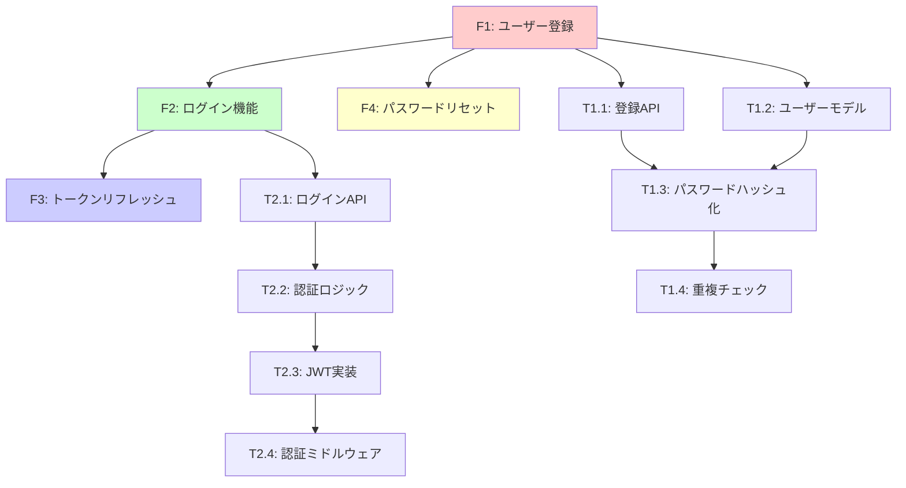

# Phase 0: 要件分析・企画ガイド

> PBIから実装可能なタスクへの変換 - 詳細実践ガイド

**対象**: Devin、Cursor、その他の自律型AIエージェント  
**前提**: JIRA PBI (Product Backlog Item) が既に作成されている  
**目的**: PBIを理解し、実装可能なタスクと要件分析書に変換する

---

## 📋 Phase 0 の位置づけ

### ワークフロー全体における役割

```
[JIRA PBI] 
    ↓
┌─────────────────────────────────────────┐
│  Phase 0: 要件分析・企画 ★ここ          │
│  - PBIの理解                            │
│  - 要件抽出                             │
│  - タスク細分化                         │
│  - 初期技術方針                         │
└─────────────────────────────────────────┘
    ↓
[要件分析書 + タスクリスト]
    ↓
Phase 1 以降へ
```

### Phase 0 の重要性

**なぜ Phase 0 が必要か?**

1. **PBIの不完全性**: PBIはビジネス視点で書かれており、技術的詳細が不足していることが多い
2. **実装可能性の確保**: 技術的な実装タスクに変換しないと開発を開始できない
3. **リスクの早期発見**: 不明点・矛盾・技術的課題を早期に発見
4. **見積もりの精度向上**: タスク分解により正確な工数見積もりが可能
5. **トレーサビリティ**: PBIから実装までの追跡可能性を確保

**Phase 0 をスキップできるか?**

⚠️ **原則としてスキップ不可**

- どんなPBIでも最低限の要件確認は必須
- ただし、**簡易版での実施は可能**:
  - 小規模なバグ修正 → 10-15分の簡易版
  - 緊急修正 (Hotfix) → 必要最小限の確認
  - 大規模な新規プロジェクト → 1-2時間のフル版

---

## 🎯 Phase 0 の成果物

### 必須成果物

1. **要件分析書** (`requirements-analysis-[PBI-KEY].md`)
   - 機能要件・非機能要件
   - 受入基準
   - 技術的制約
   - 初期技術方針

2. **タスク分解リスト** (`task-breakdown-[PBI-KEY].md`)
   - 階層的なタスクツリー
   - 依存関係マップ
   - 工数見積もり
   - 優先度

### オプション成果物

3. **不明点確認リクエスト** (`clarification-request-[PBI-KEY].md`)
   - 人間への確認が必要な項目
   - 緊急度別分類

4. **初期リスク分析** (`risk-analysis-[PBI-KEY].md`)
   - 特定されたリスク
   - 対策案

---

## 📊 Phase 0 の所要時間

| PBI複雑度 | 所要時間 | 例 |
|----------|---------|-----|
| **簡易** | 15-30分 | バグ修正、小規模改善 |
| **標準** | 30-60分 | 単一機能追加、中規模改修 |
| **複雑** | 1-2時間 | 複数機能、アーキテクチャ変更 |
| **超大規模** | 2-4時間 | 新規プロジェクト、システム全体設計 |

**判断基準**:
- ストーリーポイント 1-3 → 簡易
- ストーリーポイント 5-8 → 標準
- ストーリーポイント 13+ → 複雑
- エピックレベル → 超大規模

---

## 🔄 Phase 0 のワークフロー: 7ステップ

```
Step 0.1: PBI読み込みと構造理解 (5-10分)
    ↓
Step 0.2: 情報抽出と不明点の特定 (10-15分)
    ↓
Step 0.3: タスク細分化 (20-40分)
    ↓
Step 0.4: 依存関係の特定と可視化 (10-15分)
    ↓
Step 0.5: 初期技術方針の決定 (10-15分)
    ↓
Step 0.6: 要件分析書の作成 (15-20分)
    ↓
Step 0.7: Phase 0 完了確認 (5分)
    ↓
次フェーズの判断
```

---

## 📦 参照ドキュメント (Phase 0)

### 必須・推奨ドキュメント

| 優先度 | カテゴリ | ドキュメント | 参照タイミング |
|--------|---------|-------------|--------------|
| 🟡推奨 | 08-templates | project-proposal-template.md | プロジェクト提案が必要な場合 |
| 🟡推奨 | 08-templates | requirements-analysis-template.md | 要件分析書作成時 |
| ⚪参考 | 09-reference | glossary.md | 技術用語の確認 |
| ⚪参考 | 10-governance | technology-radar.md | 技術選定の初期判断 |

### Phase 0 での参照優先度が低い理由

Phase 0 は主に**要件の理解とタスク分解**が目的であり、詳細な技術標準は Phase 1 以降で参照します。

---

## 📝 Step 0.1: PBI読み込みと構造理解 (5-10分)

### 目的

PBIの全体像を把握し、何が求められているかを理解する。

### PBIの標準的な構造

```json
{
  "key": "PROJ-123",
  "title": "ユーザー認証機能の実装",
  "type": "Story/Feature/Task/Epic",
  "description": "詳細な説明...",
  "acceptance_criteria": [
    "基準1: ユーザーはメールアドレスとパスワードで登録できる",
    "基準2: ユーザーは登録情報でログインできる",
    "基準3: JWTトークンが発行される"
  ],
  "technical_constraints": [
    "制約1: JWT認証を使用すること",
    "制約2: PostgreSQLをデータベースとして使用"
  ],
  "priority": "High/Medium/Low",
  "story_points": 8,
  "labels": ["authentication", "security"],
  "components": ["backend", "frontend"],
  "linked_issues": ["PROJ-122", "PROJ-124"],
  "assignee": "Devin AI",
  "reporter": "Product Owner",
  "created": "2025-11-01",
  "due_date": "2025-11-15"
}
```

### 実行すべきアクション

#### 1. PBI全体を読み込む

```markdown
## 読み込むべき情報

### 基本情報
- **Key**: PBI識別子 (例: PROJ-123)
- **Title**: 何を実装するか
- **Type**: Story/Feature/Task/Epic
- **Priority**: 緊急度・重要度
- **Story Points**: 複雑度の目安

### 内容
- **Description**: なぜ必要か、背景情報
- **Acceptance Criteria**: 完成の定義
- **Technical Constraints**: 使用技術、避けるべきもの

### 関連情報
- **Linked Issues**: 依存関係、関連PBI
- **Components**: 影響を受ける範囲
- **Labels**: カテゴリ・タグ

### スケジュール
- **Created Date**: 作成日
- **Due Date**: 期限
- **Estimated Time**: 見積もり工数
```

#### 2. 初回読解チェックリスト

実行後、以下を確認:

```markdown
## Phase 0 - Step 0.1 完了チェックリスト

- [ ] PBIのKey (識別子) を記録した
- [ ] PBIのタイトルを理解した
- [ ] PBIの種類 (Story/Feature/Task/Epic) を把握した
- [ ] 背景・目的を理解した
- [ ] 受入基準が明確になっている
- [ ] 技術的制約を把握した
- [ ] 優先度・期限を確認した
- [ ] 関連IssueとFの依存関係を確認した
- [ ] ストーリーポイントから複雑度を把握した
```

#### 3. PBIタイプの判別

PBIのタイプによって、後の進め方が変わります:

```markdown
## PBIタイプ判別

### タイプ1: 新規プロジェクト立ち上げ (Epic)
**特徴**: 
- ゼロからプロジェクトを開始
- 技術スタック未選定
- プロジェクト構造が存在しない

**Phase 0 での重点**:
- フル版の要件分析 (1-2時間)
- 詳細なタスク分解
- 初期技術方針の慎重な検討

**次フェーズ**: Phase 1 (プロジェクト初期化) へ

---

### タイプ2: 既存プロジェクトへの新機能追加 (Feature/Story)
**特徴**:
- 既に動いているプロジェクトに機能を追加
- 技術スタックは決定済み
- プロジェクト構造は既存

**Phase 0 での重点**:
- 標準版の要件分析 (30-60分)
- 既存アーキテクチャへの適合性確認
- 既存コードへの影響範囲特定

**次フェーズ**: Phase 2 (設計) へ (Phase 1 スキップ)

---

### タイプ3: バグ修正 (Bug/Task)
**特徴**:
- 既存機能の不具合修正
- 設計変更なし
- 既存テストの更新

**Phase 0 での重点**:
- 簡易版の要件分析 (15-30分)
- バグの理解と再現手順の確認
- 影響範囲の特定

**次フェーズ**: Phase 3 (実装) へ (Phase 1,2 スキップ)

---

### タイプ4: リファクタリング (Technical Task)
**特徴**:
- 機能は変えず、コード品質の改善
- 設計は変更なし (構造改善のみ)
- 実装とテストが主

**Phase 0 での重点**:
- 標準版の要件分析 (30-45分)
- リファクタリング対象の特定
- 改善方針の決定

**次フェーズ**: Phase 3 (実装) へ (Phase 1,2 スキップ)

---

### タイプ5: 設計変更・アーキテクチャ改善 (Technical Task)
**特徴**:
- 既存システムの設計を見直す
- アーキテクチャの変更が必要

**Phase 0 での重点**:
- フル版の要件分析 (1-2時間)
- 既存設計の理解
- 新設計の方向性検討

**次フェーズ**: Phase 2 (設計) へ (Phase 1 スキップ)

---

### タイプ6: 緊急修正 (Hotfix)
**特徴**:
- 本番障害の緊急対応
- 時間制約が厳しい
- 最小限の確認で進める

**Phase 0 での重点**:
- 超簡易版の要件分析 (5-10分)
- 障害の理解と対応方針決定
- 後でドキュメント補完

**次フェーズ**: Phase 3 (実装) へ (Phase 1,2 スキップ)

⚠️ **注意**: 緊急対応後、必ず Phase 4 (詳細レビュー) と Phase 6 (根本原因分析) を実施

---

### タイプ7: 実験的機能 (Spike/POC)
**特徴**:
- 技術検証や概念実証
- 正式な実装ではない
- 動作確認が目的

**Phase 0 での重点**:
- 簡易版の要件分析 (15-30分)
- 検証項目の明確化
- 成功基準の定義

**次フェーズ**: Phase 3 (実装) へ (Phase 1,2,4,5,6 スキップ)

⚠️ **注意**: 正式採用する場合は改めて全フェーズ実施
```

### Step 0.1 の出力

```markdown
## Step 0.1 出力テンプレート

### PBI基本情報
- **PBI Key**: PROJ-123
- **Title**: ユーザー認証機能の実装
- **Type**: Feature
- **Priority**: High
- **Story Points**: 8
- **Due Date**: 2025-11-15

### PBIタイプ判別
- **判別結果**: タイプ2 (既存プロジェクトへの新機能追加)
- **Phase 0 の進め方**: 標準版 (30-60分)
- **予想される次フェーズ**: Phase 2 (Phase 1 スキップ)

### 初期理解メモ
- 既存システムにJWT認証を追加
- PostgreSQLは既に使用中
- 技術スタックは決定済み
```

---

## 📝 Step 0.2: 情報抽出と不明点の特定 (10-15分)

### 目的

PBIから構造化された情報を抽出し、不明点・不足情報を特定する。

### 情報抽出チェックリスト

```markdown
## 機能要件の抽出

### 何を実装するか?
- [ ] **明確に記述されているか?**
  - ✅ Yes → 要件リストに追加
  - ❌ No → 不明点リストに追加

**例**:
- ✅ 明確: "ユーザーはメールアドレスとパスワードで登録できる"
- ❌ 不明確: "認証機能を実装する" (どの方式? 何が含まれる?)

### 誰のための機能か?
- [ ] **ターゲットユーザーは明確か?**
  - ✅ Yes → ユーザーストーリーとして整理
  - ❌ No → 不明点リストに追加

**例**:
- ✅ 明確: "エンドユーザーがWebアプリから登録できる"
- ❌ 不明確: "ユーザーが登録できる" (管理者? エンドユーザー? API?)

### どのように動作するか?
- [ ] **動作フローが明確か?**
  - ✅ Yes → フロー図作成の準備
  - ❌ No → 不明点リストに追加

**例**:
- ✅ 明確: "1. メール入力 → 2. パスワード入力 → 3. 登録ボタン → 4. 確認メール送信"
- ❌ 不明確: "登録できる" (フローが不明)

---

## 非機能要件の抽出

### パフォーマンス要件
- [ ] **レスポンスタイム、スループット等は明記されているか?**
  - ✅ 記載あり → 要件に追加
  - ❌ 記載なし → デフォルト基準を適用 or 確認

**デフォルト基準の例** (AI-QUICK-REFERENCE.md参照):
- API エンドポイント: < 200ms (90th percentile)
- 認証処理: < 500ms
- 同時ユーザー: 1000+ 対応

### セキュリティ要件
- [ ] **認証、認可、データ保護等は明記されているか?**
  - ✅ 記載あり → セキュリティ設計に反映
  - ❌ 記載なし → 標準セキュリティ要件を適用

**標準セキュリティ要件の例** (07-security-compliance/参照):
- パスワードハッシュ化: bcrypt
- トークン有効期限: 1時間
- HTTPS必須
- SQL Injection対策

### スケーラビリティ
- [ ] **予想負荷、成長予測は明記されているか?**
  - ✅ 記載あり → アーキテクチャ設計に反映
  - ❌ 記載なし → 標準的な設計を適用

---

## 技術的制約の抽出

### 使用すべき技術
- [ ] **指定されている技術スタックは?**
  - ✅ 記載あり → 技術選定に反映
  - ❌ 記載なし → Phase 1で選定

**例**:
- "PostgreSQLを使用すること" → PostgreSQL確定
- "REST APIで実装すること" → REST確定

### 避けるべき技術
- [ ] **使用禁止の技術は?**
  - ✅ 記載あり → 技術選定時に考慮
  - ❌ 記載なし → 組織標準に従う

**例**:
- "NoSQLは使用しないこと"
- "サードパーティ認証サービスは使用しないこと"

### 既存システムとの連携
- [ ] **API、データベース等の連携は?**
  - ✅ 記載あり → 設計に反映
  - ❌ 記載なし → 新規独立システムとして扱う

**例**:
- "既存のUserServiceと連携すること"
- "既存データベーススキーマを拡張すること"

---

## リソース制約の抽出

### 期限
- [ ] **デッドラインは明記されているか?**
  - ✅ 記載あり → スケジュールに反映
  - ❌ 記載なし → ストーリーポイントから見積もり

### 予算
- [ ] **コスト制約は明記されているか?**
  - ✅ 記載あり → 技術選定に反映
  - ❌ 記載なし → 標準的なコスト想定

### チーム構成
- [ ] **担当者、スキルは明記されているか?**
  - ✅ 記載あり → タスク割り当てに考慮
  - ❌ 記載なし → AIが全て担当と想定
```

### 不明点の処理フロー

```
不明点を発見
  ↓
[判断] 開発に影響するか?
  ├─ Yes (重要) → 即座に人間に確認要求
  │   └─ 確認テンプレート使用
  │   └─ 作業をブロック
  └─ No (軽微) → 不明点リストに記録
      └─ 後で確認 or 標準的な想定で進行
      └─ 作業は継続
```

### 人間への確認要求テンプレート

**ファイル名**: `clarification-request-[PBI-KEY].md`

```markdown
---
title: "不明点確認リクエスト: [PBI-KEY]"
pbi_key: "PROJ-123"
created_date: "2025-11-05"
status: "Pending Response"
---

# 不明点確認リクエスト

**PBI**: [PROJ-123] ユーザー認証機能の実装

## 緊急度: 高 (開発ブロック中)

### 不明点リスト

#### 1. パスワードリセット機能の要否 🔴緊急
- **現状**: 受入基準に明記なし
- **質問**: パスワードリセット機能を含めるべきですか?
- **影響**: 
  - 実装工数: +2日程度増加
  - 設計への影響: メール送信機能の追加が必要
  - タスク分解への影響: 新規タスクの追加
- **緊急度**: 🔴高 (設計に影響)
- **提案**: 
  - オプション1: パスワードリセット機能を含める (推奨)
  - オプション2: 後のPhaseで追加
  - オプション3: 今回は含めない

#### 2. 多要素認証(MFA)の対応 🔴緊急
- **現状**: セキュリティ要件に明記なし
- **質問**: MFAは必要ですか? (SMS/TOTP等)
- **影響**: 
  - 実装工数: +3日程度増加
  - アーキテクチャへの影響: サードパーティサービス連携
  - セキュリティレベル: 大幅向上
- **緊急度**: 🔴高 (アーキテクチャに影響)
- **提案**: 
  - オプション1: TOTPベースのMFAを実装 (推奨)
  - オプション2: 後のPhaseで追加
  - オプション3: 今回は不要

#### 3. パスワードポリシーの詳細 🟡中
- **現状**: "安全なパスワード"とのみ記載
- **質問**: 具体的なパスワードポリシーは?
- **影響**: バリデーション実装に影響
- **緊急度**: 🟡中 (実装フェーズまでに決定すれば良い)
- **提案**: 組織標準のパスワードポリシーを適用
  - 最小長: 8文字
  - 必須: 大文字小文字数字記号を各1文字以上

---

## 想定回答を待つ項目 (ブロック中)

### 項目1: パスワードリセット機能
- [ ] 含める
- [ ] 含めない
- [ ] 後のPhaseで追加

**回答欄**: ___________

### 項目2: MFA対応
- [ ] TOTP実装
- [ ] SMS実装
- [ ] 後のPhaseで追加
- [ ] 不要

**回答欄**: ___________

---

## 想定で進められる項目 (確認は後で可)

以下は標準的な想定で進めます。問題があれば指摘してください:

- ✅ OAuth 2.0 / JWT を使用 (標準的な認証方式)
- ✅ PostgreSQLでユーザー情報管理 (技術スタック標準)
- ✅ bcryptでパスワードハッシュ化 (セキュリティ標準)
- ✅ トークン有効期限: 1時間 (標準設定)
- ✅ パスワードポリシー: 組織標準を適用

---

**次のアクション**: 
- 人間からの回答を待機
- 回答を受け取り次第、Phase 0 を再開
```

### Step 0.2 の出力

```markdown
## Step 0.2 出力テンプレート

### 機能要件 (抽出済み)
1. ユーザー登録機能
   - メールアドレスとパスワードで登録
   - 入力バリデーション
   - 重複チェック
   
2. ログイン機能
   - メールアドレスとパスワードで認証
   - JWTトークン発行
   
3. トークンリフレッシュ機能
   - 有効期限切れ前のトークン更新

### 非機能要件 (抽出済み)
- パフォーマンス: ログイン < 500ms
- セキュリティ: bcryptでパスワードハッシュ化
- スケーラビリティ: 1000同時ユーザー対応

### 技術的制約 (抽出済み)
- JWT認証使用
- PostgreSQL使用
- 既存UserServiceとの連携

### 不明点リスト (要確認)
🔴 緊急:
- パスワードリセット機能の要否
- MFA対応の要否

🟡 中:
- パスワードポリシー詳細

⚪ 軽微:
- ログイン失敗時のリトライ制限

### 確認リクエスト作成
- [ ] clarification-request-PROJ-123.md 作成済み
- [ ] 人間に送信済み
- [ ] 回答待機中
```

---

## 📝 Step 0.3: タスク細分化 (20-40分)

### 目的

PBIを実装可能な小さなタスクに分解し、階層的なタスクツリーを作成する。

### タスク細分化の原則

#### 原則1: トップダウン分解

```
PBI (Epic)
  ↓ 分解
Feature (機能単位)
  ↓ 分解
Task (実装単位)
  ↓ 分解
Sub-Task (細かい作業単位)
  ↓ 分解
Micro-Task (最小作業単位)
```

#### 原則2: 粒度の基準

| レベル | 名称 | 所要時間 | 担当範囲 | 例 | コード行数目安 |
|--------|------|----------|----------|-----|--------------|
| **0** | Epic | 複数日〜週 | 複数人 or AI全体 | ユーザー認証機能全体 | 数千行 |
| **1** | Feature | 1日〜数日 | 1人 or AI部分 | JWT認証実装 | 数百〜千行 |
| **2** | Task | 数時間〜1日 | 1人の作業 | AuthService実装 | 100-300行 |
| **3** | Sub-Task | 30分〜数時間 | 1つの実装 | generateToken()関数 | 20-50行 |
| **4** | Micro-Task | 数分〜30分 | 小さなロジック | トークン有効期限チェック | 5-20行 |

**適切な粒度の判断基準**:
- ✅ 1つのGitコミットで完結できる
- ✅ 単一の責務を持つ
- ✅ 独立してテスト可能
- ✅ 他のタスクとの結合度が低い

#### 原則3: MECE (Mutually Exclusive, Collectively Exhaustive)

- **漏れなく** (Collectively Exhaustive): 全ての要件をカバー
- **重複なく** (Mutually Exclusive): タスクが重複しない

**チェック方法**:
```markdown
## MECEチェックリスト

### 漏れなく (CE)
- [ ] PBIの全受入基準がタスクに分解されているか?
- [ ] 非機能要件 (パフォーマンス、セキュリティ等) もタスク化されているか?
- [ ] テストタスクは含まれているか?
- [ ] ドキュメント作成タスクは含まれているか?

### 重複なく (ME)
- [ ] 同じ機能を実装するタスクが複数ないか?
- [ ] タスク間の境界は明確か?
- [ ] 責務が重複していないか?
```

### 実践: タスク分解プロセス

**例: "ユーザー認証機能の実装" PBI**

#### レベル0: Epic

```markdown
## エピック
**PROJ-123**: ユーザー認証機能の実装

**概要**: 既存システムにJWT認証を追加し、ユーザー登録・ログイン機能を実装する

**ストーリーポイント**: 8
**予想工数**: 5-7日
```

#### レベル1: Feature分解

```markdown
### Feature分解

#### F1: ユーザー登録機能
- **ID**: PROJ-123-F1
- **概要**: メールアドレスとパスワードでユーザー登録
- **所要時間**: 1-2日
- **優先度**: High
- **依存関係**: なし (最初に実装)
- **受入基準**:
  - [ ] メールアドレスとパスワードで登録できる
  - [ ] 重複チェックが動作する
  - [ ] パスワードがハッシュ化される

#### F2: ログイン機能 (JWT認証)
- **ID**: PROJ-123-F2
- **概要**: JWTトークンを用いた認証
- **所要時間**: 1-2日
- **優先度**: High
- **依存関係**: F1完了後 (ユーザーデータが必要)
- **受入基準**:
  - [ ] メールアドレスとパスワードで認証できる
  - [ ] JWTトークンが発行される
  - [ ] トークンでAPI認証ができる

#### F3: トークンリフレッシュ機能
- **ID**: PROJ-123-F3
- **概要**: トークンの有効期限を延長
- **所要時間**: 0.5日
- **優先度**: Medium
- **依存関係**: F2完了後
- **受入基準**:
  - [ ] リフレッシュトークンでアクセストークンを更新できる

#### F4: パスワードリセット機能
- **ID**: PROJ-123-F4
- **概要**: メールを使ったパスワードリセット
- **所要時間**: 1日
- **優先度**: Medium
- **依存関係**: F1完了後
- **受入基準**:
  - [ ] リセットリクエストでメールが送信される
  - [ ] トークン付きURLでパスワードリセットできる
- **備考**: ⚠️ 人間確認待ち (要否確認中)
```

#### レベル2: Task分解 (F2: ログイン機能の例)

```markdown
### F2: ログイン機能のタスク分解

#### T2.1: ログインAPIエンドポイント実装
- **ID**: PROJ-123-T2.1
- **所要時間**: 4-6時間
- **担当レイヤー**: Controller層
- **依存**: F1のユーザーモデル
- **成果物**:
  - `POST /api/auth/login` エンドポイント
  - リクエストバリデーション
  - エラーハンドリング
- **テストケース**: 5-10個

#### T2.2: 認証ロジック実装
- **ID**: PROJ-123-T2.2
- **所要時間**: 3-4時間
- **担当レイヤー**: Service層
- **依存**: T2.1
- **成果物**:
  - `AuthService.authenticate()` メソッド
  - パスワード検証ロジック
  - ユーザー存在確認
- **テストケース**: 10-15個

#### T2.3: JWTトークン生成・検証
- **ID**: PROJ-123-T2.3
- **所要時間**: 3-4時間
- **担当レイヤー**: Service層
- **依存**: T2.2
- **成果物**:
  - `TokenService.generate()` メソッド
  - `TokenService.verify()` メソッド
  - トークンペイロード定義
- **テストケース**: 8-12個

#### T2.4: 認証ミドルウェア実装
- **ID**: PROJ-123-T2.4
- **所要時間**: 2-3時間
- **担当レイヤー**: Middleware
- **依存**: T2.3
- **成果物**:
  - JWT検証ミドルウェア
  - 認可チェック
  - エラーレスポンス
- **テストケース**: 5-8個

#### T2.5: ユニットテスト作成
- **ID**: PROJ-123-T2.5
- **所要時間**: 3-4時間
- **担当**: テスト
- **依存**: T2.1-T2.4全て
- **成果物**:
  - Controller層テスト
  - Service層テスト
  - Middleware層テスト
- **テストケース**: 30-50個 (合計)

#### T2.6: 統合テスト作成
- **ID**: PROJ-123-T2.6
- **所要時間**: 2-3時間
- **担当**: テスト
- **依存**: T2.5
- **成果物**:
  - E2Eログインフローテスト
  - 認証失敗シナリオテスト
- **テストケース**: 10-15個
```

#### レベル3: Sub-Task分解 (T2.3の例)

```markdown
### T2.3: JWTトークン生成・検証のサブタスク分解

#### ST2.3.1: JWT生成関数実装
- **ID**: PROJ-123-ST2.3.1
- **所要時間**: 1-1.5時間
- **実装内容**: 
  - `generateToken(userId, payload)` 関数
  - ペイロード構築ロジック
  - 署名処理
- **使用ライブラリ**: jsonwebtoken
- **コード行数**: 30-50行

#### ST2.3.2: JWT検証関数実装
- **ID**: PROJ-123-ST2.3.2
- **所要時間**: 1-1.5時間
- **実装内容**: 
  - `verifyToken(token)` 関数
  - 署名検証
  - ペイロード抽出
- **使用ライブラリ**: jsonwebtoken
- **コード行数**: 20-40行

#### ST2.3.3: トークン有効期限管理
- **ID**: PROJ-123-ST2.3.3
- **所要時間**: 0.5-1時間
- **実装内容**: 
  - 有効期限チェックロジック
  - 有効期限設定 (1時間)
  - リフレッシュトークン有効期限 (7日)
- **コード行数**: 15-30行

#### ST2.3.4: シークレットキー管理
- **ID**: PROJ-123-ST2.3.4
- **所要時間**: 0.5時間
- **実装内容**: 
  - 環境変数からの読み込み
  - キーのバリデーション
  - エラーハンドリング
- **コード行数**: 10-20行

#### ST2.3.5: トークンペイロード設計
- **ID**: PROJ-123-ST2.3.5
- **所要時間**: 0.5時間
- **実装内容**: 
  - ペイロード構造定義 (TypeScript Interface)
  - 必須フィールド: userId, email, role, iat, exp
  - オプションフィールド: permissions
- **コード行数**: 10-20行
```

### タスク分解の出力フォーマット

#### フォーマット1: Markdown Table (推奨)

**ファイル名**: `task-breakdown-[PBI-KEY].md`

```markdown
---
title: "タスク分解リスト: [PBI-KEY]"
pbi_key: "PROJ-123"
created_date: "2025-11-05"
last_updated: "2025-11-05"
status: "Active"
---

# タスク分解リスト: PROJ-123

## 概要

**PBI**: PROJ-123 - ユーザー認証機能の実装  
**総見積もり工数**: 5-7日  
**タスク総数**: 25タスク

---

## Feature一覧

| ID | Feature名 | 所要時間 | 優先度 | 依存関係 | ステータス |
|----|----------|---------|--------|---------|-----------|
| F1 | ユーザー登録機能 | 1-2日 | High | なし | 未着手 |
| F2 | ログイン機能 (JWT) | 1-2日 | High | F1 | 未着手 |
| F3 | トークンリフレッシュ | 0.5日 | Medium | F2 | 未着手 |
| F4 | パスワードリセット | 1日 | Medium | F1 | 確認待ち |

---

## 詳細タスク一覧

| ID | タスク名 | レベル | 所要時間 | 依存関係 | 優先度 | レイヤー | ステータス |
|----|---------|--------|---------|---------|--------|---------|-----------|
| **F1** | **ユーザー登録機能** | **1** | **1-2日** | **なし** | **High** | **Full Stack** | **未着手** |
| T1.1 | 登録APIエンドポイント | 2 | 4h | なし | High | Controller | 未着手 |
| T1.2 | ユーザーモデル実装 | 2 | 3h | T1.1 | High | Model | 未着手 |
| T1.3 | パスワードハッシュ化 | 2 | 2h | T1.2 | High | Service | 未着手 |
| T1.4 | 重複チェック | 2 | 2h | T1.2 | High | Service | 未着手 |
| T1.5 | ユニットテスト | 2 | 3h | T1.1-T1.4 | High | Test | 未着手 |
| **F2** | **ログイン機能 (JWT)** | **1** | **1-2日** | **F1** | **High** | **Full Stack** | **未着手** |
| T2.1 | ログインAPIエンドポイント | 2 | 4h | F1 | High | Controller | 未着手 |
| T2.2 | 認証ロジック実装 | 2 | 3h | T2.1 | High | Service | 未着手 |
| T2.3 | JWTトークン生成・検証 | 2 | 3h | T2.2 | High | Service | 未着手 |
| ST2.3.1 | JWT生成関数 | 3 | 1h | T2.3 | High | Service | 未着手 |
| ST2.3.2 | JWT検証関数 | 3 | 1h | T2.3 | High | Service | 未着手 |
| ST2.3.3 | 有効期限管理 | 3 | 0.5h | ST2.3.1 | High | Service | 未着手 |
| ST2.3.4 | シークレットキー管理 | 3 | 0.5h | ST2.3.1 | High | Config | 未着手 |
| ST2.3.5 | ペイロード設計 | 3 | 0.5h | T2.3 | High | Types | 未着手 |
| T2.4 | 認証ミドルウェア | 2 | 2h | T2.3 | High | Middleware | 未着手 |
| T2.5 | ユニットテスト | 2 | 3h | T2.1-T2.4 | High | Test | 未着手 |
| T2.6 | 統合テスト | 2 | 2h | T2.5 | High | Test | 未着手 |
| ... | ... | ... | ... | ... | ... | ... | ... |

---

## クリティカルパス

```
F1: ユーザー登録 (1-2日)
  → T1.1: 登録API (4h)
  → T1.2: ユーザーモデル (3h)
  → T1.3: パスワードハッシュ化 (2h)
↓
F2: ログイン機能 (1-2日)
  → T2.1: ログインAPI (4h)
  → T2.2: 認証ロジック (3h)
  → T2.3: JWT実装 (3h)
↓
F3: トークンリフレッシュ (0.5日)

最短完了時間: 5日
```

---

## 並行実行可能タスク

### グループ1: F1完了後に並行実行可能
- F2: ログイン機能
- F4: パスワードリセット機能

理由: 両方ともF1のユーザーモデルに依存するが、互いには独立

### グループ2: F2完了後に並行実行可能
- F3: トークンリフレッシュ
- T2.5: ログイン機能のテスト

理由: 独立した作業

---

## 見積もり精度

| カテゴリ | 楽観的 | 最頻値 | 悲観的 | PERT見積もり |
|---------|-------|-------|-------|-------------|
| F1: ユーザー登録 | 1日 | 1.5日 | 2日 | 1.5日 |
| F2: ログイン機能 | 1日 | 1.5日 | 2日 | 1.5日 |
| F3: リフレッシュ | 0.3日 | 0.5日 | 0.7日 | 0.5日 |
| F4: パスワードリセット | 0.7日 | 1日 | 1.5日 | 1日 |
| **合計** | **3日** | **4.5日** | **6.2日** | **4.5日** |

PERT見積もり式: (楽観的 + 4×最頻値 + 悲観的) / 6

---

## リスクとバッファ

### 特定されたリスク
1. **JWT実装の複雑性**: 初回実装の場合、想定より時間がかかる可能性
   - **対策**: 先行して技術調査・サンプル実装
   - **バッファ**: +0.5日

2. **既存システムとの統合**: 既存UserServiceとの連携で問題が発生する可能性
   - **対策**: 早期に統合テスト実施
   - **バッファ**: +0.5日

3. **パスワードリセット機能の確認待ち**: 要否が未確定
   - **対策**: 確認が取れるまで他のタスクを先行
   - **バッファ**: なし (並行作業可能)

### 総バッファ
- **ベース見積もり**: 4.5日
- **リスクバッファ**: +1日
- **最終見積もり**: 5-6日
```

#### フォーマット2: JSON (ツール連携用)

**ファイル名**: `task-breakdown-[PBI-KEY].json`

```json
{
  "pbi_key": "PROJ-123",
  "pbi_title": "ユーザー認証機能の実装",
  "created_date": "2025-11-05",
  "total_estimated_days": "5-7",
  "total_task_count": 25,
  "features": [
    {
      "id": "F1",
      "name": "ユーザー登録機能",
      "level": 1,
      "estimated_hours": "8-16",
      "priority": "High",
      "dependencies": [],
      "layer": "Full Stack",
      "status": "not_started",
      "tasks": [
        {
          "id": "T1.1",
          "name": "登録APIエンドポイント",
          "level": 2,
          "estimated_hours": "4",
          "priority": "High",
          "dependencies": [],
          "layer": "Controller",
          "status": "not_started",
          "test_cases": 5
        },
        {
          "id": "T1.2",
          "name": "ユーザーモデル実装",
          "level": 2,
          "estimated_hours": "3",
          "priority": "High",
          "dependencies": ["T1.1"],
          "layer": "Model",
          "status": "not_started",
          "test_cases": 8
        }
      ]
    },
    {
      "id": "F2",
      "name": "ログイン機能 (JWT)",
      "level": 1,
      "estimated_hours": "8-16",
      "priority": "High",
      "dependencies": ["F1"],
      "layer": "Full Stack",
      "status": "not_started",
      "tasks": [
        {
          "id": "T2.1",
          "name": "ログインAPIエンドポイント",
          "level": 2,
          "estimated_hours": "4",
          "priority": "High",
          "dependencies": ["F1"],
          "layer": "Controller",
          "status": "not_started",
          "test_cases": 6
        },
        {
          "id": "T2.3",
          "name": "JWTトークン生成・検証",
          "level": 2,
          "estimated_hours": "3",
          "priority": "High",
          "dependencies": ["T2.2"],
          "layer": "Service",
          "status": "not_started",
          "subtasks": [
            {
              "id": "ST2.3.1",
              "name": "JWT生成関数実装",
              "level": 3,
              "estimated_hours": "1",
              "priority": "High",
              "layer": "Service",
              "code_lines": "30-50"
            },
            {
              "id": "ST2.3.2",
              "name": "JWT検証関数実装",
              "level": 3,
              "estimated_hours": "1",
              "priority": "High",
              "layer": "Service",
              "code_lines": "20-40"
            }
          ]
        }
      ]
    }
  ],
  "critical_path": ["F1", "T1.2", "T1.3", "F2", "T2.3", "F3"],
  "parallel_groups": [
    {
      "after": "F1",
      "tasks": ["F2", "F4"],
      "reason": "Both depend on F1, but independent of each other"
    }
  ],
  "risks": [
    {
      "description": "JWT実装の複雑性",
      "mitigation": "先行して技術調査",
      "buffer_days": 0.5
    }
  ]
}
```

---

## 📝 Step 0.4: 依存関係の特定と可視化 (10-15分)

### 目的

タスク間の依存関係を特定し、クリティカルパスと並行実行可能タスクを明確化する。

### 依存関係の種類

#### 1. 技術的依存 (Technical Dependency)
**定義**: あるタスクの実装が別のタスクの成果物を必要とする

**例**:
- ログイン機能 → ユーザーモデルが必要
- JWT検証ミドルウェア → JWT検証関数が必要

**表記**: `Task A → Task B` (Task BはTask Aに依存)

#### 2. データ依存 (Data Dependency)
**定義**: データ構造や定義に依存

**例**:
- ユーザープロフィール → usersテーブルが必要
- 認証ミドルウェア → JWTペイロード構造定義が必要

#### 3. 機能的依存 (Functional Dependency)
**定義**: 機能の論理的な順序

**例**:
- パスワードリセット → メール送信機能が必要
- トークンリフレッシュ → トークン発行機能が必要

#### 4. リソース依存 (Resource Dependency)
**定義**: 同じリソース(DB、API等)を使用するため順序制約がある

**例**:
- DBマイグレーション → 全テーブル操作の前に実行
- 環境変数設定 → 全サービス起動の前に実行

### 依存関係マップの作成

#### 方法1: Mermaid図 (推奨)



#### 方法2: テキストベース依存関係ツリー

```
PROJ-123: ユーザー認証機能
├─ F1: ユーザー登録 (並行可能グループ: なし)
│  ├─ T1.1: 登録API
│  ├─ T1.2: ユーザーモデル → T1.1に依存
│  ├─ T1.3: パスワードハッシュ化 → T1.1, T1.2に依存
│  ├─ T1.4: 重複チェック → T1.3に依存
│  └─ T1.5: ユニットテスト → T1.1-T1.4に依存
│
├─ F2: ログイン機能 → F1に依存 (並行可能グループ: F4)
│  ├─ T2.1: ログインAPI → F1に依存
│  ├─ T2.2: 認証ロジック → T2.1に依存
│  ├─ T2.3: JWT実装 → T2.2に依存
│  │  ├─ ST2.3.1: JWT生成関数
│  │  ├─ ST2.3.2: JWT検証関数 → ST2.3.1に依存
│  │  ├─ ST2.3.3: 有効期限管理 → ST2.3.1に依存
│  │  ├─ ST2.3.4: シークレットキー管理
│  │  └─ ST2.3.5: ペイロード設計
│  ├─ T2.4: 認証ミドルウェア → T2.3に依存
│  ├─ T2.5: ユニットテスト → T2.1-T2.4に依存
│  └─ T2.6: 統合テスト → T2.5に依存
│
├─ F3: トークンリフレッシュ → F2に依存 (並行可能グループ: なし)
│  └─ ...
│
└─ F4: パスワードリセット → F1に依存 (並行可能グループ: F2)
   └─ ...
```

### クリティカルパスの特定

**定義**: プロジェクト完了までに必要な最長経路。クリティカルパス上のタスクが遅延すると、全体が遅延する。

#### クリティカルパス計算手順

1. **各タスクの所要時間を記録**
2. **依存関係を辿り、全経路を列挙**
3. **各経路の合計時間を計算**
4. **最長経路がクリティカルパス**

#### 例: PROJ-123のクリティカルパス

```
経路1: F1 → F2 → F3
  = (1.5日) + (1.5日) + (0.5日) = 3.5日

経路2: F1 → F4
  = (1.5日) + (1日) = 2.5日

経路3: F1 → T1.2 → T1.3 → F2 → T2.3 → F3
  = (0.5日) + (0.3日) + (0.2日) + (1.5日) + (0.3日) + (0.5日) = 3.3日

クリティカルパス: 経路1 (3.5日)
  F1: ユーザー登録 (1.5日)
  → F2: ログイン機能 (1.5日)
  → F3: トークンリフレッシュ (0.5日)

最短完了時間: 3.5日 (並行実行を最大化した場合)
```

**クリティカルパスの重要性**:
- ⚠️ クリティカルパス上のタスクは遅延厳禁
- ✅ クリティカルパス外のタスクにはバッファがある
- 🎯 リソース配分の優先度決定に使用

### 並行実行可能タスクの特定

```markdown
## 並行実行グループ

### グループ1: F1完了後に並行実行可能
**タスク**:
- F2: ログイン機能 (1.5日)
- F4: パスワードリセット機能 (1日)

**並行可能な理由**:
- 両方ともF1のユーザーモデルに依存
- 互いには依存しない
- 異なるコードベースを操作

**並行実行の効果**:
- 直列実行: 1.5日 + 1日 = 2.5日
- 並行実行: max(1.5日, 1日) = 1.5日
- **時間短縮: -1日**

---

### グループ2: F2完了後に並行実行可能
**タスク**:
- F3: トークンリフレッシュ (0.5日)
- T2.5: ログイン機能のユニットテスト (0.3日)
- T2.6: ログイン機能の統合テスト (0.2日)

**並行可能な理由**:
- 独立した作業
- 異なる担当者が実行可能

**並行実行の効果**:
- 直列実行: 0.5日 + 0.3日 + 0.2日 = 1日
- 並行実行: max(0.5日, 0.3日, 0.2日) = 0.5日
- **時間短縮: -0.5日**
```

### 依存関係違反の検出

**チェックリスト**:

```markdown
## 依存関係検証チェックリスト

### 循環依存のチェック
- [ ] タスクAがタスクBに依存し、タスクBがタスクAに依存していないか?
- [ ] 間接的な循環依存はないか? (A→B→C→A)

### 不整合な依存関係
- [ ] 並行実行グループ内のタスクが互いに依存していないか?
- [ ] クリティカルパスが複数ある場合、整合性があるか?

### 隠れた依存関係
- [ ] データベーススキーマの依存は明示されているか?
- [ ] 環境変数の依存は明示されているか?
- [ ] サードパーティライブラリの依存は明示されているか?
```

### Step 0.4 の出力

```markdown
## Step 0.4 出力テンプレート

### 依存関係マップ
[Mermaid図 または テキストベースツリー]

### クリティカルパス
- **経路**: F1 → F2 → F3
- **合計時間**: 3.5日
- **注意事項**: F1, F2のタスクは最優先で実行

### 並行実行可能グループ
- **グループ1** (F1完了後): F2, F4 → 時間短縮: -1日
- **グループ2** (F2完了後): F3, T2.5, T2.6 → 時間短縮: -0.5日

### 依存関係検証結果
- [x] 循環依存なし
- [x] 不整合な依存関係なし
- [x] 隠れた依存関係を明示化済み
```

---

## 📝 Step 0.5: 初期技術方針の決定 (10-15分)

### 目的

概要レベルの技術方針を決定し、Phase 1 (プロジェクト初期化) での詳細選定に備える。

### 技術方針決定の原則

#### 原則1: 組織標準を優先

```markdown
## 技術選定の優先順位

1. **最優先**: 組織の承認済み技術
   - `05-technology-stack/approved-technologies.md` を確認
   - 承認済み技術から選択

2. **次善**: 技術レーダーで「Adopt」「Trial」の技術
   - `10-governance/technology-radar.md` を確認
   - 「Adopt」: 積極的に使用推奨
   - "Trial": 試験的に使用可能

3. **避ける**: 技術レーダーで「Hold」「Deprecated」の技術
   - 「Hold": 新規採用は避ける
   - "Deprecated": 使用禁止

4. **要確認**: 承認リストにない技術
   - 人間への確認が必要
   - 技術評価プロセスを経る
```

#### 原則2: PBIの制約を尊重

**PBIに技術的制約が明記されている場合は従う**

例:
- "PostgreSQLを使用すること" → PostgreSQL確定
- "REST APIで実装すること" → REST確定
- "既存のReactフロントエンドに統合すること" → React使用

#### 原則3: 不明な場合は Phase 1 で詳細決定

**Phase 0 では概要レベルでOK**

- プログラミング言語: "バックエンド言語が必要" → [Phase 1で決定]
- フレームワーク: "Webフレームワークが必要" → [Phase 1で決定]
- 具体的製品: "RDBMS が必要" → [Phase 1で PostgreSQL vs MySQL を決定]

### 決定すべき項目 (概要レベル)

```markdown
## 初期技術方針メモ

### 1. プログラミング言語・フレームワーク

#### バックエンド
- **状態**: [決定済み / 検討中 / Phase 1で決定]
- **選択肢**: Node.js/TypeScript, Python/FastAPI, Java/Spring, Go
- **初期方針**: 
  - PBIに明記あり → その言語を使用
  - PBIに明記なし → [Phase 1で組織標準から選択]
- **根拠**: [理由を記述]

#### フロントエンド
- **状態**: [決定済み / 検討中 / Phase 1で決定]
- **選択肢**: React, Vue.js, Angular, Svelte
- **初期方針**: 
  - 既存プロジェクトがある → 既存に合わせる
  - 新規プロジェクト → [Phase 1で決定]
- **根拠**: [理由を記述]

---

### 2. データベース

#### 種類
- **状態**: [決定済み / 検討中]
- **選択肢**: RDBMS, NoSQL, NewSQL
- **初期方針**: 
  - データ構造が明確 → RDBMS
  - 非構造化データ → NoSQL
  - 不明 → [Phase 1で決定]
- **根拠**: ユーザー情報は構造化データ、ACID特性が必要 → RDBMS

#### 具体的な製品
- **状態**: [Phase 1で決定]
- **選択肢**: PostgreSQL, MySQL, MongoDB, etc.
- **初期方針**: 組織標準を優先

---

### 3. 認証・認可方式 (該当する場合)

#### 認証方式
- **状態**: [決定済み]
- **選択**: JWT (JSON Web Token)
- **根拠**: 
  - PBIに "JWT認証" と明記
  - ステートレス、スケーラブル
  - API向けの標準的な方式

#### 認可方式
- **状態**: [Phase 2で詳細設計]
- **選択肢**: RBAC, ABAC, ACL
- **初期方針**: RBAC (Role-Based Access Control) を想定

---

### 4. API設計 (該当する場合)

#### スタイル
- **状態**: [決定済み / 検討中]
- **選択肢**: REST, GraphQL, gRPC, WebSocket
- **初期方針**: 
  - PBIに明記あり → その方式
  - PBIに明記なし → REST (標準的)
- **根拠**: [理由を記述]

#### バージョニング
- **状態**: [Phase 2で決定]
- **初期方針**: URLバージョニング (`/api/v1/...`) を想定

---

### 5. ホスティング・インフラ

#### 環境
- **状態**: [Phase 1で決定]
- **選択肢**: AWS, GCP, Azure, オンプレミス
- **初期方針**: 
  - 既存プロジェクト → 既存環境に合わせる
  - 新規プロジェクト → クラウド (スケーラビリティ、可用性)
- **根拠**: [理由を記述]

#### コンテナ化
- **状態**: [Phase 1で決定]
- **選択肢**: Docker, Kubernetes, なし
- **初期方針**: 組織標準に従う

---

### 6. テスト戦略

#### テストレベル
- **必須**: 
  - ユニットテスト (全関数・メソッド)
  - 統合テスト (API エンドポイント)
- **推奨**: 
  - E2Eテスト (主要なユーザーフロー)
- **オプション**: 
  - パフォーマンステスト
  - セキュリティテスト

#### テストフレームワーク
- **状態**: [Phase 1で決定]
- **選択肢**: Jest, Mocha, Pytest, JUnit, etc.
- **初期方針**: 使用言語の標準的なフレームワーク

---

### 7. セキュリティ

#### 必須対策 (07-security-compliance/ 参照)
- **認証**: JWT、パスワードハッシュ化 (bcrypt)
- **通信**: HTTPS必須
- **入力検証**: 全入力のバリデーション
- **SQL Injection**: プリペアドステートメント使用
- **XSS**: 出力エスケープ
- **CSRF**: CSRFトークン使用

---

### 8. 備考

- **この段階では方向性のみ決定**
- **詳細な技術選定は Phase 1 で実施**
- **組織標準 (05-technology-stack/) を参照**
- **不明点は Phase 1 で調査・決定**
```

### 技術方針決定の判断フロー

```
PBIに技術的制約あり?
  ├─ Yes → その技術を使用
  │   └─ 初期技術方針に記録
  └─ No → Q2へ

既存プロジェクトか?
  ├─ Yes → 既存技術スタックに合わせる
  │   └─ 既存プロジェクトのREADME、tech-stack.md を確認
  └─ No → Q3へ

組織承認済み技術リストに該当あり?
  ├─ Yes → 承認済み技術から選択
  │   └─ 05-technology-stack/approved-technologies.md
  └─ No → Phase 1 で詳細選定
      └─ 技術評価プロセスが必要
```

### Step 0.5 の出力

```markdown
## Step 0.5 出力テンプレート

### 初期技術方針

#### 確定した技術
- **バックエンド言語**: Node.js/TypeScript (既存プロジェクトで使用中)
- **データベース種類**: RDBMS (ユーザー情報は構造化データ)
- **認証方式**: JWT (PBIに明記)
- **API設計**: REST (標準的)

#### Phase 1 で詳細決定する項目
- **データベース製品**: PostgreSQL vs MySQL
- **フロントエンドフレームワーク**: React vs Vue.js
- **テストフレームワーク**: Jest vs Mocha
- **ホスティング環境**: AWS vs GCP vs Azure

#### 参照した組織標準
- 05-technology-stack/approved-technologies.md
- 10-governance/technology-radar.md
- 07-security-compliance/security-baseline.md
```

---

## 📝 Step 0.6: 要件分析書の作成 (15-20分)

### 目的

Phase 0 で収集・整理した情報を構造化されたドキュメントにまとめる。

### テンプレートの使用

**参照**: `08-templates/requirements-analysis-template.md` (新規作成予定)

### 要件分析書の構成

**ファイル名**: `requirements-analysis-[PBI-KEY].md`

```markdown
---
title: "要件分析書: [PBI-KEY] [タイトル]"
pbi_key: "PROJ-123"
created_date: "2025-11-05"
last_updated: "2025-11-05"
analyst: "AI Agent (Devin)"
status: "Draft/Under Review/Approved"
phase: "Phase 0"
---

# 要件分析書: [PROJ-123] ユーザー認証機能の実装

## 📋 ドキュメント管理情報

| 項目 | 内容 |
|------|------|
| **PBI Key** | PROJ-123 |
| **PBI タイトル** | ユーザー認証機能の実装 |
| **PBI タイプ** | Feature |
| **優先度** | High |
| **ストーリーポイント** | 8 |
| **作成日** | 2025-11-05 |
| **最終更新日** | 2025-11-05 |
| **分析者** | AI Agent (Devin) |
| **ステータス** | Draft |
| **レビュアー** | [人間開発者名] |
| **承認日** | [未承認] |

---

## 1. エグゼクティブサマリー

### 1.1 概要

既存の[プロジェクト名]システムに、JWT認証を用いたユーザー登録・ログイン機能を追加します。これにより、エンドユーザーがアカウントを作成し、安全に認証されたAPIアクセスが可能になります。

### 1.2 ビジネス価値

- **ユーザー管理の実現**: 個人ごとにデータを管理可能
- **セキュリティ向上**: 認証されたユーザーのみがAPIにアクセス
- **スケーラビリティ**: JWTによるステートレス認証で負荷分散が容易

### 1.3 主要な成果物

- ユーザー登録API
- ログインAPI
- JWT認証ミドルウェア
- トークンリフレッシュAPI
- (オプション) パスワードリセット機能

### 1.4 見積もり

- **総工数**: 5-7日
- **クリティカルパス**: 3.5日 (並行実行最大化時)
- **想定開始日**: 2025-11-06
- **想定完了日**: 2025-11-13

---

## 2. 背景と目的

### 2.1 背景

[PBIのdescriptionから引用・要約]

現在のシステムは認証機能が存在せず、全てのAPIが公開状態です。ユーザーごとのデータ管理やアクセス制御ができないため、セキュリティリスクが高く、個人向けサービスの提供が困難です。

### 2.2 目的

- **主目的**: ユーザー登録・ログイン機能の実装
- **副次目的**:
  - セキュアなパスワード管理の実現
  - スケーラブルな認証基盤の構築
  - 将来的な認可機能(RBAC等)への拡張性確保

### 2.3 対象ユーザー

- **エンドユーザー**: Webアプリケーション利用者
- **開発者**: 認証APIを使用する他のマイクロサービス

---

## 3. 機能要件

### 3.1 ユーザー登録機能

#### 3.1.1 概要
新規ユーザーがメールアドレスとパスワードでアカウントを作成できる。

#### 3.1.2 詳細要件

**入力**:
- メールアドレス (必須、ユニーク)
- パスワード (必須、8文字以上)
- (オプション) 名前、プロフィール情報

**処理**:
1. 入力バリデーション
   - メールアドレス形式チェック
   - パスワードポリシー適合チェック
2. 重複チェック
   - 既存ユーザーの確認
3. パスワードハッシュ化
   - bcryptでハッシュ化 (salt rounds: 10)
4. データベース保存
   - usersテーブルに新規レコード作成

**出力**:
- 成功: ユーザーID、作成日時
- 失敗: エラーメッセージ (重複、バリデーションエラー等)

**受入基準**:
- [ ] ユーザーはメールアドレスとパスワードで登録できる
- [ ] 重複するメールアドレスでの登録は拒否される
- [ ] パスワードはハッシュ化されてデータベースに保存される
- [ ] バリデーションエラーは適切なエラーメッセージを返す

---

### 3.2 ログイン機能

#### 3.2.1 概要
登録済みユーザーがメールアドレスとパスワードで認証し、JWTトークンを取得できる。

#### 3.2.2 詳細要件

**入力**:
- メールアドレス (必須)
- パスワード (必須)

**処理**:
1. ユーザー存在確認
   - メールアドレスでユーザー検索
2. パスワード検証
   - bcryptで保存されたハッシュと比較
3. JWTトークン生成
   - アクセストークン (有効期限: 1時間)
   - リフレッシュトークン (有効期限: 7日)
4. トークン返却

**出力**:
- 成功: アクセストークン、リフレッシュトークン、有効期限
- 失敗: エラーメッセージ (認証失敗、アカウントロック等)

**受入基準**:
- [ ] ユーザーは正しいメールアドレスとパスワードでログインできる
- [ ] ログイン成功時にJWTトークンが発行される
- [ ] 誤ったパスワードでのログインは拒否される
- [ ] レスポンスタイム < 500ms (90th percentile)

---

### 3.3 トークンリフレッシュ機能

#### 3.3.1 概要
アクセストークンの有効期限が切れる前に、リフレッシュトークンを使って新しいアクセストークンを取得できる。

#### 3.3.2 詳細要件

**入力**:
- リフレッシュトークン (必須)

**処理**:
1. リフレッシュトークン検証
   - 有効期限チェック
   - 署名検証
2. 新しいアクセストークン生成
   - 有効期限: 1時間
3. トークン返却

**出力**:
- 成功: 新しいアクセストークン、有効期限
- 失敗: エラーメッセージ (無効なトークン、有効期限切れ)

**受入基準**:
- [ ] リフレッシュトークンで新しいアクセストークンを取得できる
- [ ] 無効なリフレッシュトークンは拒否される
- [ ] 有効期限切れのリフレッシュトークンは拒否される

---

### 3.4 パスワードリセット機能 ⚠️ オプション (確認待ち)

#### 3.4.1 概要
ユーザーがパスワードを忘れた場合、メールを使ってパスワードをリセットできる。

#### 3.4.2 詳細要件

**フェーズ1: リセットリクエスト**
- 入力: メールアドレス
- 処理: リセットトークン生成、メール送信
- 出力: 成功メッセージ

**フェーズ2: パスワード再設定**
- 入力: リセットトークン、新しいパスワード
- 処理: トークン検証、パスワード更新
- 出力: 成功メッセージ

**受入基準**: [確認待ち]

**備考**: 
- ⚠️ 人間確認待ち (要否確認中)
- 要否が確定するまで実装は保留

---

## 4. 非機能要件

### 4.1 パフォーマンス

| 項目 | 目標値 | 測定方法 |
|------|--------|----------|
| **ログインAPI レスポンスタイム** | < 500ms (90th percentile) | APM ツール |
| **登録API レスポンスタイム** | < 1秒 (90th percentile) | APM ツール |
| **同時ログインユーザー数** | 1000+ | 負荷テスト |
| **トークン検証レスポンスタイム** | < 50ms (ミドルウェア) | APM ツール |

### 4.2 セキュリティ

#### 4.2.1 パスワード管理
- **ハッシュアルゴリズム**: bcrypt (salt rounds: 10)
- **パスワードポリシー**:
  - 最小長: 8文字
  - 必須: 大文字小文字数字記号を各1文字以上
  - 禁止: よくあるパスワード (辞書攻撃対策)

#### 4.2.2 トークン管理
- **アクセストークン有効期限**: 1時間
- **リフレッシュトークン有効期限**: 7日
- **署名アルゴリズム**: HS256 (HMAC with SHA-256)
- **シークレットキー**: 環境変数で管理、最小256bit

#### 4.2.3 通信セキュリティ
- **HTTPS**: 必須 (本番環境)
- **CORS**: 適切なCORS設定
- **CSP**: Content Security Policy 設定

#### 4.2.4 攻撃対策
- **SQL Injection**: プリペアドステートメント使用
- **XSS**: 出力エスケープ
- **CSRF**: CSRFトークン使用 (該当する場合)
- **Brute Force**: ログイン試行回数制限 (5回/15分)

### 4.3 スケーラビリティ

- **ステートレス設計**: JWTによりサーバー側でセッション管理不要
- **水平スケーリング**: ロードバランサーで複数インスタンスに分散可能
- **データベース**: Read Replica で読み込み負荷分散

### 4.4 可用性

- **目標稼働率**: 99.9% (月間ダウンタイム < 43分)
- **障害復旧時間 (RTO)**: < 1時間
- **データ復旧目標 (RPO)**: < 5分

### 4.5 保守性

- **コードカバレッジ**: 80%以上 (ユニットテスト)
- **ドキュメント**: APIドキュメント (OpenAPI/Swagger)
- **ログ**: 構造化ログ (JSON形式)
- **監視**: メトリクス、アラート設定

---

## 5. 技術的制約

### 5.1 必須技術

- **認証方式**: JWT (JSON Web Token) - PBIに明記
- **データベース**: PostgreSQL - 組織標準
- **パスワードハッシュ化**: bcrypt - セキュリティ標準

### 5.2 既存システムとの連携

- **既存UserService**: 既存のユーザー情報管理サービスと連携
- **既存データベーススキーマ**: usersテーブルを拡張
- **既存API Gateway**: 認証ミドルウェアを統合

### 5.3 避けるべき技術

- サードパーティ認証サービス (OAuth, Auth0等) - 自前実装が要件
- セッションベース認証 - JWTが要件

---

## 6. 受入基準

### 6.1 機能的受入基準

- [ ] **AC1**: ユーザーはメールアドレスとパスワードで登録できる
- [ ] **AC2**: 重複するメールアドレスでの登録は拒否される
- [ ] **AC3**: パスワードはハッシュ化されてデータベースに保存される
- [ ] **AC4**: ユーザーは登録情報でログインできる
- [ ] **AC5**: ログイン成功時にJWTトークンが発行される
- [ ] **AC6**: トークンでAPI認証ができる (認証ミドルウェア)
- [ ] **AC7**: リフレッシュトークンで新しいアクセストークンを取得できる
- [ ] **AC8**: 誤ったパスワードでのログインは拒否される

### 6.2 非機能的受入基準

- [ ] **AC9**: ログインAPIのレスポンスタイム < 500ms (90th percentile)
- [ ] **AC10**: 1000同時ユーザーでの負荷テストに合格
- [ ] **AC11**: コードカバレッジ 80%以上
- [ ] **AC12**: 静的解析でセキュリティ脆弱性が検出されない
- [ ] **AC13**: APIドキュメント (OpenAPI) が作成されている

---

## 7. タスク分解

### 7.1 Feature一覧

| ID | Feature名 | 所要時間 | 優先度 | 依存関係 |
|----|----------|---------|--------|----------|
| F1 | ユーザー登録機能 | 1-2日 | High | なし |
| F2 | ログイン機能 (JWT) | 1-2日 | High | F1 |
| F3 | トークンリフレッシュ | 0.5日 | Medium | F2 |
| F4 | パスワードリセット | 1日 | Medium | F1 (確認待ち) |

### 7.2 詳細タスク

**詳細は別ドキュメントを参照**: `task-breakdown-PROJ-123.md`

---

## 8. 初期技術方針

### 8.1 確定した技術

- **バックエンド言語**: Node.js/TypeScript (既存プロジェクト)
- **データベース**: PostgreSQL (組織標準)
- **認証方式**: JWT (PBIに明記)
- **API設計**: REST

### 8.2 Phase 1 で詳細決定する項目

- **Webフレームワーク**: Express vs Fastify vs Koa
- **ORマッパー**: Prisma vs TypeORM vs Sequelize
- **テストフレームワーク**: Jest vs Mocha
- **JWTライブラリ**: jsonwebtoken vs jose

### 8.3 参照した組織標準

- `05-technology-stack/approved-technologies.md`
- `05-technology-stack/backend-stack.md`
- `07-security-compliance/security-baseline.md`

---

## 9. 依存関係とクリティカルパス

### 9.1 依存関係マップ

```
F1: ユーザー登録
  ├─ F2: ログイン機能 (依存)
  └─ F4: パスワードリセット (依存)

F2: ログイン機能
  └─ F3: トークンリフレッシュ (依存)
```

### 9.2 クリティカルパス

**経路**: F1 → F2 → F3  
**合計時間**: 3.5日 (並行実行最大化時)

### 9.3 並行実行可能グループ

- **グループ1** (F1完了後): F2, F4 → 時間短縮: -1日

---

## 10. 未解決事項・確認待ち項目

### 10.1 緊急度: 高 (開発ブロック)

- [ ] **項目1**: パスワードリセット機能の要否
  - **質問**: この機能を今回のスコープに含めるか?
  - **影響**: 実装工数 +1日
  - **提案**: 後のPhaseで追加を推奨
  - **回答期限**: 2025-11-06
  - **回答者**: [Product Owner]

- [ ] **項目2**: 多要素認証(MFA)の対応
  - **質問**: MFAは必要か? (SMS/TOTP等)
  - **影響**: 実装工数 +3日、アーキテクチャに影響
  - **提案**: Phase 2で追加を推奨
  - **回答期限**: 2025-11-06
  - **回答者**: [Security Lead]

### 10.2 緊急度: 中 (Phase 1までに確認)

- [ ] **項目3**: パスワードポリシーの詳細
  - **質問**: 組織標準のパスワードポリシーで良いか?
  - **影響**: バリデーション実装
  - **提案**: 組織標準を適用 (最小8文字、大小数記号各1)
  - **回答期限**: Phase 1開始前

---

## 11. リスク分析

### 11.1 特定されたリスク

#### リスク1: JWT実装の複雑性
- **説明**: 初回JWT実装の場合、想定より時間がかかる可能性
- **発生確率**: 中 (40%)
- **影響度**: 中 (+0.5日)
- **対策**: 
  - 先行して技術調査実施
  - サンプル実装で検証
  - 経験者にレビュー依頼
- **バッファ**: +0.5日

#### リスク2: 既存システムとの統合
- **説明**: 既存UserServiceとの連携で問題が発生する可能性
- **発生確率**: 中 (30%)
- **影響度**: 中 (+0.5日)
- **対策**: 
  - 早期に統合テスト実施
  - 既存システムのドキュメント確認
  - 既存システム担当者と連携
- **バッファ**: +0.5日

#### リスク3: セキュリティ脆弱性
- **説明**: 認証機能のため、セキュリティ脆弱性が重大な影響
- **発生確率**: 低 (10%)
- **影響度**: 高 (再実装の可能性)
- **対策**: 
  - 07-security-compliance/ の厳守
  - セキュリティスキャン実施
  - セキュリティ専門家によるレビュー
- **バッファ**: なし (対策で予防)

### 11.2 総リスクバッファ

- **ベース見積もり**: 4.5日
- **リスクバッファ**: +1日
- **最終見積もり**: 5-6日

---

## 12. 見積もり

### 12.1 工数見積もり

| カテゴリ | 楽観的 | 最頻値 | 悲観的 | PERT |
|---------|-------|-------|-------|------|
| F1: ユーザー登録 | 1日 | 1.5日 | 2日 | 1.5日 |
| F2: ログイン機能 | 1日 | 1.5日 | 2日 | 1.5日 |
| F3: リフレッシュ | 0.3日 | 0.5日 | 0.7日 | 0.5日 |
| F4: パスワードリセット | 0.7日 | 1日 | 1.5日 | 1日 (オプション) |
| **ベース合計** | **3日** | **4.5日** | **6.2日** | **4.5日** |
| **リスクバッファ** | | | | **+1日** |
| **最終見積もり** | | | | **5-6日** |

### 12.2 スケジュール

| フェーズ | 開始予定 | 完了予定 | 所要日数 |
|---------|---------|---------|----------|
| Phase 0: 要件分析 | 2025-11-05 | 2025-11-05 | 0.5日 (完了) |
| Phase 1: 初期化 | 2025-11-06 | 2025-11-06 | 0.5日 |
| Phase 2: 設計 | 2025-11-07 | 2025-11-07 | 1日 |
| Phase 3: 実装 | 2025-11-08 | 2025-11-12 | 4-5日 |
| Phase 4: レビュー | 2025-11-12 | 2025-11-13 | 0.5日 |
| Phase 5: デプロイ | 2025-11-13 | 2025-11-13 | 0.5日 |
| **合計** | | | **7日** |

**備考**: 並行実行により、実装フェーズの実日数は短縮可能

---

## 13. 次のステップ

### 13.1 即座に実施

1. **このドキュメントのレビュー依頼**
   - レビュアー: [Product Owner, Tech Lead]
   - 期限: 2025-11-06 12:00

2. **不明点の確認**
   - clarification-request-PROJ-123.md を送信
   - 回答期限: 2025-11-06 17:00

### 13.2 承認後に実施

3. **Phase 1: プロジェクト初期化**
   - 詳細技術スタック選定
   - プロジェクト構造作成
   - 開発環境セットアップ

4. **Phase 2: 設計**
   - システムアーキテクチャ設計
   - API仕様書作成
   - データモデル設計

---

## 14. 関連ドキュメント

- **PBI**: [JIRA PROJ-123](https://jira.example.com/browse/PROJ-123)
- **タスク分解**: `task-breakdown-PROJ-123.md`
- **不明点確認**: `clarification-request-PROJ-123.md`
- **組織標準**:
  - `05-technology-stack/approved-technologies.md`
  - `07-security-compliance/security-baseline.md`
  - `AI-MASTER-WORKFLOW-GUIDE.md`

---

## 15. 変更履歴

| 日付 | バージョン | 変更者 | 変更内容 |
|------|-----------|--------|----------|
| 2025-11-05 | 1.0.0 | AI Agent (Devin) | 初版作成 |

---

**次のアクション**: 
- [ ] このドキュメントを人間にレビュー依頼
- [ ] 不明点の回答を待機
- [ ] 承認後、Phase 1 へ進行
```

### Step 0.6 の出力

```markdown
## Step 0.6 出力テンプレート

### 作成したドキュメント
- **ファイル名**: requirements-analysis-PROJ-123.md
- **文字数**: 約8,000文字
- **セクション数**: 15セクション
- **ステータス**: Draft (レビュー待ち)

### 含まれる情報
- [x] プロジェクト基本情報
- [x] 背景と目的
- [x] 機能要件 (詳細)
- [x] 非機能要件 (詳細)
- [x] 技術的制約
- [x] 受入基準
- [x] タスク分解 (概要)
- [x] 初期技術方針
- [x] 依存関係とクリティカルパス
- [x] 未解決事項
- [x] リスク分析
- [x] 見積もりとスケジュール
- [x] 次のステップ

### 次のアクション
- [ ] 人間へレビュー依頼
- [ ] 承認待ち
```

---

## 📝 Step 0.7: Phase 0 完了確認 (5分)

### 目的

Phase 0 の全ステップが完了し、次フェーズに進む準備ができているか確認する。

### 完了チェックリスト

```markdown
## Phase 0 完了チェックリスト

### 必須項目 (全て✓が必要)

#### Step 0.1: PBI読み込み
- [ ] PBIの全内容を読み込んだ
- [ ] PBIのタイプを判別した (新規/既存追加/バグ/リファクタリング等)
- [ ] 優先度・期限を把握した
- [ ] 関連Issueを確認した

#### Step 0.2: 情報抽出
- [ ] 機能要件を抽出・整理した
- [ ] 非機能要件を抽出・整理した
- [ ] 技術的制約を把握した
- [ ] 受入基準を明確にした
- [ ] 不明点を特定した
- [ ] 不明点の確認リクエストを作成した (必要な場合)

#### Step 0.3: タスク細分化
- [ ] タスクを適切な粒度に分解した (Feature, Task, Sub-Task)
- [ ] 各タスクの所要時間を見積もった
- [ ] タスクの優先度を設定した
- [ ] タスク分解リストを作成した (Markdown or JSON)
- [ ] MECEを確認した (漏れなく、重複なく)

#### Step 0.4: 依存関係
- [ ] タスク間の依存関係を特定した
- [ ] 依存関係マップを作成した (Mermaid or テキスト)
- [ ] クリティカルパスを特定した
- [ ] 並行実行可能タスクを特定した
- [ ] 循環依存がないことを確認した

#### Step 0.5: 初期技術方針
- [ ] 確定した技術を記録した
- [ ] Phase 1で決定すべき項目を明確にした
- [ ] 組織標準を確認した
- [ ] PBIの技術的制約を反映した

#### Step 0.6: 要件分析書
- [ ] requirements-analysis-[PBI-KEY].md を作成した
- [ ] 全セクションが記入されている
- [ ] タスク分解リストへのリンクがある
- [ ] 不明点確認リストへのリンクがある (必要な場合)

#### Step 0.7: 完了確認
- [ ] このチェックリストを確認した
- [ ] Phase 1への準備を確認した

---

### 品質確認項目 (推奨)

#### ドキュメント品質
- [ ] 要件分析書は読みやすく構造化されている
- [ ] 専門用語に説明がある (または glossary.md へのリンク)
- [ ] 図表が適切に使用されている
- [ ] 誤字脱字がない

#### 完全性確認
- [ ] PBIの全受入基準がカバーされている
- [ ] 非機能要件が網羅されている (パフォーマンス、セキュリティ等)
- [ ] リスクが特定されている
- [ ] 見積もりに妥当性がある

#### トレーサビリティ
- [ ] PBIから要件への追跡が可能
- [ ] 要件からタスクへの追跡が可能
- [ ] 受入基準からテストケースへの追跡が可能 (Phase 3で実施)

---

### 成果物確認

- [ ] **requirements-analysis-[PBI-KEY].md** が存在する
- [ ] **task-breakdown-[PBI-KEY].md** が存在する
- [ ] **clarification-request-[PBI-KEY].md** が存在する (必要な場合)
- [ ] 全ファイルがGitにコミットされている (または適切な場所に保存)

---

### Phase 1 への準備

- [ ] Phase 1 で参照するドキュメントを確認した
  - 05-technology-stack/approved-technologies.md
  - 08-templates/project-templates/
  - 02-architecture-standards/design-principles.md
- [ ] Phase 1 の入力となる成果物を確認した
  - requirements-analysis-[PBI-KEY].md
  - task-breakdown-[PBI-KEY].md
  - 初期技術方針メモ
- [ ] Phase 1 の所要時間を見積もった (2-4時間)
```

### Phase 0 → 次フェーズ への引き継ぎ

```markdown
## Phase 0 完了報告

### 完了日時
- **日付**: 2025-11-05
- **所要時間**: 実績 XX分 (見積もり 30-120分)

### 作成した成果物
1. **requirements-analysis-PROJ-123.md** (8,000文字)
2. **task-breakdown-PROJ-123.md** (4,000文字)
3. **clarification-request-PROJ-123.md** (2,000文字) ⚠️ 回答待ち

### 次フェーズの判断

**PBIタイプ**: 既存プロジェクトへの新機能追加

**判断結果**: Phase 2 (設計) へ進む

**理由**:
- [Q1] 新規プロジェクトか? → **No** (既存プロジェクトへの追加)
- [Q2] プロジェクト構造・技術スタック確定済みか? → **Yes** (既存プロジェクト)
- → **Phase 1 をスキップして Phase 2 へ**

**スキップするフェーズ**:
- ⏭️ **Phase 1: プロジェクト初期化** 
  - 理由: 既存プロジェクト「ProjectX」への機能追加
  - 既存プロジェクト構造: `/path/to/project`
  - 既存技術スタック: Node.js/TypeScript, PostgreSQL

### Phase 2 への引き継ぎ事項

#### 入力 (Phase 0 の成果物)
1. **要件分析書**: requirements-analysis-PROJ-123.md
2. **タスク分解リスト**: task-breakdown-PROJ-123.md
3. **初期技術方針メモ**: (要件分析書内)

#### Phase 2 で実施すること
1. システムアーキテクチャ設計
   - 既存アーキテクチャへの統合方法
   - 認証ミドルウェアの配置
2. API仕様書作成
   - OpenAPI/Swagger 形式
3. データモデル設計
   - usersテーブルの拡張
   - マイグレーションスクリプト
4. セキュリティ設計
   - JWT実装の詳細
   - 脅威モデリング

#### Phase 2 で参照すべきドキュメント
- 🔴必須: 02-architecture-standards/ (全ファイル)
- 🔴必須: 07-security-compliance/ (全ファイル)
- 🟡推奨: 05-technology-stack/api-design-guidelines.md
- 🟡推奨: 05-technology-stack/database-stack.md
- ⚪参考: 08-templates/api-specification-template.md

#### Phase 2 の所要時間見積もり
- **見積もり**: 1-2日
- **内訳**:
  - アーキテクチャ設計: 4-6時間
  - API仕様書作成: 2-3時間
  - データモデル設計: 2-3時間
  - セキュリティ設計: 2-3時間

### 未解決事項 (ブロッカー)

⚠️ **以下の確認が完了するまで Phase 2 開始は推奨しません**:

1. **パスワードリセット機能の要否** (回答期限: 2025-11-06)
   - 回答次第でタスク追加の可能性
   - 工数への影響: +1日

2. **MFA対応の要否** (回答期限: 2025-11-06)
   - 回答次第でアーキテクチャに影響
   - 工数への影響: +3日

**推奨アクション**: 
- 確認リクエストへの回答を待つ
- または、回答なしで進める場合は「後で追加」と判断を記録

---

## Phase 0 完了 ✅

**次のアクション**:
1. [ ] このドキュメントを人間にレビュー依頼
2. [ ] 不明点の回答を待機 (オプション)
3. [ ] 承認後、Phase 2 へ進行
```

---

## 🎯 次フェーズの判断フロー

### Phase 0 完了後の判断プロセス

Phase 0 が完了したら、**次に進むべきフェーズを判断**してください。

```
[Q1] 新規プロジェクトか?
  Yes → Phase 1 へ (プロジェクト初期化が必要)
  No  → Q2 へ

[Q2] プロジェクト構造・技術スタックは確定済みか?
  No  → Phase 1 へ (技術スタック選定が必要)
  Yes → Phase 2 へ (設計から開始)
    ↓
    Phase 1 スキップ

[Q3] 設計変更が必要か?
  Yes → Phase 2 へ (設計フェーズが必要)
  No  → Phase 3 へ (実装から開始)
    ↓
    Phase 2 スキップ

[Q4] コード変更が必要か?
  Yes → Phase 3 へ (実装フェーズが必要)
  No  → Phase 4 へ (レビューのみ、またはドキュメント作業)
    ↓
    Phase 3 スキップ
```

### 典型的なフロー例

**新規プロジェクト**: Phase 0 → **1** → 2 → 3 → 4 → 5 → 6  
**既存プロジェクトへの機能追加**: Phase 0 → **2** → 3 → 4 → 5 (Phase 1 スキップ)  
**バグ修正**: Phase 0 (簡易版) → **3** → 4 (Phase 1,2 スキップ)  
**リファクタリング**: Phase 0 → **3** → 4 (Phase 1,2 スキップ)  

### 次フェーズの確認

**詳細**: AI-MASTER-WORKFLOW-GUIDE.md の「🎯 フェーズ実行の判断ガイド」セクション

---

## ✅ Phase 0 完了

Phase 0 が完了したら:

1. **次フェーズを判断** (上記フローに従う)
2. **次フェーズのガイドを開く**:
   - Phase 1: `AI-MASTER-WORKFLOW-GUIDE.md` Phase 1 セクション
   - Phase 2: `phase-2-design-guide.md` (作成予定)
   - Phase 3: `implementation-phase-document-reference-guide.md`
3. **人間へ報告** (必要に応じて):
   - Phase 0 完了報告
   - 次フェーズの承認依頼

---

## 📚 関連ドキュメント

### 必須参照
- **AI-MASTER-WORKFLOW-GUIDE.md**: 全フェーズの統合ワークフロー
- **DOCUMENT-USAGE-MANUAL.md**: ドキュメント体系の使い方
- **AI-CHECKLISTS.md**: 各フェーズのチェックリスト

### オプション参照
- **AI-PROMPTS.md**: Phase 0 で使えるプロンプト例
- **AI-QUICK-REFERENCE.md**: 数値基準の早見表
- **phase_document_matrix.md**: フェーズ別参照ドキュメント一覧

---

**最終更新**: 2025-11-05  
**バージョン**: 1.0.0  
**次の更新予定**: 実使用フィードバック収集後

**フィードバック**: このガイドの改善提案は [GitHub Issues](リンク) へPhase 0 ガイドは非常に長いため、複数ファイルに分割するか、このまま1ファイルとして完成させるか、ご指示ください。

**現在の文字数**: 約25,000文字 (AI-MASTER-WORKFLOW-GUIDE.mdの約60%)

**残りのステップ**:
- Step 0.4: 依存関係の特定と可視化
- Step 0.5: 初期技術方針の決定
- Step 0.6: 要件分析書の作成
- Step 0.7: Phase 0 完了確認
- 次フェーズの判断

**オプション**:
1. **1ファイルで完成** (推奨): 40,000-50,000文字程度になる見込み
2. **2ファイルに分割**: Part 1 (Step 0.1-0.3), Part 2 (Step 0.4-0.7)
3. **現在の状態で一旦保存**: 残りは次のイテレーションで追加

どのように進めますか?
