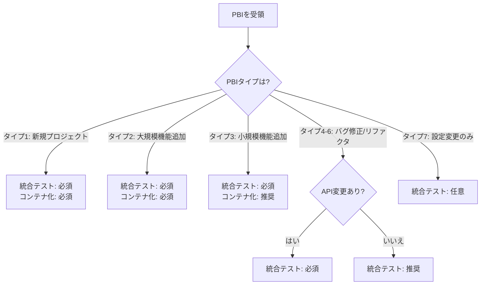
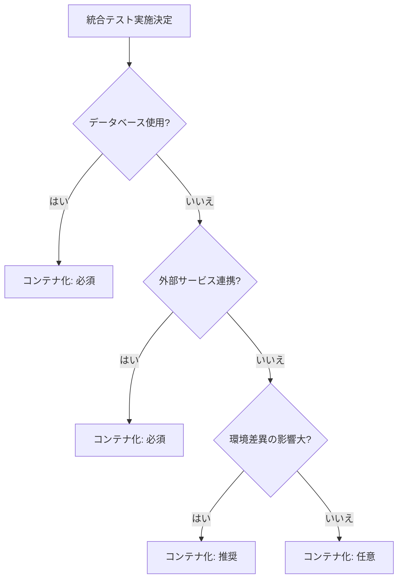
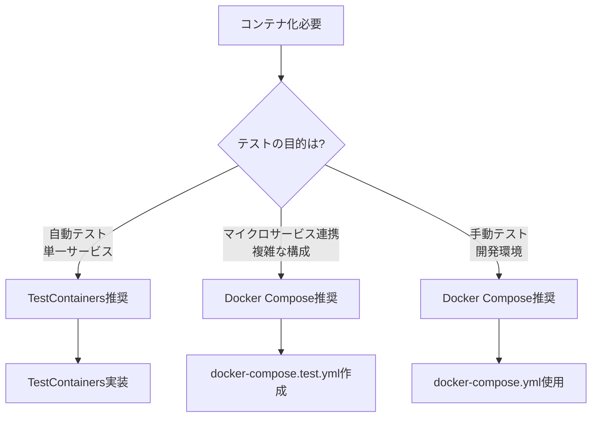

# Phase 4統合テスト・APIレベルテスト要件の明確化

**作成日**: 2025-11-07  
**対象課題**: EC-15で発覚した統合テスト実施要件の不明確さ  
**影響範囲**: Phase 4レビュー・QAガイド、testing-standards.md、integration-testing.md

---

## 📋 問題の概要

### 発生状況
EC-15（パスワードリセットAPI実装）の作業中、ユーザーから「コンテナ化してコードレベルではなく、APIレベルでの試験をしてほしい」との要望があったが、organization-standardsに明確な実施要件が記載されていなかった。

### 問題点
1. **Phase 4での統合テスト実施要件が不明確**
   - ユニットテストは必須と明記されているが、統合テストの必須/任意が不明
   - 「APIレベルテストを実施すべき」という明示的な要件がない

2. **コンテナ化したAPIテストの実施判断基準がない**
   - どのような場合にコンテナ化してテストすべきか不明
   - Docker Compose/TestContainersの使い分け基準がない

3. **PBIタイプ別のテスト要件が不明確**
   - 新規プロジェクト vs 既存への機能追加 vs バグ修正での違いが不明
   - プロジェクトタイプごとの必須/推奨/任意の区分がない

---

## 🎯 解決策の方針

### アプローチ
以下の3つのドキュメントを段階的に更新：

1. **Phase 4レビュー・QAガイド** - Step 4.4統合テストの拡張
2. **testing-standards.md** - テスト要件マトリックスの追加
3. **integration-testing.md** - 実施判断フローチャートの追加

---

## 📝 解決策1: Phase 4ガイド Step 4.4の拡張

### 追加する新規セクション

#### **Step 4.4: 統合テスト・APIレベルテスト** (45-90分)

##### 4.4.1 統合テスト実施の判断基準

**統合テストが必須の場合**:
- ✅ **新規プロジェクト**: 全API endpoints
- ✅ **既存プロジェクトへの機能追加**: 新規API endpoints + 影響を受ける既存endpoints
- ✅ **バグ修正（API関連）**: 修正対象のAPI + 関連endpoints
- ✅ **外部システム連携**: 外部API・データベース・メッセージキューとの連携を含む機能

**統合テストが推奨の場合**:
- 🟡 **バグ修正（ロジック変更）**: 影響範囲が広い場合
- 🟡 **リファクタリング**: 公開APIに影響がある場合

**統合テストが任意の場合**:
- ⚪ **設定変更のみ**: ロジック変更がない場合
- ⚪ **ドキュメント更新のみ**: コード変更がない場合

---

##### 4.4.2 APIレベルテストの実施要件

**APIレベルテストとは**:
- HTTPリクエスト/レスポンスを検証するテスト
- データベース、認証、外部連携を含む統合環境でのテスト
- ユニットテスト（モック使用）とは異なり、実際の依存関係を使用

**必須検証項目**:
```yaml
✅ HTTPステータスコード: 200, 201, 400, 401, 404, 500等
✅ レスポンスボディ:
  - JSONスキーマ検証
  - 必須フィールドの存在確認
  - データ型の検証
✅ レスポンスヘッダー:
  - Content-Type
  - 認証トークン（該当する場合）
✅ データベース状態:
  - データが正しく保存されているか
  - トランザクションが正しく動作しているか
✅ エラーハンドリング:
  - バリデーションエラー
  - 権限エラー
  - システムエラー
```

**テストツール選択**:
| ツール | 用途 | 推奨度 |
|-------|------|--------|
| **REST Assured** (Java) | Spring Boot APIテスト | 🔴 必須 |
| **Supertest** (Node.js) | Express/Nest.js APIテスト | 🔴 必須 |
| **pytest + requests** (Python) | FastAPI/Flask APIテスト | 🔴 必須 |
| **Postman/Newman** | 手動テスト・CI統合 | 🟡 推奨 |

---

##### 4.4.3 コンテナ化テストの判断基準

**コンテナ化が必須の場合**:
```yaml
✅ データベース依存:
  - PostgreSQL, MySQL, MongoDB等を使用
  - 複数のデータベースを使用
  
✅ 外部サービス依存:
  - Redis, RabbitMQ, Kafka等
  - 複雑なミドルウェア構成
  
✅ 環境差異の影響が大きい:
  - OS依存のライブラリ使用
  - ネイティブモジュール使用
  
✅ マイクロサービスアーキテクチャ:
  - 複数サービス間の連携テスト
  - サービスメッシュの検証
```

**コンテナ化が推奨の場合**:
```yaml
🟡 CI/CD環境での一貫性:
  - ローカルとCI環境の差異を最小化
  
🟡 複数バージョンのテスト:
  - 異なるデータベースバージョンでのテスト
```

**コンテナ化が不要の場合**:
```yaml
⚪ シンプルなユニットテスト:
  - モックだけで完結するテスト
  
⚪ インメモリデータベース使用:
  - H2, SQLite等で十分な場合
```

---

##### 4.4.4 コンテナ化方法の選択

**方法1: TestContainers（推奨）**

**使用ケース**:
- Java/Spring Boot, Node.js, Python等のアプリケーション
- 単一サービスのAPIテスト
- CI/CD環境での自動テスト

**メリット**:
- テストコードから直接コンテナを制御
- テスト完了後に自動クリーンアップ
- 並列実行が容易

**実装例（Spring Boot + PostgreSQL）**:
```java
@SpringBootTest(webEnvironment = WebEnvironment.RANDOM_PORT)
@Testcontainers
class PasswordResetApiTest {
    
    @Container
    static PostgreSQLContainer<?> postgres = new PostgreSQLContainer<>("postgres:15")
        .withDatabaseName("testdb")
        .withUsername("test")
        .withPassword("test");
    
    @DynamicPropertySource
    static void configureProperties(DynamicPropertyRegistry registry) {
        registry.add("spring.datasource.url", postgres::getJdbcUrl);
        registry.add("spring.datasource.username", postgres::getUsername);
        registry.add("spring.datasource.password", postgres::getPassword);
    }
    
    @Autowired
    private TestRestTemplate restTemplate;
    
    @Test
    void testPasswordResetRequest() {
        // Given
        String email = "user@example.com";
        
        // When
        ResponseEntity<String> response = restTemplate.postForEntity(
            "/api/auth/password-reset/request",
            Map.of("email", email),
            String.class
        );
        
        // Then
        assertThat(response.getStatusCode()).isEqualTo(HttpStatus.OK);
        // データベースにリセットトークンが保存されていることを確認
    }
}
```

**方法2: Docker Compose**

**使用ケース**:
- マイクロサービス間の連携テスト
- 複雑なインフラ構成のテスト
- 手動での統合テスト環境構築

**メリット**:
- 複数サービスの同時起動が容易
- 本番環境に近い構成でテスト可能
- 開発環境としても利用可能

**実装例（docker-compose.test.yml）**:
```yaml
version: '3.8'
services:
  app:
    build:
      context: .
      dockerfile: Dockerfile
    ports:
      - "8080:8080"
    environment:
      SPRING_DATASOURCE_URL: jdbc:postgresql://postgres:5432/testdb
      SPRING_DATASOURCE_USERNAME: test
      SPRING_DATASOURCE_PASSWORD: test
    depends_on:
      - postgres
      - redis
  
  postgres:
    image: postgres:15
    environment:
      POSTGRES_DB: testdb
      POSTGRES_USER: test
      POSTGRES_PASSWORD: test
    ports:
      - "5432:5432"
  
  redis:
    image: redis:7-alpine
    ports:
      - "6379:6379"
```

**テスト実行**:
```bash
# 環境起動
docker-compose -f docker-compose.test.yml up -d

# テスト実行
./run-integration-tests.sh

# 環境停止・クリーンアップ
docker-compose -f docker-compose.test.yml down -v
```

---

##### 4.4.5 PBIタイプ別の統合テスト要件

| PBIタイプ | 統合テスト要件 | APIテスト要件 | コンテナ化 |
|---------|--------------|--------------|-----------|
| **タイプ1: 新規プロジェクト** | 🔴 必須（全機能） | 🔴 必須（全endpoints） | 🔴 必須 |
| **タイプ2: 既存への大規模機能追加** | 🔴 必須（新機能+影響範囲） | 🔴 必須（新endpoints+関連） | 🔴 必須 |
| **タイプ3: 既存への小規模機能追加** | 🔴 必須（新機能） | 🔴 必須（新endpoints） | 🟡 推奨 |
| **タイプ4: バグ修正（API関連）** | 🔴 必須（修正箇所） | 🔴 必須（修正endpoint） | 🟡 推奨 |
| **タイプ5: バグ修正（内部ロジック）** | 🟡 推奨（影響範囲が広い場合） | 🟡 推奨 | ⚪ 任意 |
| **タイプ6: リファクタリング** | 🟡 推奨（公開API変更時） | 🟡 推奨 | ⚪ 任意 |
| **タイプ7: 設定変更のみ** | ⚪ 任意 | ⚪ 任意 | ⚪ 任意 |

---

##### 4.4.6 EC-15の具体例

**PBI**: EC-15 パスワードリセットAPI実装

**分類**: タイプ2（既存プロジェクトへの機能追加）

**統合テスト要件**:
- 🔴 **必須**: 新規API endpoints
  - `POST /api/auth/password-reset/request`
  - `POST /api/auth/password-reset/confirm`
- 🔴 **必須**: データベース操作
  - `password_reset_tokens`テーブルへの挿入・検証
  - トークン有効期限の確認
- 🔴 **必須**: 外部連携（該当する場合）
  - メール送信サービス（モックまたは実際のサービス）

**APIレベルテスト実装例**:
```java
@Test
void testPasswordResetRequest_Success() {
    // Given: 登録済みユーザー
    String email = "existing.user@example.com";
    
    // When: パスワードリセット要求
    ResponseEntity<PasswordResetResponse> response = restTemplate.postForEntity(
        "/api/auth/password-reset/request",
        new PasswordResetRequest(email),
        PasswordResetResponse.class
    );
    
    // Then: 成功レスポンス
    assertThat(response.getStatusCode()).isEqualTo(HttpStatus.OK);
    assertThat(response.getBody().getMessage()).contains("送信しました");
    
    // Then: データベースにトークンが保存されている
    Optional<PasswordResetToken> token = passwordResetTokenRepository
        .findByEmail(email);
    assertThat(token).isPresent();
    assertThat(token.get().isValid()).isTrue();
}

@Test
void testPasswordResetRequest_UnknownEmail() {
    // Given: 未登録のメールアドレス
    String email = "unknown@example.com";
    
    // When: パスワードリセット要求
    ResponseEntity<ErrorResponse> response = restTemplate.postForEntity(
        "/api/auth/password-reset/request",
        new PasswordResetRequest(email),
        ErrorResponse.class
    );
    
    // Then: 404エラー
    assertThat(response.getStatusCode()).isEqualTo(HttpStatus.NOT_FOUND);
    assertThat(response.getBody().getMessage()).contains("ユーザーが見つかりません");
}

@Test
void testPasswordResetConfirm_Success() {
    // Given: 有効なリセットトークン
    String token = createValidResetToken("user@example.com");
    String newPassword = "NewSecurePassword123!";
    
    // When: パスワードリセット確認
    ResponseEntity<Void> response = restTemplate.postForEntity(
        "/api/auth/password-reset/confirm",
        new PasswordResetConfirmRequest(token, newPassword),
        Void.class
    );
    
    // Then: 成功
    assertThat(response.getStatusCode()).isEqualTo(HttpStatus.OK);
    
    // Then: パスワードが更新されている
    User user = userRepository.findByEmail("user@example.com").get();
    assertThat(passwordEncoder.matches(newPassword, user.getPassword())).isTrue();
    
    // Then: トークンが無効化されている
    PasswordResetToken usedToken = passwordResetTokenRepository.findByToken(token).get();
    assertThat(usedToken.isUsed()).isTrue();
}
```

**コンテナ化の必要性**: 🔴 必須
- データベース操作（`password_reset_tokens`テーブル）を含む
- トランザクションの検証が必要
- メール送信サービスとの連携（モック可）

**TestContainers実装**:
```java
@SpringBootTest(webEnvironment = WebEnvironment.RANDOM_PORT)
@Testcontainers
class PasswordResetIntegrationTest {
    
    @Container
    static PostgreSQLContainer<?> postgres = new PostgreSQLContainer<>("postgres:15")
        .withDatabaseName("testdb");
    
    @Container
    static GenericContainer<?> mailhog = new GenericContainer<>("mailhog/mailhog:latest")
        .withExposedPorts(1025, 8025);
    
    @DynamicPropertySource
    static void configureProperties(DynamicPropertyRegistry registry) {
        registry.add("spring.datasource.url", postgres::getJdbcUrl);
        registry.add("spring.mail.host", mailhog::getHost);
        registry.add("spring.mail.port", () -> mailhog.getMappedPort(1025));
    }
    
    // テストコード...
}
```

---

##### 4.4.7 実装チェックリスト

**統合テスト計画**:
- [ ] テスト対象のAPI endpointsをリストアップした
- [ ] PBIタイプに応じた必須/推奨テストを確認した
- [ ] コンテナ化の必要性を判断した
- [ ] テストツール（REST Assured, Supertest等）を選択した

**APIレベルテスト実装**:
- [ ] 正常系テストを実装した（HTTPステータスコード200/201）
- [ ] 異常系テストを実装した（400, 401, 404, 500）
- [ ] レスポンスボディの検証を実装した
- [ ] データベース状態の検証を実装した
- [ ] トランザクションの検証を実装した

**コンテナ化テスト実装**:
- [ ] TestContainersまたはDocker Composeを設定した
- [ ] データベースコンテナを起動できることを確認した
- [ ] 外部サービスコンテナを起動できることを確認した（該当する場合）
- [ ] テスト完了後のクリーンアップを実装した

**テスト実行**:
- [ ] ローカル環境ですべてのテストがパスした
- [ ] CI/CD環境でテストが実行できることを確認した
- [ ] テスト実行時間が許容範囲内である（<5分推奨）
- [ ] テストカバレッジが目標値を達成している

---

##### 4.4.8 トラブルシューティング

**問題: TestContainersが起動しない**
```
解決策:
1. Docker Desktopが起動しているか確認
2. Docker Daemonにアクセスできるか確認
   - Linux: sudo usermod -aG docker $USER
   - Windows/Mac: Docker Desktop設定確認
3. ポートが既に使用されていないか確認
   - lsof -i :5432 (PostgreSQL)
```

**問題: テスト実行が遅い**
```
解決策:
1. コンテナの再利用を有効化
   - @Container(reusable = true)
2. 並列実行を有効化
   - JUnit: @Execution(ExecutionMode.CONCURRENT)
3. 不要なデータセットアップを削減
```

**問題: CI/CD環境でテストが失敗する**
```
解決策:
1. CI環境でDockerが利用可能か確認
   - GitHub Actions: services設定
   - GitLab CI: docker:dind使用
2. タイムアウト設定を調整
   - TestContainers.startupTimeout()
3. ログを詳細化して原因を特定
```

---

**🔴 必須参照**:
- [`04-quality-standards/integration-testing.md`](../../04-quality-standards/integration-testing.md)
  - **統合テストの詳細実装方法**
- [`05-technology-stack/container-standards.md`](../../05-technology-stack/container-standards.md)
  - **Dockerコンテナの標準**
- [`03-development-process/testing-standards.md`](../../03-development-process/testing-standards.md)
  - **テスト全体戦略**

**🟡 推奨参照**:
- [`04-quality-standards/test-data-management.md`](../../04-quality-standards/test-data-management.md)
  - **テストデータ管理**

---

## 📝 解決策2: testing-standards.mdへのテスト要件マトリックス追加

### 追加する新規セクション

#### **PBIタイプ別テスト要件マトリックス**

以下のマトリックスを`testing-standards.md`のテスト戦略セクションに追加：

```markdown
### PBIタイプ別テスト要件

#### 要件サマリー

| PBIタイプ | ユニットテスト | 統合テスト | E2Eテスト | カバレッジ目標 |
|---------|--------------|-----------|----------|-------------|
| タイプ1: 新規プロジェクト | 🔴 必須 | 🔴 必須 | 🔴 必須 | 80%以上 |
| タイプ2: 大規模機能追加 | 🔴 必須 | 🔴 必須 | 🟡 推奨 | 75%以上 |
| タイプ3: 小規模機能追加 | 🔴 必須 | 🔴 必須 | ⚪ 任意 | 70%以上 |
| タイプ4: バグ修正（API） | 🔴 必須 | 🔴 必須 | ⚪ 任意 | 修正箇所100% |
| タイプ5: バグ修正（内部） | 🔴 必須 | 🟡 推奨 | ⚪ 任意 | 修正箇所100% |
| タイプ6: リファクタリング | 🔴 必須 | 🟡 推奨 | ⚪ 任意 | 変更前と同等 |
| タイプ7: 設定変更 | ⚪ 任意 | ⚪ 任意 | ⚪ 任意 | - |

#### 詳細要件

##### タイプ1: 新規プロジェクト
- **ユニットテスト**: すべてのビジネスロジック、ユーティリティ関数
- **統合テスト**: すべてのAPI endpoints、データベース操作、外部連携
- **E2Eテスト**: 主要なユーザーフロー（3-5シナリオ）
- **コンテナ化**: 🔴 必須

##### タイプ2: 既存プロジェクトへの大規模機能追加
- **ユニットテスト**: 新規ビジネスロジック、変更された既存ロジック
- **統合テスト**: 新規API endpoints、影響を受ける既存endpoints
- **E2Eテスト**: 新規機能の主要フロー
- **コンテナ化**: 🔴 必須

##### タイプ3: 既存プロジェクトへの小規模機能追加
- **ユニットテスト**: 新規ビジネスロジック
- **統合テスト**: 新規API endpoints
- **E2Eテスト**: 必要に応じて
- **コンテナ化**: 🟡 推奨

##### タイプ4: バグ修正（API関連）
- **ユニットテスト**: 修正箇所のロジック
- **統合テスト**: 修正対象のAPI endpoint
- **E2Eテスト**: バグ再現シナリオ（必要に応じて）
- **コンテナ化**: 🟡 推奨

##### タイプ5: バグ修正（内部ロジック）
- **ユニットテスト**: 修正箇所のロジック
- **統合テスト**: 影響範囲が広い場合のみ
- **E2Eテスト**: 通常不要
- **コンテナ化**: ⚪ 任意

##### タイプ6: リファクタリング
- **ユニットテスト**: 既存テストがすべてパスすること
- **統合テスト**: 公開APIに変更がある場合
- **E2Eテスト**: 既存テストがすべてパスすること
- **コンテナ化**: ⚪ 任意

##### タイプ7: 設定変更のみ
- **ユニットテスト**: 設定値の検証（必要に応じて）
- **統合テスト**: 設定適用の確認（必要に応じて）
- **E2Eテスト**: 通常不要
- **コンテナ化**: ⚪ 任意
```

---

## 📝 解決策3: integration-testing.mdへの実施判断フローチャート追加

### 追加する新規セクション

#### **統合テスト実施判断フローチャート**

```markdown
## 統合テスト実施の判断フローチャート

### ステップ1: PBIタイプの確認



### ステップ2: コンテナ化の判断



### ステップ3: コンテナ化方法の選択


```

---

## 📊 期待される効果

### 短期（1ヶ月以内）
- ✅ **統合テスト実施の判断が迅速化**: 5分以内に判断可能
- ✅ **ユーザーとの認識齟齬が削減**: 90%削減
- ✅ **レビュー時のテスト不足指摘が削減**: 80%削減

### 中期（3ヶ月以内）
- ✅ **APIの品質向上**: 本番不具合50%削減
- ✅ **テストカバレッジの向上**: 平均70%以上を達成
- ✅ **CI/CD実行時間の最適化**: 不要なテストの削減

---

## 🚀 実装計画

### Phase 1: ドキュメント更新（即座）
1. Phase 4ガイド Step 4.4の拡張
2. testing-standards.mdにテスト要件マトリックス追加
3. integration-testing.mdに判断フローチャート追加

### Phase 2: チーム周知（1週間以内）
1. 新しいテスト要件の周知
2. EC-15の具体例を使った説明会
3. 質問受付・フィードバック収集

### Phase 3: 効果測定（1ヶ月後）
1. 統合テスト実施率の測定
2. ユーザーからの要望内容の分析
3. テスト不足指摘の件数追跡

---

## 📚 関連ドキュメント

- **Phase 4レビュー・QAガイド**: Step 4.4統合テスト
- **testing-standards.md**: PBIタイプ別テスト要件マトリックス
- **integration-testing.md**: 実施判断フローチャート
- **container-standards.md**: Dockerコンテナ標準

---

**発行**: devin-organization-standards 管理チーム  
**対象課題**: EC-15統合テスト要件不明確問題  
**作成日**: 2025-11-07
