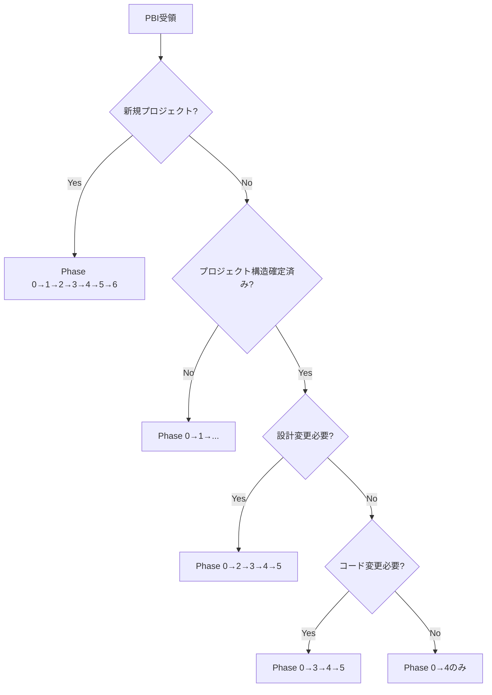

# devin-organization-standards ドキュメント体系分析レポート

## 📊 分析日時
2025年11月6日

## 🎯 分析概要

「devin-organization-standards」は、AIエージェント（Devin、Cursor等）が自律的にシステム開発を進めるための包括的なドキュメント体系です。

---

## ✅ 現状の優れている点

### 1. 明確な3層構造
ドキュメントは以下の3層に整理されており、非常に体系的です。

```
Layer 1: マスターガイド（司令塔）
  ├─ AI-MASTER-WORKFLOW-GUIDE.md (40KB) - 全フェーズ統合ワークフロー
  ├─ DOCUMENT-USAGE-MANUAL.md (29KB) - 利用マニュアル
  └─ AI-DOCUMENT-NAVIGATOR.md - ドキュメント選択ツリー

Layer 2: フェーズ別・AI活用ガイド（実行手順）
  ├─ phase-guides/ (7フェーズ × 7ファイル)
  └─ ai-guides/ (7ファイル)

Layer 3: 組織標準ドキュメント（参照標準）
  └─ 01-10/ (10カテゴリ、97ファイル)
```

### 2. PBIベースの開発フロー
JIRA PBIを起点とした明確な開発フローが定義されています：

```
PBI受領 → Phase 0 → Phase 1 → ... → Phase 6 → 運用保守
```

### 3. 柔軟なフェーズスキップ機能 ⭐
**これは素晴らしい設計です**：
- 7つのPBIタイプ別に推奨フローを定義
- フェーズスキップの判断フローチャートを提供
- 各フェーズの開始条件とスキップ条件を明示

例：
- 新規プロジェクト → 全フェーズ実施
- 既存への機能追加 → Phase 1スキップ
- バグ修正 → Phase 0(簡易) → 3 → 4

### 4. 完了チェックリスト
各フェーズに対応するチェックリストが用意されており、品質担保に寄与しています。

### 5. 豊富なテンプレート
08-templates/ には実務で使えるテンプレートが充実しています。

---

## ⚠️ 改善が必要な点

### 1. **エントリーポイントの不明確さ** 🔴重要

#### 問題点
AIがこのドキュメント体系に初めて触れた時、**どこから読み始めるべきか**が明確ではありません。

#### 現状
- ルートのREADME.mdに全体構造は記載されているが、「最初に読むべき順序」が不明瞭
- AI-MASTER-WORKFLOW-GUIDE.mdが司令塔であることは理解できるが、その前に読むべきものがあるのか判断しづらい

#### 推奨改善策

**A. ルートREADME.mdに「クイックスタートガイド」セクションを追加**

```markdown
## 🚀 クイックスタート（初回利用者向け）

### AIエージェントの場合

**ステップ1: 初回セットアップ（30-60分）**
1. このREADME.md（今読んでいるファイル）
2. `00-guides/DOCUMENT-USAGE-MANUAL.md` - 体系全体の理解
3. `00-guides/AI-MASTER-WORKFLOW-GUIDE.md` - ワークフローの理解
4. `00-guides/ai-guides/AI-QUICK-REFERENCE.md` - 数値基準の把握

**ステップ2: PBI受領後（都度実行）**
1. `00-guides/AI-MASTER-WORKFLOW-GUIDE.md` のPhase 0を開く
2. フェーズごとにガイドに従って実行

### 人間開発者の場合
...
```

**B. 読む順序の視覚化**

```
┌─────────────────────────────────────┐
│ 1️⃣ まず最初に読むべき（必須）        │
│   ✓ README.md（このファイル）        │
│   ✓ 00-guides/DOCUMENT-USAGE-MANUAL.md │
├─────────────────────────────────────┤
│ 2️⃣ 次に読むべき（必須）              │
│   ✓ AI-MASTER-WORKFLOW-GUIDE.md     │
│   ✓ AI-QUICK-REFERENCE.md           │
├─────────────────────────────────────┤
│ 3️⃣ 開発時に参照（必要に応じて）      │
│   ・phase-guides/                   │
│   ・01-10/ 組織標準                 │
└─────────────────────────────────────┘
```

---

### 2. **「作業開始前チェックリスト」の不在** 🟡重要

#### 問題点
AIが作業を開始する前に確認すべき事項が散在しており、1箇所にまとまっていません。

#### 推奨改善策

**新規ファイルの作成: `00-guides/AI-PRE-WORK-CHECKLIST.md`**

```markdown
# AI作業開始前チェックリスト

## 初回起動時（1回のみ）
- [ ] README.mdを読んだ
- [ ] DOCUMENT-USAGE-MANUAL.mdを読んだ
- [ ] AI-MASTER-WORKFLOW-GUIDE.mdを読んだ
- [ ] AI-QUICK-REFERENCE.mdで数値基準を把握した
- [ ] ドキュメント体系の3層構造を理解した

## PBI受領時（毎回）
- [ ] PBI情報を完全に読み込んだ
- [ ] PBIタイプを判別した（7タイプ）
- [ ] 実行すべきフェーズを判断した
- [ ] 必要な既存プロジェクト情報を確認した

## フェーズ開始時（フェーズごと）
- [ ] 前フェーズの成果物を確認した
- [ ] このフェーズの参照ドキュメントリストを確認した
- [ ] 🔴必須ドキュメントを読んだ
- [ ] このフェーズの完了条件を理解した
```

---

### 3. **意思決定フローの視覚化不足** 🟡

#### 問題点
フェーズスキップの判断フローチャートはテキストベースで記載されていますが、複雑な判断には視覚的な図があると理解しやすくなります。

#### 推奨改善策

**Mermaidフローチャートの追加**

```markdown
## フェーズスキップ判断フロー


```

※MarkdownをサポートするツールではMermaid図が自動レンダリングされます

---

### 4. **エスカレーション基準の詳細化不足** 🟡

#### 問題点
AI-MASTER-WORKFLOW-GUIDE.mdに「エスカレーション基準」の記載はありますが、具体的な判断基準が不足しています。

#### 推奨改善策

**エスカレーション判断マトリクスの追加**

```markdown
## エスカレーション判断マトリクス

| 状況 | 重要度 | エスカレーション | 対応 |
|------|--------|----------------|------|
| PBIの受入基準が不明瞭 | 🔴高 | 即座 | 作業停止、人間確認 |
| 技術スタックの選定 | 🔴高 | 即座 | 選択肢を提示、人間判断 |
| パフォーマンス要件未記載 | 🟡中 | 記録後進行可 | デフォルト値適用、後で確認 |
| コードレビュー結果 | 🟡中 | Phase 4完了時 | レビュー結果を報告 |
| コーディングスタイルの解釈 | 🟢低 | 不要 | 組織標準に従う |
```

---

### 5. **フェーズ間の情報引き継ぎフォーマットの標準化** 🟢

#### 問題点
各フェーズの「入力」「出力」は記載されていますが、実際のファイルフォーマットやディレクトリ構成が明示されていません。

#### 推奨改善策

**プロジェクトディレクトリ構成の標準テンプレート**

```markdown
## 標準ディレクトリ構成

```
project-root/
├── docs/
│   ├── phase-0/
│   │   ├── requirements-analysis-[PBI-KEY].md
│   │   ├── task-breakdown-[PBI-KEY].md
│   │   └── clarification-request-[PBI-KEY].md
│   ├── phase-1/
│   │   ├── project-structure.md
│   │   └── technology-selection.md
│   ├── phase-2/
│   │   ├── architecture-design.md
│   │   ├── api-specification.yaml
│   │   └── data-model.md
│   ...
├── src/
├── tests/
└── README.md
```
```

---

### 6. **進捗状況の可視化機能の不在** 🟢

#### 問題点
現在どのフェーズのどのステップにいるのか、進捗状況を記録・確認する仕組みが不足しています。

#### 推奨改善策

**進捗トラッキングファイルのテンプレート**

新規ファイル: `08-templates/progress-tracking-template.md`

```markdown
# 開発進捗トラッキング: [PBI-KEY]

## 基本情報
- PBI: [PROJ-123] ユーザー認証機能の実装
- 開始日: 2025-11-06
- 担当: Devin AI Agent
- 現在のフェーズ: Phase 3 (実装)

## フェーズ実行状況

| Phase | ステータス | 開始日 | 完了日 | 成果物 |
|-------|----------|--------|--------|--------|
| Phase 0 | ✅完了 | 2025-11-06 | 2025-11-06 | requirements-analysis.md |
| Phase 1 | ⏭️スキップ | - | - | 既存プロジェクト |
| Phase 2 | ✅完了 | 2025-11-06 | 2025-11-06 | api-design.yaml |
| Phase 3 | 🔄進行中 | 2025-11-06 | - | - |
| Phase 4 | ⏳未着手 | - | - | - |
| Phase 5 | ⏳未着手 | - | - | - |
| Phase 6 | ⏳未着手 | - | - | - |

## 現在のタスク
- [x] ユーザーモデル実装
- [x] 認証API実装
- [ ] テストコード作成（進行中）
- [ ] ドキュメント更新

## ブロッカー
なし

## 次のアクション
- ユニットテスト完成後、Phase 4へ移行
```

---

### 7. **AI学習曲線を考慮した段階的ガイドの不足** 🟢

#### 問題点
初めて使うAIと、2回目以降のAIで、必要な情報量が異なります。

#### 推奨改善策

**段階別ガイドの作成**

```markdown
## AIの習熟度別ガイド

### 🆕 初回利用（Day 1）
- 読むべき: README.md, DOCUMENT-USAGE-MANUAL.md, AI-MASTER-WORKFLOW-GUIDE.md
- 目標: ドキュメント体系の理解
- 所要時間: 30-60分

### 📚 学習中（Day 2-5）
- 読むべき: phase-guides/, AI-QUICK-REFERENCE.md
- 目標: 各フェーズの詳細理解
- 実践: 簡単なPBIで試してみる

### 💼 習熟（Day 6+）
- 参照: 必要に応じて組織標準ドキュメント
- 目標: 自律的な開発
- 効率化: クイックリファレンスを活用
```

---

## 📋 改善提案の優先順位

### 🔴 最優先（即座に対応推奨）

1. **エントリーポイントの明確化**
   - ルートREADME.mdに「クイックスタートガイド」追加
   - 読む順序の視覚化

2. **作業開始前チェックリストの作成**
   - `00-guides/AI-PRE-WORK-CHECKLIST.md` の新規作成

### 🟡 重要（早期対応推奨）

3. **意思決定フローの視覚化**
   - Mermaidフローチャートの追加

4. **エスカレーション基準の詳細化**
   - 判断マトリクスの追加

### 🟢 推奨（余裕があれば対応）

5. **フェーズ間情報引き継ぎの標準化**
   - ディレクトリ構成テンプレート

6. **進捗トラッキング機能**
   - progress-tracking-template.md の作成

7. **段階的学習ガイド**
   - 習熟度別ガイドの追加

---

## 🎯 実装ロードマップ案

### Week 1: クイックウィン
- [ ] ルートREADME.mdにクイックスタート追加
- [ ] AI-PRE-WORK-CHECKLIST.md 作成

### Week 2: 可視化強化
- [ ] フローチャート（Mermaid）追加
- [ ] エスカレーションマトリクス追加

### Week 3: テンプレート拡充
- [ ] ディレクトリ構成テンプレート作成
- [ ] progress-tracking-template.md 作成

### Week 4: 学習支援
- [ ] 段階的学習ガイド追加
- [ ] FAQ拡充

---

## 💡 その他の提案

### A. ドキュメントのバージョン管理
現在、個別ファイルにバージョン情報がありますが、体系全体のバージョンを明示することを推奨します。

```markdown
## ドキュメント体系バージョン
- **体系バージョン**: 2.0.0
- **最終更新日**: 2025-11-05
- **メジャー変更**: Phase 0の追加、フェーズスキップ機能の追加
```

### B. 変更履歴の追加
`CHANGELOG.md` ファイルを作成し、重要な変更を記録することを推奨します。

### C. 用語集のインデックス化
`09-reference/glossary.md` を充実させ、頻繁に参照される用語のクイックリンクを用意。

---

## ✅ 結論

**現状のドキュメント体系は非常に優れています**が、以下の点を改善することで、AIの自律性と作業効率がさらに向上します：

1. ✅ **体系的な構造** - 3層構造が明確
2. ✅ **柔軟なフロー** - フェーズスキップ機能が秀逸
3. ✅ **豊富なテンプレート** - 実務で使えるリソースが充実

⚠️ **改善余地**：
- エントリーポイントの明確化（最優先）
- チェックリストの統合
- 視覚化の強化

上記改善を実施することで、**AIが迷わず自律的に作業を進められる**体系になります。

---

## 📊 総合評価

| 項目 | 評価 | コメント |
|------|------|---------|
| **体系性** | ⭐⭐⭐⭐⭐ | 3層構造が非常に明確 |
| **完全性** | ⭐⭐⭐⭐☆ | 全フェーズをカバー、細部に若干の不足 |
| **実用性** | ⭐⭐⭐⭐☆ | テンプレートが豊富、エントリーポイントが改善点 |
| **柔軟性** | ⭐⭐⭐⭐⭐ | フェーズスキップ機能が優秀 |
| **わかりやすさ** | ⭐⭐⭐☆☆ | 視覚化を強化すると更に向上 |

**総合評価: ⭐⭐⭐⭐☆ (4.2/5.0)**

非常に優れた体系です。上記改善を実施することで5.0を目指せます。
