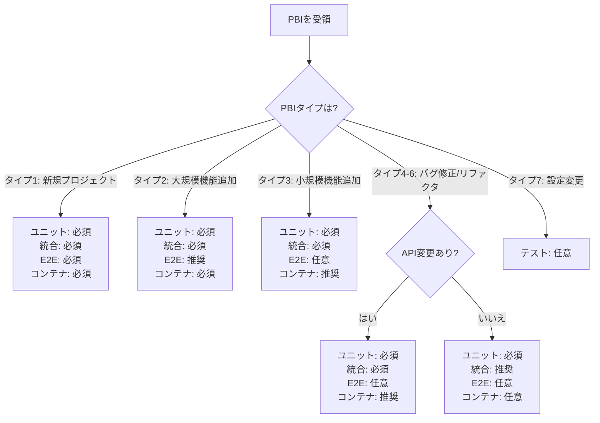

# testing-standards.md - PBIタイプ別テスト要件マトリックス追加

> **統合先**: `03-development-process/testing-standards.md`  
> **挿入位置**: テスト戦略セクションの後  
> **理由**: EC-15で発覚したPBIタイプ別テスト要件の不明確さを解決

---

## PBIタイプ別テスト要件マトリックス 🆕

### 概要

開発タスクの種類（PBIタイプ）によって、必要なテストレベルと実施要件が異なります。以下のマトリックスは、各PBIタイプに対する最適なテスト戦略を示します。

---

### 要件サマリー

| PBIタイプ | ユニットテスト | 統合テスト | E2Eテスト | カバレッジ目標 | コンテナ化 |
|---------|--------------|-----------|----------|-------------|-----------|
| **タイプ1: 新規プロジェクト** | 🔴 必須 | 🔴 必須 | 🔴 必須 | 80%以上 | 🔴 必須 |
| **タイプ2: 大規模機能追加** | 🔴 必須 | 🔴 必須 | 🟡 推奨 | 75%以上 | 🔴 必須 |
| **タイプ3: 小規模機能追加** | 🔴 必須 | 🔴 必須 | ⚪ 任意 | 70%以上 | 🟡 推奨 |
| **タイプ4: バグ修正（API）** | 🔴 必須 | 🔴 必須 | ⚪ 任意 | 修正箇所100% | 🟡 推奨 |
| **タイプ5: バグ修正（内部）** | 🔴 必須 | 🟡 推奨 | ⚪ 任意 | 修正箇所100% | ⚪ 任意 |
| **タイプ6: リファクタリング** | 🔴 必須 | 🟡 推奨 | ⚪ 任意 | 変更前と同等 | ⚪ 任意 |
| **タイプ7: 設定変更のみ** | ⚪ 任意 | ⚪ 任意 | ⚪ 任意 | - | ⚪ 任意 |

**凡例**:
- 🔴 **必須**: 実施しない場合、PRマージ不可
- 🟡 **推奨**: 実施を強く推奨（影響範囲に応じて判断）
- ⚪ **任意**: 必要に応じて実施

---

### 詳細要件

#### タイプ1: 新規プロジェクト

**定義**: ゼロから新しいプロジェクト・アプリケーションを作成

**ユニットテスト**: 🔴 必須
```yaml
対象:
  - すべてのビジネスロジック
  - ユーティリティ関数
  - ドメインモデル
  - バリデーションロジック
  
カバレッジ目標: 80%以上
```

**統合テスト**: 🔴 必須
```yaml
対象:
  - すべてのAPI endpoints
  - データベース操作（CRUD）
  - 外部API連携
  - トランザクション処理
  
実装方法: TestContainers推奨
```

**E2Eテスト**: 🔴 必須
```yaml
対象:
  - 主要なユーザーフロー（3-5シナリオ）
  - 認証・認可フロー
  - エラーハンドリング
  
ツール: Playwright, Cypress, Selenium
```

**コンテナ化**: 🔴 必須
- データベース、Redis等の依存サービスを含む

---

#### タイプ2: 既存プロジェクトへの大規模機能追加

**定義**: 既存システムに大規模な新機能を追加（新規テーブル追加、複数API追加等）

**ユニットテスト**: 🔴 必須
```yaml
対象:
  - 新規ビジネスロジック
  - 変更された既存ロジック
  - 新規ドメインモデル
  
カバレッジ目標: 新規コード75%以上
```

**統合テスト**: 🔴 必須
```yaml
対象:
  - 新規API endpoints
  - 影響を受ける既存endpoints
  - 新規データベース操作
  - 既存データとの連携
  
実装方法: TestContainers推奨
```

**E2Eテスト**: 🟡 推奨
```yaml
対象:
  - 新規機能の主要フロー
  - 既存機能との統合フロー
  
ツール: Playwright, Cypress
```

**コンテナ化**: 🔴 必須
- 既存データベーススキーマとの互換性検証が必要

**例**: EC-15（パスワードリセットAPI実装）
- 新規endpoints: `/api/auth/password-reset/request`, `/confirm`
- 新規テーブル: `password_reset_tokens`
- 外部連携: メール送信サービス

---

#### タイプ3: 既存プロジェクトへの小規模機能追加

**定義**: 既存システムに小規模な新機能を追加（1-2 API追加、既存機能の拡張等）

**ユニットテスト**: 🔴 必須
```yaml
対象:
  - 新規ビジネスロジック
  - 変更されたメソッド
  
カバレッジ目標: 新規コード70%以上
```

**統合テスト**: 🔴 必須
```yaml
対象:
  - 新規API endpoints
  - 新規データベース操作
  
実装方法: TestContainers推奨、Docker Compose可
```

**E2Eテスト**: ⚪ 任意
```yaml
対象:
  - 新規機能の基本フロー（必要に応じて）
```

**コンテナ化**: 🟡 推奨
- データベース操作を含む場合は必須

---

#### タイプ4: バグ修正（API関連）

**定義**: 公開APIに関連するバグの修正

**ユニットテスト**: 🔴 必須
```yaml
対象:
  - 修正箇所のロジック
  - 関連するロジック
  
カバレッジ目標: 修正箇所100%
```

**統合テスト**: 🔴 必須
```yaml
対象:
  - 修正対象のAPI endpoint
  - 関連endpoints
  - バグ再現テスト
  
実装方法: TestContainers推奨
```

**E2Eテスト**: ⚪ 任意
```yaml
対象:
  - バグ再現シナリオ（重大なバグの場合）
```

**コンテナ化**: 🟡 推奨
- APIテストの場合は推奨

**重要**: バグ修正には必ず**バグ再現テスト**を追加
```java
@Test
void testBugFix_Issue123_NullPointerException() {
    // Given: バグが発生する条件
    User userWithoutEmail = new User();
    userWithoutEmail.setName("Test User");
    // email is null
    
    // When: バグが発生していた操作
    ResponseEntity<String> response = restTemplate.postForEntity(
        "/api/users/send-notification",
        userWithoutEmail,
        String.class
    );
    
    // Then: エラーではなく適切にハンドリングされる
    assertThat(response.getStatusCode()).isEqualTo(HttpStatus.BAD_REQUEST);
    assertThat(response.getBody()).contains("メールアドレスが必要です");
}
```

---

#### タイプ5: バグ修正（内部ロジック）

**定義**: 公開APIに影響しない内部ロジックのバグ修正

**ユニットテスト**: 🔴 必須
```yaml
対象:
  - 修正箇所のロジック
  - バグ再現テスト
  
カバレッジ目標: 修正箇所100%
```

**統合テスト**: 🟡 推奨
```yaml
対象:
  - 影響範囲が広い場合のみ
  
実装方法: 必要に応じてTestContainers
```

**E2Eテスト**: ⚪ 任意

**コンテナ化**: ⚪ 任意

---

#### タイプ6: リファクタリング

**定義**: 既存コードの構造改善（機能変更なし）

**ユニットテスト**: 🔴 必須
```yaml
要件:
  - 既存テストがすべてパスすること
  - 新規テストは通常不要（ただし、カバレッジ向上の機会）
  
カバレッジ目標: 変更前と同等以上
```

**統合テスト**: 🟡 推奨
```yaml
対象:
  - 公開APIに変更がある場合
  - 既存テストがすべてパスすること
```

**E2Eテスト**: ⚪ 任意
```yaml
要件:
  - 既存テストがすべてパスすること
```

**コンテナ化**: ⚪ 任意

**重要**: リファクタリングの黄金ルール
1. テストを先に実行し、すべてパスすることを確認
2. リファクタリング実施
3. 同じテストを実行し、すべてパスすることを確認
4. 新しいバグを導入しないことが最優先

---

#### タイプ7: 設定変更のみ

**定義**: コードロジック変更を伴わない設定変更（環境変数、設定ファイル等）

**ユニットテスト**: ⚪ 任意
```yaml
対象:
  - 設定値の検証（必要に応じて）
```

**統合テスト**: ⚪ 任意
```yaml
対象:
  - 設定適用の確認（必要に応じて）
```

**E2Eテスト**: ⚪ 任意

**コンテナ化**: ⚪ 任意

---

### テストピラミッドとの対応

```
      /\         E2Eテスト（10%）
     /  \        - タイプ1: 必須
    /────\       - タイプ2: 推奨
   /      \      - タイプ3-7: 任意
  /────────\     
 /          \    統合テスト（30%）
/────────────\   - タイプ1-4: 必須
                 - タイプ5-6: 推奨
────────────────  
                 ユニットテスト（60%）
                 - タイプ1-6: 必須
                 - タイプ7: 任意
```

---

### Phase別テスト実施タイミング

| Phase | テストレベル | 実施内容 | 担当 |
|------|------------|---------|------|
| **Phase 3: 実装** | ユニットテスト | テストコード作成 | AIエージェント/開発者 |
| **Phase 4: レビュー・QA** | 統合テスト | APIレベルテスト実装・実行 | AIエージェント/開発者 |
| **Phase 4: レビュー・QA** | E2Eテスト | ユーザーフローテスト実装・実行 | AIエージェント/QAエンジニア |
| **Phase 5: デプロイメント** | スモークテスト | 主要機能の動作確認 | 運用チーム |

---

### 判断フローチャート



---

### 実践例

#### 例1: EC-15（パスワードリセットAPI実装）

**分類**: タイプ2（既存プロジェクトへの大規模機能追加）

**実施したテスト**:
```yaml
ユニットテスト: ✅ 実施
  - PasswordResetService: トークン生成、検証ロジック
  - PasswordResetValidator: バリデーションロジック
  - カバレッジ: 85%

統合テスト: ✅ 実施（TestContainers使用）
  - POST /api/auth/password-reset/request: 正常系・異常系
  - POST /api/auth/password-reset/confirm: 正常系・異常系
  - データベース操作: password_reset_tokensテーブル
  - メール送信: MailHogモック使用

E2Eテスト: ✅ 実施（Playwright）
  - パスワードリセット完全フロー
  - メール受信→リンククリック→新パスワード設定→ログイン

コンテナ化: ✅ 実施
  - PostgreSQL 15
  - MailHog
```

#### 例2: バグ修正（ユーザー削除時のNullPointerException）

**分類**: タイプ4（バグ修正・API関連）

**実施したテスト**:
```yaml
ユニットテスト: ✅ 実施
  - UserService.deleteUser(): バグ再現テスト
  - カバレッジ: 修正箇所100%

統合テスト: ✅ 実施
  - DELETE /api/users/{id}: エッジケーステスト
  - 関連データ（orders, profiles）の適切な削除確認

E2Eテスト: ⚪ 実施せず（単純なバグのため）

コンテナ化: ✅ 実施
  - PostgreSQL（外部キー制約の検証のため）
```

---

### カバレッジ目標達成のチェックポイント

```yaml
Phase 4完了時の確認事項:
  - [ ] PBIタイプに応じた必須テストをすべて実装した
  - [ ] カバレッジ目標を達成している
  - [ ] すべてのテストがパスしている
  - [ ] CI/CD環境でテストが実行できる
  - [ ] テスト実行時間が許容範囲内（<5分推奨）
  - [ ] フレーキーテスト（不安定なテスト）がない
```

---

**統合完了チェック**:
- [ ] 「PBIタイプ別テスト要件マトリックス」セクションをtesting-standards.mdに追加した
- [ ] 既存のテストピラミッドセクションとの整合性を確認した
- [ ] Phase 4レビュー・QAガイドから参照できることを確認した
